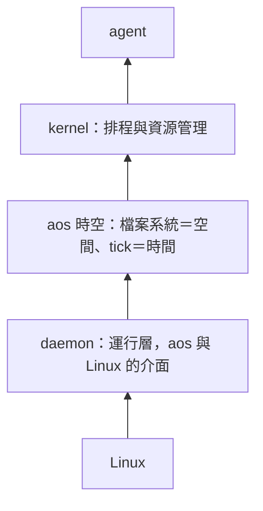

# aos 的分層：運行層、時空、kernel、agent（使用者想法，2026-10-03）

← [筆記索引](README.md)

**這是使用者口述的想法，照原意整理，不是裁定。** 當天的脈絡是在討論 daemon 減法、改成 FUSE，以及 tick 要不要改成 thread 和 lib，見 [thread 與程序評估](proposals/2026-10-03-thread-vs-process/README.md)。

## 四層，由下往上

1. **daemon 是運行層。** 它是 aos 體系和 Linux 系統之間的介面。在 daemon 之上，可以完全脫離 Linux，做 aos 自己的抽象世界。
2. **aos 的時空：檔案系統是空間，tick 是時間。**
   - tick 本質上是一個動作，每次動作後會進行一些行為。
   - aos 體系依託 tick 做時間上的判斷。
   - **tick 是程式還是 lib 都可以，形式無所謂。** 採用 inst JSON 當基底，只是因為它在 Linux 上最通用。
3. **kernel 運行在 aos 時空之上**，也就是檔案系統加 tick。排程和資源管理都依託在這上面。
4. **最後才是 agent。**

## 往下延伸（使用者，同日稍後）

- **tick 是動作，也能在一定程度上當時間單位。** 它是 aos 體系下唯一必有的時間單位：tick 動作啟動後，這個回合就開始了。
- **tick-tock（還在想，只是一個方法）。** tick 動作結束代表回合開始，tock 動作結束代表回合結束。
- **空間邊界＝daemon 能訪問的資料夾。** 因為 aos 運行在 daemon 上，daemon 提供、我們能訪問的資料夾就是空間的邊界。
- **「脫離 Linux」是口號。** 實際上是提供一個脫離 Linux 的接口，硬要接回 Linux 也可以。所謂脫離，就是像現在這樣：所有動作都基於 inst，inst 由 tick 和 daemon 安排。
- **kernel 的資源可以無限定義。**
- **tick-tock 的邊緣狀況默認都正常。** 出事了交給 daemon 處理，那是 daemon 的問題，不是 aos 時空的問題。
- **FUSE 和 tick 能碰到的資料夾要整合在一起，以 tick 能碰到的資料夾為正統。**
- **整合方式傾向「整棵穿透」（FUSE 掛在空間的根上），因為最靈活。**
- **tick 只是起頭。** tick 很快結束，之後有很多任務在跑。任務跑完後 tock 進場，也可能提前進場。
- **任務的讀寫可以不經過 FUSE。** 只是任務能碰到的資料夾，理論上只有 tick 給它們的那些。
- **tick-tock 就是定期啟動。** 所有任務的啟動都必須來自 tick，以此限制任務能接觸到的空間範圍。
- **任務可以跨 tick。** tock 不是把任務收掉的東西，只是告訴任務：這個回合結束了，這是第幾回合，讓任務自己知道時間。
- **例子。** 第三回合時 tick 啟動任務 A。A 之後逐次收到 tock 通知，收到第三次，也就是第六回合結束時，A 自行結束。
- **為什麼任務一律由 tick 啟動。** tick 負責把任務和 daemon 對接。這樣任務在跑的時候，才收得到來自 tick、tock 和 daemon 的訊息，也才能受管理，kill 和 restart 都是。
- **tick、tock 天然沒辦法準時啟動，這沒關係。** aos 體系本來就和現實時空脫鉤。
- **之後再想。** kill、restart 這些控制塊，以及任務和 tick、tock、daemon 之間的訊息交流，都留到之後。

## 核心設施與主體（使用者，同日稍後）

- **daemon、tick 是核心設施，概念很簡單。** 架構會膨脹或變複雜，只是為了應對工程上的問題。只要符合核心概念，其他都好說。
- **kernel 和 agent 的核心概念依託在 tick 的任務上。** 有資源管理、排程任務的，就算 kernel。有 LLM 呼叫、工具使用的，就算 agent。
- **主體性就是先前的 node。**
- **目前 tick、tock 只服務一個資料夾，所以該資料夾天然就是一個 node。**
- **就目前來說，daemon 要能支援多條 tick-tock 時間線同時跑。** 假設每條時間線各自負責一個資料夾，那個資料夾就是 node。
- **還在想：重疊要不要嚴格管理。** 巢狀資料夾，或兩條 tick-tock 管同一個資料夾，也就是重疊或部分重疊，要嚴格管理還是不管，尚未決定。

## 跟同日討論的關係

以下是 Claude 對照同一天的討論列出的，不是使用者的原話：

- daemon 減法把 cgroup、切帳號、權限從 daemon 拉出來。這些是 Linux 那一側的事，運行層只負責把 aos 時空撐起來。
- 「tick 形式無所謂」表示「tick 是程序還是 lib」屬於運行層的實作選擇，不是 aos 時空的定義。
- 10-02 的 [kernel 提案](proposals/2026-10-02-kernel/README.md)和 [agent 提案](proposals/2026-10-02-agent/README.md)正好對到第 3、4 層。
