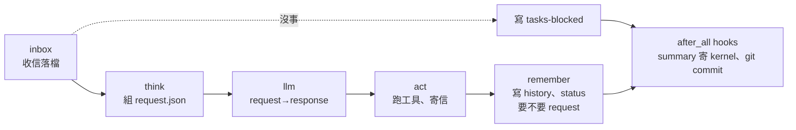

# 一格做什麼：五項任務怎麼接力

← [提案入口](README.md)｜上一份：[agent 的長相](03-agent長相.md)｜下一份：[生命週期](05-生命週期.md)

一格＝一輪：**最多打一次 LLM**，做完它要的工具，寫記憶。還有事就在 summary 說 `ready:true`，等 kernel 下一格叫（沒 kernel 就叫自己）。



## 每一項

| 項 | 讀 | 寫 | 沒事時 |
|---|---|---|---|
| `inbox` | `aos-mq take`（自己訂的所有門）；`work/continue`（上一格留的） | `type:"grant"` 且 `to` 是自己 → `work/grant.json`；其餘 → `state/inbox/<seq>-<n>.json` | 沒新信、沒 `continue`、沒待回的工具結果 → 寫 `.aos/tick/tasks-blocked`（全擋） |
| `think` | `config/system.md`、`state/notes.md`、`state/history.jsonl` 最後 N 輪、`state/inbox/` 新信、`work/tools/*/out`、`work/grant.json` | `work/request.json`（OpenAI chat 請求本文） | 額度用完 → 寫 `tasks-blocked` `{"kinds":["llm"]}`，只跳過 `llm` |
| `llm` | `work/request.json`；端點與金鑰從環境變數 | `work/response.json`（原樣） | 回非 0 → `act` 看不到 response 就記一筆錯、不做事 |
| `act` | `work/response.json`、`config/tools.json` | 每個 tool_call 一個 `work/tools/<call_id>/`；要寄的信用 `aos-mq send` | 沒 tool_calls → 不留 `continue` |
| `remember` | 本格所有接力檔 | 追加 `state/history.jsonl`；改 `public/status.json`；有 tool_calls → 留 `work/continue`；要額度或要定時 → 寄 `request` 給 kernel；`self_wake` 開著才 `aos-ctl wake --keep-schedule` | — |
| hook `summary` | `work/`、`response.json` 的 `usage`、`state/inbox/` | 寄 summary 到 `$AOS_DAEMON_MQ_KERNEL`（`ready`＝有 `continue` 或有信沒處理） | 沒有 kernel 門就不寄 |

## `aos-llm`（唯一一支新的「基礎」程式）

`aos-llm <request.json> <response.json>`。讀 OpenAI 相容的 chat 請求本文，`POST $AOS_LLM_URL/chat/completions`，回應原樣寫檔。不串流、不重試、自己有逾時（tick 開任務沒逾時，這支一定要有）。

- 環境變數（寫在 agent 的 `.aos/inst.json` 或 `tasks.json` 頂層 `envs`，金鑰一律 `$env`）：`AOS_LLM_URL`、`AOS_LLM_KEY`、`AOS_LLM_TIMEOUT_MS`。
- `AOS_LLM_URL=fake:<劇本.json>` 時照劇本回，給測試與試玩用（proto5 用「固定假回覆」理解流程的做法）。
- 結束碼：0 寫了 response；1 其他（連不上、非 2xx、逾時）。非 0 不寫 response。
- 一次呼叫＝一次計算（T-06）。之後 kernel 想自己排 LLM，把 `AOS_LLM_URL` 指到 kernel 的代理即可，agent 不改。

## 工具＝inst（沿 proto5 的 `_meta`，改叫 `_inst`）

`config/tools.json` 是 OpenAI `tools` 陣列，每個多一格 `_inst`：

```json
[{"type": "function",
  "function": {"name": "wc", "description": "算檔案字數", "parameters": {"type": "object", "properties": {"path": {"type": "string"}}}},
  "_inst": {"argv": ["tools/wc.sh"], "stdin": "args.json", "stdout": "out", "exit": "exit"}}]
```

`act` 對每個 tool_call：建 `work/tools/<call_id>/`，把模型給的 arguments 寫成 `args.json`，把 `_inst` 補上 `_metainfo` 寫成 `inst.json`，然後 **`aos-exec work/tools/<call_id>`**。stdout 檔就是給模型看的結果，`exit` 檔是結束碼。

- 好處：工具的執行、串流、結束碼全走 inst 與 `aos-exec`，不另造；每次呼叫在 `work/` 留下完整證據。
- 權限：工具用 agent 自己的帳號跑，碰得到什麼看資料夾權限（09-28 方向：不逐工具 bwrap）。
- 同一回應多個 tool_call 依序跑；要平行是之後的事。

## 接力檔的形狀

- `work/request.json`：就是 chat 請求本文（`model`、`messages`、`tools`）。`think` 從 `config/agent.json` 取 `model` 與 `params`。
- `work/response.json`：模型回應原樣。`act` 只取 `choices[0].message`。
- `work/tools/<call_id>/{inst.json,args.json,out,exit}`。
- `work/continue`：空檔，有＝下一格直接 think。
- 每格 `inbox` 開頭先清上一格的 `work/`（`continue` 與 `tools/` 除外，等 `think` 吃進 history 再清）。

## 記憶

- `state/history.jsonl`：user／assistant／tool 三種 role，一行一則；`remember` 追加。
- 壓縮沿 proto5 使用者裁定：機械做、不叫模型。留最後 3 輪原樣，更舊只留問與最後一答，總量超過 `config/agent.json` 的 `history_max_tokens`（預設 32000）就把最舊的封存到 `state/archive/<seq>.jsonl`。
- `state/notes.md`：模型用 `note` 工具寫；`think` 整份帶進 system 之後。
- 「上下文帶什麼」只有 `think` 一支程式決定，要改策略改它就好。

## 一格的時間

五個程序＋一次 HTTP。沒事的格只跑 `inbox`（幾十毫秒）就擋掉。有事的格以 LLM 為主，通常數秒到數十秒；`interval_ms` 從上一次**結束**算，所以不會疊格。
