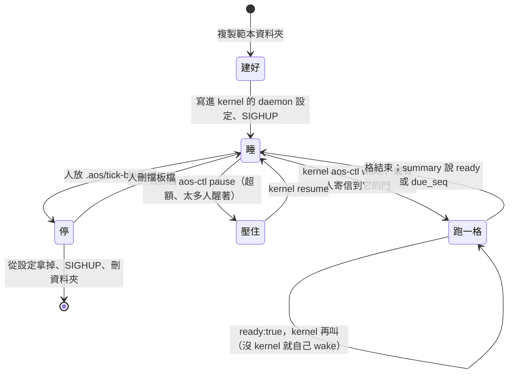
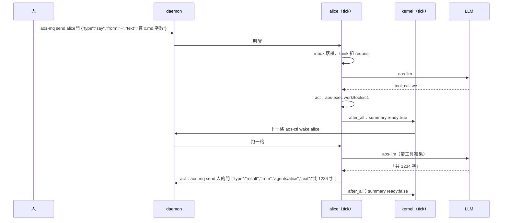

# 生命週期：建、起、睡、醒、停、刪

← [提案入口](README.md)｜上一份：[一格做什麼](04-一格做什麼.md)｜下一份：[多 agent 與上下層](06-多agent與上下層.md)

全部用現有指令，沒有 `aos-agent start/stop` 這類新命令；要包成一支方便的腳本是之後的事。

| 階段 | 誰做 | 怎麼做 |
|---|---|---|
| 建立 | 人或主管 agent | 複製範本資料夾（`tasks.json`、`config/`、空的 `state/`）；建 `doors/`，用資料夾權限決定誰能寄；`git init` |
| 啟動 | 管 daemon 設定的人（kernel 或人） | 在 `insts` 加一項（路徑＝資料夾）、訂自己的門與團隊門、指定帳號；`kill -HUP <daemon>`。daemon 開起來每項先跑一次，第一格就是 `inbox` → 沒事 → 擋 → summary |
| 一格 | tick | 見 [一格做什麼](04-一格做什麼.md) |
| 睡 | 什麼都不用做 | 格結束就是睡；`interval_ms` 很長當保底 |
| 醒 | kernel，或任何能連它門的人 | `aos-ctl wake <inst>`；`aos-mq send <門> <信>`（daemon 合併叫醒：連來十封只跑一格） |
| 連續做 | kernel | agent 在 summary 說 `ready:true`，kernel 下一格 `wake` 它。沒 kernel：`self_wake` 開著，agent 自己 `aos-ctl wake --keep-schedule` |
| 壓住 | kernel 或人 | `aos-ctl pause <inst>`；信照收、進信箱不跑；暫停中 `wake` 仍跑一次 |
| 硬停 | 人 | 放 `.aos/tick-blocked`：核心取鎖後看到就回 0、什麼都不做、不佔 seq |
| 刪 | 人或 kernel | 從 daemon 設定拿掉那一項、SIGHUP（daemon 連信箱一起丟）；刪資料夾；帳號不刪 |

## 幾個要說清楚的點

- **睡、壓住、停是三件事**。睡＝沒人叫；壓住＝kernel pause，kernel 自己能解；停＝擋板檔，只有人能解。agent 自己三種都不做，它只在 summary 說自己想不想被叫。
- **daemon 重開**：每項都先跑一格（掛了狀態模組的，被壓住的除外）。agent 第一格 `inbox` 沒事就擋掉、寄 summary，成本很小。
- **信箱在記憶體**。daemon 重開前沒被 `take` 的信就丟了。`inbox` 是每格第一項，窗口很小；「默認一切正常」先不處理。
- **自己叫醒自己的迴圈**：agent 寄信到自己有訂的團隊門，自己也會被叫醒。`inbox` 看 `from` 是自己就當已讀，不進 history。
- **第一格**：新 agent 第一格就是「沒事 → 擋 → summary」，正好當啟動自檢。

## 一次對話長怎樣（有 kernel）

人要收回話，自己也得是某扇門的訂戶（daemon 一項 `insts` 寫個 `aos-mq take` 的小 inst，或人手 `aos-mq peek`）。這是「人也是一項」的自然結果，不另造 `say`／`listen`；要包成好用的 CLI 放第三階段。
