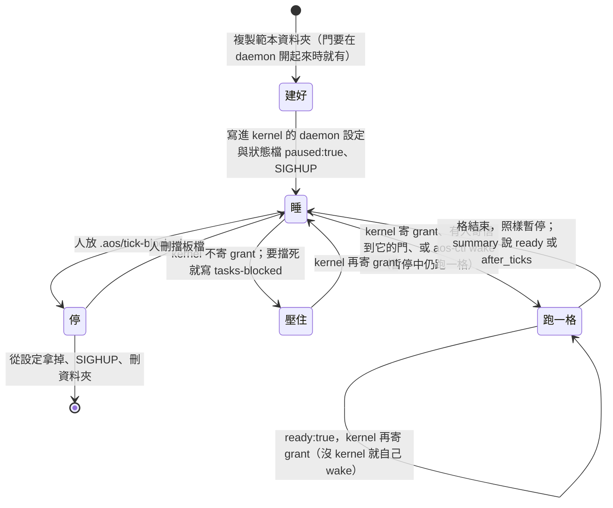
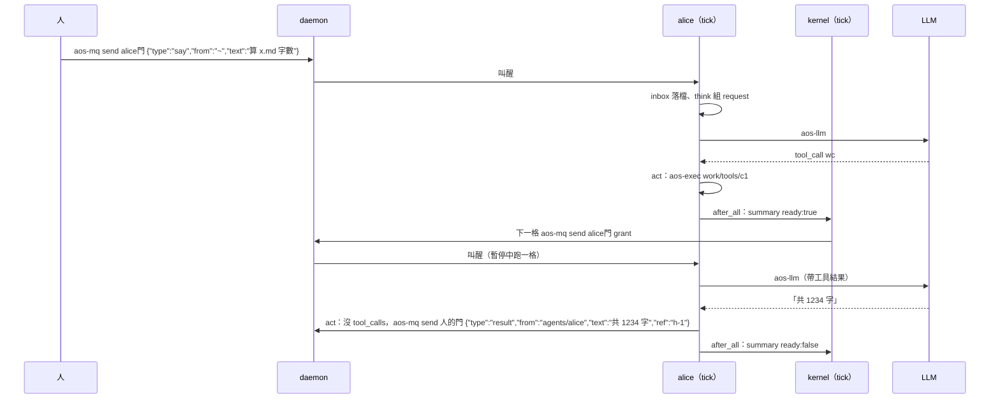

# 生命週期：建、起、睡、醒、停、刪

← [提案入口](README.md)｜上一份：[一格做什麼](04-一格做什麼.md)｜下一份：[多 agent 與上下層](06-多agent與上下層.md)

全部用現有指令，沒有 `aos-agent start/stop` 這類新命令；要包成一支方便的腳本是之後的事。

| 階段 | 誰做 | 怎麼做 |
|---|---|---|
| 建立 | 人或主管 agent | 複製範本資料夾（`tasks.json`、`config/`、空的 `state/`）；`git init`。**它的門得在 daemon 開起來時就列在 `modules.mq`**（重讀不開新門、訂新門會整份重讀失敗）：先預建備用門，或重開 daemon |
| 啟動 | 管 daemon 設定的人（kernel 或人） | 在 `insts` 加一項（路徑＝資料夾）、訂自己的門與團隊門、指定帳號；狀態檔先寫 `paused:true`；`kill -HUP <daemon>`。新加的項會先跑一格：`inbox` → 沒事 → 擋，不寄 summary |
| 一格 | tick | 見 [一格做什麼](04-一格做什麼.md) |
| 睡 | daemon 狀態模組 | 一直是 `paused`，格結束照樣暫停；`interval_ms` 用不到 |
| 醒 | kernel，或任何能連它門的人 | `aos-mq send <門> <信>`（grant 也是信；daemon 合併叫醒：開跑前寄來的幾封併成一格，跑到一半寄來的再補一格）；或 `aos-ctl wake <inst>`。暫停中都會跑一格 |
| 連續做 | kernel | agent 在 summary 說 `ready:true`，kernel 再寄 grant。沒 kernel：`self_wake` 開著，agent 自己 `aos-ctl wake --keep-schedule` |
| 壓住 | kernel | 不寄 grant 就不會因 kernel 而醒；但別人的信仍叫得醒它。要擋死 LLM 就寫 `tasks-blocked` `{"kinds":["llm"]}`（它每格最後會被刪，要每格重寫）。`pause` 幫不上忙：它本來就暫停著 |
| 硬停 | 人 | 放 `.aos/tick-blocked`：核心取鎖後看到就回 0、什麼都不做、不佔 seq |
| 刪 | 人或 kernel | 從 daemon 設定拿掉那一項、SIGHUP（daemon 連信箱一起丟）；刪資料夾；帳號不刪。拿掉項是熱的，門不是 |

## 幾個要說清楚的點

- **`pause` 與 `kill` 的真實語意**（程式：`aos_daemon_ctl.py`、`tests/test_mq_send.py`）：`pause` 只停週期排程，來信與 `wake` 仍跑一次、正在跑的不殺；`kill` 只殺正在跑的那次，照週期再排。所以兩個都不是「停止」：永久不跑要拿掉設定項；LLM 不准打要靠 grant 或 `tasks-blocked`。
- **睡、壓住、停是三件事**。睡＝暫停著等信；壓住＝kernel 不給 grant（別人的信仍能叫醒它，所以 `max_awake` 只是 kernel 自己叫的數，不是上限）；停＝擋板檔，只有人能解。
- **daemon 重開**：狀態檔記得暫停，被預置暫停的 agent 不先跑。
- **信箱在記憶體**。daemon 重開前沒被 `take` 的信就丟了。`inbox` 是每格第一項，窗口很小；「默認一切正常」先不處理。
- **自己叫醒自己的迴圈**：agent 寄信到自己有訂的團隊門，自己也會被叫醒。`inbox` 看 `from` 是自己就當已讀，不進 history。
- **第一格**：新 agent 第一格就是「沒事 → 擋 → summary」，正好當啟動自檢。

## 一次對話長怎樣（有 kernel）

回答由 `act` 寄回那封信的 `reply_door`、帶同一個 `ref`；POC 一格處理一封對話信，多封在 `state/inbox/` 排隊、下一格再來（所以 summary 會說 `ready:true`）。

人要收回話，自己也得是某扇門的訂戶（daemon 一項 `insts` 寫個 `aos-mq take` 的小 inst，或人手 `aos-mq peek`）。這是「人也是一項」的自然結果，不另造 `say`／`listen`；要包成好用的 CLI 放第三階段。
