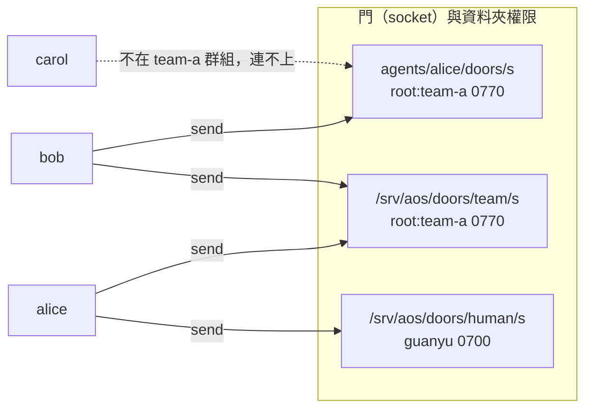
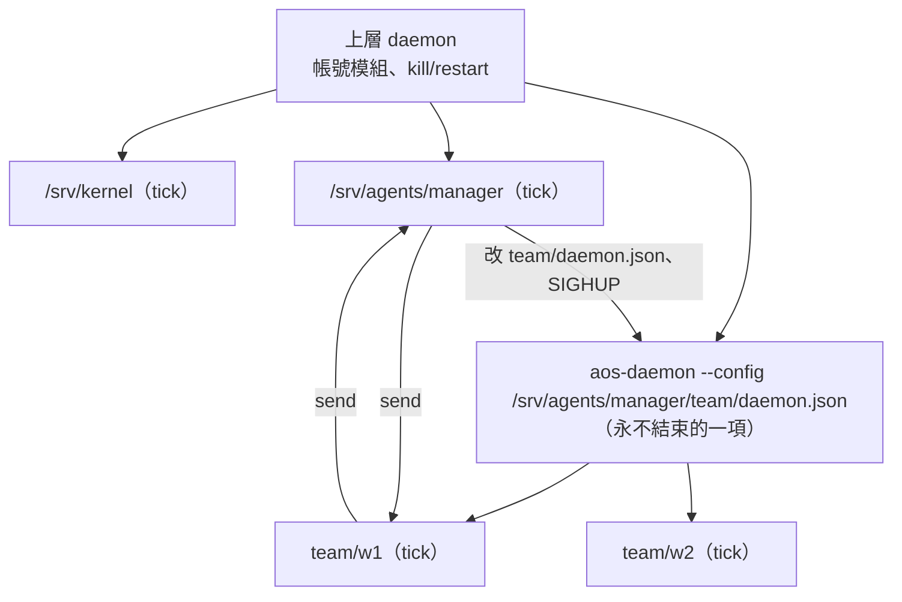

# 多 agent 合作與上下層

← [提案入口](README.md)｜上一份：[生命週期](05-生命週期.md)｜下一份：[kernel 介面](07-kernel介面.md)

## 合作只靠門

daemon 不轉送、不加欄位、不認收件人；**門就是地址，資料夾權限就是名單**。



| 門 | 誰訂 | 資料夾權限 | 用途 |
|---|---|---|---|
| `agents/alice/doors/s` | alice | `root:team-a 0770` | alice 的私人收件匣，同組才能寄 |
| `/srv/aos/doors/team/s` | 全組 | `root:team-a 0770` | 組內廣播；寄的人自己也收到（自己跳過） |
| `/srv/aos/doors/human/s` | 人的那一項 | `guanyu 0700`，另開一條給 agent 寄的 `0730` 子門 | 給人看的 |

要讀門的路徑：自己訂的門在 `AOS_DAEMON_MQ_<門名>`；別人的門寫在 `config/contacts.json`（暱稱 → socket 路徑，只是 agent 自己的通訊錄，不是 daemon 的 `peers`——那個使用者說先不做）。

## 信的形狀（agent 之間的約定，daemon 不管）

```json
{"type": "say", "version": 1,
 "from": "agents/bob", "reply_door": "/srv/team-a/agents/bob/doors/s",
 "text": "x.md 算好了嗎？", "ref": "bob-42"}
```

- 欄位形狀照 kernel 提案的三種信（`type`、`version`、`from`＝inst 字面值），六個 `type` 共用一份 schema。
- `from`／`reply_door`：寄的人自己填；daemon 不驗，所以**這不是身分證據**，只是方便回信。能不能寄才是證據（門的資料夾權限）。
- `type`：`say`（一般話）、`result`（回某個 `ref`）、`task`（請你做）。先只這三個；proto5 的六種 STATUS 之後要再加。
- `ref`：寄件人自己編號；回信帶同一個。
- 人寄信：`from` 寫 `"~"`（沿 C++ 版通訊錄的習慣）。

## 上下層：兩種形狀

**平的（第三階段，推薦先做）**：同一個 daemon 列一堆 agent，誰是「主管」只是語意：主管訂了成員們會寄的門、被授權改成員的 `config/`。proto5 試過父子樹後撤成「一律平的」，先照它。

**巢的（第四階段）**：主管 agent 擁有一個**子 daemon**，由上層 daemon 當一項 inst 跑它（daemon 跑 daemon），成員是子 daemon 的項。



主管「生一個成員」＝複製範本到 `team/w3/`、在 `team/daemon.json` 加一項、送 SIGHUP 給子 daemon。

| | 平的 | 巢的 |
|---|---|---|
| 生成員要改誰的設定 | 上層 daemon 的設定（主管要有寫權＋能送 SIGHUP） | 自己的 `team/daemon.json` |
| 停整組 | 一項一項 pause | `aos-ctl kill <子 daemon>` 一刀 |
| 帳號 | 上層帳號模組一次配好 | 子 daemon 也要 root 開才能切帳號——跟「主程式永久降權」衝突，見待決 |
| 程式要改 | 不用 | 不用，但有兩個坑（下） |

### 巢的兩個坑（程式核對出來的）

1. **環境變數外漏**：子 daemon 沒掛控制／訊息模組時，上層的 `AOS_DAEMON_CTL_SOCKET`、`AOS_DAEMON_MQ_*`、`AOS_DAEMON_INST` 會原樣傳給成員，成員的 `aos-ctl`／`aos-mq` 會打到上層的那一項（也就是整個子 daemon）：`wake` 叫醒整組、`take` 取走子 daemon 的信。**規矩：子 daemon 一律掛控制與訊息模組。** 或在 inst 的 `envs` 用 `clear` 清掉再補。
2. **沒人送 SIGHUP**：控制 socket 不收 reload（使用者定的）。主管要重讀子 daemon 設定，只能 `kill -HUP`（要知道 pid，現在拿不到）或 `aos-ctl --socket <上層> restart <子 daemon>`（整組重開、成員正在跑的格被殺）。kernel 提案建議 daemon 給 `AOS_DAEMON_PID`，這邊贊成（待決 12）。

## 一萬個 agent 怎麼放

- 閒置的 agent 只是暫停的一項＋一個資料夾＋一扇門；成本是 daemon 記憶體裡一筆與一個 socket 檔。一個 daemon 開一萬個 socket 不實際——所以**門不必一人一扇**：一組共用一扇門，信裡 `to` 自己約定，`inbox` 看不是給自己的就放回？不行，`take` 取走就沒了。
- 比較穩的做法：**小隊（十到百人）一個 daemon、一人一扇門；隊與隊之間用巢的形狀或平行多個 daemon**。這也是使用者 09-30 答的多 daemon 範圍（多帳號、巢狀、備援）。
- 每小時活躍不到 100 個，所以同時在跑的 tick 很少；LLM 併發由 kernel 用 pause 控。
