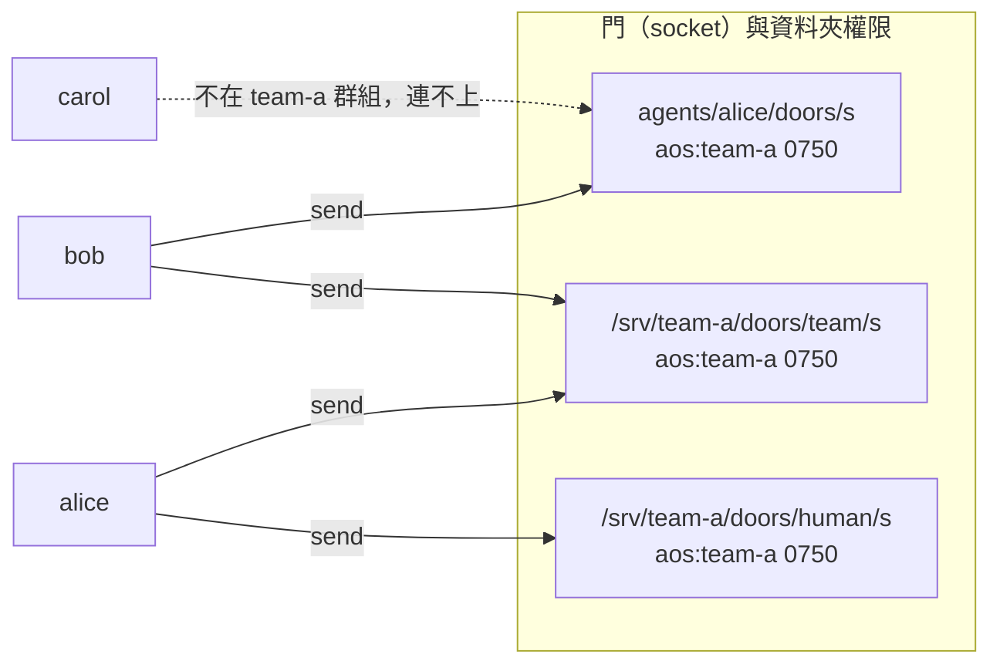
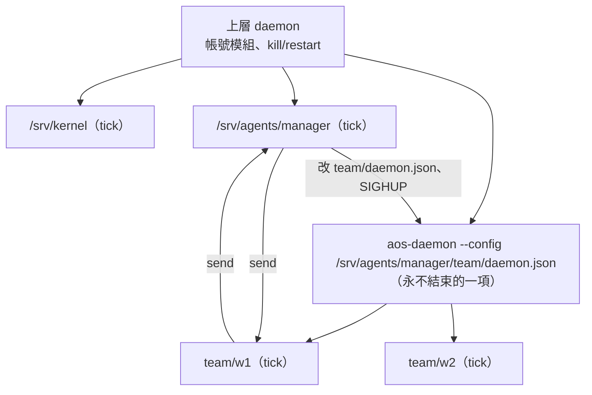

# 多 agent 合作與上下層

← [提案入口](README.md)｜上一份：[生命週期](05-生命週期.md)｜下一份：[kernel 介面](07-kernel介面.md)

## 合作只靠門

daemon 不轉送、不加欄位、不認收件人；**門就是地址，資料夾權限就是名單**。



| 門 | 誰訂 | 資料夾權限 | 用途 |
|---|---|---|---|
| `agents/alice/doors/s` | alice | `aos:team-a 0750` | alice 的私人收件匣（grant 也寄這裡），同組才能寄 |
| `/srv/team-a/doors/team/s` | 全組 | `aos:team-a 0750` | 組內廣播；每個訂戶各拿一份副本、都被叫醒；寄的人自己也收到（自己跳過） |
| `/srv/team-a/doors/human/s` | 人的那一項 | `aos:team-a 0750`；人自己連任一扇門 `peek` | agent 寄給人的 |

門資料夾的權限要同時滿足兩件事：**擁有者是 daemon 主程式的帳號**（掛帳號模組時是預設帳號 `aos`，socket 由它建，所以要有 `w`＋`x`），**要寄的帳號要能穿過整條路徑**（每一層目錄都要 `x`，所以不能把門藏在別人 `0700` 的家底下）。表裡用 `aos:<組> 0750`：daemon 建檔、組員穿越，別人進不來。socket 本身一律 666（daemon 定的）。

要讀門的路徑：自己訂的門在 `AOS_DAEMON_MQ_<門名>`；別人的門寫在 `config/contacts.json`（暱稱 → socket 路徑，只是 agent 自己的通訊錄，不是 daemon 的 `peers`——那個使用者說先不做）。**所有門都要在 daemon 開起來時列好**；重讀設定不開新門，新成員訂新門會讓整份重讀失敗。

## 信的形狀（agent 之間的約定，daemon 不管）

```json
{"type": "say", "version": 1,
 "from": "agents/bob", "reply_door": "/srv/team-a/agents/bob/doors/s",
 "text": "x.md 算好了嗎？", "ref": "bob-42"}
```

- 欄位形狀照 kernel 提案的三種信（`type`、`version`、`from`＝inst 字面值），六個 `type` 共用一份 schema。
- `from`／`reply_door`：寄的人自己填；daemon 不驗，所以**這不是身分證據**，只是方便回信。能不能寄才是證據（門的資料夾權限）。
- `type`：`say`（一般話）、`result`（回某個 `ref`）、`task`（請你做）。先只這三個；proto5 的六種 STATUS 之後要再加。
- `ref`：寄件人自己編號；回信帶同一個。
- 人寄信：`from` 寫 `"~"`（沿 C++ 版通訊錄的習慣）。

## 上下層：兩種形狀

**平的（第三階段，推薦先做）**：同一個 daemon 列一堆 agent，誰是「主管」只是語意：主管訂了成員們會寄的門、被授權改成員的 `config/`。proto5 試過父子樹後撤成「一律平的」，先照它。

**巢的（第四階段）**：主管 agent 擁有一個**子 daemon**，由上層 daemon 當一項 inst 跑它（daemon 跑 daemon），成員是子 daemon 的項。



主管「生一個成員」＝複製範本到 `team/w3/`、在 `team/daemon.json` 加一項（訂一扇**預建的備用門** `W3`）、送 SIGHUP 給子 daemon。備用門用完就得重開子 daemon。

| | 平的 | 巢的 |
|---|---|---|
| 生成員要改誰的設定 | 上層 daemon 的設定（主管要有寫權＋能送 SIGHUP） | 自己的 `team/daemon.json` |
| 停整組 | 一項一項從設定拿掉 | 上層對子 daemon 那項先 `pause`（不再排）再 `kill`（殺正在跑的；掛了收屍模組連成員一起清）。單獨 `kill` 會照週期再開、單獨 `pause` 不會殺常駐的子 daemon |
| 帳號 | 上層帳號模組一次配好 | 子 daemon 不能再切帳號（帳號模組要 root 開、成員不准 root）：整隊同帳號 |
| 程式要改 | 不用 | 不用，但有三個坑（下） |

### 巢的三個坑（程式核對出來的）

1. **環境變數外漏**：daemon 給任務的環境是「整份自己的環境＋覆蓋同名的 `AOS_DAEMON_*`」（`aos_daemon_run.give_env`）。子 daemon 掛了控制與訊息模組，`AOS_DAEMON_CTL_SOCKET`、`AOS_DAEMON_INST` 與**同名**的門會被蓋掉；但**上層獨有的門**（例如上層的 `AOS_DAEMON_MQ_KERNEL`、子層沒有這個門名）會原樣留給成員。範本要寫清楚：子 daemon 的門名沿用上層那套（`KERNEL`、`TEAM`），刻意要留的上層地址在啟動子 daemon 那份 `inst.json` 的 `envs` 另存別名（`"AOS_KERNEL_UP": {"$env": "AOS_DAEMON_MQ_KERNEL"}`、`"AOS_KERNEL_UP_INST": {"$env": "AOS_DAEMON_INST"}`（名字照 kernel 提案）），其餘上層變數用 `envs` 的 `clear` 清掉再補 `PATH`。daemon 要不要自己把繼承來的 `AOS_DAEMON_*` 先拿掉再給（像 tick 對 `AOS_TASK_*` 那樣），列待決。
2. **沒人送 SIGHUP、也拿不到 pid**：控制 socket 不收 reload（使用者定的）。主管與子 daemon 是上層的兩個不同項，就算 daemon 給 `AOS_DAEMON_PID`，主管拿到的也是**上層** daemon 的 pid。零改程式的接法：啟動子 daemon 的 inst 寫 `["sh","-c","echo $$ > team/daemon.pid; exec aos-daemon --config team/daemon.json"]`，主管讀這個檔送 `kill -HUP`；兩者要同帳號訊號才送得到。替代：上層 `aos-ctl restart <子 daemon>`（整組重開、成員正在跑的格被殺）。
3. **門不能熱加**：見上。

## 一萬個 agent 怎麼放（現行程式下的真實成本）

- 閒置的 agent **不開程序**，但不是「只佔磁碟」：daemon 裡每一項一條執行緒＋一個信箱（`aos_daemon_run.start_item`），每扇門再一條執行緒（`aos_daemon_ctl.serve`）。一個 daemon 一萬項、一萬扇門，是兩萬條執行緒、一萬個 socket 檔，不實際。
- 共用門不能解：從一扇門寄進來的信，**每個訂戶各拿一份副本**、每個都被叫醒（`aos_daemon_mq.handle`）；`take` 只清自己的信箱。所以共用門的問題不是搶信，是全員被叫醒跑空格——這正是 grant 要寄私門的理由。
- 比較穩的做法：**小隊（十到百人）一個 daemon、一人一扇門；隊與隊之間用巢的形狀或平行多個 daemon**（使用者 09-30 答的多 daemon 範圍：多帳號、巢狀、備援）。分隊只是把執行緒分散到多個 daemon，總數沒少；真要萬人，daemon 得改成不每項一條執行緒，那是之後的事。
- 每小時活躍不到 100 個，所以同時在跑的 tick 很少；LLM 併發由 kernel 用 grant 控。
