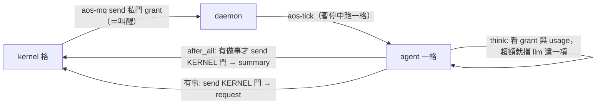

# agent 與 kernel 的介面（已對齊 kernel 提案，含審查後的修正）

← [提案入口](README.md)｜上一份：[多 agent 與上下層](06-多agent與上下層.md)｜下一份：[分階段](08-分階段.md)｜對方的契約：kernel 提案 `proto6/notes/proposals/2026-10-02-kernel/04-agent介面.md`（另一個 worktree，合進 main 後再改成連結）

kernel 提案的結論：kernel 是角色＝一個工作資料夾＋它擁有的一份 daemon 設定；agent＝那份設定清單上的一項 inst；成員寄 **summary**，kernel 寄 **grant**，成員要東西寄 **request**。10-02 兩邊照 astra 審查互相改過一輪，下面是改完的契約；agent 內部怎麼做不在此。

## 原則（兩邊一致）

1. kernel 管「它主動叫醒誰、LLM 額度」，不管格裡做什麼；分配單位是一格。
2. agent 平常是 `paused`（kernel 的狀態檔預置），**收到信就跑一格**：grant、別人的私信、`wake` 都算。所以「收信開格」是事實，kernel 限制的是它自己叫的格數＋LLM 前的額度檢查。
3. **寄 grant 到成員私門就是叫醒**，kernel 不另發 `wake`；grant 只在 kernel 決定叫它、或政策／窗口變了才寄，**不每格重寄**；收到 `ready:false` 不重寄。agent 這邊**空格不寄 summary**。兩條加起來才斷得了「grant → 空格 summary → grant」的互叫。
4. 信沒有權限意義；不等對方；反應最快一格。kernel 不讀 agent 資料夾、不轉成員之間的信。

## agent 這側怎麼配合



| kernel 要的 | agent 怎麼做 | 落在哪 |
|---|---|---|
| 開跑先看額度 | `inbox` `take` 一次（信箱整個清空，所以一次取完再按 `type` 分流）；grant → `state/grant.json`（不放每格清的 `work/`） | `inbox` |
| 叫 LLM 前自律 | `think` 讀 `state/grant.json`＋`state/usage.json`；窗口用完 → 寫 `tasks-blocked` `{"kinds":["llm"]}`，這格跳過 `llm`（紀錄留 `skipped`），`act`、`remember` 照跑 | `think` |
| 用量回報 | `remember` 把 `response.json` 的 `usage` 累進 `state/usage.json`（按 `window_start_seq` 分窗口） | `remember` |
| 跑完寄 summary | hook `after_all`：`aos-agent summary`；`inbox` 判定沒事而全擋的格**不寄** | hook |
| 要更多額度／幾格後叫我 | `remember` 寄 `request`（`llm_more`、`wake_me`） | `remember` |
| `ready` 怎麼算 | 跟 `inbox` 的「有沒有事」同一支函式：有 `continue`、`state/inbox/` 有沒處理的信、有待回的工具結果＝`true`；寄了 `task` 等回信＝`false`；要定時＝`after_ticks` | `summary` |
| 整格逾時 | agent 的 `.aos/inst.json` 寫 `["timeout","600","aos-tick"]` | inst |

沒有 kernel 時（第 0～2 階段）：`config/agent.json` 的 `self_wake:true`，`remember` 有 `continue` 就 `aos-ctl wake --keep-schedule` 自己（暫停中照樣跑一格）；有 kernel 就關掉。

## 三種信（照 kernel 提案 10-02 改版）

```json
{"type": "summary", "version": 1, "from": "agents/bob", "seq": 42,
 "ready": true, "after_ticks": null,
 "usage": {"llm_calls": 1, "llm_tokens": 1820}, "note": "等 amy 回 x.md 來源"}
```

```json
{"type": "grant", "version": 1, "to": "agents/bob", "kernel_seq": 1203,
 "llm": {"calls": 20, "tokens": 50000, "window_start_seq": 1200, "window_ticks": 10}}
```

```json
{"type": "request", "version": 1, "from": "agents/bob", "seq": 42,
 "ask": "llm_more", "args": {"tokens": 20000}, "note": "大檔要摘要"}
```

- `llm` 的數字是**窗口總額**；同窗口再收一封不重置；沒收到新 grant 沿用上一封；`after_ticks` 從 kernel 收到那格起算（C-01：`_seq` 是第幾格，不是等待長度）。
- `from`／`to` 都是 inst 字面值（`AOS_DAEMON_INST`）。agent 之間的信用同一個 `type` 欄位：`say`、`result`、`task`（[06](06-多agent與上下層.md)）。六個 `type` 一份 `agent-msg.schema.json`，兩邊共用範例、不各寫一份。

## 額度強制：只能是「配合式」

- `before_kind.llm` 寫 `tasks-blocked` **擋不到當次**：tick 先查擋板、再跑 `before_kind`、接著直接跑任務（`aos_tick.py` 主迴圈；`test_tick_kind.py` 明測只擋下一項）。要用 hook 檢查，掛在 **`after_task.think`**；但 `think` 自己查就夠了，hook 版只是讓 kernel 用 `$ref` 換政策不改 agent 程式。
- 不管放哪，agent 握著金鑰、自己能寫 `tasks.json`，就不是硬強制（T-08）。硬強制只有兩條路：kernel 當 LLM 代理（常駐服務，要使用者點頭），或帳號與資料夾權限讓 agent 拿不到金鑰（金鑰放只有代理讀得到的地方）。POC 先自律。

## 仍待兩邊共同拍的

- 有 kernel 卻還沒收到任何 grant：先等，還是用 agent 自己的預設額度？（待決 23）
- `pause` 對常駐子 daemon 無效（只是不再排，正在跑的不殺）；整組停＝先 `pause` 再 `kill`；多層 POC 同帳號。
- daemon 跑 daemon 的環境變數：門名沿用上層那套、要留的上層地址別名化、其餘清掉（[06](06-多agent與上下層.md)）。
- `AOS_DAEMON_PID` 指「啟動自己的那個 daemon」；主管要的是子 daemon 的 pid，另走 `team/daemon.pid`。
