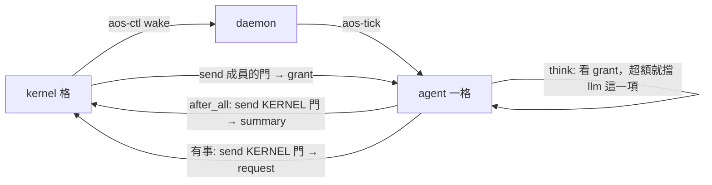

# agent 與 kernel 的介面（已對齊 kernel 提案）

← [提案入口](README.md)｜上一份：[多 agent 與上下層](06-多agent與上下層.md)｜下一份：[分階段](08-分階段.md)｜對方的契約：kernel 提案 `proto6/notes/proposals/2026-10-02-kernel/04-agent介面.md`（另一個 worktree，合進 main 後再改成連結）

kernel 提案的結論：kernel 是角色＝一個工作資料夾＋它擁有的一份 daemon 設定；agent＝那份設定清單上的一項 inst；成員每格 `after_all` 寄 **summary**，kernel 寄 **grant**，成員要東西寄 **request**。**這份照它的契約來，下面只寫 agent 這側怎麼配合，以及三處不同意見。**

## 原則（兩邊一致）

1. kernel 管「誰的格什麼時候跑、LLM 額度」，不管格裡做什麼；分配單位是一格。
2. agent 不自醒：`interval_ms` 設很長，靠 kernel `aos-ctl wake` 或有人寄信。一格做完就結束，不忙轉。
3. 信沒有權限意義，能寄到門就是能寄；不等對方；反應最快一格。
4. kernel 不讀 agent 資料夾、不轉成員之間的信。

## agent 這側怎麼配合



| kernel 要的 | agent 怎麼做 | 落在哪一項 |
|---|---|---|
| 開跑先取信看額度 | `inbox` 本來就 `take`；信裡 `type:"grant"` 且 `to` 是自己 → 寫 `work/grant.json`，其餘進 `state/inbox/` | `inbox` |
| 叫 LLM 前自律 | `think` 讀 `work/grant.json`，本窗口用完 → 寫 `tasks-blocked` `{"kinds":["llm"]}`，這格跳過 `llm`、紀錄留 `skipped`；`act`、`remember` 照跑 | `think` |
| 跑完寄 summary | hook `after_all`：`aos-agent summary`，從 `work/` 與 `response.json` 的 `usage` 組信、寄到 `$AOS_DAEMON_MQ_KERNEL` | hook，所以被擋的格也寄 |
| 要更多額度／幾格後叫我 | `remember` 判斷後寄 `request`（`llm_more`、`wake_me`） | `remember` |
| `ready` 怎麼算 | 有 `work/continue`（還有 tool_calls 要回）或 `state/inbox/` 還有沒處理的信＝`true`；寄了 `task` 等回信＝`false`、不給 `due_seq`（睡到有信）；要定時＝`due_seq` | `summary` |
| 整格逾時 | agent 的 `.aos/inst.json` 寫 `["timeout","600","aos-tick"]`（kernel 說包在 inst 外） | inst |

沒有 kernel 時（第 0～2 階段）：`config/agent.json` 的 `self_wake:true`，`remember` 有 `continue` 就 `aos-ctl wake --keep-schedule` 自己；有 kernel 就關掉、交給 summary 的 `ready`。

## 三種信（照 kernel 提案，agent 這邊一字不改）

```json
{"type": "summary", "version": 1, "from": "agents/bob", "seq": 42,
 "ready": true, "due_seq": null,
 "usage": {"llm_calls": 1, "llm_tokens": 1820}, "note": "等 amy 回 x.md 來源"}
```

```json
{"type": "grant", "version": 1, "to": "agents/bob", "kernel_seq": 1203,
 "llm": {"calls": 20, "tokens": 50000, "window_ticks": 10}}
```

```json
{"type": "request", "version": 1, "from": "agents/bob", "seq": 42,
 "ask": "llm_more", "args": {"tokens": 20000}, "note": "大檔要摘要"}
```

`from`／`to` 都是 inst 字面值（就是 `AOS_DAEMON_INST`），agent 之間的信也照這個（見 [06](06-多agent與上下層.md)）。agent 之間的信用同一個 `type` 欄位區分：`say`、`result`、`task`。

## 三處不同意見（請 kernel 規劃者看，由使用者拍）

1. **grant 走共用的 MEMBERS 門會叫醒全員。** daemon 從一扇門收到信，是放進**訂了那扇門的每一項**信箱並叫醒它們。一百個成員訂同一扇 MEMBERS 門，kernel 每寄一封 grant，一百個 agent 都醒來跑一格、發現 `to` 不是自己。建議：**grant 寄到成員自己的門**（每成員一扇，kernel 的 daemon 設定本來就要列成員，順手列門），MEMBERS 只留給真正的廣播。成本是門數＝成員數，小隊（十到百）沒問題。
2. **額度要強制時不必走「池代發」。** kernel 若有成員 `.aos/` 的寫權，可以在成員 `tasks.json` 的 `hooks` 用 `$ref` 掛 kernel 的政策檔：`before_kind.llm` 跑 `check-budget`，超額就寫 `tasks-blocked`。不改 agent 程式、不需要常駐的池。沒寫權就只能自律，這點跟 kernel 提案一致。
3. **pull 留著當除錯。** 同意 push 為主（我原本擔心一萬個 agent 每格一封信，但閒置 agent 不跑格，所以成本只跟活躍數成正比，可接受）。agent 仍寫自己的 `public/status.json` 給人看，kernel 不必讀。

## 兩邊都要補的小事

- `AOS_DAEMON_PID`（kernel 提案待決 4）：agent 這邊的主管生成員也要它，贊成加。
- daemon 跑 daemon 時環境變數外漏（[06](06-多agent與上下層.md)）：子 daemon 一律掛控制與訊息模組，兩份提案都要寫進範本。
- 三種信加 agent 的三種，六個 `type`，建議一份 schema `agent-msg.schema.json` 用 `type` 分支。
