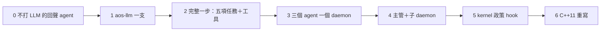

# 分階段落地：Python POC 先，C++11 最後

← [提案入口](README.md)｜上一份：[kernel 介面](07-kernel介面.md)｜下一份：[待決問題](09-待決問題.md)

每階段寫出「最小可驗的東西」。每段做完照 aos-teams 的規矩派人試玩。

## 第 0 階段：回聲 agent（半天，零新程式）

只用現有程式＋兩支 shell。資料夾 `echo/`，`tasks.json` 兩項：`inbox`（`aos-mq take` → 落檔，沒信就寫 `tasks-blocked` 並 `aos-ctl pause`）、`reply`（把每封信 `aos-mq send` 回 `reply_door`，然後 `aos-ctl pause`）。daemon 掛控制＋訊息兩模組。

**驗**：人 `aos-mq send` 一封 → daemon stdout 恰一行 `exit=0` → 人 `aos-mq peek` 收到回聲 → `aos-ctl status` 顯示 `paused:true` → 連寄三封只跑一格。這就證明「睡／醒／收／寄」全用現有零件組得出來。

## 第 1 階段：`aos-llm`（一天）

一支程式、一個檔：`aos-llm <request.json> <response.json>`。urllib、不裝套件；`fake:` 劇本模式；逾時。

**驗**：對 LiteLLM 或 LM Studio 真打一次；fake 模式下單元測試過；逾時回 1 不寫 response。

## 第 2 階段：完整的一步（兩三天）

一支 `aos-agent` 五個子命令（`inbox／think／act／remember／summary`），`config/tools.json` 一個 `wc` 工具，`history.jsonl`，git hook。還沒有 kernel，`self_wake` 開著。

**驗**（一個人跟一個 agent）：寄「算 x.md 字數」→ 第一格 tool_call、`work/tools/<id>/out` 有數字、自己 wake → 第二格回話寄到人的門 → 之後不再跑。`git log` 兩個 commit。砍掉 LLM 端點再寄一次：`record.json` 的 `tasks` 記 `llm` 非 0，agent 沒當掉，下一格重試。

## 第 3 階段：三個 agent 一個 daemon（兩天）

alice、bob、carol；用 root 開 daemon 掛帳號模組，各自 Linux 帳號；門的資料夾權限如 [06](06-多agent與上下層.md)；人也是一項（`human/`，表上只有 `aos-mq take` 落檔）。

**驗**：alice 問 bob、bob 回；carol 連 alice 私門被拒（`connect` 錯）；`ls -l` 看得出誰能寄給誰；`aos-ctl pause alice` 後寄信照收不跑。順手做一支 `aos-say`（包 `aos-mq send`＋通訊錄）給人用。

## 第 4 階段：主管＋子 daemon（兩三天）

manager 擁有 `team/daemon.json`；上層 daemon 一項跑 `aos-daemon --config …`；manager 的工具 `spawn_member` 複製範本、改設定、SIGHUP。子 daemon 一律掛控制＋訊息。

**驗**：成員的 `aos-ctl pause` 停的是自己不是整個子 daemon（環境變數沒外漏）；上層 `aos-ctl restart <子 daemon>` 整組重開；manager 生第三個成員後不用重開上層。這階段會逼出「鎖檔要不要記 pid」「子 daemon 要不要 root」兩題。

## 第 5 階段：接上 kernel（跟 kernel 提案第 1、3 階段合）

agent 關掉 `self_wake`，改靠 summary 的 `ready` 讓 kernel 叫；`inbox` 收 grant、`think` 看額度自律。kernel 若有寫權，再試 `hooks` `$ref` 掛 kernel 政策檔的強制版。

**驗**：grant 給 2 次，agent 第三格 `llm` 被自己寫的 `tasks-blocked` 跳過、紀錄有 `skipped`、summary 有 `ready:true`；kernel 下個窗口再給，agent 接著做。兩個 agent 都 `ready`、`max_awake:1` 時只有一個被叫。

對照 kernel 提案的階段：它的 0（手搭）與 1（單層）對我的 3；它的 3（LLM 額度）對我的 5；它的 2（兩層）對我的 4。

## 第 6 階段：C++11

Python 玩過、形狀穩了才做。重寫順序：`aos-llm`（libcurl，`core/llm` 有現成 client 可參考）→ 四支 agent 程式 → 其餘不動（tick、daemon 另有排程）。使用者 10-01：「C++11 等 Python POC 玩過後再來」。

## 一路要守的

- 不改 tick、daemon 核心；要改也是「補測試」（例如 daemon 跑 daemon 的環境變數外漏）而不是加功能。
- 每階段的新程式放 `proto6/src/py/bin/`＋`lib/aos_agent_*.py`、`aos_llm.py`，測試照現有樣式；格式進 `spec/protocol/schemas/`（`agent-msg`（六個 `type`）、`agent-tools`、`agent-config` 三份就夠）。
- 「agent」這個詞只出現在新程式名與 agent 範本裡，tick／daemon 的 spec 不提它。
