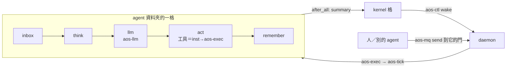

# agent 架構提案（2026-10-02）

← [筆記索引](../../README.md)｜現行 spec：[proto6/spec](../../../spec/README.md)｜裁定：[verdicts 11](../../verdicts/11-tick-as-unit.md)｜同日的 kernel 提案 `proto6/notes/proposals/2026-10-02-kernel/`（另一個 worktree，合進 main 後再改成連結）

**這是規劃，不是實作。** 不改程式、不改 spec、不下裁定；方向由使用者決定。kernel 另有一份提案，兩份靠 [07-kernel介面](07-kernel介面.md) 接起來（已照它的契約對齊，三處不同意見寫在那份末段）。

## 一段話結論

**agent 就是一個工作資料夾**：`.aos/tasks.json` 寫成「agent 的一步」——收信、組 context、呼叫一次 LLM、做工具、寫記憶，五項各是一支小程式；由 kernel 擁有的那份 daemon 設定列成一項，定期叫 `aos-tick` 跑。一格＝agent 的一步＝最多一次 LLM 呼叫（對上 T-06「分配的單位是一次計算」）。身分＝資料夾路徑＋daemon 帳號模組給的 Linux 帳號；收信＝`aos-mq take`、寄信＝`aos-mq send`、睡＝格結束什麼都不做、醒＝kernel `aos-ctl wake` 或有人寄信、停＝人放擋板檔。tick 與 daemon 的程式和 spec **不出現「agent」這個詞**，它只是 T-10 的「其他任務」。新造的只有兩支程式：`aos-llm`（一次呼叫）與 `aos-agent`（五個子命令），加三份 schema。

## 為什麼是這個

- 使用者這三天把 agent 需要的機制都做成 tick 與 daemon 零件了：一步一格、收發信、叫醒、暫停、帳號、cgroup、hooks 配 git。沒人做的只剩「打 LLM」與「把這些接起來」。
- 一步拆成五項，看 `tasks.json` 就知道 agent 做什麼（程式即 spec）；LLM 是表上一項，kernel 或 agent 自己用 `tasks-blocked` `{"kinds":["llm"]}` 就擋得住，不用改程式。
- 其他方案（一支大程式、常駐程式、一人一 daemon）各違反一條方向或只是退化版，比較見 [02](02-方案取捨.md)。

## 檔案

| 檔 | 內容 |
|---|---|
| [01-歷史與零件](01-歷史與零件.md) | proto5 的 agent 是什麼、舊設計 spec、哪些被吸收、現行沒有的、程式核對出的坑 |
| [02-方案取捨](02-方案取捨.md) | 四個方案與取捨、推薦 A；睡覺的三種做法 |
| [03-agent長相](03-agent長相.md) | 資料夾布局、需求→零件對照表、`tasks.json`、daemon 設定範例 |
| [04-一格做什麼](04-一格做什麼.md) | 五項怎麼接力、`aos-llm`、工具＝inst、接力檔、記憶 |
| [05-生命週期](05-生命週期.md) | 建、起、睡、醒、壓住、停、刪；一次對話的時序圖 |
| [06-多agent與上下層](06-多agent與上下層.md) | 門與資料夾權限、信的形狀、平的與巢的、daemon 跑 daemon 的兩個坑、一萬個 agent |
| [07-kernel介面](07-kernel介面.md) | 照 kernel 提案的契約：summary／grant／request、agent 怎麼配合、三處不同意見 |
| [08-分階段](08-分階段.md) | 0 回聲 → 1 aos-llm → 2 完整一步 → 3 三個 agent → 4 主管＋子 daemon → 5 接 kernel → 6 C++11 |
| [09-待決問題](09-待決問題.md) | 21 題，每題附建議 |
| [10-範例JSON](10-範例JSON.md) | `agent.json`、`tools.json`、信、`status.json`、通訊錄、政策檔、回聲 agent 的表 |

## 待使用者決定（短版，全文在 09）

| # | 題 | 建議 |
|---|---|---|
| 1 | 一格＝一次 LLM 呼叫？ | 是；要連續就下一格 |
| 2 | 一步拆五項（A）或一支程式（B）？ | A |
| 3 | 睡＝不自醒、靠 kernel 或信叫？ | 是 |
| 4 | 工具＝inst 交給 `aos-exec`？ | 是 |
| 5 | 信的欄位照 kernel 提案（`type`、`version`、`from`）？ | 是，六個 `type` 一份 schema |
| 6 | LLM 直連、kernel 只排格？ | 是 |
| 7 | 子 agent 先平的、第四階段再子 daemon？ | 是 |
| 8 | 記憶壓縮沿 proto5（機械、32000 token）？ | 是 |
| 9 | 一 agent 一 Linux 帳號，第三階段起？ | 是 |
| 10 | tick／daemon 完全不提 agent？ | 是 |
| 11 | 信箱在記憶體、重開丟信先不管？ | 不管 |
| 12 | SIGHUP 子 daemon 靠 `AOS_DAEMON_PID`？ | 是（同 kernel 提案） |
| 13 | 子 daemon 不切帳號？ | 先不切 |
| 14 | 人也是 daemon 的一項、少造 CLI？ | 是 |
| 15 | 保底週期多久？ | 一小時（kernel 提案）；沒 kernel 時五分 |
| 16 | push summary 而不是 kernel 讀檔？ | push |
| 17 | 工具平行？ | 先依序 |
| 18 | 程式名 `aos-agent <子命令>`＋`aos-llm`？ | 是 |
| 19 | grant 寄成員自己的門，不走共用門？ | 是（跟 kernel 提案不同，要對方同意） |
| 20 | 連續做由 kernel 叫；沒 kernel 才 `self_wake`？ | 是 |
| 21 | 額度強制用 hooks `$ref` 政策檔，不用池代發？ | 先自律；強制留 hooks 版 |

## 來源

現行 spec 全篇與暫緩區；程式 `proto6/src/py`（三位 Opus 助手核對：proto5 agent 歷史、封存舊設計與裁定、現行程式行為）；proto5 `spec/agent`、`spec/aos-agent`、`lib/aos_agent*.py`、`notes/play`、`advice.md`；`notes/archive/spec-2026-10-02/`；`notes/verdicts/09`、`10`、`11` 全部分檔；`notes/agent.md`、`concepts.md`、`2026-10-01-tick-system-tasks.md`；`wf/SESSION-LOG.md`、`wf/workflows/roadmap.md`；kernel 提案（worktree `agent-a6247d4f7cb1ddad9`）。
