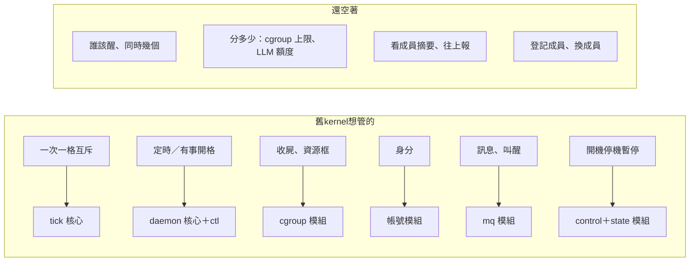

# 一、現況與邊界：kernel 是什麼、不是什麼

← [提案入口](README.md)｜下一份：[方案比較](02-方案比較.md)

## 手上有哪些零件

現行六支程式（[spec](../../../spec/README.md)）在 kernel 眼裡各是什麼：

- **`aos-exec`＋inst**：kernel 做的每件事最後都是一份 inst。
- **`aos-tick`**：kernel 的「腦」就是一份 `tasks.json`，由它跑。
- **`aos-daemon` 核心**：kernel 的「手腳」，成員就是它清單上的項。
- **控制模組＋`aos-ctl`**：叫醒、暫停、砍掉成員的唯一管道。
- **重讀設定模組**：改成員名單、改資源上限的管道。
- **收屍／cgroup 模組**：分 CPU／記憶體／pids 的管道。
- **帳號模組**：分身分的管道（靜態）。
- **訊息模組＋`aos-mq`**：收摘要、發額度、收請求的管道。
- **記住狀態模組**：kernel 的決定能撐過 daemon 重開。

程式裡**沒有**：agent、LLM 呼叫、額度、排程政策、逾時（daemon 與 tick 都沒傳）、訊息持久化。這些是空白，不是 bug。

## 歷史上 kernel 想做什麼

- **proto5**：kernel＝排程員＋帳本。管池、派工、判回音、叫醒。不管帳號、權限、LLM 額度。
- **proto6 舊設計（09-29～09-30）**：kernel 是**角色**，不是程式——哪個資料夾的任務表放了「管排程與資源」的任務，它就是 kernel。可以疊很多層，上層只看下層摘要。資源可插拔；LLM 也是資源；上層管下層要「潤物細無聲」。
- **T-06（還算數）**：aos 分配的單位是「一次計算」（一次 LLM 呼叫、一輪 agent），計算要能被 Linux 啟動、限制、殺掉。

## 哪些已被吸收、哪些還空著

**還空著的四樣就是 kernel。** 它們全是「政策」：讀狀況、做決定、透過現有管道套用。沒有一樣需要新的常駐程序。

## kernel 的邊界

| 對象 | kernel 是 | kernel 不是 |
|---|---|---|
| tick | 一個靠 tick 推進的工作資料夾；排程只在它的格裡跑 | 不是 tick 模組，不改 tick 核心 |
| daemon | daemon 的使用者：它擁有一份 daemon 設定，成員寫在 `insts` | 不是 daemon 模組；daemon 仍是笨 cron |
| daemon 模組 | 靠 control／reload／cgroup／account／mq 五個模組做事 | 不加新模組（除了一個小補，見待決 4） |
| hooks | kernel 自己的 tasks.json 可用 hooks（git、往上報）；成員用 hooks 送摘要 | 不用 hooks 替成員做決定 |
| inst | kernel 每一項任務都是 inst；成員也是 inst | inst 不多任何欄位（沒有 `user`、沒有資源欄） |
| agent | agent 是 kernel 的一個成員（一項 inst，通常 argv 是 `aos-tick <agent 資料夾>`） | kernel 不讀 agent 內部，只收摘要 |

## 幾條沿用的原則

- **權限不在 kernel 裡判**（T-08）：能連 socket、能寫 tasks.json 就是那個身分。kernel 要隔離成員，就把 socket 放在權限對的資料夾、成員用帳號模組開。
- **一切以格計**（C-01）：額度、保留期、到期用 kernel 自己的 `seq`；外部世界的（HTTP 逾時、`interval_ms`）才用毫秒。
- **默認一切正常**：kernel 的格壞了（表壞、程式丟錯）就回 1、下一格再來；成員照上一次的設定繼續跑，沒有救援邏輯。
- **反應速度是一格**：成員要什麼，最快下一格 kernel 才處理；急件靠 `aos-mq` 的叫醒。
