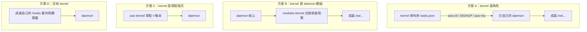

# 二、方案比較

← [提案入口](README.md)｜上一份：[現況與邊界](01-現況與邊界.md)｜下一份：[推薦方案](03-推薦方案.md)

四個方案，差別在「排程政策住在哪裡」。

## A．kernel 是角色：資料夾＋一份 daemon 設定

kernel＝一個工作資料夾（`tasks.json` 放「收、判、套、報」四類任務，由 `aos-tick` 跑）＋它擁有的一份 daemon 設定（`insts` 列成員）。政策跑在 kernel 自己的格裡；套用全走現有管道。多層＝上層 daemon 把下層 daemon 當一項跑。

- 好：零新機制。完全符合「排程行為在任務表上、只在 tick 跑、daemon IPC 是唯一逃生口」。kernel 壞了成員照跑。層數隨便疊。
- 壞：反應慢一格（這是使用者接受的）。kernel 要改成員名單或上限得改自己的 daemon 設定再 SIGHUP，現在拿不到 daemon 的 pid（小補）。政策跟 daemon 設定分兩份檔，要對得上。

## B．kernel 是 daemon 模組

daemon 多一個 `modules.kernel`：每次要開某項之前先看一份政策檔（額度、同時上限），不合就不開。

- 好：開格的強制力最強（成員繞不過）。反應快，不用等格。
- 壞：違反「排程只在 tick 跑」與「daemon 只是笨 cron」兩條使用者方向。參數改政策檔就好，但**演算法**一變就要改 daemon 程式（A 改的是一支任務程式，daemon 不動）。它只在開格前檢查整項，管不到一格裡叫幾次 LLM——LLM 額度要強制，不管哪個方案都得逐次呼叫前檢查或池代發。多層時每層 daemon 都帶政策，跟「上層只認自己懂的東西」打架。

## C．kernel 是常駐程式（proto5 路線）

一支 `aos-kernel` 常駐，記帳本、派工、判回音。

- 好：proto5 做過，概念熟。
- 壞：違反「不准有背景程序繞過 tick」、「沒有帳本」兩條裁定。使用者 09-29 就是因為這條路偏了才改回 kernel 樹。不推。

## D．沒有 kernel：成員自律

不設 kernel 資料夾。共用一份額度檔，每個成員的 `before_all` hook 自己看額度決定要不要跑；用量自己記。

- 好：最少東西。小團隊夠用。
- 壞：沒有「上層看下層摘要」、沒有同時上限、沒有往上報；額度檔多人寫會撞。這其實是方案 A 的退化版：kernel 什麼政策都不做時就長這樣。

## 對照使用者原則

| 原則 | A | B | C | D |
|---|---|---|---|---|
| 排程是任務表上的程式，只在 tick 跑 | 是 | 否 | 否 | 是 |
| daemon IPC 是唯一逃生口 | 是 | 是 | 否 | 是 |
| 不新造機制、用現有零件 | 是（一個小補） | 新模組 | 新程式＋帳本 | 是 |
| 多層多 kernel、上層只看摘要 | 是 | 勉強 | 是 | 否 |
| 默認一切正常、壞了不連累成員 | 是 | daemon 壞全停 | kernel 壞全停 | 是 |
| 開格數可強制 | 否（成員收信就開格） | 是 | 是 | 否 |
| LLM 額度可強制 | 否（自律；強制要池代發或逐次檢查） | 否（同左） | 否（同左） | 否 |

## 推薦：A；D 另搭一版對照

推薦 A。理由一句話：**它是使用者這三天裁定自然長出來的形狀**——tick 是單位、daemon 是手腳、模組是管道，kernel 只剩「拿這些管道做決定」。

D 是 A 的退化版（kernel 什麼政策都不做時就長這樣），但**第 0 階段手搭的是 A 不是 D**。要判斷「成員自律夠不夠」，得另搭一個真正沒有 kernel 的版本並排看（見 [05](05-分階段落地.md) 第 0 階段）。

B 留一個位置：等 POC 玩過，若使用者覺得「成員自律靠不住」，LLM 額度那一塊可以改走「池代發」（舊設計三檔的第二檔），由池那一項強制；仍不必把政策塞進 daemon。
