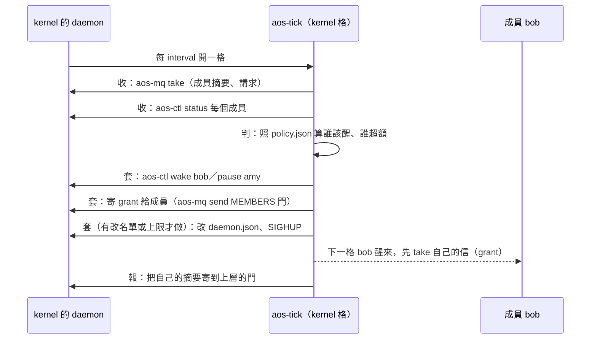
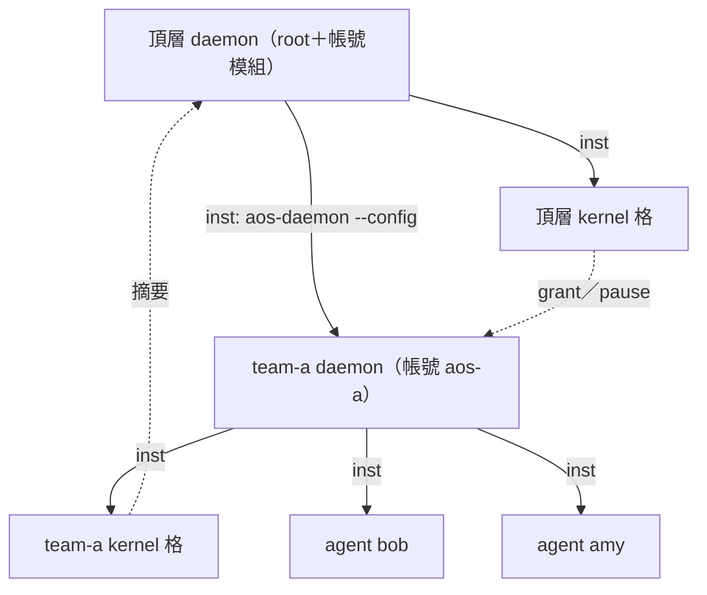

# 三、推薦方案：kernel 的一格

← [提案入口](README.md)｜上一份：[方案比較](02-方案比較.md)｜下一份：[agent 介面](04-agent介面.md)

## 一個 kernel 長什麼樣

```text
team-a/                      ← kernel 的工作資料夾
  .aos/tasks.json            ← kernel 的腦：收、判、套、報
  daemon.json                ← kernel 的手腳：成員清單（daemon 設定）
  config/policy.json         ← 政策：每成員額度、同時上限
  state/members.json         ← 上一格看到的成員狀況（kernel 自己寫）
  doors/kernel/s             ← 成員寄信給 kernel 的門（資料夾權限管誰能寄）
  doors/members/s            ← kernel 寄信給成員的門
```

kernel 的 daemon 設定裡，**第一項就是 kernel 自己**，其餘是成員：

```json
{"interval_ms": 60000,
 "modules": {"control": {"socket": "./ctl.sock"}, "reload": {},
             "state": {"$ref": "state/daemon-state.json"}, "cgroup": {},
             "mq": {"KERNEL": "./doors/kernel/s", "MEMBERS": "./doors/members/s"}},
 "insts": {
   ".": {"interval_ms": 10000, "mq": ["KERNEL"]},
   "agents/bob": {"interval_ms": 3600000, "mq": ["MEMBERS"], "cgroup": {"memory.max": "512M"}},
   "agents/amy": {"interval_ms": 3600000, "mq": ["MEMBERS"], "account": {"user": "aos-amy"}},
   "teams/b/daemon-run": {"interval_ms": 86400000, "cgroup": {"memory.max": "4G"}}}}
```

- `"."` 是 kernel 自己：它的 `inst.json` 寫 `{"argv": ["aos-tick"]}`，每 10 秒跑一格。
- 成員的週期設很長，等於「不叫不醒」；kernel 用 `aos-ctl wake` 叫。
- `teams/b/daemon-run` 是下一層 kernel：它的 inst 是 `aos-daemon --config teams/b/daemon.json`。上層只看到一項。

## 一格做什麼



tasks.json 四項，全是普通程式（`kind` 寫 `"kernel"` 只為掛 hooks）：

| 項 | 做什麼 | 讀 | 寫 |
|---|---|---|---|
| `collect` | 取信、問 status | mq、ctl | `state/members.json` |
| `decide` | 算額度、排誰醒 | `config/policy.json`、`state/` | `state/plan.json` |
| `apply` | wake／pause、寄 grant、改 daemon.json＋SIGHUP | `state/plan.json` | daemon |
| `report` | 寄自己的摘要給上層 | `state/` | 上層的門 |

四項拆開是為了好讀、好測、好換（例如 `decide` 換成另一套政策）。要合成一支也行。

## kernel 管哪些事

| 事 | 怎麼管 | 用哪個零件 |
|---|---|---|
| 誰該醒、同時幾個 | `max_awake`；成員摘要 `ready` 或 `due_seq` 到了就排進去 | `aos-ctl wake`／`pause`／`status` |
| CPU／記憶體／pids | 成員 `cgroup` 上限寫在 daemon.json | cgroup 模組、reload |
| LLM 額度 | 每成員「這個窗口能叫幾次／幾個 token」，寄 grant；成員回報用量 | mq |
| 身分 | 成員用哪個帳號，寫在 daemon.json（靜態，kernel 不動態換） | 帳號模組 |
| 訊息 | 兩扇門：成員→kernel、kernel→成員；kernel 不轉信 | mq |
| 紀錄 | 自己的 `state/`＋tick 紀錄；沒有帳本 | 檔案 |
| 下層 kernel | 當一項：同樣的 wake／pause／cgroup；只收它的摘要 | 同上 |

**不管**：權限（T-08，靠資料夾與帳號）、git（成員與 kernel 各自用 hooks）、成員內部怎麼跑、逾時（成員自己包 `timeout`）、隨機性（T-06 方向，先不做）。

## 多層怎麼接



- 上層分給下層一塊：daemon.json 那一項的 `cgroup` 上限、帳號名單、LLM 額度（grant）。下層在那塊裡再分。cgroup 天生巢狀；LLM 額度靠下層 kernel 的 `decide` 自己守住。
- 上層怎麼管下層，下層的成員不知道（潤物細無聲）：上層 pause 了 team-a，整個 team-a 的 daemon 停住，bob 只覺得沒被叫醒。
- 上層的門路徑怎麼讓下層知道：寫死在下層的 `policy.json`，或在下層 daemon.json 的 kernel 項 `envs` 裡用 `{"$env": "AOS_DAEMON_MQ_KERNEL"}` 把繼承來的上層門路徑接住（daemon 展開設定檔時環境還是上層給的）。兩種都能用，見待決 7。

## 壞了怎樣

默認一切正常。kernel 的格 `bad_table` 或程式丟錯：回 1、不開格或半途停，成員照上一次的 wake／pause／grant 繼續；下一格再來。daemon 重開：state 模組記得暫停，grant 要等 kernel 下一格重寄（信箱在記憶體）。kernel 不做任何救援。
