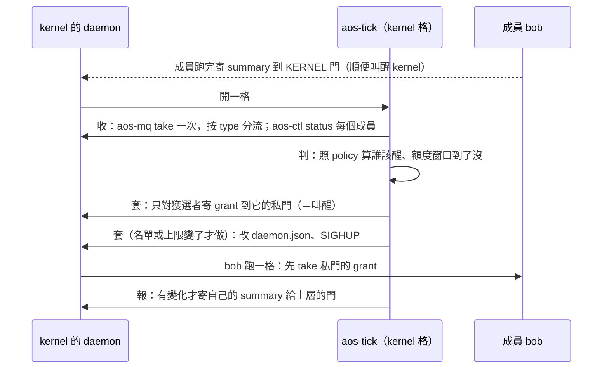
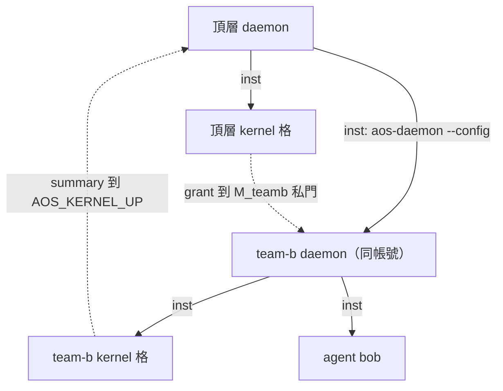

# 三、推薦方案：kernel 的一格

← [提案入口](README.md)｜上一份：[方案比較](02-方案比較.md)｜下一份：[agent 介面](04-agent介面.md)

〔2026-10-02 照 astra 審查修正：成員預置暫停、grant 走私門且只在叫醒時寄、下層不能再分帳號、`envs` 放對位置、任務失敗不會讓整格回 1。〕

## 一個 kernel 長什麼樣

```text
team-a/                      ← kernel 的工作資料夾
  .aos/tasks.json            ← kernel 的腦：一項 aos-kernel step（收→判→套→報）
  .aos/inst.json             ← {"argv": ["aos-tick"]}
  daemon.json                ← kernel 的手腳：成員清單（daemon 設定）
  config/policy.json         ← 政策：每成員額度、同時上限
  state/members.json         ← 上一格看到的成員狀況（kernel 自己寫）
  state/daemon-state.json    ← state 模組的檔；成員預置 paused:true
  doors/kernel/s             ← 成員寄 summary／request 給 kernel 的門
  doors/bob/s、doors/amy/s   ← 每成員一扇私門：kernel 寄 grant＝叫醒
```

kernel 的 daemon 設定裡，**第一項就是 kernel 自己**，其餘是成員：

```json
{"interval_ms": 10000,
 "modules": {"control": {"socket": "./ctl.sock"}, "reload": {},
             "state": {"$ref": "state/daemon-state.json"}, "cgroup": {},
             "mq": {"KERNEL": "./doors/kernel/s", "M_bob": "./doors/bob/s",
                    "M_amy": "./doors/amy/s", "M_teamb": "./doors/teamb/s"}},
 "insts": {
   ".": {"mq": ["KERNEL"]},
   "agents/bob": {"mq": ["M_bob"], "cgroup": {"memory.max": "512M"}},
   "agents/amy": {"mq": ["M_amy"]},
   "teams/b/run": {"mq": ["M_teamb"], "cgroup": {"memory.max": "4G"}}}}
```

- 成員**不是**靠長週期「不叫不醒」：daemon 開起來每項先跑一次、之後照週期。所以 `state/daemon-state.json` 預先寫 `{"insts":{"agents/bob":{"paused":true},…}}`，成員永遠暫停；暫停中收到信會跑一格、跑完照樣暫停（現行行為，有測試）。**kernel 寄 grant 到它的私門＝叫醒它跑一格。**
- 切帳號要 root 開 daemon 並掛 `modules.account`；範例沒掛，所以都用同一帳號（見「多層」）。
- `teams/b/run` 是下一層 kernel：那個資料夾的 `inst.json` 寫 `aos-daemon --config teams/b/daemon.json`。上層只看到一項。

## 一格做什麼



**不互叫**：kernel 從不「每格無條件寄信」。grant 只在三種時候寄：決定叫醒某成員、該成員的額度窗口換了、該成員寄了 request。成員寄 summary 叫醒 kernel 沒關係——kernel 一格很便宜，沒事就什麼都不寄、結束。

tasks.json 只列**一項** `aos-kernel step`，裡面依序跑收、判、套、報，前一步失敗就停。拆成四個子命令是為了好測、好換政策；不拆成四項任務，因為 tick 對任務非 0 碼只記不停（B-620），`decide` 壞了 `apply` 還是會跑。真要拆四項，`decide` 失敗時自己建 `tasks-blocked` 擋住後面。

| 子命令 | 做什麼 | 讀 | 寫 |
|---|---|---|---|
| `collect` | take 一次、問 status | mq、ctl | `state/members.json` |
| `decide` | 算額度窗口、排誰醒（受 `max_awake`，看 status 的 `running` 跨格數） | policy、state | `state/plan.json` |
| `apply` | 寄 grant、改 daemon.json＋SIGHUP | plan | daemon |
| `report` | 有變化才寄 summary 給上層 | state | 上層的門 |

## kernel 管哪些事

| 事 | 怎麼管 | 零件 |
|---|---|---|
| 誰該醒、同時幾個 | `max_awake`；只對獲選者寄 grant；`status.running` 算在跑的 | mq、ctl |
| CPU／記憶體／pids | 成員 `cgroup` 上限寫在 daemon.json | cgroup 模組、reload |
| LLM 額度 | grant 寫窗口總額；成員回報用量；成員自律 | mq |
| 身分 | 寫在 daemon.json（靜態；只有 root 開的那一層能分） | 帳號模組 |
| 訊息 | KERNEL 門收、私門發；kernel 不轉信 | mq |
| 紀錄 | 自己的 `state/`＋tick 紀錄；沒有帳本 | 檔案 |
| 下層 kernel | 當一項：cgroup 上限、grant（寫 `awake` 上限）；只收它的摘要 | 同上 |

**kernel 限制的是「它主動叫醒的格數」**，不是成員所有的格：成員收到別人的信也會跑一格（這是 daemon 的行為，kernel 攔不住）。真正要省的是 LLM，所以成員在叫 LLM 前查 grant，而不是在開格時查。

**不管**：權限（T-08）、git（各自 hooks）、成員內部、逾時（成員自己包 `timeout`）、隨機性（先不做）。

## 多層怎麼接



**上層怎麼找下層、下層怎麼找上層。**daemon 設定的 `insts` 不讀 `envs`，所以上層門的路徑要放在啟動下層那份真正的 `teams/b/run/inst.json`：`"envs": {"AOS_KERNEL_UP": {"$env": "AOS_DAEMON_MQ_M_teamb"}, "AOS_KERNEL_UP_INST": {"$env": "AOS_DAEMON_INST"}}`——`aos-exec` 在上層給的環境裡解 `$env`，等於把「我的私門」「我在上層叫什麼」存成別名再往下傳。下層 daemon 複製整份環境、只覆蓋同名變數（`AOS_DAEMON_INST`、同名門），別名不會被蓋。下層 kernel 取上層的 grant：`AOS_DAEMON_INST=$AOS_KERNEL_UP_INST aos-mq take $AOS_KERNEL_UP`；報告寄到同一扇門、`from` 填 `AOS_KERNEL_UP_INST`。

**壓住下層。**對常駐的下層 daemon，`aos-ctl pause` 沒用（只是不再排下一次，正在跑的不殺）。兩條路：軟＝上層寄 grant `{"awake": 0}`，下層 kernel 自己不再叫醒成員、在跑的做完（POC 用這條）；硬＝先 `aos-ctl pause` 再 `kill`（`kill` 只殺當次，不 pause 的話下個週期又開；掛 cgroup 時整框清掉），`resume` 回來，下層成員的暫停靠 state 模組記得。不能說成「原地暫停、resume 接續」。

**cgroup。**上層給下層一項上限，下層在裡面再分；同帳號巢狀現行就能做。

**帳號：現行只有 root 開的那一層能分帳號。**帳號模組要 root 才掛得起來、成員又不准用 root，所以下層 daemon 不能再分。POC 多層全用同一帳號；逐層切帳號是未具備的能力，列在待決 16。

## 壞了怎樣

默認一切正常。kernel 的 `step` 回非 0：tick 照記、整格仍回 0（任務碼不影響 tick）；成員照上一次的 grant 繼續，下一格再來。`tasks.json` 壞了才 `bad_table` 回 1、不開格。daemon 重開：state 記得成員暫停；還沒 take 的 grant 丟了，kernel 下一格重判再寄。kernel 不做任何救援。
