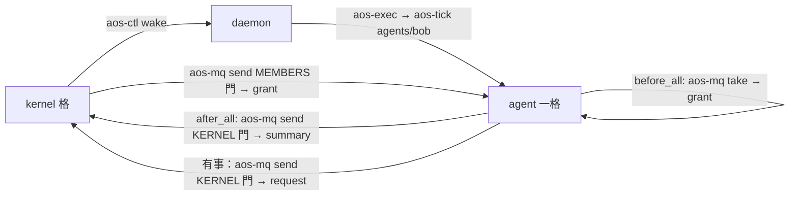

# 四、kernel 與 agent 的介面（給 agent 規劃者對齊用）

← [提案入口](README.md)｜上一份：[推薦方案](03-推薦方案.md)｜下一份：[分階段落地](05-分階段落地.md)

這份是**契約草案**：kernel 這邊只要求這幾件事，agent 內部怎麼做不管。agent 規劃者若另有想法，改這份、兩邊對齊。

## 一句話

**agent 對 kernel 來說就是 daemon 清單上的一項 inst**：被叫醒就跑一格、跑完寄一封摘要、開跑先取信看額度。沒有別的身分、沒有登記協議。



## agent 怎麼被看見

kernel 只看三樣：`aos-ctl status <inst>`（在跑、暫停、上次碼）、agent 寄來的 **summary**、agent 寄來的 **request**。kernel 不讀 agent 資料夾、不看它的 tick 紀錄。

## agent 怎麼被啟動

- agent 是一個工作資料夾，有 `.aos/tasks.json`（agent 的一輪怎麼跑，agent 規劃者定）。
- kernel 的 daemon.json 把它列成一項，`interval_ms` 設很長（等於不自醒）。要它跑，kernel `aos-ctl wake`；它寄信給 kernel 的門也會順便叫醒 kernel。
- agent 的一格拿到的環境變數就是現行那幾個：`AOS_DAEMON_CTL_SOCKET`、`AOS_DAEMON_INST`、`AOS_DAEMON_MQ_KERNEL`、`AOS_DAEMON_MQ_MEMBERS`、`AOS_TICK_CWD`…（C-10）。不另加。

## agent 怎麼被限制

| 限制 | 誰套 | agent 要配合什麼 |
|---|---|---|
| 要不要跑、何時跑 | kernel wake／pause | 不自醒；一格做完就結束，不忙轉 |
| CPU／記憶體／pids | daemon cgroup 模組 | 不用配合，Linux 強制 |
| 帳號 | daemon 帳號模組 | 不用配合 |
| LLM 額度 | kernel 寄 grant | **自律**：叫 LLM 前看 grant，超了就不叫、摘要寫 `ready:true` 等下回 |
| 整格逾時 | 包在 inst 外的 `timeout` | 不用配合 |

POC 階段 grant 不強制（agent 可以不理）；要強制就走「池代發」那一檔（待決 5）。

## 三種信（JSON 範例）

信都是 `aos-mq` 原樣送，kernel 與 agent 自己認 `type`。欄位可加不可改意思（C-07）。

**summary**（agent → kernel 的門；建議放在 agent 的 `after_all` hook）：

```json
{"type": "summary", "version": 1, "from": "agents/bob", "seq": 42,
 "ready": true, "due_seq": null,
 "usage": {"llm_calls": 3, "llm_tokens": 1820},
 "note": "等 bob 回信"}
```

- `seq`：agent 自己的格數。`ready:true`＝還有事可做、希望再被叫醒；`false`＋`due_seq`＝幾格後再叫（算 kernel 的格，C-01）；兩者都空＝睡到有信。
- `usage`：這一格用了多少 LLM；kernel 累加。
- `note`：給人看，kernel 不解讀。

**grant**（kernel → MEMBERS 門；agent `before_all` 先 `aos-mq take`，只認 `to` 是自己的）：

```json
{"type": "grant", "version": 1, "to": "agents/bob", "kernel_seq": 1203,
 "llm": {"calls": 20, "tokens": 50000, "window_ticks": 10},
 "note": "本窗口剩 17 次"}
```

- 每格重寄最新一封（信箱在記憶體、重開會丟）；agent 以最新的為準。
- 數字以 kernel 的格為窗口。沒收到 grant 就照 agent 自己的預設。

**request**（agent → kernel；要什麼就寄，kernel 下一格處理）：

```json
{"type": "request", "version": 1, "from": "agents/bob", "seq": 42,
 "ask": "llm_more", "args": {"tokens": 20000}, "note": "大檔要摘要"}
```

`ask` 開放列舉；POC 只認 `llm_more`（要更多額度）與 `wake_me`（幾格後叫我：`args.after_ticks`）。不認得的 kernel 記下就算，不回錯。

## agent 規劃者要定的、kernel 這邊不管的

- agent 一輪的 tasks.json 長相、LLM 怎麼叫（直連 key 在 agent 帳號讀得到，舊裁定已接受）、記憶怎麼存。
- summary 由哪個 hook 送、怎麼算 `ready`。
- 收到 grant 怎麼自律（建議：一個小程式 `aos-llm-call` 讀 grant 檔再打 HTTP，超額回非 0）。
- 跟其他 agent 講話：走同一扇 MEMBERS 門或自開門，kernel 不轉信（第二十一批：跨 daemon 直接寄到對方的門）。

## 兩邊都要守的

- 信裡**沒有權限意義**：能寄到門就是能寄。要限制誰能寄給 kernel，門放在權限對的資料夾。
- 不等對方：kernel 不等 agent 的摘要，agent 不等 grant。沒信就照預設。
- 反應速度一格：agent 寄 request 後最快 kernel 的下一格才有回應。
