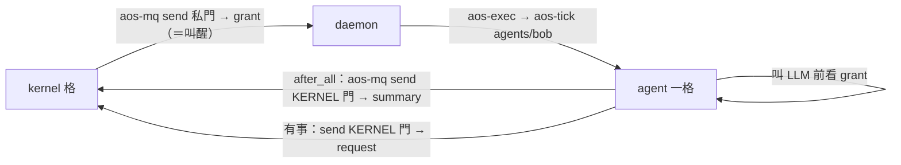

# 四、kernel 與 agent 的介面（給 agent 規劃者對齊用）

← [提案入口](README.md)｜上一份：[推薦方案](03-推薦方案.md)｜下一份：[分階段落地](05-分階段落地.md)｜對方：agent 提案 [07-kernel介面](../2026-10-02-agent/07-kernel介面.md)

這份是**契約草案**：kernel 只要求這幾件事，agent 內部怎麼做不管。〔2026-10-02 照 astra 審查與 agent 提案改：grant 走私門、不每格寄；`due_seq` 改 `after_ticks`；grant 是窗口總額；take 一次再分流；schema 合一份。〕

## 一句話

**agent 對 kernel 來說就是 daemon 清單上的一項 inst**：收到 grant 就跑一格、跑完寄一封 summary、叫 LLM 前看 grant。沒有別的身分、沒有登記協議。



## agent 怎麼被看見

kernel 只看三樣：`aos-ctl status <inst>`（在跑、暫停、上次碼）、agent 寄來的 **summary**、agent 寄來的 **request**。kernel 不讀 agent 資料夾、不看它的 tick 紀錄。

## agent 怎麼被啟動

- agent 是一個工作資料夾，有 `.aos/tasks.json`（agent 的一輪怎麼跑，agent 規劃者定）。
- kernel 的 daemon.json 把它列成一項，並用 state 模組**預置 `paused:true`**（daemon 開起來每項會先跑一次，長週期擋不住）。暫停中收到信會跑一格、跑完照樣暫停，所以 **kernel 寄 grant 到它的私門就是叫醒它**。別人寄信到它訂的門也會讓它跑一格，這是 daemon 的行為，kernel 不攔。
- 環境變數就是現行那幾個：`AOS_DAEMON_CTL_SOCKET`、`AOS_DAEMON_INST`、`AOS_DAEMON_MQ_KERNEL`、`AOS_DAEMON_MQ_M_<名>`（每扇門一個）、`AOS_TICK_CWD`…（C-10）。不另加。

## agent 怎麼被限制

| 限制 | 誰套 | agent 要配合什麼 |
|---|---|---|
| 要不要跑、何時跑 | kernel 寄 grant 叫醒 | 預置暫停、不自醒；一格做完就結束，不忙轉 |
| CPU／記憶體／pids | daemon cgroup 模組 | 不用配合，Linux 強制 |
| 帳號 | daemon 帳號模組（root 那層才有） | 不用配合 |
| LLM 額度 | kernel 的 grant | **自律**：叫 LLM 那一步之前看 grant，超了就不叫、summary 寫 `ready:true`。不能用 `before_kind` 寫 tasks-blocked 擋當次（擋板只擋下一項） |
| 整格逾時 | 包在 inst 外的 `timeout` | 不用配合 |

POC 階段 grant 不強制（agent 可以不理）；要強制是方向題（待決 5）。

## 三種信（JSON 範例）

信都是 `aos-mq` 原樣送，收信方**只 take 一次**（take 會清空信箱），再按 `type` 分流；不認得的 `type` 留著不丟。欄位可加不可改意思（C-07）。schema **只一份** `agent-msg.schema.json`（agent 隊定名），跟 agent 之間的 `say`／`result`／`task` 合在一起，六個 `type` 用 `type` 分支。

**summary**（agent → KERNEL 門；建議放在 agent 的 `after_all` hook，沒做事的空格可以不寄）：

```json
{"type": "summary", "version": 1, "from": "agents/bob", "seq": 42,
 "ready": true, "after_ticks": null,
 "usage": {"llm_calls": 3, "llm_tokens": 1820},
 "note": "等 amy 回信"}
```

- `seq`：agent 自己的格數。`ready:true`＝還有事、希望再被叫醒；`false`＋`after_ticks:N`＝從 kernel 收到這封起算 N 格後再叫（算 kernel 的格，C-01）；兩者都空＝睡到有信。
- `usage`：這一格用了多少 LLM；kernel 累加進窗口。
- `note`：給人看。

**grant**（kernel → 該成員的私門；寄到就是叫醒）：

```json
{"type": "grant", "version": 1, "to": "agents/bob",
 "kernel_seq": 1203, "window_start_seq": 1200, "window_ticks": 10,
 "llm": {"calls": 20, "tokens": 50000},
 "note": "窗口總額，不是剩餘"}
```

- `llm` 是**這個窗口的總額**；同一個 `window_start_seq` 再收到一封不重置，agent 用自己記的用量去扣。沒收到新 grant 就沿用上一封（agent 要留住它，別跟暫存一起清）。
- kernel 不每格寄。只在：決定叫醒你、窗口換了、你寄了 request。
- 給下層 kernel 的 grant 多一欄 `"awake": N`（它最多同時叫醒幾個成員；0＝全部壓住）。

**request**（agent → KERNEL 門；kernel 下一格處理）：

```json
{"type": "request", "version": 1, "from": "agents/bob", "seq": 42,
 "ask": "llm_more", "args": {"tokens": 20000}, "note": "大檔要摘要"}
```

`ask` 開放列舉；POC 只認 `llm_more`（要更多額度）與 `wake_me`（`args.after_ticks`）。不認得的 kernel 記下就算，不回錯。

## agent 規劃者要定的、kernel 不管的

- agent 一輪的 tasks.json、LLM 怎麼叫（直連 key 在 agent 帳號讀得到，舊裁定已接受）、記憶怎麼存、grant 存哪。
- summary 由哪個 hook 送、`ready` 怎麼算。
- 跟其他 agent 講話：寄到對方訂的門，kernel 不轉（第二十一、二十二批已有廣播與頻道）。

## 兩邊都要守的

- 信裡**沒有權限意義**：能寄到門就是能寄。要限制誰能寄給 kernel，門放在權限對的資料夾。
- 不等對方：kernel 不等 summary。agent 從沒收過 grant 時「照自己預設跑」還是「等到有 grant」是方向題：我建議照預設、agent 隊建議等（他們的待決 23），使用者拍了誰改誰。
- 反應速度一格：request 最快 kernel 的下一格才有回應。
- 門是開 daemon 時定的，重讀設定加不了新門：POC 成員固定；加成員要重開 daemon，或開時預留幾扇備用門（`W1`…`W8`）給新成員接。
