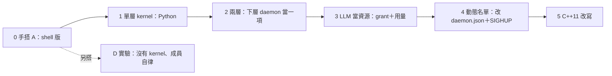

# 五、分階段落地

← [提案入口](README.md)｜上一份：[agent 介面](04-agent介面.md)｜下一份：[待決問題](06-待決問題.md)

原則：每階段有一件**人手跑一次就能看見**的事；Python POC 先、C++11 最後；每階段做完照慣例派沒讀過筆記的人試玩。〔2026-10-02 照 astra 審查改：第 0 階段是 A 的手搭版、同時上限跨格驗、第 2 階段驗雙向信與 kill、第 4 階段加門要重開。〕

## 第 0 階段：手搭方案 A（不寫程式，半天）

用現有六支程式搭一個 kernel 與兩個假成員（成員就是 shell 腳本：睡幾秒、寄一封 summary）。kernel 的 `step` 先用 shell 寫。成員用 state 檔預置 `paused:true`。

最小可驗：
1. kernel 寄 grant 到 bob 私門，bob 跑一格、寄 summary；kernel 下一格 take 看得到。
2. `max_awake:1`，兩個成員都 `ready:true`，假成員跑的時間比 kernel 週期長，**連看三格**都只有一個在跑（看 `aos-ctl status` 的 `running`）。
3. bob 的 `usage.llm_calls` 寫爆，kernel 下一格不再寄 grant；改回來後又寄。
4. amy 完全沒收到 grant 時，不會因為 bob 收 grant 而醒來（私門隔開）。

**這驗的是 A，不是 D。** 要知道「成員自律就夠不夠」，另搭一個真正沒有 kernel 的版本：兩個成員各自讀共用額度檔、自己 `aos-ctl wake` 自己。兩版並排看，是待決 15 的實測依據。

## 第 1 階段：單層 kernel（Python，一隊）

`aos-kernel step`（子命令 collect／decide／apply／report），一份共用信 schema `agent-msg.schema.json`（跟 agent 隊合、用 `type` 分支）與 `policy.json`、`state/members.json` 的格式與正反例。

最小可驗：
- 單元測試：給一組 summary 與 policy，`decide` 算出的叫醒名單與 grant 正確；同窗口寄兩封合計仍只能用原額。
- 整合測試：真 daemon＋真 tick，三格內完成「叫醒→摘要→不再叫醒」。
- 範本：`proto6/templates/kernel/` 一份能直接複製的 kernel 資料夾。

不做：動態名單、LLM 真呼叫、多層。

## 第 2 階段：兩層（一隊）

頂層 daemon 把 team-b 的 daemon 當一項跑（**同帳號**；cgroup 給上限）。啟動 team-b 的 inst.json 用 `envs` 存上層門的別名。

最小可驗：
- **雙向信**：team-b 的 kernel 寄 summary 到頂層（`from` 是它在頂層的名字）；頂層寄 grant 到 team-b 的私門，team-b 的 kernel 用上層身分 take 得到。
- **軟壓住**：頂層寄 grant `awake:0`，team-b 下一格起不再叫醒 bob；改回 1 恢復。
- **硬停**：頂層先 `aos-ctl pause teams/b/run` 再 `kill`，整框清掉、週期也不再開；`resume` 後 team-b 回來、bob 仍是暫停。
- 頂層改 team-b 的 `memory.max`、人手送 SIGHUP，team-b 內的程序真被限制（有委派 cgroup 的機器才驗）。

## 第 3 階段：LLM 當資源（一隊，跟 agent 隊合）

agent 隊的 LLM 呼叫程式讀 grant；kernel 累加 usage、窗口到了寄新 grant；`request.llm_more` 有回應。

最小可驗：
- 額度 3 次，agent 一格想叫 5 次，只成功 3 次，summary 寫 `ready:true`。
- 下個窗口額度回來，剩下 2 次做完。
- 沒收到 grant 的 agent 照自己預設跑（不卡死）。

## 第 4 階段：動態名單（半隊）

kernel 的 `apply` 能改自己的 daemon.json（加成員、改上限）再 SIGHUP。前提：待決 4（怎麼拿到 daemon 的 pid）有答案。**重讀加不了新門**：新成員要有私門就得重開 daemon，或事先預留幾扇空門。

最小可驗：複製一個 agent 資料夾、在 policy 加一行、接一扇預留門，三格內新成員收到第一封 grant。

## 第 5 階段：C++11 改寫

等 POC 玩過、格式定了再做。順序照穩定度：信 schema → `decide`（純函式，最好測）→ `collect`／`apply`／`report`。使用者說過想親手寫的部分留到這裡。

## 每階段共同的驗收

- `cd proto6/src/py && PYTHONDONTWRITEBYTECODE=1 PYTHONPATH=lib python3 -m unittest discover -s tests` 全綠。
- `validate.py` 驗 schema 與正反例。
- `bash wf/tools/wf-lint.sh .` 無壞連結、無超標。
- 派一個只拿 README 的 agent 照範本搭起來、故意弄壞、照五條標準打分。
