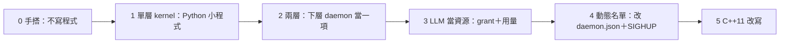

# 五、分階段落地

← [提案入口](README.md)｜上一份：[agent 介面](04-agent介面.md)｜下一份：[待決問題](06-待決問題.md)

原則：每階段有一件**人手跑一次就能看見**的事；Python POC 先、C++11 最後；每階段做完照慣例派沒讀過筆記的人試玩。

## 第 0 階段：手搭（不寫程式，半天）

用現有六支程式搭一個 kernel 與兩個假成員（成員就是 shell 腳本：睡幾秒、寄一封 summary）。kernel 的四項任務先用 shell 寫。

最小可驗：
1. kernel 格 `aos-ctl wake` 叫醒 bob；bob 跑完寄 summary；kernel 下一格 `aos-mq take` 看得到。
2. policy 寫 `max_awake:1`，兩個成員都 `ready:true`，一格只醒一個。
3. 把 bob 的 `usage.llm_calls` 寫爆，kernel 下一格 `pause` 它；改回來後 `resume`。

這一步同時驗證方案 D（成員自律）夠不夠：若夠，使用者可以決定先停在這裡。

## 第 1 階段：單層 kernel（Python，一隊）

把四項任務寫成小程式（名字暫定 `aos-kernel-collect`／`-decide`／`-apply`／`-report`，或一支 `aos-kernel <子命令>`），加三份 schema（summary、grant、request）與 `policy.json`、`state/members.json` 的格式與正反例。

最小可驗：
- 單元測試：給一組 summary 與 policy，`decide` 算出的 wake／pause／grant 清單正確。
- 整合測試：真 daemon＋真 tick，三格內完成「叫醒→摘要→暫停」。
- 範本：`proto6/templates/kernel/` 一份能直接複製的 kernel 資料夾。

不做：動態名單、LLM 真呼叫、多層。

## 第 2 階段：兩層（一隊）

頂層 daemon 把 team-a 的 daemon 當一項跑（帳號模組切帳號、cgroup 給上限）。team-a 的 kernel 把摘要寄到頂層的門。

最小可驗：
- 頂層 `aos-ctl pause teams/a`，team-a 整個停，bob 沒再被叫醒；`resume` 後恢復。
- 頂層收到 team-a 的 summary（含 team-a 成員用量合計）。
- 頂層改 team-a 的 `memory.max`，team-a 內的程序真被限制（有委派 cgroup 的機器才驗）。

## 第 3 階段：LLM 當資源（一隊，跟 agent 隊合）

agent 隊的 `aos-llm-call` 讀 grant；kernel 累加 usage、窗口到了重發額度；`request.llm_more` 有回應。

最小可驗：
- 額度 3 次，agent 一格想叫 5 次，只成功 3 次，summary 寫 `ready:true`。
- 下個窗口額度回來，剩下 2 次做完。
- 沒收到 grant 的 agent 照自己預設跑（不卡死）。

## 第 4 階段：動態名單（半隊）

kernel 的 `apply` 能改自己的 daemon.json（加成員、改上限）再 SIGHUP。前提是待決 4（怎麼拿到 daemon 的 pid）有答案。

最小可驗：複製一個 agent 資料夾、在 policy 加一行，三格內新成員被叫醒。

## 第 5 階段：C++11 改寫

等 POC 玩過、格式定了再做。改寫順序照穩定度：三份 schema → `decide`（純函式，最好測）→ `collect`／`apply`／`report`。使用者說過想親手寫的部分留到這裡。

## 每階段共同的驗收

- `cd proto6/src/py && python3 -m unittest discover -s tests` 全綠。
- `validate.py` 驗 schema 與正反例。
- `bash wf/tools/wf-lint.sh .` 無壞連結、無超標。
- 派一個只拿 README 的 agent 照範本搭起來、故意弄壞、照五條標準打分。
