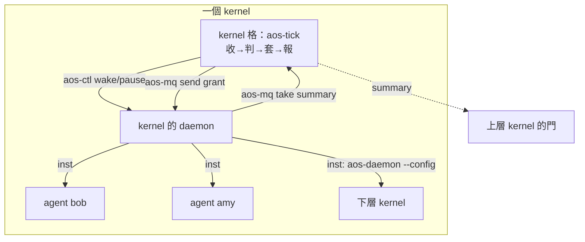

# kernel 架構提案（2026-10-02）

← [筆記索引](../../README.md)｜現行 spec：[proto6/spec](../../../spec/README.md)｜裁定：[verdicts 11](../../verdicts/11-tick-as-unit.md)

**這是規劃，不是實作。** 不改程式、不改 spec、不下裁定；方向由使用者決定。同一天另有一份 agent 架構提案，兩份靠 [04-agent介面](04-agent介面.md) 接起來。

## 一段話結論

kernel 不是新程式，是一個**角色**：一個工作資料夾（`tasks.json` 放「收、判、套、報」四項政策任務，由 `aos-tick` 跑）＋它擁有的一份 daemon 設定（`insts` 列成員）。它用現有零件做事——`aos-ctl` 叫醒／暫停成員、daemon 設定裡的 `cgroup` 與 `account` 分資源與身分、`aos-mq` 收成員摘要與發 LLM 額度。多層＝上層 daemon 把下層 daemon 當一項跑，上層只收它的摘要。新東西只有三樣：四支小程式（kernel 任務）、三種信（summary、grant、request）、daemon 一個小補（讓 kernel 能 SIGHUP 自己的 daemon，第 4 階段才要）。

## 為什麼是這個

- 使用者這三天的裁定已經把 kernel 該有的機制全做成 tick 與 daemon 模組了：鎖、開格、叫醒、暫停、收屍、帳號、訊息。剩下沒人做的只有**政策**：誰該醒、分多少、看摘要、往上報。
- 政策照裁定「排程行為是任務表上的程式、只在 tick 跑、daemon IPC 是唯一逃生口」——那就只能是一個工作資料夾的 tasks.json。
- 另外三個方案（kernel 做成 daemon 模組、常駐程式、沒有 kernel 成員自律）各違反一條裁定，或只是本方案的退化版。比較見 [02](02-方案比較.md)。

## 檔案

| 檔 | 內容 |
|---|---|
| [01-現況與邊界](01-現況與邊界.md) | 手上零件、歷史上 kernel 想做什麼、哪些被吸收、kernel 跟 tick／daemon／模組／hooks／inst 的邊界 |
| [02-方案比較](02-方案比較.md) | 四個方案與取捨、推薦 A |
| [03-推薦方案](03-推薦方案.md) | kernel 的資料夾、daemon 設定範例、一格做什麼、管哪些事、多層怎麼接、壞了怎樣 |
| [04-agent介面](04-agent介面.md) | 給 agent 規劃者的契約：怎麼被看見、啟動、限制、溝通；三種信的 JSON |
| [05-分階段落地](05-分階段落地.md) | 0 手搭 → 1 單層 → 2 兩層 → 3 LLM 額度 → 4 動態名單 → 5 C++11；每階段最小可驗 |
| [06-待決問題](06-待決問題.md) | 15 題，每題附建議 |

## 待使用者決定（短版，全文在 06）

| # | 題 | 建議 |
|---|---|---|
| 1 | kernel 是角色不是程式？ | 是 |
| 2 | 一個 kernel 一份 daemon 設定？ | 是；多層＝daemon 跑 daemon |
| 3 | 成員狀況 push 還是 pull？ | push（成員 `after_all` 寄 summary） |
| 4 | kernel 怎麼 SIGHUP 自己的 daemon？ | 加 `AOS_DAEMON_PID`；第 4 階段才要 |
| 5 | LLM 額度強制嗎？ | POC 自律，強制留給池代發 |
| 6 | grant 用信還是檔？ | 信，每格重寄 |
| 7 | 下層怎麼知道上層的門？ | 寫死在 policy 先 |
| 8 | 額度窗口用誰的格？ | kernel 的格 |
| 9 | `kind:"kernel"`？ | 要，只是標籤 |
| 10 | 還叫 kernel？ | 保留 kernel，不用 node |
| 11 | kernel 格壞了救不救？ | 不救 |
| 12 | 成員要放 kernel 資料夾底下？ | 不要求 |
| 13 | kernel 轉成員之間的信？ | 不轉 |
| 14 | 隨機性當排程依據？ | 先不做，預留欄位 |
| 15 | 第 0 階段做完要不要停在「成員自律」？ | 不停，但看實測再拍 |

## 跟 agent 規劃者的對齊狀況

這個環境找不到對方的名字（沒有 ListAgents，盲送不到），所以沒等對方。契約草案全寫在 [04](04-agent介面.md)：agent 就是 daemon 清單上的一項 inst；三種信的格式；哪些是 agent 規劃者自己定的。對方讀了有不同意見，改那一檔就好。

## 來源

現行 spec（README、conventions、terms、inst、tick、daemon、protocol、deferred）；程式 `proto6/src/py`；proto5 `lib/kernel_*` 與 notes；封存舊設計 `notes/archive/spec-2026-10-02/`（base／agent／scheduling／kernel-tasks）；裁定 `notes/verdicts/09`、`10`、`11` 全部分檔；`notes/2026-09-29-kernel-tree.md`、`2026-09-29-llm-scheduler-options.md`、`2026-10-01-tick-system-tasks.md`；`wf/SESSION-LOG.md`、`wf/workflows/roadmap.md`。
