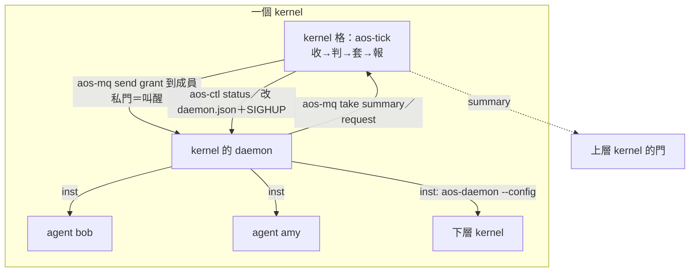

# kernel 架構提案（2026-10-02）

← [筆記索引](../../README.md)｜現行 spec：[proto6/spec](../../../spec/README.md)｜裁定：[verdicts 11](../../verdicts/11-tick-as-unit.md)

**這是規劃，不是實作。** 不改程式、不改 spec、不下裁定；方向由使用者決定。同一天另有一份 agent 架構提案，兩份靠 [04-agent介面](04-agent介面.md) 接起來。

## 一段話結論

kernel 不是新程式，是一個**角色**：一個工作資料夾（`tasks.json` 放一項政策任務「收、判、套、報」，由 `aos-tick` 跑）＋它擁有的一份 daemon 設定（`insts` 列成員）。它用現有零件做事——成員用 state 模組預置暫停，kernel 寄 grant 到成員的私門就是叫醒；daemon 設定裡的 `cgroup` 分資源；`aos-mq` 收成員摘要。多層＝上層 daemon 把下層 daemon 當一項跑，上層只收它的摘要。新東西：一支小程式 `aos-kernel step`、三種信（summary、grant、request，跟 agent 的信共一份 schema）、daemon 一個小補（`AOS_DAEMON_PID`，第 4 階段才要）。**現有零件做不到的**也要先講：下層 daemon 不能再分帳號（多層 POC 同帳號）、重讀加不了新門（加成員要重開或預留門）、kernel 攔不住「收信就開格」（它只管主動叫醒數與 LLM 額度）。〔2026-10-02 照 astra 審查修正，見各檔開頭。〕

## 為什麼是這個

- 使用者這三天的裁定已經把 kernel 該有的機制全做成 tick 與 daemon 模組了：鎖、開格、叫醒、暫停、收屍、帳號、訊息。剩下沒人做的只有**政策**：誰該醒、分多少、看摘要、往上報。
- 政策照裁定「排程行為是任務表上的程式、只在 tick 跑、daemon IPC 是唯一逃生口」——那就只能是一個工作資料夾的 tasks.json。
- 另外三個方案（kernel 做成 daemon 模組、常駐程式、沒有 kernel 成員自律）各違反一條裁定，或只是本方案的退化版。比較見 [02](02-方案比較.md)。

## 檔案

| 檔 | 內容 |
|---|---|
| [01-現況與邊界](01-現況與邊界.md) | 手上零件、歷史上 kernel 想做什麼、哪些被吸收、kernel 跟 tick／daemon／模組／hooks／inst 的邊界 |
| [02-方案比較](02-方案比較.md) | 四個方案與取捨、推薦 A |
| [03-推薦方案](03-推薦方案.md) | kernel 的資料夾、daemon 設定範例、一格做什麼、管哪些事、多層怎麼接、壞了怎樣 |
| [04-agent介面](04-agent介面.md) | 給 agent 規劃者的契約：怎麼被看見、啟動、限制、溝通；三種信的 JSON |
| [05-分階段落地](05-分階段落地.md) | 0 手搭 → 1 單層 → 2 兩層 → 3 LLM 額度 → 4 動態名單 → 5 C++11；每階段最小可驗 |
| [06-待決問題](06-待決問題.md) | 18 題，每題附建議；沒回答不等於採納 |

## 待使用者決定（短版，全文在 06）

方向題（1～7、10、15～18）沒答就不動工；例行細節（8、9、12、13）沒答照建議、標「暫定」。

| # | 題 | 建議 |
|---|---|---|
| 1 | kernel 是角色不是程式？ | 是 |
| 2 | 一個 kernel 一份 daemon 設定？ | 是；多層＝daemon 跑 daemon（同帳號） |
| 3 | 成員狀況 push 還是 pull？ | push（成員 `after_all` 寄 summary） |
| 4 | kernel 怎麼 SIGHUP 自己的 daemon？ | 加 `AOS_DAEMON_PID`；第 4 階段才要 |
| 5 | LLM 額度強制嗎？ | POC 自律 |
| 6 | grant 用信（私門）還是檔？ | 私門，只在叫醒／換窗口時寄 |
| 7 | 下層怎麼知道上層的門？ | 啟動下層的 inst.json 用 `$env` 存別名 |
| 8 | 額度窗口用誰的格？ | kernel 的格，數字是窗口總額 |
| 9 | `kind:"kernel"`？ | 要，只是標籤 |
| 10 | 還叫 kernel？ | 保留 kernel，不用 node |

例行細節與新題：

| # | 題 | 建議 |
|---|---|---|
| 11 | kernel 格壞了救不救？ | 不救 |
| 12 | 成員要放 kernel 資料夾底下？ | 不要求 |
| 13 | kernel 轉成員之間的信？ | 不轉 |
| 14 | 隨機性當排程依據？ | 先不做，預留欄位 |
| 15 | 要不要停在「成員自律」？ | 不停；第 0 階段另搭一版沒 kernel 的對照 |
| 16 | 多層要不要逐層切帳號？ | POC 同帳號；是新能力，POC 後拍 |
| 17 | kernel 限「開格數」還是「計算數」？ | 接受收信開格；管主動叫醒數與 LLM 額度 |
| 18 | 「壓住下層」要哪種？ | 停派新工作（grant `awake:0`）；立即終止用 pause＋kill |

## 跟 agent 規劃者的對齊狀況

已跟 agent 規劃者互傳訊息對齊（10-02 審查後）：grant 走私門、不每格寄、`after_ticks`、窗口總額、take 一次再分流、信 schema 合一份、pause 語意、子 daemon 環境變數別名化——兩邊一致。契約在 [04](04-agent介面.md)，對方那份在 `proto6/notes/proposals/2026-10-02-agent/07-kernel介面.md`。剩下的分歧只有方向題，列在 06。

## 來源

現行 spec（README、conventions、terms、inst、tick、daemon、protocol、deferred）；程式 `proto6/src/py`；proto5 `lib/kernel_*` 與 notes；封存舊設計 `notes/archive/spec-2026-10-02/`（base／agent／scheduling／kernel-tasks）；裁定 `notes/verdicts/09`、`10`、`11` 全部分檔；`notes/2026-09-29-kernel-tree.md`、`2026-09-29-llm-scheduler-options.md`、`2026-10-01-tick-system-tasks.md`；`wf/SESSION-LOG.md`、`wf/workflows/roadmap.md`。
