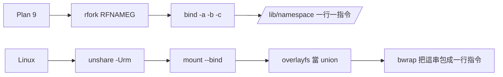

# 二、在 Linux 上能用什麼逼近，各自的代價

← [提案入口](README.md)｜上一份：[Plan 9 逐條對照](01-Plan9逐條對照.md)｜下一份：[daemon 變成檔案伺服器](03-daemon變成檔案伺服器.md)

本機（公司 WSL2，kernel 6.6，Ubuntu 24.04）有實測的標「實測」，其餘是查資料或量級估計。助手 2026-10-02 查的，來源列在文末。

## 一句話結論

三件事裡兩件 rootless 做得到而且夠用：**一切皆檔案靠 FUSE、每個行程自己的 namespace 靠 `unshare -Urm`＋bind＋overlayfs**。第三件「9P 當唯一協議」做不到也不值得：kernel 的 9P client（v9fs）要真 root 才能掛（實測在 user namespace 裡被拒），而且 gVisor、QEMU、WSL 自己都在把 9P 換掉。

## 工具表

| 工具 | 做什麼 | 要 root？ | 效能 | 成熟 | 坑 |
|---|---|---|---|---|---|
| FUSE（libfuse3） | user-space 檔案系統 | 不用：`fusermount3` 是 setuid（實測），或 user ns 裡直接掛（4.18+） | 一次 op 幾 µs；每秒幾十萬 ops | 很成熟 | daemon 死＝掛載點 `ENOTCONN`；ctl 檔要 `direct_io`；`allow_other` 要改 `/etc/fuse.conf`（本機沒開，實測） |
| pyfuse3 | Python async FUSE | 不用 | 一次 op 幾十 µs；每秒萬級 | 有維護 | 綁 trio；要自己處理 interrupt |
| fuser（Rust）／go-fuse | 編譯語言 FUSE | 不用 | 接近 C | 成熟 | — |
| FUSE passthrough | 資料直通底層檔 | 要（6.9+，privileged） | 接近原生 | 新 | 本機 6.6 沒有；對 ctl 檔沒用 |
| kernel v9fs | 掛 9P 服務 | **要真 root**（實測 `unshare -Urm` 裡 `mount -t 9p` 被拒） | 小檔慢一個數量級 | 成熟但冷門 | ctl 要 `cache=none`；WSL 的 `/mnt/c` 就是它、出名地慢 |
| diod／u9fs／go p9／rs9p | 9P server | server 不用 | 中 | diod 近年恢復維護 | client 端還是卡 root |
| plan9port `9pfuse` | 把 9P 服務掛成 FUSE | 不用 | 9P＋FUSE 兩層 | 成熟 | 只講 9P2000；本機沒裝 |
| `unshare -Urm` | 開私有 user＋mount ns | 不用（實測 `ok`；原生 Ubuntu 24.04 會被 AppArmor 擋，WSL 沒有） | 零 | 很成熟 | 不能掛真 fs（ext4、9p）；uid 只對應自己 |
| bind mount | Plan 9 的 `bind`（replace） | user ns 裡不用（實測） | 零 | 很成熟 | 沒有 `-a`／`-b` 疊加 |
| overlayfs | union dir | user ns 裡不用（5.11+，實測） | 接近原生 | 成熟 | 只有一個 upper；lower 掛好不能加層；有層數上限 |
| bwrap | 現成的 namespace 組裝器 | 不用 | 零 | 成熟（Flatpak） | 本機沒裝，`apt install bubblewrap` 就有 |
| `nsenter`／`setns` | 進別人的 ns | 自己的不用 | 零 | 成熟 | 要拿到 `/proc/PID/ns/mnt` |
| cgroup v2 檔 | Linux 自己的 ctl 檔 | 委派後不用 | 原生 | 很成熟 | 要先 delegation（daemon 已這樣做） |
| inotify | 檔案變更通知 | 不用 | 原生 | 成熟 | **對 FUSE 內部產生的變化無效**；對 cgroup `cgroup.events` 有效（kernfs 例外） |

## 四個真正的坑（效能不是坑）

一秒幾十次 ctl 寫入，每次幾十微秒，CPU 不到 0.1%，Python 寫的 FUSE 也夠。真正要花心力的是語意：

1. **blocking read 與 kill**。FUSE 可以讓 read 擋住（daemon 不回就擋），但必須 `direct_io`，不然 kernel 看 `st_size=0` 直接回 EOF、根本不問 daemon。呼叫端被一般 signal 打斷時 kernel 送 `FUSE_INTERRUPT`，daemon 要回 `EINTR`；被 SIGKILL 時若請求已送到 daemon，呼叫端會等到 daemon 回才死（中度確定）。tick 的任務若在 `wait` 檔上擋著、被 cgroup.kill 砍，就可能卡住。
2. **page cache 吃掉 ctl 檔**。同一個 `status` 檔第二次 `cat` 可能讀到舊的；要 `direct_io` 或每次回不同 `st_size`。v9fs 也一樣，要 `cache=none`。
3. **daemon 死了掛載點會 hang**。`Transport endpoint is not connected`，要 `fusermount3 -u`；daemon 卡住可以 `echo 1 > /sys/fs/fuse/connections/N/abort`。現在 socket 死了只是 `connect` 錯，任務照回 1；FUSE 版任務會卡在 `open()`。
4. **inotify 不靈**。想用 inotify 盯 `inbox/` 等信，FUSE 這邊收不到；只能 blocking read 或 poll（FUSE 支援 `FUSE_POLL`）。

## 「換掉 9P」的三個故事（重要反證）

- **gVisor**：原本 Sentry 透過 9P 問 gofer 拿檔；9P 太多話（走 N 段路徑至少 N−1 次 RPC），換成自家的 lisafs，gofer 記憶體降 30～60%；後來再加 directfs 直接開 host fd。9P 模式已 deprecated。
- **QEMU**：virtio-9p 被 virtiofs（FUSE 協議跑 virtio）取代，理由是效能與 POSIX 語意；Kata 跟著換。
- **WSL**：`/mnt/c` 的 9P 被罵了五年（microsoft/WSL#5103），2026 年還在為 virtiofs 改 DMA pool。

怎麼讀：**被換掉的全是資料面、大量小檔、要完整 POSIX 的場景**。沒有一個故事說 9P 不適合低頻控制面。所以結論不是「9P 爛」，是「9P 只該放在 ctl 這種地方，而 Linux 上要掛它得 root，所以用 FUSE 直接做比較省事」。

## Linux 自己也在走這條路（可以當佐證）

cgroup v2 就是 Plan 9 式 ctl 檔：`echo $$ > cgroup.procs` 搬家、`echo 1 > cgroup.kill` 整組殺、`cat cgroup.events` 看 `populated 0`、`poll` 它等清空。aos 的收屍模組已經在這樣寫。另外 `/proc/PID/oom_score_adj`、`/sys/power/state`、tracefs、configfs（`mkdir` 就是建物件）都是同一招。

反例也要講：`/sys/class/gpio` 字串介面已 deprecated 改 chardev＋ioctl、`/dev/uinput` 走 ioctl、bpf 走 syscall。Linux 的分界線是：**設定與控制用字串檔；要原子性、型別、效能的地方退回 syscall 與 fd**。這條線正好可以拿來劃 aos 的 JSON 與一行文字（[06](06-JSON放哪與文字格式.md)）。

## namespace 在 Linux 上怎麼拼

對應關係：`rfork(RFNAMEG)`＝`unshare -m`；`bind`＝`mount --bind`；union dir＝overlayfs（但只有一個可寫層、不能動態加層）；`/lib/namespace`＝bwrap 的參數列或一支 shell 腳本；`RFNOMNT`（鎖死不准再 mount）＝不給 CAP_SYS_ADMIN、或 user ns 裡本來就掛不了真 fs。`/srv` 布告欄沒有對應，最接近的是「一個目錄放 unix socket」——plan9port 在 Unix 上就是這樣模擬的（`/tmp/ns.$USER.$DISPLAY`）。

本機實測 `unshare -Urm` 裡 tmpfs、overlay、bind 都能掛；`proc` 要配 pid ns；`9p` 被拒。

## 來源

To FUSE or Not to FUSE（FAST'17）；kernel docs `filesystems/9p`、`fuse-io-uring`；LWN「Inotify support in FUSE and virtiofs」（RFC，未合併）；gVisor lisafs／directfs 公告；qemu-devel virtiofs vs 9p 數據；microsoft/WSL#5103。
