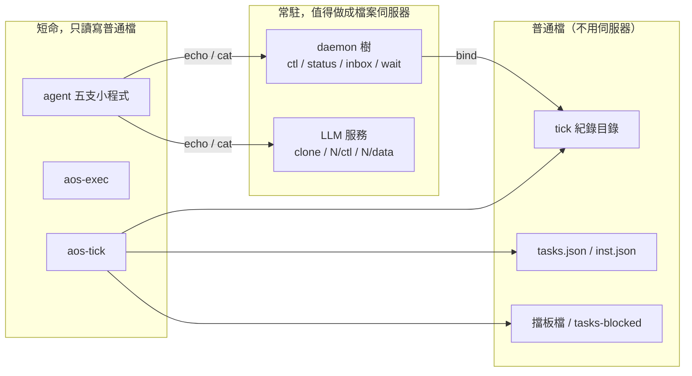

# 四、tick 紀錄已經是目錄；inst 與任務表要不要也變目錄

← [提案入口](README.md)｜上一份：[daemon 變成檔案伺服器](03-daemon變成檔案伺服器.md)｜下一份：[agent 與 kernel 的視野](05-agent與kernel的namespace.md)

## tick 這邊其實已經走在 Plan 9 的路上

現行 tick 有三樣東西已經是「檔案即介面」：

| 現行 | 性質 | Plan 9 對應 |
|---|---|---|
| `.aos/tick/current/`、`last/`，`record.json` 用 `$ref` 指到 `ran.json`、`task-exits.json` | 狀態就是目錄，常變的欄位拆成小檔 | `/proc/n/{status,fd,ns}`：一個行程一個目錄，一件事一個檔 |
| `.aos/tick-blocked`、`.aos/tick/tasks-blocked` | 前者**只看存不存在**；後者看存在、也看內容（`{"kinds":[…]}` 只擋那幾類，其他形狀全擋）。放檔＝下指令、刪檔＝解除 | Plan 9 沒有這招（它會用 ctl 寫 `stop`），但這是 Unix 的 lock-file 老傳統 |
| `tick.lock` 用 flock | 鎖是檔 | Plan 9 用 `DMEXCL` 檔（同時只准一個人 open）做鎖 |

第十六批裁的「擋板檔只看存不存在」，就是最純的 Plan 9 精神：**介面是檔案的存在與否，程式只做 `stat`**。所以 tick 核心這邊不用大改。推想中只動兩處：

1. `ran.json`、`task-exits.json` 改成一行文字：`ran` 檔內容就是 `3`；`task-exits` 一行一項 `id=report index=1 exit=3`。好處是 `cat` 就能看、`wc -l` 就是失敗項數。壞處是 schema 驗不了——這點見 [JSON 放哪](06-JSON放哪與文字格式.md)。
2. `current/` 多一個 `wait` 檔（如果 tick 跑在 FUSE 樹裡）：讀它 block 到這格結束。tick 本身短命、不是伺服器，所以這個檔只能由 daemon 的樹代為提供（`insts/a/wait`，見 [03](03-daemon變成檔案伺服器.md)）。**tick 不該變成檔案伺服器**：它開格、跑完、退出，正好是 Plan 9 「短命程式讀寫長命伺服器」的分工。

## 任務表：JSON 陣列 vs 目錄

現行 `tasks.json` 是頂層物件，裡面的 `tasks` 是陣列，位置就是順序。Plan 9 式會改成一個目錄，一項一個子目錄，**檔名排序就是順序**：

```text
.aos/tasks/
  10-inbox/
    argv            ← 一行一個參數（Plan 9 的 /proc/n/args 是帶引號規則的一行，這裡不照它）
    kind            ← 一行：agent
    cwd
    envs            ← 一行一個 KEY=value
    stdout          ← 一行：路徑，或 append:路徑
  20-think/
  30-llm/
    argv
    kind            ← llm
  40-act/
  50-remember/
  hooks/
    after_all/
      10-summary/
      20-git/
  modules/
    tasks-blocked/
      insts/
        10-notify/
```

**好處**：

- `ls .aos/tasks` 就是「這個 agent 一步做什麼」，程式即 spec 更直白。
- 加一項＝`mkdir`，拿掉＝`rm -r`，調順序＝`mv`。kernel 要在成員表上插一個 `before_kind.llm` 的 hook，就是 `mkdir -p hooks/before_kind/llm/10-budget`，不用解析 JSON 再寫回。
- `$ref` 消失：要共用一項就 `ln -s`（或 bind）。Plan 9 本來就用 bind 取代 symlink 與 `$ref` 這類「指到別處」的機制。
- 每個欄位各自一個檔，git diff 小、兩個人改不同欄位不打架。

**壞處**（這段很重要，別被目錄的漂亮騙了）：

- 一項 inst 從一個檔變五六個檔；一個 agent 的表從 1 個檔變 30 個。`find` 一下很美，但**人手寫一份表變成一堆 `echo > `**。
- 讀表的原子性沒了：JSON 一次 `read` 就是一致的快照；目錄要一個檔一個檔讀，中途有人 `mv` 就讀到半套。Plan 9 自己也被罵這點（沒有跨檔 transaction）。tick 要「開格時整份讀完再跑」，目錄版得先 `cp -r` 一份到 `current/` 當快照——這其實跟現在「展開 `$ref` 後整份在記憶體」是同一件事，只是慢。
- `$opt`、`$fmt`、`$env` 這些指示詞要重做：`append:路徑` 這種前綴可以替代 `$opt`；`$env` 可以改成「envs 檔裡寫 `KEY=$LITELLM_KEY`」由 tick 展開；`$fmt` 沒有對應。
- schema 驗證沒有對象（jsonschema 驗不了目錄）。要驗只能寫一支 `aos-tasks-check`。

**我的看法**：任務表這層**不值得**全換成目錄。它是「人寫、程式讀一次」的設定檔，JSON 的優點（一次讀完一致、能用 schema 驗、一個檔就能 `$ref` 共用）正好對上它的用法；Plan 9 的 `/lib/namespace` 也是一個文字檔而不是目錄。可以折衷：**保留 `tasks.json`，但允許 `tasks.d/` 目錄裡一項一檔，開格時照檔名排序合併**——這是 Unix 早有的 `conf.d` 慣例，不是 Plan 9 專利，但方向一致。

## inst：一份 JSON 還是一個目錄

inst 更不該變目錄。它是「一次 POSIX 執行」的描述，`aos-exec <目標>` 一次讀完。而且現行已經有「目標是資料夾就找 `.aos/inst.json`」的規則——**資料夾就是單位，裡面的 inst.json 是它的 `argv` 檔**。真要像 Plan 9，是把 `.aos/inst.json` 想成 `/proc/n/args`：一個資料夾＝一個「還沒跑起來的行程」，`inst.json` 是它的啟動參數。這個比喻現在已成立，不用改。

## tick 紀錄：目錄版再往前一步

現行紀錄只有 `current/` 與 `last/`。Plan 9 式的 `/proc` 是「活的」：目錄內容隨時反映現在。推想一個「活的 tick 目錄」，由 daemon 的樹提供（tick 自己不常駐）：

```text
/aos/d/insts/agents-bob/
  tick/
    seq              ← 一行：1237
    current/
      ran            ← 一行：2（tick 每跑完一項就改一次；現在也是這樣寫檔）
      task-exits     ← 一行一項
      hooks/…
    last/            ← 同上
    tasks-blocked    ← 任務寫這裡＝擋後面的項（跟現在一樣，只是路徑在樹裡）
    blocked          ← 擋板檔
```

但這棵樹跟現在 `.aos/tick/` 的差別只有「它掛在 daemon 的樹裡」。tick 寫的仍是普通檔案；daemon 只是把那個目錄 bind 進來。**所以 tick 這一層幾乎不需要 FUSE**，只需要 bind mount。這是檔位劃分裡最便宜的一刀，見 [檔位](08-檔位.md)。

## 一張圖：哪些該是檔案伺服器、哪些該是普通檔



Plan 9 的分工就是這樣：**長命的東西才是檔案伺服器（rio、factotum、plumber），短命程式（cat、echo、sam -d）只讀寫它們**。aos 裡長命的只有 daemon 和（未來的）LLM 服務，正好兩個。
