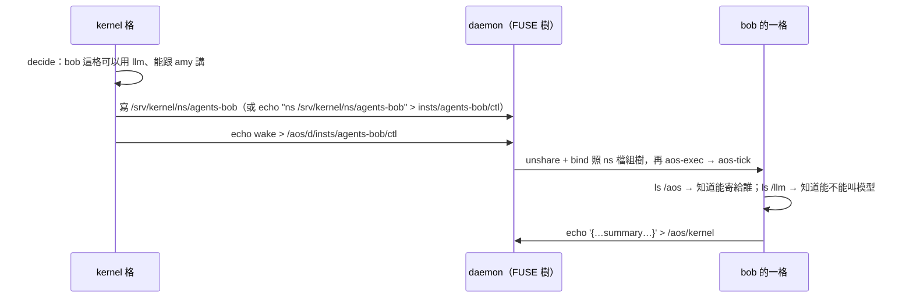

# 五、agent 的視野是一個 namespace；kernel 是組 namespace 的人

← [提案入口](README.md)｜上一份：[tick 與 inst 變成目錄](04-tick與inst變成目錄.md)｜下一份：[JSON 放哪](06-JSON放哪與文字格式.md)

全篇是推想。對照同日的 agent 提案與 kernel 提案（[agent](../2026-10-02-agent/README.md)、[kernel](../2026-10-02-kernel/README.md)）：它們把 agent 定成「一個工作資料夾＋五項任務」、kernel 定成「一個資料夾＋一份 daemon 設定」。Plan 9 路線不推翻這兩個定義，只改一件事——**agent 能碰到什麼，不只靠環境變數與資料夾權限，還靠它開跑時被組好的那棵樹**。

## agent 一格看到的世界

```text
/                                ← 這是 bob 的一格的 namespace，不是真的根
  work/                          ← bind 自 /srv/agents/bob/work
  state/                         ← bind 自 /srv/agents/bob/state
  config/                        ← bind 自 /srv/agents/bob/config（唯讀）
  aos/
    me/                          ← bind 自 daemon 樹的 insts/agents-bob
      ctl  status  inbox  mail/  wait  tick/
    kernel                       ← bind 自 daemon 樹的 doors/kernel（只有這一個檔，寫＝寄給 kernel）
    team                         ← bind 自 doors/team
    amy                          ← bind 自 doors/amy（通訊錄變成目錄裡有哪些檔）
  llm/
    clone                        ← bind 自 LLM 服務的樹（見下）
  tools/
    wc  note  say                ← union：/srv/tools/common ＋ /srv/agents/bob/tools
  bin/                           ← union：/usr/bin ＋ aos 自己的 bin
```

幾個重點：

- **沒有 `AOS_DAEMON_*`、沒有 `config/contacts.json`**。bob 能寄信給誰，`ls /aos` 就知道；kernel 不讓 bob 跟 carol 講話，就是不把 carol 的門 bind 進來。agent 提案花了一節講「門與資料夾權限」，這裡變成「門有沒有出現在樹上」。
- **工具就是 `/tools/` 裡的檔**。agent 提案的 `config/tools.json`（OpenAI tools 陣列＋`_inst`）仍然要有，因為模型需要 schema；但 `_inst.argv[0]` 一律指 `/tools/<名>`，而那個路徑是 union 出來的。kernel 要拿掉 bob 的 `say` 工具，就是 union 時不疊那一層。
- **`/aos/me` 取代 `AOS_DAEMON_INST`**。bob 永遠寫 `/aos/me/ctl`，不用知道自己在 daemon 清單上叫什麼。
- **上層怎麼管下層，下層看不到**（潤物細無聲）：team-a 的 daemon 跑在 team-a 的 namespace 裡，它自己的樹掛在它的 `/aos/d`；頂層 daemon 的樹不在裡面。daemon 跑 daemon 時「環境變數外漏」那個坑變成「漏出去的路徑連不到」；變數本身 namespace 不會清，仍要 `--clearenv` 或 inst `envs` 的 `clear` 明確清掉。

## kernel 做的事變成「寫 namespace 檔」

Plan 9 每個使用者有 `/lib/namespace`，一行一個 `bind`／`mount`。kernel 提案說 kernel 的「套」是 `aos-ctl wake`／`pause`、寄 grant、改 daemon.json；Plan 9 路線多一件：**kernel 替每個成員寫一份 namespace 檔**，daemon 開 `aos-exec` 前照它組樹。

```text
# /srv/kernel/ns/agents-bob          ← kernel 寫；格式照 Plan 9 /lib/namespace，一行一指令
bind /srv/agents/bob/work /work
bind /srv/agents/bob/state /state
bind -r /srv/agents/bob/config /config
bind /aos/d/insts/agents-bob /aos/me
bind /aos/d/doors/kernel /aos/kernel
bind /aos/d/doors/team /aos/team
bind /aos/d/doors/amy /aos/amy
bind /srv/llm /llm
union /srv/tools/common /srv/agents/bob/tools /tools
```

Linux 落地：daemon（或 `aos-exec` 加一個 `--ns <檔>` 選項）把這幾行翻成一行 `bwrap --bind … --ro-bind … --overlay …`。**重點是 bwrap 會另建一個空根、只把列出的東西掛進去、再切換根（pivot_root）並卸掉舊根**，所以沒列的就真的看不到；單純 `unshare -Urm` 加 `mount --bind` 不行——新 namespace 是整份掛載表的複本，原本的 `/srv/…` 仍到得了。**bwrap 的參數列就是 Linux 版的 `/lib/namespace`**，不用自己發明格式。兩個現實：`union` 那行要 bwrap 0.11 的 `--overlay`，Ubuntu 24.04 套件是 0.9，先只能 bind 一層；執行環境（`/usr`、`/proc`、`/dev`、aos 的 bin 與 lib）也要列進去，不然裡面連 Python 都沒有。



kernel 提案的 grant（信）在這裡可以**換成「有沒有 `/llm`」**：不給額度就不 bind `/llm`，bob 的 `think` 看 `/llm/clone` 不存在就寫 `tasks-blocked {"kinds":["llm"]}`。這比「收信、看 `to`、自律」更硬——**namespace 是強制的，信不是**。但要分清：`/llm` 在不在只決定「這格能不能用」，呼叫次數、token 額度仍要下面那個 `/llm` 服務自己管，不是 bind 就有。agent 提案待決第 21 題（額度要不要強制）在這條路上有了第三個選項。

## LLM 是一個 clone 式的檔案服務

這是整份提案裡最「Plan 9」、也最值得單獨實驗的一塊。照 `/net/tcp/clone` 與 webfs 的慣例：

```text
/llm/
  clone                          ← open 它 → read 得到號碼 N；這個 fd 就是 N/ctl
  N/
    ctl                          ← 寫：model deepseek-chat、temperature 0.2、timeout 120000
    request                      ← 寫：OpenAI chat 請求本文（JSON）
    response                     ← 讀：擋到回應回來（blocking read），內容是回應本文（JSON）
    usage                        ← 讀：一行 prompt=51230 completion=8120
    status                       ← 讀：一行 state=waiting|done|error err=…
```

agent 的 `llm` 那一項從 `aos-llm request.json response.json` 變成一支 shell：

```sh
exec 3</llm/clone; read -r n <&3          # 開一條；fd 3 要留著——照 webfs，相關 fd 全關就回收號碼
echo "model deepseek-chat" > /llm/$n/ctl
cat work/request.json > /llm/$n/request   # 服務以 close 當「收完」
cat /llm/$n/response > work/response.json # 擋到回來；逾時由服務回 ETIMEDOUT
exec 3<&-                                 # 用完才關，號碼才回收
```

為什麼值得：

- **LLM 排程的三檔（直連／交 endpoint／自己排）變成「`/llm` bind 自哪棵樹」**。直連＝bind 一個薄薄的「HTTP 轉發」FUSE；自己排＝bind kernel 跑的「有佇列、有額度」的 FUSE；交 endpoint＝bind LiteLLM 前面的那層。agent 一行不改。
- **額度強制在服務裡做**：`clone` 回 `EAGAIN`／`EDQUOT` 就是「這格沒額度」。T-06「一次計算是分配單位」在這裡有實體：一次 open clone ＝ 一次計算。
- **金鑰不進 agent 的 namespace**：agent 看得到 `/llm`，看不到 key；Plan 9 factotum 就是這個分工（秘密與認證集中管，多數協議裡程式只搬位元組不碰密碼；`proto=pass` 會交出明文是例外）。09-30 「直連 key 藏不住」的裁定在這條路上可以翻案。
- 要測試就 bind 一個「照劇本回」的 FUSE 到 `/llm`——agent 提案的 `fake:` 模式自然出現，連環境變數都不用。

代價：又一個常駐的 FUSE 服務（這條與「不准背景程序繞過 tick」要對一下——它不是 tick 的任務，是像 daemon 一樣的基礎設施）；blocking read `response` 在格內等 HTTP，格的時長被 LLM 綁住，跟現在 `aos-llm` 一樣，沒變差。

## 權限變成什麼

| 現在 | Plan 9 路線 |
|---|---|
| socket 666，誰能連看資料夾 mode | 門是不是在你的樹上 |
| 一 agent 一 Linux 帳號（帳號模組） | 仍可用；但 user ns 裡 uid 只對應自己，多帳號要 `newuidmap`／`/etc/subuid`，或 daemon 仍以 root 開再 `setuid` |
| 工具沿用 agent 帳號、不逐工具 bwrap | 整格一個 namespace，工具在裡面跑；這其實就是 09-28 撤掉的「逐工具 bwrap」改成「逐格 bwrap」 |
| `config/` 不給模型改 | `bind -r`（唯讀 bind，`mount --bind -o ro`）比檔案 mode 更不會被繞 |

T-08「能下指令就等於能用那個身分」原則不變，只是「能不能下」的判準從 mode 變成「看不看得到」。兩者可以疊：樹上有、mode 又對，才行。
