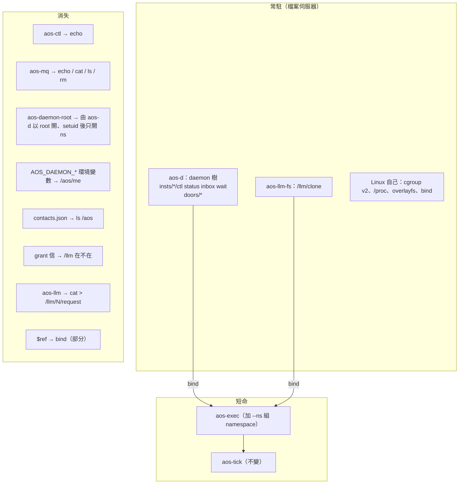

# 七、推到極限：剩下哪幾個檔案伺服器；以及誠實的代價

← [提案入口](README.md)｜上一份：[JSON 放哪](06-JSON放哪與文字格式.md)｜下一份：[檔位與最小實驗](08-檔位與最小實驗.md)

## 極限版：只剩三個檔案伺服器、兩支短命程式

**消失的**：`aos-ctl`、`aos-mq`、`aos-llm`（agent 提案要新造的）、`aos-daemon-root`（root 端協議），三組環境變數，通訊錄，grant 信。
**留下的**：`aos-exec`（多一個組 namespace 的步驟）、`aos-tick`（幾乎不動）、`aos-d`（daemon 改寫成 FUSE 樹）、`aos-llm-fs`（新）。

agent 的五支小程式（inbox／think／act／remember／summary）不消失，但每支都變薄：inbox 從「連 socket、解 JSON、看 `to`」變成 `cat /aos/me/inbox`；act 的工具呼叫從「查 tools.json 的 `_inst`」變成「`/tools/<名>` 在不在」。

**kernel 變成「寫 namespace 檔的人」**：收（`cat /aos/d/insts/*/status`、`cat /aos/me/inbox`）、判（不變）、套（寫 `/srv/kernel/ns/<成員>`、`echo wake > …/ctl`）、報（`echo > /aos/kernel`）。四項任務還在，只是不再需要 `aos-ctl`／`aos-mq` 兩支客戶端。

**agent 的工具就是 namespace 裡的檔**：這句話在極限版成立——模型看得到的 `tools` schema 仍是 JSON（模型要它），但「能不能跑」由 `/tools/` 裡有沒有那個檔決定。

## 誠實的代價

### 1. 跟「daemon 只是笨 cron」正面衝突

這是最大的一條。使用者 10-01 把 daemon 砍到「讀清單、照週期叫 aos-exec、印一行」，模組一個鍵一個。Plan 9 路線要它變檔案伺服器：多執行緒（blocking read 一個卡一條）、處理 FUSE interrupt、管掛載點生命週期。Python 用 pyfuse3 大約再加三到五百行；C++11 用 libfuse3 low-level API 也差不多，但**daemon 從「一個 while 迴圈」變成「一個檔案系統」是質變，不是量變**。可以折衷：FUSE 樹做成一個模組（`modules.fs`），不掛就是現在的 socket——但那就等於兩套介面並存，違反「不新造機制」。

### 2. 跟「反應速度是一格、不准背景程序繞過 tick」的張力

Plan 9 到處是 blocking read：`wait`、`inbox`、`/llm/N/response`。給了任務「在格內等別人」的能力，格的時長就不再由任務表決定。現在 `aos-llm` 在格內等 HTTP 已經是這樣，所以 `/llm/N/response` 沒變差；但 `insts/bob/wait` 是新的——kernel 可以在一格裡 wake 一個成員再等它跑完。這方便，但等於讓 kernel 的格變成「套娃」。**要走這條路，得補一條規矩：任務不准 read 別項的 `wait`，或 `wait` 檔只給人用、不給任務 bind。**

### 3. 權限：FUSE 與 user namespace 的細節會咬人

- `allow_other` 本機沒開：daemon 以帳號 A 掛的 FUSE，帳號 B 的任務看不到。一 agent 一 Linux 帳號（帳號模組）跟 FUSE 樹要同時成立，要嘛改 `/etc/fuse.conf`（root 一次），要嘛 daemon 以 root 掛、再 setuid（現在帳號模組已經是 root 開再降權，路是通的）。
- user ns 裡 uid 只對應自己：想在 ns 裡用多個 Linux 帳號要 `newuidmap`／`/etc/subuid`。多帳號與 namespace 兩件事疊起來，複雜度是乘法不是加法。
- 原生 Ubuntu 24.04 的 AppArmor 預設擋 unprivileged user ns（WSL 沒擋，實測 ok）。使用者要原生 Linux 也能跑——那台機器得改 sysctl 或裝 profile。

### 4. 除錯變難也變易

- 變易：`ls`、`cat`、`echo` 就能看、能戳；不用寫測試客戶端；`strace` 看得到每個 open／write。
- 變難：掛載點 hang、`ENOTCONN`、`fusermount3 -u` 的清理；blocking read 卡住的程序 `kill -9` 不一定死；page cache 讀到舊 status 這種「看起來沒 bug 其實是 cache」的鬼。tick 現在的錯誤模式是「程式回 1、stderr 一行」，很乾淨；FUSE 世界的錯誤模式多了一類「卡住」。

### 5. 測試

現在 643 個測試裡 ctl 25、mq 24 是 socket 測試，改掉就要重寫；FUSE 測試要真的掛（CI 裡要 `/dev/fuse`）。可以用 libfuse 的 `-o` 選項掛到 tmp 目錄，但每個測試掛一次大約幾十毫秒，整套還能接受。

### 6. C++11 落地

libfuse3 是 C API，C++11 包起來不難；但 blocking read 要自己管執行緒或用 libfuse 的 multi-thread loop。比寫 unix socket server 難一級。LLM 服務的 FUSE 還要配 libcurl，又多一個常駐。使用者說過想親手寫 C++——這會是「有趣但不小」的一塊。

### 7. 跟「程式即 spec」的關係：契合多於衝突

`ls /aos/d/insts/a` 就是 daemon 控制面的 spec，比 schema 直白。但 ctl 收哪些字、status 有哪些 key，仍要有一處寫下來——Plan 9 用 man page，aos 用 spec 條文。沒有省掉文件，只是文件變短。

### 8. 「默認一切正常」：契合

Plan 9 的錯誤處理就是「write 失敗、看 errstr」，沒有重試、沒有狀態機。這跟 10-01 的方向一致。真正的例外是「掛載點掛了怎麼辦」——答案可以是「人手 `fusermount3 -u` 再開 daemon」，跟現在「daemon 死了人手重開」同級。

## 反對意見（我自己會提的）

1. **現有零件已經組得出 kernel 與 agent**（同日兩份提案都證明了）。Plan 9 路線沒有讓任何一件「做不到」變「做得到」，只是讓介面更齊、客戶端更少。這是品味的改進，不是能力的改進。
2. **FUSE 是新依賴**。第十四批裁「初版不用 systemd」、notes 寫「Docker／FUSE 不作基本前提，FUSE 延後」。走這條路等於翻 09-28 的決定。
3. **文字 ctl 比 JSON 更難擋壞輸入**。`echo "wake --foo" > ctl` 的錯誤處理要自己寫 tokenize；JSON 至少有 schema 擋第一層。Plan 9 社群自己也承認這是弱點。
4. **三個「換掉 9P」的故事**提醒：檔案抽象在資料面會被效能打回來。aos 的 LLM 回應幾十 KB、信幾 KB，離那個量級很遠，但要記得這條線在哪。

## 什麼時候值得

一句話：**當 aos 要給很多不是你寫的程式（別人的 agent、shell 腳本、別的語言）當客戶端時**，「介面是檔案」的回報最大——不用提供每種語言的 client library，`echo` 與 `cat` 就是。現在 aos 只有自己的六支程式互講，回報最小。所以值不值得，取決於使用者對「一萬個 agent、各種人寫」那個終局有多認真。
