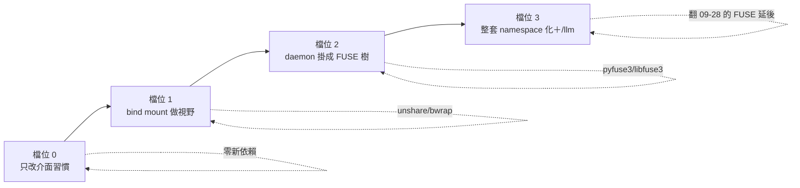

# 八、接近程度的四個檔位

← [提案入口](README.md)｜上一份：[推到極限與代價](07-推到極限與代價.md)｜下一份：[最小實驗](09-最小實驗.md)

四個檔位，由淺到深。每檔寫：長什麼樣、要改什麼、代價、我覺得值不值得。**不下裁定**，給使用者挑。一兩天能玩的實驗在 [09](09-最小實驗.md)。



## 檔位 0：只改介面習慣（不加任何依賴）

**樣子**：程式不換、socket 不換，只把「格式」往 Plan 9 靠：

- ctl 請求從 `{"wake":"a"}` 改成一行文字 `wake a`（或保留 JSON、但 `aos-ctl` 多收 `-` 從 stdin 讀一行）。
- `status` 回一行 `key=value`，不回 JSON。
- 紀錄的 `ran.json`／`task-exits.json` 改成 `ran`／`task-exits` 一行文字。
- （另一項功能，分開估）daemon 的 `mq` 模組加「目錄版信箱」：每一項自己的 `insts/<項>/mail/<n>.json` 落檔，`aos-mq take` 等於 `ls`＋`rm`。信落檔會解掉「重開丟信」，但現行明訂信箱在記憶體、POC 接受重開丟信，所以**它是實驗選項，不列第一輪必做**。

**代價**：格式改動不難（改 ctl／mq 的協議與 schema、改紀錄讀寫、約 50 個測試），JSON schema 驗不了文字那部分；信落檔是另一項功能，另外估。
**值不值得**：格式那幾條是品味，改了沒有新能力，不建議單獨做。信落檔有真收益（重開丟信、inotify 能盯本機目錄），但不急。

## 檔位 1：用 bind mount 給每一格一個視野（不碰 daemon 的協議）

**樣子**：daemon 開 `aos-exec` 前用 `unshare -Urm`（或 bwrap）組一棵樹：成員的 `work/`、`state/`、唯讀的 `config/`、它訂的門（socket 檔 bind 進 `/aos/<門名>`）、它的工具 union 進 `/tools/`。socket 協議照舊，但**路徑固定了**：`/aos/kernel` 永遠是 kernel 的門，`/aos/ctl` 永遠是控制 socket。這一檔**只承諾兩件事：路徑固定、限制看得到哪些入口**。它不會縮小 socket 的能力——能連到 `/aos/ctl` 就能對清單上任何一項下指令、能連到任一門就能報別項的名字取信（第二十五批裁定的現況）；分項隔離要等檔位 2 的新介面。身分變數 `AOS_DAEMON_INST` 仍要（`aos-mq take`／`peek` 靠它），socket 路徑的變數要**明確覆寫**成樹上的固定路徑；namespace 不會自動清環境變數。

```text
# 示意，bwrap 0.9（Ubuntu 24.04 套件版）能跑的旗標；路徑照本機調
bwrap --unshare-user --die-with-parent \
  --ro-bind /usr /usr --symlink usr/bin /bin --symlink usr/lib /lib --symlink usr/lib64 /lib64 \
  --ro-bind /etc/ld.so.cache /etc/ld.so.cache --proc /proc --dev /dev --tmpfs /tmp \
  --ro-bind /opt/aos /opt/aos \
  --bind /srv/agents/bob/work /work --bind /srv/agents/bob/state /state \
  --ro-bind /srv/agents/bob/config /config \
  --bind /srv/d/doors/kernel.sock /aos/kernel --bind /srv/d/ctl.sock /aos/ctl \
  --ro-bind /srv/tools/common /tools \
  --clearenv --setenv PATH /usr/bin:/opt/aos/bin \
  --setenv AOS_DAEMON_INST agents/bob --setenv AOS_DAEMON_CTL_SOCKET /aos/ctl \
  --setenv AOS_DAEMON_MQ_KERNEL /aos/kernel \
  --chdir /work -- aos-tick
```

幾個現實：bwrap 沒有 `--unshare-mount`（mount ns 一律自動新建）；`--overlay`／`--tmp-overlay` 是 0.11 才有，noble 套件是 0.9，所以 `/tools` 先只能 bind 一層；空根裡沒有 Python 與 aos，`/usr`、`/proc`、`/dev`、aos 的 bin 與 lib 都要列進去；`--clearenv` 後要自己補 PATH 與身分變數。

**要改**：daemon 一個模組 `modules.ns`：每項可寫一份 namespace 檔（一行一個 bind），有寫就包 bwrap、並明寫清除與重設哪些 `AOS_DAEMON_*`。kernel 的「套」多一件：寫成員的 ns 檔。`aos-exec` 不動。
**代價**：bwrap 要裝（apt 一行）；原生 Ubuntu 要開 unprivileged user ns；一 agent 一帳號跟 user ns 的 uid 對應要想（先只用單帳號）；daemon 跑 daemon 時外漏的門路徑在內層連不到了，但變數要靠 `--clearenv` 清，而且「內層要不要再 unshare 一層」要答（要，巢狀 user ns 可以）。
**值不值得**：**值得，而且是四檔裡性價比最高的**。它拿到 Plan 9 最核心的一樣東西（每個行程自己的視野、路徑固定、看不到就連不到），零 FUSE、零協議改動、不碰 tick 核心。還順手解了 kernel 提案待決第 7 題（下層怎麼知道上層的門：固定路徑 `/aos/kernel`）與 agent 提案的通訊錄問題（`ls /aos`）。收益要說成「路徑組裝與可見範圍」，不是隔離。

## 檔位 2：daemon 掛成 FUSE 樹（[03](03-daemon變成檔案伺服器.md) 那棵）

**樣子**：控制與訊息不再開 socket，daemon 掛一棵 FUSE：`insts/*/{ctl,status,inbox,mail/,wait}`、`doors/*`、`ctl`（reload）。`aos-ctl`、`aos-mq` 消失。配檔位 1 的 bind，任務裡永遠是 `/aos/me/ctl`。
**要改**：daemon 核心加 FUSE 迴圈（pyfuse3，三到五百行）、ctl／mq 模組改成檔案 handler、state 模組可以順手把 status 落檔。測試改掛 FUSE。
**代價**：FUSE 成為依賴（翻 09-28 「FUSE 延後」）；daemon 不再「笨」；掛載點生命週期、`direct_io`、interrupt 三個坑要吃；`allow_other` 與多帳號要處理。
**值不值得**：**要看檔位 1 玩完的感覺**。如果玩過檔位 1 之後覺得「socket 路徑固定就夠了，`echo > ctl` 只是好看」，就停在 1。如果覺得「少兩支客戶端、shell 直接戳」真的省事，再上 2。我個人傾向：**POC 階段不上 2**，C++11 時再評估——因為 2 的收益主要在「別人的程式當客戶端」，POC 沒有別人。

## 檔位 3：整套 namespace 化＋`/llm` 服務（[05](05-agent與kernel的namespace.md)）

**樣子**：檔位 2 加 `aos-llm-fs`（`/llm/clone`），grant 變成「`/llm` 在不在」，LLM 三檔排程變成「`/llm` bind 自哪棵樹」，金鑰出 agent 的 namespace。kernel 的 decide 輸出就是每個成員的 ns 檔。
**代價**：兩個常駐 FUSE；LLM 服務要管 HTTP 連線、逾時、佇列，是個不小的程式；跟「不准背景程序繞過 tick」要講清楚（它是基礎設施不是任務）。
**值不值得**：`/llm/clone` 這一塊**獨立看很值得**——介面層面能接上額度強制、金鑰隔離、排程三檔切換、假 LLM 測試四件事，而且不依賴檔位 2（可以是獨立的 FUSE，bind 進檔位 1 的樹）。但假 LLM 展示小，額度、帳號、真 HTTP 的整合不是玩具行數能估的。整套 3 則是終局想像，不是近期目標。

## 比較表

| | 0 格式 | 1 bind 視野 | 2 FUSE daemon | 3 全套＋/llm |
|---|---|---|---|---|
| 新依賴 | 無 | bwrap | FUSE | FUSE×2 |
| 碰 tick 核心 | 紀錄格式 | 不碰 | 不碰 | 不碰 |
| 碰 daemon | 協議格式 | 加一模組 | 核心改寫 | 核心改寫＋新程式 |
| 消失的程式 | 無 | 無（socket 路徑變數可改成固定值） | aos-ctl、aos-mq | 再加 aos-llm（root 端留著） |
| 解掉的真問題 | （選項）重開丟信 | 門路徑固定、通訊錄變 `ls`、可見入口可 `ls` 驗——不是分項隔離 | 客戶端歸零、wait、分項隔離才有可能 | 介面上能接額度強制、金鑰隔離、LLM 三檔切換、假 LLM |
| 跟現有裁定衝突 | 無 | 無 | 「daemon 是笨 cron」「FUSE 延後」 | 再加「不准背景程序」要解釋 |
| 工作量 | 格式不難；信落檔另估 | 一個模組＋bwrap 包裝 | 明顯較大：把既有協議接成檔案語意 | 假 LLM 小；額度、帳號、真 HTTP 不小 |
| 我的建議 | 不急；mail/ 當實驗選項 | **做** | POC 先不做 | 只做 /llm 那塊、當獨立實驗 |
