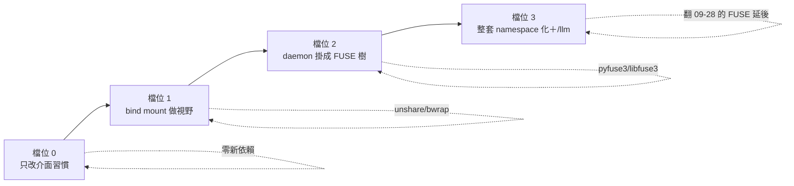

# 八、接近程度的檔位，與一兩天能玩的最小實驗

← [提案入口](README.md)｜上一份：[推到極限與代價](07-推到極限與代價.md)

四個檔位，由淺到深。每檔寫：長什麼樣、要改什麼、代價、我覺得值不值得。**不下裁定**，給使用者挑。



## 檔位 0：只改介面習慣（不加任何依賴）

**樣子**：程式不換、socket 不換，只把「格式」往 Plan 9 靠：

- ctl 請求從 `{"wake":"a"}` 改成一行文字 `wake a`（或保留 JSON、但 `aos-ctl` 多收 `-` 從 stdin 讀一行）。
- `status` 回一行 `key=value`，不回 JSON。
- 紀錄的 `ran.json`／`task-exits.json` 改成 `ran`／`task-exits` 一行文字。
- daemon 的 `mq` 門除了 socket，再多一個「目錄版信箱」：`insts/<a>/mail/<n>.json` 落檔，`aos-mq take` 等於 `ls`＋`rm`。信落檔順便解掉「重開丟信」。

**代價**：改 ctl／mq 的協議與 schema、改紀錄讀寫、約 50 個測試；JSON schema 驗不了文字那部分。
**值不值得**：**值得的只有「信落檔到 `mail/`」那一條**，因為它解了真問題（重開丟信、peek 不取走、inotify 能盯）。其他純粹是格式品味，改了沒有新能力，不建議單獨做。

## 檔位 1：用 bind mount 給每一格一個視野（不碰 daemon 的協議）

**樣子**：daemon 開 `aos-exec` 前用 `unshare -Urm`（或 bwrap）組一棵樹：成員的 `work/`、`state/`、唯讀的 `config/`、它訂的門（socket 檔 bind 進 `/aos/<門名>`）、它的工具 union 進 `/tools/`。socket 協議照舊，但**路徑固定了**：`/aos/kernel` 永遠是 kernel 的門，`/aos/me.sock` 永遠是自己的控制 socket。環境變數 `AOS_DAEMON_*` 可以留著相容，實際上沒人需要。

```text
bwrap --unshare-user --unshare-mount \
  --bind /srv/agents/bob/work /work --bind /srv/agents/bob/state /state \
  --ro-bind /srv/agents/bob/config /config \
  --bind /srv/d/doors/kernel.sock /aos/kernel --bind /srv/d/ctl.sock /aos/ctl \
  --overlay-src /srv/tools/common --overlay-src /srv/agents/bob/tools --tmp-overlay /tools \
  -- aos-tick /work
```

**要改**：daemon 一個模組 `modules.ns`：每項可寫一份 namespace 檔（一行一個 bind），有寫就包 bwrap。kernel 的「套」多一件：寫成員的 ns 檔。`aos-exec` 不動。
**代價**：bwrap 要裝（apt 一行）；原生 Ubuntu 要開 unprivileged user ns；一 agent 一帳號跟 user ns 的 uid 對應要想（先只用單帳號）；daemon 跑 daemon 的「環境變數外漏」坑消失，但換成「內層要不要再 unshare 一層」的問題（答案是要，巢狀 user ns 可以）。
**值不值得**：**值得，而且是四檔裡性價比最高的**。它拿到 Plan 9 最核心的一樣東西（每個行程自己的視野、權限＝看不看得到），零 FUSE、零協議改動、不碰 tick 核心。還順手解了 kernel 提案待決第 7 題（下層怎麼知道上層的門：固定路徑 `/aos/kernel`）與 agent 提案的通訊錄問題。

## 檔位 2：daemon 掛成 FUSE 樹（[03](03-daemon變成檔案伺服器.md) 那棵）

**樣子**：控制與訊息不再開 socket，daemon 掛一棵 FUSE：`insts/*/{ctl,status,inbox,mail/,wait}`、`doors/*`、`ctl`（reload）。`aos-ctl`、`aos-mq` 消失。配檔位 1 的 bind，任務裡永遠是 `/aos/me/ctl`。
**要改**：daemon 核心加 FUSE 迴圈（pyfuse3，三到五百行）、ctl／mq 模組改成檔案 handler、state 模組可以順手把 status 落檔。測試改掛 FUSE。
**代價**：FUSE 成為依賴（翻 09-28 「FUSE 延後」）；daemon 不再「笨」；掛載點生命週期、`direct_io`、interrupt 三個坑要吃；`allow_other` 與多帳號要處理。
**值不值得**：**要看檔位 1 玩完的感覺**。如果玩過檔位 1 之後覺得「socket 路徑固定就夠了，`echo > ctl` 只是好看」，就停在 1。如果覺得「少兩支客戶端、shell 直接戳」真的省事，再上 2。我個人傾向：**POC 階段不上 2**，C++11 時再評估——因為 2 的收益主要在「別人的程式當客戶端」，POC 沒有別人。

## 檔位 3：整套 namespace 化＋`/llm` 服務（[05](05-agent與kernel的namespace.md)）

**樣子**：檔位 2 加 `aos-llm-fs`（`/llm/clone`），grant 變成「`/llm` 在不在」，LLM 三檔排程變成「`/llm` bind 自哪棵樹」，金鑰出 agent 的 namespace。kernel 的 decide 輸出就是每個成員的 ns 檔。
**代價**：兩個常駐 FUSE；LLM 服務要管 HTTP 連線、逾時、佇列，是個不小的程式；跟「不准背景程序繞過 tick」要講清楚（它是基礎設施不是任務）。
**值不值得**：`/llm/clone` 這一塊**獨立看很值得**——它一次解掉額度強制、金鑰隔離、排程三檔切換、假 LLM 測試四件事，而且不依賴檔位 2（可以是獨立的 FUSE，bind 進檔位 1 的樹）。整套 3 則是終局想像，不是近期目標。

## 比較表

| | 0 格式 | 1 bind 視野 | 2 FUSE daemon | 3 全套＋/llm |
|---|---|---|---|---|
| 新依賴 | 無 | bwrap | FUSE | FUSE×2 |
| 碰 tick 核心 | 紀錄格式 | 不碰 | 不碰 | 不碰 |
| 碰 daemon | 協議格式 | 加一模組 | 核心改寫 | 核心改寫＋新程式 |
| 消失的程式 | 無 | 無（環境變數可消） | aos-ctl、aos-mq | 再加 aos-llm、root 端 |
| 解掉的真問題 | 重開丟信（mail/） | 環境變數外漏、通訊錄、門路徑、權限可 `ls` 驗 | 客戶端歸零、wait | 額度強制、金鑰隔離、LLM 三檔切換、假 LLM |
| 跟現有裁定衝突 | 無 | 無 | 「daemon 是笨 cron」「FUSE 延後」 | 再加「不准背景程序」要解釋 |
| 我的建議 | 只做 mail/ | **做** | POC 先不做 | 只做 /llm 那塊、當獨立實驗 |

## 最小實驗（一兩天）

**實驗 A（半天）：bwrap 給回聲 agent 一個視野。** 拿 agent 提案第 0 階段的回聲 agent（零新程式），daemon 設定那項的 inst 改成 `["bwrap", …, "aos-tick", "/work"]`，把 kernel 門 bind 到 `/aos/kernel`、自己的門 bind 到 `/aos/me`。驗三件事：`ls /aos` 只看到該看到的兩個檔；在裡面 `aos-mq send /aos/kernel …` 通；把別人的門路徑硬寫進去 → `connect` 錯（看不到）。再開第二個回聲 agent，證明兩棵樹互不可見。這一步不改任何 aos 程式。

**實驗 B（一天）：`/llm/clone` 的 FUSE 玩具。** pyfuse3 寫一個 150 行的 FUSE：`clone` 讀回號碼、`N/request` 收 JSON、`N/response` blocking read 等 HTTP（先用 `fake:` 劇本不打真 API）、`N/usage` 一行。驗：shell 四行完成一次「呼叫」；`cat response` 被 Ctrl-C 中斷不卡；拔掉 FUSE 之後讀 `clone` 的錯誤長什麼樣；第二個 agent 的 namespace 不 bind `/llm` 時，它的 `think` 能否正確寫 `tasks-blocked {"kinds":["llm"]}`。

**實驗 C（可選，半天）：信落檔 `mail/`。** daemon mq 模組加一個選項把每封信落成 `<門>/mail/<n>.json`，`aos-mq take`＝`ls`＋`cat`＋`rm`。這是檔位 0 唯一值得的一條，獨立可做。

三個實驗都在 scratchpad 或 `proto6/notes/probes/` 玩，不碰 spec、不碰 `src/py`（實驗 C 除外，可用 `--opt` 開關）。玩完照 aos-teams 慣例派人試玩打分。
