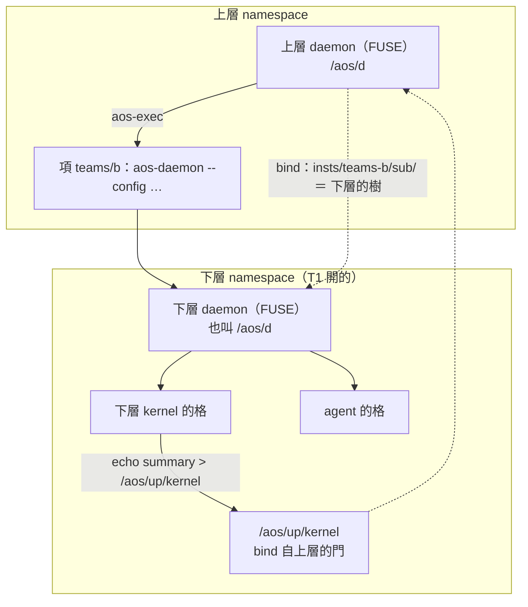

# 十、daemon 變成 FUSE 樹之後，daemon 跑 daemon 會變怎樣

← [提案入口](README.md)｜上一份：[最小實驗](09-最小實驗.md)｜相關：[daemon 變成檔案伺服器](03-daemon變成檔案伺服器.md)、[agent 與 kernel 的 namespace](05-agent與kernel的namespace.md)

全篇是推想（10-02 使用者追問後補）。前提是檔位 2（daemon 掛成 FUSE 樹）加檔位 1（每格自己的 namespace），見 [08](08-檔位.md)。

## 啟動幾乎不變

上層設定裡還是一項，inst 照樣是 `aos-daemon --config teams/b/daemon.json`。差在下層開起來之後：

1. 下層開自己的掛載空間（unshare），把自己的樹掛在 `/aos/d`。
2. 它開的任務都在這個空間裡，所以**每一層看到的 `/aos/d` 都是「自己的 daemon」**。
3. 上層的樹預設看不到。要往上講話，就像 Plan 9 一樣明確 bind 一扇門進來，例如 `/aos/up/kernel`。

## 比現在好的地方

| 現在（socket） | FUSE 版 |
|---|---|
| 上層的 `AOS_DAEMON_*` 會漏給下層任務 | 不需要這些變數；看不到上層的樹就碰不到 |
| kernel 把上層的門存成 `AOS_KERNEL_UP` 之類的別名 | namespace 檔裡一行 `bind` |
| 重讀子 daemon 要拿 PID 送 SIGHUP（agent 提案「主管拿不到子 daemon PID」那題） | 子 kernel `echo reload > /aos/d/ctl`；外面的主管寫子 daemon 樹裡的 `ctl`，不用 PID |
| 上層看下層只能收下層寄的摘要 | 子 daemon 的樹 bind 進上層樹，例如 `insts/teams-b/sub/`；最上面就能 `cat …/sub/insts/bob/status`，整個組織像 `/proc` 一樣一路瀏覽下去 |

上層管下層照舊：`echo kill > /aos/d/insts/teams-b/ctl`，等於現在的 `aos-ctl kill`。`pause` 一樣不會停住正在跑的子 daemon——那是 daemon 的語意，跟介面是不是檔案無關。

## 新出現的坑

1. **掛載的生死**：子 daemon 死了，掛載點讀了回 `ENOTCONN`；掛載空間要等裡面的程序全結束才消失，而 tick 不收後代，殘留任務會把死掉的掛載點留住。解法是 cgroup 收屍模組把整框殺光，所以 FUSE 版的巢狀 daemon 幾乎一定要掛收屍模組。
2. **兩個 daemon 卡在一起**：上層樹要呈現下層（`sub/`），只能用 bind mount 接過去，**不能讓上層的 handler 去讀下層再轉回來**；否則下層一卡，上層的執行緒跟著卡。同理，daemon 絕不能讀自己掛的樹。
3. **跨帳號看得到嗎**：FUSE 預設只有掛的帳號看得到；上下層不同帳號要 `allow_other`，而本機 `/etc/fuse.conf` 沒開 `user_allow_other`（見 [02](02-Linux上的工具與代價.md)）。多層先同帳號的限制不變，又多一條理由。
4. **掛在哪**：每層都掛 `/aos/d` 的前提是每層有自己的掛載空間；沒有就得改掛各自路徑（例如 `<家>/.aos/d`），失去「每層都叫 `/aos/d`」的好處。所以 FUSE 版幾乎一定要配檔位 1。
5. **帳號**：非 root 的下層照樣不能切帳號，換成檔案介面也一樣。

## 一句話

FUSE 化之後，daemon 跑 daemon 會從現在最彆扭的地方（環境變數外漏、拿不到 PID、上層看不到下層），變成最漂亮的地方：一棵能一路往下瀏覽的組織樹。代價是要管掛載點的生死、避免兩個 daemon 互卡，而且一定要配 namespace。
