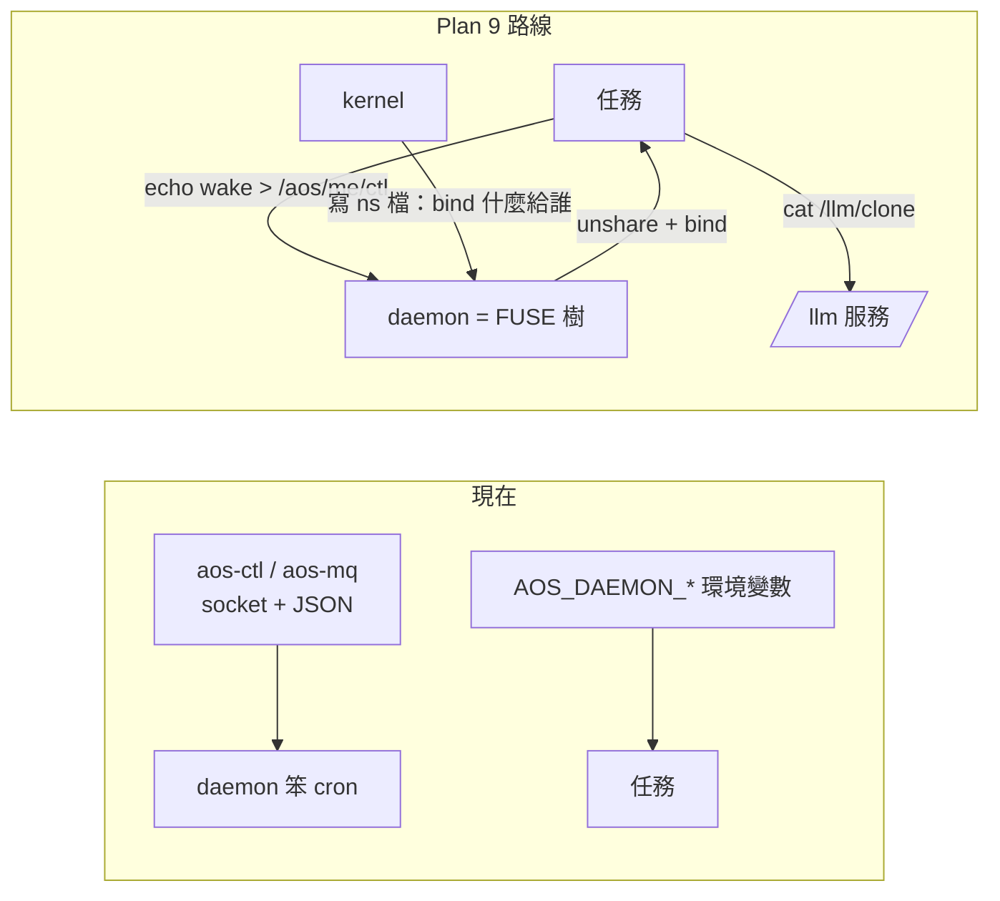

# 思想實驗：aos 全走 Plan 9 路線會長什麼樣（2026-10-02）

← [筆記索引](../../README.md)｜現行 spec：[proto6/spec](../../../spec/README.md)｜同日提案：kernel、agent（各在自己的 worktree，合進 main 後補連結）

**這是思想實驗，不是規劃。** 不改程式、不改 spec、不下裁定。前提照使用者給的：仍在 Linux 上、JSON 仍可當通用格式。問的是：我們能多接近 Unix 哲學的極限。文中分清「Plan 9 真的這樣做」（憑記憶，細節請對第四版 manual／9front）與「我的推想」。

## 一段話結論

aos 的 tick 層其實已經很 Plan 9——表、鎖、擋板、紀錄全是檔，「擋板檔只看存不存在」是最純的那種。不像的地方全集中在唯一常駐的 daemon：它用 socket、JSON、訊號、環境變數跟外界講話，正好是 Plan 9 全部不要的四樣。推到極限，整個 aos 只剩三個檔案伺服器（daemon 樹、`/llm/clone`、Linux 自己的 cgroup／proc）加兩支短命程式（`aos-exec`、`aos-tick`）；`aos-ctl`、`aos-mq`、`aos-llm`、三組 `AOS_DAEMON_*`、通訊錄、grant 信都消失，kernel 變成「替每個成員寫 namespace 檔的人」，agent 的工具就是它樹上 `/tools/` 裡有哪些檔。但代價很實：daemon 不再是「笨 cron」、FUSE 成為依賴（翻 09-28 的「FUSE 延後」）、blocking read 跟「一格」原則打架、掛載點與 user namespace 的坑會咬人。**在 Linux 上真正便宜又拿到核心好處的只有一刀：用 bind mount 給每一格一個自己的視野（檔位 1）**；`/llm/clone` 值得單獨實驗；daemon 變 FUSE 樹留到 C++11 時再評。

## 檔案

| 檔 | 內容 |
|---|---|
| [01-Plan9逐條對照](01-Plan9逐條對照.md) | Plan 9 核心想法一條一條對 aos 現況：已經是／半路／不是；跟 aos 原則的合與衝 |
| [02-Linux上的工具與代價](02-Linux上的工具與代價.md) | FUSE、9P（v9fs、diod、9pfuse）、unshare／bind／overlayfs／bwrap、inotify；本機實測；三個「換掉 9P」的反證 |
| [03-daemon變成檔案伺服器](03-daemon變成檔案伺服器.md) | daemon 樹的檔案樹、ctl／status／inbox／wait 的文字格式、好處與壞處 |
| [04-tick與inst變成目錄](04-tick與inst變成目錄.md) | tick 紀錄已是目錄；任務表與 inst 要不要變目錄（結論：不要，折衷 `tasks.d/`） |
| [05-agent與kernel的namespace](05-agent與kernel的namespace.md) | agent 一格看到的樹、kernel 寫 namespace 檔、`/llm/clone`、權限變成「看不看得到」 |
| [06-JSON放哪與文字格式](06-JSON放哪與文字格式.md) | 動詞與單值用文字、名詞與結構用 JSON；錯誤用 errno；範例 |
| [07-推到極限與代價](07-推到極限與代價.md) | 極限版剩什麼、消失什麼；八條誠實代價；四條反對意見；什麼時候值得 |
| [08-檔位與最小實驗](08-檔位與最小實驗.md) | 四個檔位的樣子、代價、建議；三個一兩天能玩的實驗 |

## 四個檔位（一句話版）

| 檔位 | 一句話 | 新依賴 | 我的建議 |
|---|---|---|---|
| 0 只改介面習慣 | ctl 與 status 改一行文字、紀錄改文字、信落檔成 `mail/` | 無 | 只做「信落檔」那條，其餘是品味 |
| 1 bind mount 做視野 | daemon 開任務前 `unshare`＋bind：門在 `/aos/<名>`、工具 union 進 `/tools/`、`config/` 唯讀 | bwrap | **做**：零 FUSE、零協議改動，拿到「權限＝看不看得到」，順手消掉環境變數外漏與通訊錄 |
| 2 daemon 掛成 FUSE 樹 | `echo wake > /aos/me/ctl`、`cat inbox`、`wait`；`aos-ctl`／`aos-mq` 消失 | FUSE | POC 不做；C++11 時再評，收益在「別人的程式當客戶端」 |
| 3 全套 namespace 化＋`/llm/clone` | grant＝`/llm` 在不在、LLM 三檔排程＝bind 自哪棵樹、金鑰出 agent 的樹 | FUSE×2 | `/llm/clone` 單獨實驗值得；整套是終局想像 |

## 推薦

1. 先玩**實驗 A**（半天，零新程式）：用 bwrap 給回聲 agent 一個視野，看「`ls /aos` 就知道能跟誰講」這件事順不順手。
2. 若順手，檔位 1 做成 daemon 一個模組 `modules.ns`（每項一份 namespace 檔，一行一個 bind），kernel 的「套」多寫一份 ns 檔。
3. **實驗 B**（一天）：`/llm/clone` 的 pyfuse3 玩具，先接 `fake:` 劇本。這塊獨立於 daemon，風險低、回報高。
4. 檔位 2 不急。等 C++11 改寫 daemon 時，再看要不要內嵌 libfuse3。

## 問使用者的問題

| # | 題 | 選項與後果 | 我的建議 |
|---|---|---|---|
| 1 | FUSE 要不要從「延後」解禁？ | a 不解禁：只能走檔位 0／1；b 解禁但只給 `/llm`；c 全解禁 | b。`/llm/clone` 的四個好處夠大；daemon 不急 |
| 2 | 任務能不能在格內 block 等別人（`wait` 檔、`/llm/N/response`）？ | a 都不准（維持純一格）；b 只准等 LLM（現狀）；c 都准 | b。等 LLM 本來就在等；等別項是新能力，跟「一格」打架 |
| 3 | 「daemon 是笨 cron」這條守多嚴？ | a 鐵律，daemon 永不變檔案伺服器；b 核心笨、FUSE 樹是可掛模組；c 可改寫 | b。模組化跟現在六個模組同一套規矩 |
| 4 | 權限的判準要不要加「看不看得到」這層？ | a 只靠 mode 與帳號（現狀）；b 疊上 namespace（樹上有＋mode 對才行） | b。T-08 原則不變，多一層可 `ls` 驗的保險 |
| 5 | ctl／status 要不要改一行文字？ | a 留 JSON；b 改文字，錯誤用 errno | 不急。檔位 2 才有意義；檔位 1 只固定路徑、協議照舊 |
| 6 | grant 要不要從「信」改成「`/llm` 在不在」？ | a 信（兩份提案現狀）；b 樹；c 兩者並存 | 等實驗 B 再答。b 是強制的，a 是自律的，這是待決 21 的第三個選項 |
| 7 | 一 agent 一 Linux 帳號，跟 user namespace 怎麼疊？ | a 先單帳號＋ns；b 先多帳號、不做 ns；c 都做（要 subuid） | a。乘法複雜度，一次疊一層 |
| 8 | 信要不要落檔（`mail/` 目錄）？ | a 留記憶體（現狀）；b 落檔 | b。解掉重開丟信，獨立可做 |

## 來源

現行 spec 全篇與程式（助手盤點 `proto6/src/py`：28 模組 4135 行、643 個測試、41 條跨程式介面）；同日 kernel 與 agent 提案；Plan 9 事實與 Linux 現況由兩位 Opus 助手整理（本機 WSL2 實測 FUSE／unshare／v9fs 狀態）；proto5 agent 歷史與 `notes/verdicts/11` 各批裁定。
