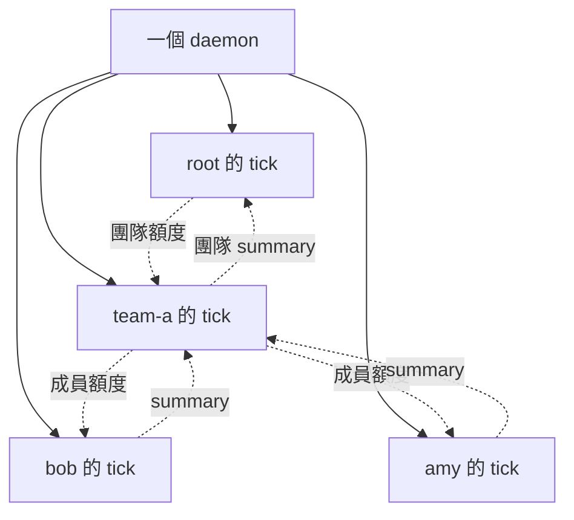

# kernel 不必綁一份 daemon：三條替代路線（astra，2026-10-03）

## 一段話結論

**「政策在 tick 裡執行」不會自然推出「每個 kernel 必須擁有一份 daemon 設定」。**
原提案把政策層級、程序層級、額度交付綁得太緊。
最值得先試的是拆開這三件事。
第一條路保留多層 kernel，但共用 daemon。
第二條路讓上層先分額度，成員自行決定何時消耗。
第三條路才真正翻方向，讓 daemon 根據宣告式規則決定誰能啟動。
若團隊邊界必須同時代表整組收屍、整組資源上限與獨立重啟，原提案仍較直接。

以下是設計推演。
全程唯讀，未改檔、未 commit、未跑測試。
實驗都是後續可做的時間盒，不是已驗證結果。

## 替代方案

三案處理的是不同問題。
方案一與方案二可以合用。

| 方案 | 政策在哪裡算 | kernel 要不要專屬 daemon | 主要交換 |
|---|---|---|---|
| 一：政策樹與程序樹分開 | 各層 kernel 的 tick | 不要 | 部署簡單，但團隊硬邊界減少 |
| 二：先分額度，成員自行准入 | 上層分配，成員格內扣用 | 不要 | 少逐次協調，但額度可能閒置 |
| 三：宣告式啟動席次 | daemon 模組 | kernel 可只剩設定 | 啟動同時數可管，但要翻 tick 排程裁定 |

### 方案一：多層 kernel，共用執行底座

**長相**

這是把原提案[待決第 2 題的 B 選項](../../proposals/2026-10-02-kernel/06-待決問題.md)補成完整方案。
不是宣稱原提案完全沒想過共用 daemon。

```text
site/
  daemon.json                     # 部署者持有
  kernels/root/
    .aos/tasks.json
    members.json                  # 只認 team-a、team-b
  kernels/team-a/
    .aos/tasks.json
    members.json                  # 只認 bob、amy
    policy.json
  agents/bob/.aos/tasks.json
  agents/amy/.aos/tasks.json
```

daemon 清單平鋪所有 kernel 與 agent。
政策上的父子關係留在各 kernel 的 `members.json`。



root 一格只看團隊摘要。
team-a 一格只看自己的成員摘要。
grant 仍可沿用私門。
daemon 直接啟動葉節點，不必再啟動另一個 daemon。

部署者知道完整程序清單。
root 的政策程式仍可只知道下一層。
這兩種「知道」不必相同。

現行 daemon 已逐項啟動獨立執行迴圈。
它沒有要求 kernel 項必須對應子 daemon。
見 [aos_daemon_run.py](../../../src/py/lib/aos_daemon_run.py) 第 88–108、181–182 行。

**比原提案好在哪**

- 可以先驗多層政策，不必先處理多層 daemon 的生命週期。
- 一個由 root 啟動的帳號模組，可以直接替所有葉節點選帳號。
- 團隊換父層時，可以先只換政策關係。
- kernel 壞掉與 daemon 壞掉成為兩種清楚分開的故障。

帳號模組會逐項檢查執行帳號。
啟動別的帳號時，執行路徑會交給 root 端。
見 [aos_daemon_account.py](../../../src/py/lib/aos_daemon_account.py) 第 85–90 行，以及 [aos_daemon_run.py](../../../src/py/lib/aos_daemon_run.py) 第 27–32 行。
模組仍須由 root 啟動。
見 [aos_daemon.py](../../../src/py/lib/aos_daemon.py) 第 132–140 行。

這避開的是「非 root 的下層 daemon 不能再掛帳號模組」。
不是新增逐層切帳號能力。

**代價與邊緣狀況**

最重要的代價是：**政策樹存在，團隊硬資源樹不會自動存在。**

現行 cgroup 依 inst 建立同一層的框。
見 [aos_daemon_cgroup.py](../../../src/py/lib/aos_daemon_cgroup.py) 第 95–108 行。
所以不能直接表示「team-a 合計最多 4 GB，但成員可以互借餘量」。
替每個成員設定固定上限，可以限制總和，卻會失去共享餘量。

控制權也會變粗。
能連共用 ctl 的 kernel，就能指名其他團隊的項。
現行 handler 直接依請求中的 inst 找目標。
見 [aos_daemon_ctl.py](../../../src/py/lib/aos_daemon_ctl.py) 第 131–155 行。
若不給 team kernel ctl 權限，它就只能靠摘要判斷成員狀態。

共用 daemon 重啟時，所有團隊一起受影響。
它也仍保留每項一條執行緒。
平鋪不會解決大量閒置成員的成本。

共用 `daemon.json` 必須有單一寫入者。
不能讓每個 kernel 各讀一份、各自覆寫。
第一版固定名單即可。
之後若要動態成員，讓部署任務收集各組需求，再產生完整設定。

父層縮減額度，仍要等下層下一格採用。
政策關係的變更不會撤銷已開始的工作。
若需要一個動作就殺掉整組，原提案的子 daemon 加 cgroup 邊界更自然。

**要翻的裁定**

最低版本**不必翻既定方向**。

[裁定 09「方向」第 2、3、5 條](../../verdicts/09-special-computing-os/01-方向與審稿裁定.md)要求多層、多 kernel，並允許各層有不同定義。
本案保留這些角色。

[裁定 11「方向與追答」](../../verdicts/11-tick-as-unit/01-0930-方向與追答.md)要求政策在 tick 任務裡執行。
本案也保留。

改掉的是[原提案推薦方案](../../proposals/2026-10-02-kernel/03-推薦方案.md)的一對一部署選擇。
它尚未成為裁定。

若另外要求「同一 ctl 自動限制每個 kernel 只能控制自己的組」，才需要翻[第二十五批追加裁定](../../verdicts/11-tick-as-unit/26-1002-第二十五批.md)。
目前的規則是能連控制 socket，就能控制任何項。

**最小實驗**

半天至一天。
使用兩層政策、兩個團隊、四個假 agent。
固定成員、固定門、先用同帳號。

各搭一份共用 daemon 與巢狀 daemon。
兩份使用相同的政策函式與假工作。

比較三件事：

1. 相同摘要是否產生相同額度分配。
2. root 改額度後，葉節點隔幾格採用。
3. 停掉 team kernel 與停掉 daemon，分別影響哪些工作。

若政策結果相同，而目前用不到團隊硬資源框，共用版本就值得留下。
若整組控制是主要用途，這次實驗也能說明原方案為何較好。

### 方案二：先切份額，成員自行決定是否計算

**長相**

這是重新設計原提案 D。
它不是讓所有成員搶寫同一份餘額。

上層只在窗口邊界分配有限份額。
每個成員只寫自己的用量。
每次昂貴計算前，由成員格內的包裝程式檢查。

```text
team-a/
  .aos/tasks.json                  # 分份額、看公開摘要
  allocations/current.json        # 上層單寫，成員只讀
  slots/0.lock
  slots/1.lock                    # 合作式同時上限
  members/bob/
    .aos/tasks.json
    state/spent.json               # bob 單寫
    public/summary.json            # 上層只讀這份摘要
```

以下是新格式示意。

```json
{
  "version": 1,
  "window_id": "team-a-1200",
  "window_start_seq": 1200,
  "window_ticks": 10,
  "policy_seq": 1203,
  "allocations": {
    "bob": {"calls": 12},
    "amy": {"calls": 8}
  }
}
```

bob 保存：

```json
{"version": 1, "window_id": "team-a-1200", "calls_debited": 5}
```

成員每格收普通訊息。
有工作時，執行新的 `budget-run`。
它先讀上層當前窗口，再嘗試取得一個計算槽。
有槽且有額度，才先扣一次額度，再執行昂貴計算。
完成後釋放槽，覆寫公開摘要。

上層下一格讀摘要。
同一窗口內不收回重借。
下一窗口才重新切份。

窗口依上層 `seq` 判定。
不能拿 bob 自己的 `seq` 代算。
上層停住時，窗口時鐘也停住。
成員至多花完既有份額，不會因自己的格數增加而自行補額度。

grant 因此不必是信。
普通訊息仍走 mq。
成員可先靠週期繼續工作，之後才評估獨立 `wake` 是否值得。

**比原提案好在哪**

- 上層不必逐次點名，才能讓下一次計算發生。
- 更新額度不會順便叫醒成員。
- 平常只改本地用量，沒有全體共寫的餘額檔。
- 上層暫時不跑時，已分出去的有限額度仍可使用。
- 摘要層級仍然存在。
- 同時上限可放在實際昂貴呼叫周圍，不必用 `status.running` 推測。

現行 mq 確實把放信與叫醒接在一起。
見 [aos_daemon_mq.py](../../../src/py/lib/aos_daemon_mq.py) 第 104–111 行。
改用分配檔，才真正把兩件事拆開。

普通任務可以執行這種新 wrapper。
見 [aos_tick_run.py](../../../src/py/lib/aos_tick_run.py) 第 74–88 行。
但槽與扣額度都要新寫。
現有 `tick.lock` 只鎖同一工作資料夾，而且不傳給任務。
見 [aos_tick.py](../../../src/py/lib/aos_tick.py) 第 191–203 行。

**代價與邊緣狀況**

**最主要的代價是份額閒置。**
bob 用完、amy 沒用時，bob 仍要等下一窗口。
這是少協調換來的結果。

不能看到 amy 沒回報，就把它的份額借出去。
amy 可能已經開始計算。
提前移轉需要明確繳回。
第一版不做借貸。

先扣再呼叫，可能扣完就中斷。
保守做法是這次仍算已用。
先呼叫再扣，則可能在中斷後重花。
若要求斷電也不重花，需要另加持久化保證。
不能把現行 POC 的簡化當成這項保證。

同窗口重讀分配檔不能清零。
政策檔的修訂號也不能當作新窗口。
否則只是改一個說明欄位，就會重新發錢。

槽鎖的生命期必須包住真正的計算。
前置 hook 取鎖，hook 結束就放掉，沒有用。
wrapper 被殺而子程序仍活著，也可能提早放槽。
第一輪只在 wrapper 本身完成假呼叫。
正式接任意子程序時，才驗 fd 繼承與收尾。
槽檔固定保留，不刪掉重建。

本機鎖也不能證明遠端 LLM 已停止。
HTTP 連線中斷後，供應商可能仍在計算。
所以這裡的同時數先限定為本地持有槽的呼叫。

公平性不會自動成立。
短任務可能反覆搶到槽。
先採非阻塞取得，沒拿到就等下一格。
若最後仍需要嚴格公平隊列，集中政策可能比較便宜。

第一版只管呼叫次數。
token 要先預留上限，再依實際用量退差額。
這是另一套機制。

分配檔可設成成員只讀。
但成員能改自己的用量檔，或繞過 wrapper 時，仍是自律。
此案不宣稱能保護握有金鑰的惡意成員。

**要翻的裁定**

保留上層分配角色時，最低版本**不必翻既定方向**。

分額度與扣額度都在 tick 裡做。
這符合[裁定 11 的排程原則](../../verdicts/11-tick-as-unit/01-0930-方向與追答.md)。
窗口也保留上層格數。

多層 kernel 仍可重複切份。
root 給 team-a 20 次，team-a 再分 12 與 8 次。
這保留[裁定 09 的多層方向](../../verdicts/09-special-computing-os/01-方向與審稿裁定.md)。

改掉的是[提案的私門 grant、逐次叫醒與 push 摘要選擇](../../proposals/2026-10-02-kernel/06-待決問題.md)。
這些仍是待決方案。

「沒有帳本」也不等於禁止一個 counter。
[裁定 02 第五批](../../verdicts/02-kernel-tree-and-tick.md)明留「帳本其他用途靠檔案，但要精簡」。
本案只存當前份額與用量。
若擴充成完整借貸、撤銷與交易歷史，就應重新討論這條邊界。

若進一步完全取消多層政策角色，才會翻裁定 09。
本案不要求那一步。

**最小實驗**

一天至兩天。
三個成員共 30 次假呼叫。
每人先分 10 次。
共用兩個槽。

第一天只驗固定窗口。
比較原方案與本案的完成時間、kernel 執行次數、空格數與同時呼叫峰值。
再把工作量改成明顯不平均，量出閒置份額。

第二天加入窗口切換與兩個中斷點。
一個在扣額度後、呼叫前。
另一個在呼叫進行中。

驗收重點是同窗口不重置，以及正常生命週期內不超過兩個槽。
中斷結果用來判斷這條路的成本。
不把完整容錯、公平隊列與 token 退款塞進時間盒。

### 方案三：kernel 只剩一份宣告式啟動規則

**長相**

這是重新評估原提案 B。
先把目標縮成「哪些 inst 能同時啟動」。
不把任意政策語言塞進 daemon。

以下是新模組示意。
現行程式沒有 `admission`。

```json
{
  "modules": {
    "admission": {
      "groups": {
        "all": {"slots": 3},
        "team-a": {"parent": "all", "slots": 2},
        "team-b": {"parent": "all", "slots": 2}
      }
    }
  },
  "insts": {
    "agents/bob": {"admission": {"group": "team-a"}},
    "agents/amy": {"admission": {"group": "team-a"}},
    "agents/eve": {"admission": {"group": "team-b"}}
  }
}
```

週期到、收到訊息、收到 wake，都先形成待啟動需求。
模組一次取得成員到根之間的全部席次。
拿不到就保留待跑狀態。
拿到才啟動 inst。
執行與清框完成後，歸還席次。

這個方案沒有 kernel 自己的一格。
成員照樣跑 tick。
kernel 可以只是一份設定。

現行 `_next_run()` 只看單項的 pending、paused、stopped 與 due。
各項再各自標記 running。
見 [aos_daemon_run.py](../../../src/py/lib/aos_daemon_run.py) 第 69–108 行。
所以必須新增跨項的原子取得。
只多查一次共用數字，仍可能同時放進太多人。

**比原提案好在哪**

- 限制放在真正啟動程序的位置。
- 普通訊息叫醒也會經過同一個門檻。
- 不需要「先查各項 status，再寄 grant」的分開操作。
- 額度參數改動不必改演算法。
- 若需求只有同時數，少了一個政策資料夾與摘要往返。

但它管的是 inst 同時數。
一個 inst 裡呼叫幾次 LLM，仍然不在它的計量範圍。
人手直接跑程式也不受這個門檻限制。

**代價與邊緣狀況**

長任務可能一直佔著席次。
「公平分配啟動機會」也不等於公平分配時間或 token。
若加入權重，必須先說清楚權重代表什麼。

祖先席次必須全拿或全不拿。
先拿父槽、再等子槽，會白佔容量。

持槽任務若同步等待另一個需要同組槽的任務，可能卡死。
控制與回報工作應有獨立的小額席次。
不能讓解鎖所需的工作也被滿槽擋住。

席次要等工作與收屍都結束才歸還。
現行 `run_once()` 在掛 cgroup 時，會等清框後才回傳。
見 [aos_daemon_run.py](../../../src/py/lib/aos_daemon_run.py) 第 48–65 行。

daemon 重啟不能只把計數清零。
現行退出不等也不殺子程序。
見 [aos_daemon.py](../../../src/py/lib/aos_daemon.py) 第 77–80 行。
沒有可靠接手或清理舊程序，就不能承諾跨重啟的實際同時上限。

新模組故障會影響所有受管項。
故障範圍比獨立 kernel 任務更大。

第一版設定只在啟動時讀。
現行重讀不熱套用 `modules`。
見 [aos_daemon_reload.py](../../../src/py/lib/aos_daemon_reload.py) 第 41–44、60–62 行。
不能順手假定新模組可熱換政策。

**要翻的裁定**

這案需要明確翻案。

- [裁定 11「方向與追答」](../../verdicts/11-tick-as-unit/01-0930-方向與追答.md)：排程在 tick 任務表上，只在每次 tick 執行。
  本案在 daemon 裡選下一個啟動者。
- [最核心 daemon 裁定](../../verdicts/11-tick-as-unit/07-1001-最核心daemon.md)：核心只是定期叫 `aos-exec`。
  本案需要為可掛模組增加跨項政策例外。
- [第十一批 daemon 模組裁定](../../verdicts/11-tick-as-unit/13-1001-第十十一批.md)：模組以 `insts` 的一項為單位。
  群組席次需要跨項單位。

若只把它當成一種有限資源的 kernel，仍可保留其他 tick kernel。
若拿它取代所有 kernel，就還會收窄[裁定 09 第 3 條](../../verdicts/09-special-computing-os/01-方向與審稿裁定.md)。
各 kernel 原本可以自訂抽象、資源與隔離方式。
有限的席次設定做不到全部。

現行 mq 的「收到就叫醒」也要補清新例外。
可保留訊息立即入箱與合併 pending，但實際啟動等待席次。
這需要對照[第二十五批的叫醒裁定](../../verdicts/11-tick-as-unit/26-1002-第二十五批.md)重新確認。

**最小實驗**

一天至兩天。
先只做固定群組、固定席次與簡單輪流。
不做任意演算法、動態成員或預算窗口。

六個假工作分成短、中、長三種。
同時由週期、wake 與訊息觸發。

記錄取得席次、啟動、結束與歸還。
驗每個祖先群組的峰值都不超標。
再插入一次啟動失敗與一次 kill。
確認席次只歸還一次。

重啟保證另列。
若實驗環境沒有可用 cgroup，就只驗正常生命週期。
這個實驗的價值，是看「強制開格同時數」是否值得翻上述裁定。

## 不換方向的改良

### 「收、判、套、報」可以保留，但不要把它當成四個完成狀態

原提案已把四步包成一項 `aos-kernel step`。
這避免前一步失敗後，tick 還繼續跑下一項。
但它不會讓跨檔案、socket 與程序的操作變成原子交易。

現行 tick 確實只記任務結果，最後仍正常收尾。
見 [aos_tick.py](../../../src/py/lib/aos_tick.py) 第 178–188 行。
ctl 的成功回覆也不等待目標工作完成。
見 [aos_daemon_ctl.py](../../../src/py/lib/aos_daemon_ctl.py) 第 122–155 行。

更有用的切法是：

```text
觀測快照 → 純政策計算 → 發布期望狀態
                            ↓
                     執行動作／成員採用
                            ↓
                        下格核對
```

至少分清三件事：

| 狀態 | 意思 |
|---|---|
| 已決定 | 政策算出分配結果 |
| 已發布 | 新版本已寫出或送入通道 |
| 已採用 | 成員回報自己使用哪個版本 |

不必立刻新增重送與復原系統。
先讓報告別把「寄成功」寫成「已生效」即可。

可以用同一份觀測快照，離線重跑不同 `decide`。
這很適合比較公平輪流、固定配額與需求優先。
不用每換一個演算法，就重新搭整個 daemon 拓樸。

### 即使保留中央派工，也可讓 grant 成為快照

kernel 寫 `public/grants/<member>.json`。
需要啟動時，另呼叫 `wake`。
資料版本與叫醒次數分開。

同窗口的 grant 更新不重置用量。
成員摘要回報已採用的版本。
發布成功但 wake 失敗時，記成「已發布、未確認啟動」。

這比把 grant 的唯一副本放在記憶體信箱更容易觀察。
但寫檔與 wake 是兩個操作。
它仍有半途中斷窗口。

此改良只替代 grant 的交付。
普通訊息的私門需求仍可能存在。
不能因此宣稱動態新增成員不再受新門限制。

改掉的是[提案待決第 6 題](../../proposals/2026-10-02-kernel/06-待決問題.md)。
不必修改現行 mq 裁定。

### 把不同的上限分開命名

`max_awake` 容易混合三種不同要求：

- 每次政策決策最多主動叫醒幾項。
- 同時最多有幾個 inst 在執行。
- 一個窗口最多准許幾次 LLM 呼叫。

它們需要不同的機制。
第一個由 kernel 的決策管。
第二個需要啟動席次或計算槽。
第三個需要消耗額度的檢查點。

實驗也應分別記錄。
不要只看「每格寄了一封 grant」，就算通過同時數驗收。

### 一份部署來源，產生多份執行設定

原方案仍可以保留一 kernel 一 daemon。
但成員路徑、門名、帳號與政策引用，改由一份部署描述產生。

產物仍是現行 `daemon.json`、inst 與政策檔。
不讓 daemon 學會新的產品概念。
動態產生時，也仍由 tick 上的普通任務執行。

這減少人工維護兩份成員清單的成本。
代價是必須指定來源檔為唯一修改入口。
手改產物會被下一次產生覆蓋。

## 試過但放棄的想法（各一兩句）

- **市場／拍賣。**
  若仍由一個 kernel 收 bid，它主要只是替換 `decide`。
  若要去中央化，還要付出共同輪次、額度移轉與重複成交的成本，目前沒有足夠清楚的收益目標。

- **所有成員共寫一個 token counter。**
  可以用鎖做，但每次呼叫都經過同一把鎖。
  若已接受這個集中點，中央政策角色可能更容易說明公平性。

- **用 token 檔案的 rename 當完整資源管理。**
  取得 token 不難，難的是中斷後何時可以安全回收。
  只按期限收回，可能讓舊工作與新持有者同時使用同一份容量。

- **用 FUSE 統一介面，就當作 kernel 替代。**
  [Plan 9 提案](../../proposals/2026-10-02-plan9/05-agent與kernel的namespace.md)可以改善可見路徑與介面組裝。
  但誰決定額度、誰扣用量、誰處理在途工作，仍然要另定。

- **獨立常駐 kernel。**
  對這次比較的有限配額與席次，尚未找到足以抵銷新增生命週期與翻裁定的收益。
  原提案 A 已能承載任意政策程式。

- **現在就把巢狀 daemon 全拿掉。**
  若每個團隊都需要獨立重啟與整體 cgroup 上限，原提案的程序邊界有實際用途。
  共用 daemon 應是可選部署，不宜直接取代全部情境。

## 問使用者的問題

| 題 | 選項與後果 | 建議 |
|---|---|---|
| kernel 的層級主要代表什麼？ | 政策層級：可共用 daemon。／程序與硬資源邊界：巢狀 daemon 較直接。 | 先用方案一驗多層政策，把部署邊界另外選。 |
| 最想限制哪個數字？ | 主動叫醒數：原方案即可。／昂貴呼叫數：方案二。／所有 daemon 啟動的同時數：方案三。 | 先量昂貴呼叫與空格成本，再决定是否值得翻 daemon 邊界。 |
| 願不願意用閒置額度換少協調？ | 願意：先切份額。／不願意：中央即時分配，或新增移轉協議。 | 先做不均工作量的對照，不先做借貸。 |
| grant 必須兼做叫醒嗎？ | 綁一起：少一次操作，但每次交付都触發待跑。／分開：狀態較易查，但有發布與叫醒之間的中斷窗口。 | 先試快照加獨立 wake。 |
| 願不願意讓 daemon 做有限政策？ | 不願意：保留方案一、二。／願意：可做席次門檻，但要翻 tick 排程與單項模組裁定。 | 只有在「所有開格都必須限流」是必要條件時，才優先試方案三。 |