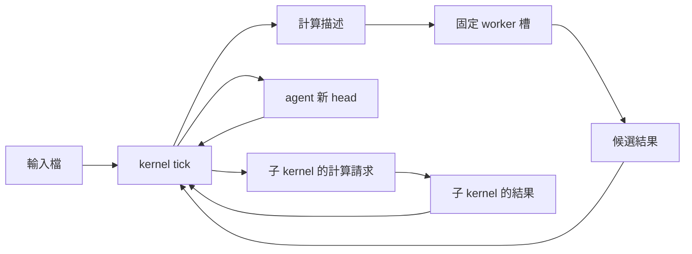
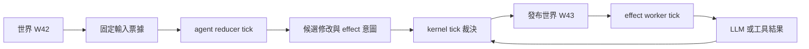

# 從一次計算與共同世界重想 kernel＋agent（astra，2026-10-03）

## 一段話結論

有兩條值得與原提案並排的整體路線。
**方案 A 把 agent 變成資料，由 kernel 排一次次計算。**
**方案 B 把 agent 變成世界修改的提案者，由 kernel 統一發布下一版世界。**
前者優先解決執行數量、計算分配與候選結果管理。
後者優先解決多人協作時的版本、衝突與可重放性。
我建議先用一天半驗 A。
若你真正想管理的是「幾個 agent 共同推進一件事」，再驗 B。
若目標只是讓少數 agent 各自工作、互相傳話，原提案仍可能最划算。

## 替代方案

本報告先從裁定、spec 與程式形成兩條主軸。
之後才拿去對照三份提案。
比較採用修正後的提案。
昨天 [06](../2026-10-02-astra/06-kernel-proposal.md)、[07](../2026-10-02-astra/07-agent-proposal.md)、[08](../2026-10-02-astra/08-plan9-proposal.md)、[09](../2026-10-02-astra/09-cross.md) 已指出的問題，不再拿來充當新方案的優勢。

先固定幾個事實。

| 現行程式的能力與邊界 | 對替代方案的意思 |
|---|---|
| tick 依序執行任務。任務失敗會記錄，但不自動阻止下一項。[aos_tick.py](../../../src/py/lib/aos_tick.py)，第 144–188 行。 | 採納與發布先包成一項 `step`。不能靠三項任務的排列取得交易保證。 |
| 任務會等待子程序結束。[aos_tick_run.py](../../../src/py/lib/aos_tick_run.py)，第 75–88 行。 | 可以讓獨立 worker 的一格執行一次有限計算。這不等於已有非同步工作管理器。 |
| daemon 每項獨立循環，週期從結束後起算，每項開一條執行緒。[aos_daemon_run.py](../../../src/py/lib/aos_daemon_run.py)，第 88–128、181–182 行。 | 固定 worker 數量可以減少 daemon 項目。共同回合則必須另由應用定義。 |
| MQ 把訊息複製給訂閱者，並叫醒它們。`take` 清空指定項的信箱。[aos_daemon_mq.py](../../../src/py/lib/aos_daemon_mq.py)，第 90–112 行。 | MQ 適合當提示。新方案的工作正本另放檔案。 |
| 帳號來自 daemon 項目的 `account.user`。[aos_daemon_account.py](../../../src/py/lib/aos_daemon_account.py)，第 103–110、147–148 行。 | 工件寫 `"agent":"alice"` 不會讓程序自動變成 alice。 |
| tick 紀錄只輪換 `current` 與 `last`。[aos_tick_record.py](../../../src/py/lib/aos_tick_record.py)，第 98–123 行。 | 計算歷史、世界版本與重放輸入都要新做。 |

兩案都保留 tick 與 daemon 核心。
新能力放在普通任務程式。
下面的程式名與 JSON 都是候選設計。

### 方案 A：工件推導機——agent 是資料，kernel 排一次計算

**長相**

取消「每個 agent 都必須有自己的 daemon 項目」。

agent 長期保存的是策略、記憶與目前採納的版本。
需要思考時，kernel 建立一份計算描述。
需要工具時，kernel 再建立另一份計算描述。
少量固定工作槽執行它们。

工作槽就是預先登記給 daemon 的 worker 資料夾。
每槽同時執行一件事。
worker 不自行挑下一件。
挑工作仍是 kernel 的排程政策。

```text
team/
  kernel/
    .aos/tasks.json             # 一項 graph-step
    policy.json
    pending.json               # 有限的待處理索引

  agents/
    alice.json                 # 策略、目前 head、可用工具
    bob.json

  objects/
    context-17.json             # 發布後不再修改
    answer-18.json
    tool-result-19.json

  jobs/J27/
    calculation.json
    attempts/A1/result.json

  slots/
    llm-0/
      .aos/tasks.json           # 一項 run-assignment
      assignment.json
    tool-0/
      .aos/tasks.json
      assignment.json

  subkernels/research/
    kernel/
    agents/
    objects/
    jobs/
    slots/
```

計算描述可以是：

```json
{
  "job": "J27",
  "agent": "alice",
  "input": "context-17",
  "operation": "llm",
  "policy_version": "p3",
  "budget": {"owner": "team", "ticks": 8}
}
```

派工另外指定嘗試次數：

```json
{
  "job": "J27",
  "attempt": "A1",
  "input": "context-17",
  "result_dir": "jobs/J27/attempts/A1"
}
```

`job` 表示要完成的計算。
`attempt` 表示這一次嘗試。
兩次相同輸入可以刻意得到兩份不同的 LLM 回答。
因此不能只用輸入雜湊決定「已算過，不用再算」。

kernel 一格做以下事情：

1. 讀取已完成的結果。
2. 核對輸入版本與 attempt。
3. 選擇要採納的結果。
4. 更新相關 agent 的 head。
5. 推導後續計算。
6. 把工作交給空槽。

這六步先放在一支 `graph-step`。
前一步失敗，就不繼續派工。
它不宣稱六步已具有當機交易保證。

worker 一格只做以下事情：

1. 固定讀取一份 assignment。
2. 執行一次 LLM 或工具。
3. 把結果寫入該 attempt 的暫存區。
4. 完成後發布結果檔。
5. 提示 kernel 有新結果。

assignment 由程式執行時讀取。
不能把它當成同格稍後才展開的 `$ref`。
現行任務表的已知欄位在開格時就展開。
見 [aos_tick_table.py](../../../src/py/lib/aos_tick_table.py)，第 173–189 行。

**訊息怎麼走**



檔案承載輸入、派工與結果。
MQ 只傳「有東西可看」。

kernel 每格檢查有限的未完成集合。
worker 可以保留低頻 tick，檢查尚未處理的 assignment。
遺失提示最多增加等待。
這是新任務程式的補查行為。
不是替現行 MQ 增加可靠投遞承諾。

agent 之間的傳話，也成為目標 agent 的輸入資料。
agent 本身不再持有私人 daemon 信箱。
新增 agent 的入口只建立資料與待處理項。
daemon 設定不用跟著新增一項。

多層仍然存在。
上層把「完成研究報告」交給子 kernel。
子 kernel 可以拆成十次不同計算。
上層只認輸入、結果與自己理解的資源。
不必知道下層有哪些 agent。

**比原提案好在哪**

第一個收益是讓分配單位直接變成一次計算。

原提案主要決定「下一格叫醒誰」。
本方案決定「這一次 LLM、這一次工具，要不要執行」。
不必先叫醒整個 agent，再由它自行檢查 grant。

第二個收益是讓執行成本與工作槽數量連動。

一千個閒置 agent 可以只是資料。
daemon 只保留 kernel 與少量 worker 項目。
這個差異來自現行每項一條執行緒的實作。
不是尚未量測的效能保證。

第三個收益是候選分支更自然。

同一上下文可以產生兩份答案。
kernel 可以先比較，再決定更新哪個 head。
不必為了兩份候選答案建立兩個完整 agent 執行個體。

第四個收益是可以直接實驗「少用隨機計算」。

例如重用已採納答案。
例如限制分支數。
例如用固定檢查器淘汰不合格結果。
這些都是排程選擇。
不必先發明一個叫「隨機性額度」的數字。

**代價與邊緣狀況**

| 情況 | 本方案怎麼處理，以及代價 |
|---|---|
| 一輪對話被拆成多次計算 | LLM、工具、下一輪思考之間多了派工與採納等待。原提案的一格五項比較直接。 |
| 同一 head 分出兩份結果 | kernel 必須選一份，或再安排合併計算。不能讓兩份都無條件覆蓋 head。 |
| worker 很慢 | 只佔住自己的槽。HTTP 逾時由 worker 處理。排程預算仍算安排它的 kernel 格數。 |
| 工具做完，但結果尚未發布就被殺 | 標成 `unknown`。不能因為沒有結果檔就自動重做外部動作。 |
| 舊 attempt 晚回 | 保留供檢查，但不能覆蓋新 head。取消結果採納不會撤回已發生的費用或外部影響。 |
| kernel 派工到一半中斷 | assignment、head 與待辦索引可能不一致。第一版停止該工作供檢查，不承諾自動恢復。 |
| 固定槽重複使用 | 每次使用獨立 attempt 目錄。前一件的輸出不能成為下一件的預設輸入。 |
| agent 數量增加 | 不必增加 worker。仍要管理待辦索引與磁碟工件。不能每格遍歷全部歷史。 |

**權限是本方案最大的部署取捨。**

固定共享槽不能自動保留「每個 agent 一個宿主帳號」。
第一版應按信任域配置槽。
不同帳號用不同槽池。
同帳號內的邏輯 agent 不宣稱互相隔離。

LLM 槽與任意工具槽也應分開。
LLM 槽只執行固定 client。
工具槽不取得 LLM 金鑰。
如果允許投件者任意更改持有金鑰之槽的 argv，就不能宣稱金鑰隔離。

槽的 cgroup 可以沿用 daemon 現有能力。
現行每項建框，執行結束後清框。
見 [aos_daemon_cgroup.py](../../../src/py/lib/aos_daemon_cgroup.py)，第 98–108 行。
清框接在程序結束後。
見 [aos_daemon_run.py](../../../src/py/lib/aos_daemon_run.py)，第 48–62 行。
因此第一版維持一槽一件。
不在同槽內偷偷再並行多件工作。

**要翻的裁定**

| 裁定 | 本方案的處理 |
|---|---|
| [02 第三批：LLM／工具先送出去，tick 保持短](../../verdicts/02-kernel-tree-and-tick.md) | **明確限縮。** kernel 格保持短。worker 格可以等待一次有限計算。若「所有 tick 都必須短」仍要保留，本方案就需要例外。 |
| [02 第五批：agent 也註冊給 daemon](../../verdicts/02-kernel-tree-and-tick.md) | **放棄這個舊應用模型。** daemon 登記 kernel 與 worker。agent 只存資料。舊登記機制已封存，這不是修改現行 daemon API。 |
| [10 方向第 3 條：掛 agent 任務，讓資料夾變成 agent](../../verdicts/10-tick-minimal-core/01-方向.md) | **重新選擇 agent 的長相。** 原文是用途例子，沒有明文禁止資料型 agent。不能把它誇成核心鐵律，但本方案確實不沿用它。 |
| [02 第五批：不用帳本、其他用途靠精簡檔案](../../verdicts/02-kernel-tree-and-tick.md) | 保留。輸入與結果是計算資料。head 是目前採納狀態。待辦索引不再另當一份成功帳。不提供全系統事件重播或原子回滾。 |
| [09：一次計算、多層 kernel、各層抽象可不同](../../verdicts/09-special-computing-os/01-方向與審稿裁定.md) | 保留。子 kernel 仍可自行拆解與定義資源。 |
| [11：排程在 tick 上，daemon IPC 是逃生口](../../verdicts/11-tick-as-unit/01-0930-方向與追答.md) | 保留。kernel 與 worker 都在 tick 裡做事。沒有新增常駐排程服務。 |
| [11：POC 默認正常](../../verdicts/11-tick-as-unit/03-1001-POC默認一切正常.md) | 保留最小實驗的範圍。完整恢復、可靠重試與自動清理不列入第一輪。 |

舊 kernel、agent、LLM 設計已依 [第二十七批](../../verdicts/11-tick-as-unit/28-1002-第二十七批.md) 封存。
上表把舊方向的改選與現行核心的修改分開。
本方案沒有要求先復活舊 node 或註冊協議。

**跟三份提案的差異表**

| 比較對象 | 原提案 | 本方案 | 原提案較好的地方 |
|---|---|---|---|
| [kernel 提案](../../proposals/2026-10-02-kernel/03-推薦方案.md) | 排成員的格。收 summary、發 grant。 | 排明確輸入與輸出的計算。選擇結果，再推導後續工作。 | kernel 與 agent 內部耦合較少。 |
| [agent 提案](../../proposals/2026-10-02-agent/04-一格做什麼.md) | 每個 agent 有資料夾與 daemon 項。一格串起五項。 | agent 是策略與上下文。計算交給固定 worker。 | 一格就能看完一輪。互動等待較少。 |
| [Plan 9 提案](../../proposals/2026-10-02-plan9/05-agent與kernel的namespace.md) | 保留 agent 執行角色。用 namespace 組出它能呼叫的入口。 | agent 本身不持有執行入口。由 kernel 把計算派到適當權限的槽。 | 任意外部程式直接使用服務的方式較自然。 |

若最後仍然一個 agent 一個 daemon 項，只把 LLM 改成共享池，就不是本方案。
那只是原提案已容納的變體。

**最小實驗**

時間盒是一日至一天半。
不改 tick 與 daemon。
使用假 LLM。
工具只產生測試檔案。

| 步驟 | 要看到的結果 |
|---|---|
| 一個 kernel、兩個 worker、三個活躍 agent | 跑通「輸入 → LLM → 工具 → 下一次思考」。 |
| 再加入一千個閒置 agent 資料檔 | daemon 項目不增加。新增 agent 不需要重讀 daemon。 |
| 同一輸入產生兩份候選答案 | 兩份都能保留。只有被選中的結果更新 head。 |
| 丟棄 MQ 提示 | 後續週期讀取仍能發現 assignment 或結果。 |
| 計算中途停止 worker | 工作留在可辨識的 `unknown`，不自動重做。 |
| 注入舊 attempt 結果 | 舊結果不能污染新 head。 |

記錄三個數字。
一輪對話經過幾格。
空 worker 每分鐘跑幾格。
維護派工與採納用了多少程式。

若這些格式與等待比原提案的生命週期更難理解，就放棄 A。
不必因為它比較像「一次計算的 OS」就硬留。

### 方案 B：共同回合的版本世界——agent 提修改，kernel 發布世界

**長相**

把一個合作群組看成一個有版本的世界。

kernel 擁有世界的發布權。
agent 讀取指定版本。
agent 產生候選修改。
kernel 決定哪些修改一起成為下一版。

這裡的「一起」只涵蓋一個 kernel 管的合作群組。
不要求整台機器共用一個世界。
不同 kernel 可以有不同資料格式、週期與採納政策。

```text
world/
  .aos/tasks.json                  # 一項 world-step
  policy.json
  current.json                    # 指向目前已發布版本

  versions/W42/manifest.json       # 該版有哪些狀態、訊息與 effects
  objects/                        # 發布後不再修改的內容

  tickets/R43/alice.json           # alice 這回合固定讀哪些輸入
  tickets/R43/bob.json

  proposals/alice/R43.json         # alice 寫，kernel 讀
  proposals/bob/R43.json

  effects/
    assignments/
    results/

workers/
  alice/.aos/tasks.json            # 一項 agent-reduce
  bob/.aos/tasks.json
  llm/.aos/tasks.json              # 一項 effect-step
```

agent 可以保留自己的 tick 工作資料夾。
但它不再自行發布別人看得到的狀態。

`agent-reduce` 是狀態轉換程式。
它讀固定輸入，產生候選結果。
它不在這一步直接叫 LLM 或執行工具。

```json
{
  "base": "W42",
  "ticket": "R43-alice",
  "next_state": "objects/alice-waiting.json",
  "messages": [
    {"to": "bob", "body": "請檢查這份草稿"}
  ],
  "effects": [
    {
      "id": "E17",
      "type": "llm",
      "request_ref": "objects/prompt-17.json"
    }
  ]
}
```

effect 是尚未執行的外部動作。
kernel 採納後，worker 才執行它。
LLM 結果稍後成為世界的新輸入。

**一格做什麼**

kernel 的一格：

1. 固定這次要處理的收件集合。
2. 檢查候選修改的基礎版本。
3. 裁決相互衝突的修改與資源申請。
4. 寫好新物件與 manifest。
5. 最後切換 `current.json`。
6. 發出下一回合票據與已核准的 effect 工作。

同樣先包成一項 `world-step`。
前段失敗就不發布。
不能把無條件執行的 `after_all` 當成「前面都成功才提交」。

agent 開始時固定讀票據指定的版本。
之後不能反覆讀 `current.json` 追最新。
manifest 也不能只指向會被原地修改的活檔案。
否則「同版世界」只是同一個名字。

**不等待所有 agent。**

kernel 下一格就封存這次採納集合。
沒有交件的 agent 本回合沒有狀態變更。
過期提案不能偷偷補進新版。

長時間 LLM 是已登記的等待中 effect。
它可以跨多個世界回合才完成。
它的結果按 effect ID 匯入。
這與「基於舊世界做出的修改」是兩種不同資料。

**訊息怎麼走**



agent 對 agent 的訊息也經過世界發布。
這是刻意付出的延遲。
它換來明確的「哪一版開始看得見」。

MQ 可以提示檔案已到。
也可以完全不用 MQ，靠週期讀取。
共同回合不是 daemon 提供的新時鐘。
現行 daemon 仍按各項自己的完成時間排下一次。
見 [aos_daemon_run.py](../../../src/py/lib/aos_daemon_run.py)，第 88–123 行。

上下層各自有世界。
上層只匯入下層公開的結果或摘要。
下層不必共享上層的 manifest 格式。
跨層也不承諾同一回合一致。

**比原提案好在哪**

第一個收益是說得清楚「你根據哪一版做決定」。

原提案的 agent 可以先後收到不同訊息。
本方案讓同回合參與者取得同版輸入的各自投影。
共同版本不代表所有人都能讀完整世界。

第二個收益是衝突可以在執行前處理。

兩個 agent 都想用唯一一個 LLM 名額。
kernel 可以一起比較，再核准其中一個 effect。
兩個 agent 都想更新同一份文件。
kernel 可以先拒絕衝突，再讓其中一份成為可見版本。

第三個收益是可以重放採納過程。

固定 reducer 程式版本。
固定輸入。
固定之前保存的 LLM 回覆。
就可以重跑候選結果與採納判斷。

這不代表重新呼叫 LLM 會得到同樣答案。
也不代表外部工具可以安全重做。
重放時使用記錄下來的外部結果。

第四個收益是人能停在某版世界檢查。

可以問「W42 裡每個人知道什麼」。
也可以問「為什麼 E17 在 W43 才獲准」。
這比從多個獨立 agent 的最新狀態拼回當時情境更直接。

**代價與邊緣狀況**

| 情況 | 本方案怎麼處理，以及代價 |
|---|---|
| 一次簡單對話 | 申請 LLM、採納、執行、匯入結果可能跨數格。原提案較快。 |
| reducer 太慢 | 提案可能連續過期。第一版直接拒收。之後若引入讀取集合與局部重驗，就是另一塊新機制。 |
| LLM 太慢 | 世界仍前進。等待中的 effect 留在狀態裡。完成後才加入新的輸入集合。 |
| 兩份修改衝突 | 第一版用固定優先序裁決。這可能造成飢餓。不能把固定排序誤稱為公平。 |
| 發布前程序死亡 | 新物件尚未被 current 引用。讀者仍讀舊版。這不等於斷電持久化保證。 |
| 發布後，effect 尚未啟動 | 已採納但未執行的 effect 必須仍可查到。提示不能成為唯一啟動依據。 |
| effect 已執行，但結果未寫完 | 留下 `unknown`。回退世界版本不能撤銷外部後果。 |
| kernel 故障 | 全隊的新結果都無法發布。故障影響比原提案更集中。 |
| 世界愈來愈大 | manifest、候選修改與版本保留成為成本。第一版只處理有票據的成員，不掃全部歷史。 |

**權限與純度仍需分開。**

agent 可以只讀自己的世界投影。
proposal 放在預配置的寫入區。
kernel 才能改 `current.json` 與已發布狀態。

JSON 裡的 `actor` 不當認證。
kernel 依收件位置與部署權限辨識來源。
也不能接受 proposal 指定任意宿主路徑。

「reducer 不做外部副作用」第一版是程式契約。
現行 account 與 cgroup 不會自動讓任意程式變成純函式。
若需要強制禁止網路或其他寫入，要另外設計隔離。

**要翻的裁定**

| 裁定 | 本方案的處理 |
|---|---|
| [02 第五批：原子操作用 git，除此之外不需要帳本](../../verdicts/02-kernel-tree-and-tick.md) | **本文把這項列為局部翻案。** manifest 保存採納集合與待執行 effects，重新引入「先記意圖，再決定套用」的用途。不能只改名為世界就說沒有帳本。例外只限這種 kernel，不建立全機總帳本。 |
| [02 第三批：tick 保持短](../../verdicts/02-kernel-tree-and-tick.md) | 與 A 相同。kernel 與 reducer 保持短。effect worker 的 tick 可以等待有限外部計算。 |
| [09 第 3、5 條：各 kernel 抽象可不同，上下層不必對齊](../../verdicts/09-special-computing-os/01-方向與審稿裁定.md) | 本文保留。每個 kernel 自己一個世界。若改成全機共同世界，就必須再翻這兩條。 |
| [11 追答第 6 條：上下層週期差異不管](../../verdicts/11-tick-as-unit/01-0930-方向與追答.md) | 本文保留。共同回合只在本地世界內。若強迫整棵樹每回合同步，就必須翻。 |
| [11 追答第 8 條：tick 本身不保證整格原子](../../verdicts/11-tick-as-unit/01-0930-方向與追答.md) | 保留。manifest 發布是 `world-step` 的應用能力。不是 tick 核心的新承諾。 |
| [11 第七批：tick 歷史紀錄不做](../../verdicts/11-tick-as-unit/11-1001-第六七批.md) | 保留核心邊界。世界版本是此 kernel 的業務狀態。不能因此要求所有 tick 保存完整歷史。 |
| [POC 默認正常](../../verdicts/11-tick-as-unit/03-1001-POC默認一切正常.md)、[B-625 暫緩](../../verdicts/11-tick-as-unit/27-1002-第二十六批.md) | 不重開核心恢復工程。第一輪展示發布邊界與 unknown，不承諾完整重試、斷電恢復或外部動作恰好一次。 |

第五批的原話沒有禁止未來任何應用保存狀態。
但 B 確實把當時認為「不需要」的採納機制放回設計中心。
採用時應明確接受這個取捨。

**跟三份提案的差異表**

| 比較對象 | 原提案 | 本方案 | 原提案較好的地方 |
|---|---|---|---|
| [kernel 提案](../../proposals/2026-10-02-kernel/04-agent介面.md) | 看 status、summary、request。決定誰醒與額度。 | 看候選修改。決定哪些狀態與 effects 一起發布。 | kernel 故障時，成員可能仍能沿用已有 grant。 |
| [agent 提案](../../proposals/2026-10-02-agent/04-一格做什麼.md) | 當格呼叫 LLM、做工具、寫自己的記憶與回話。 | 當格提出修改。外部動作經採納後執行。 | 對話路徑短。agent 自主性較高。 |
| [Plan 9 提案](../../proposals/2026-10-02-plan9/05-agent與kernel的namespace.md) | namespace 決定看得到哪些入口。 | manifest 決定這回合讀哪個內容版本。 | 活服務適合即時查詢。無須等待世界發布。 |

B 與 A 也不是同一條路。

A 可以逐件採納計算結果。
alice 更新 head 時，不必與 bob 同步。
B 的主要價值正是把多人的可見更新放進同一次發布。
若拿掉這個邊界，B 就退回 A 或原提案加版本號。

**最小實驗**

時間盒是一天半至兩天。
一個世界。
三個假 agent。
一個假 LLM worker。
固定成員。
不做完整恢復與自動版本清理。

| 步驟 | 要看到的結果 |
|---|---|
| 三個 agent 同讀 W7 | 每份票據固定同版輸入。程式中途不追 current。 |
| 兩個 agent 同時申請唯一 LLM 名額 | 下一版只核准一個 effect。能指出採納理由。 |
| 兩個 agent 修改相同資料 | 衝突先被裁決。讀者看不到半套發布。 |
| 假 LLM 延遲三個 kernel 格 | 世界繼續前進。結果回來後按 effect ID 匯入。 |
| 第三個 agent 到 W9 才交 W7 的修改 | 明確拒收或留待重算。不能偷偷補進 W9。 |
| 發布前中止 world-step | 其他 agent 仍讀舊版。 |
| 用相同輸入與保存的假回覆重放 | 比較採納集合與狀態內容。排除時間戳等非語意欄位。 |

記錄額外等待格數。
記錄提案過期比例。
記錄每回合產生的檔案量。

若共同快照沒有讓協作更容易理解，或多數時間都在等下一次發布，就放棄 B。
不把同步成本當成理論上漂亮就值得付的代價。

## 不換方向的改良

即使最後保留原提案，下面幾項也值得單獨採用。

| 改良 | 具體做法 | 收益與界線 |
|---|---|---|
| 每次計算有自己的工作目錄 | 用 `work/<operation>/<attempt>/` 保存 request、response、工具輸出。 | 讓舊結果與本次結果容易分辨。不要求改成完整工件推導機。 |
| 額度政策做成可乾跑的函式 | 輸入固定的成員快照，輸出「叫誰、准幾次、原因」。套用另做。 | 可以比較政策。真正執行仍要核對當時狀態。 |
| 區分四種數量 | 分別顯示開格數、獲准計算數、已開始計算數、已完成計算數。 | 避免把「叫醒了」當成「用了模型」。 |
| 重要輸入先存檔，再發提示 | 先發布 request/result 檔，再用 MQ 提示對方。 | 可作普通任務的選配契約。不改 daemon 的記憶體信箱裁定。 |
| 把失敗串接規則寫在 step 裡 | 關鍵政策用一項 step。需要多項時，明確處理擋板與各階段輸入有效性。 | 現行 tick 不因任務非零就停止。依據是 [aos_tick.py](../../../src/py/lib/aos_tick.py)，第 178–188 行。 |
| namespace 實驗獨立進行 | 用相同回聲工作，單獨比較固定路徑與可見入口。 | 不把介面偏好與 kernel／agent 執行模型綁成同一個決定。 |

MQ 的權限邊界也應出現在實驗說明裡。
現行從任一門提出 `take`，都按 payload 的 inst 名稱找信箱。
見 [aos_daemon_mq.py](../../../src/py/lib/aos_daemon_mq.py)，第 93–103 行。
因此「私人門」、「固定路徑」與「只能操作自己的項目」不能混稱。

這裡不建議順手修改該行為。
[第二十五批](../../verdicts/11-tick-as-unit/26-1002-第二十五批.md) 已明確裁定能連就能做。
若要改成分項授權，應另列翻案。

## 試過但放棄的想法（各一兩句）

- **全機一個共同世界。**  
  它能把所有採納集中起來。  
  但會限縮各 kernel 自訂抽象與上下層不必對齊的方向，所以 B 只保留每個合作群組自己的世界。

- **等全部 agent 交件才進下一回合。**  
  最容易解釋同步。  
  也最容易被一個慢工作拖住，所以 B 採固定封存點與缺席者不變更。

- **中央常駐事件服務接管排程。**  
  可以減少 tick 間等待。  
  但要翻「排程在 tick 上」與背景服務邊界，且第一輪沒有必要付這個代價。

- **只增加一個共享 LLM 池。**  
  這可以是實用改良。  
  但原提案已容納池代發，不能算這次要求的整體另一條路。

- **讓所有 agent 自己搶共用工作與額度。**  
  能減少中央派工。  
  卻把公平、重複領取與跨層政策分散到每個 worker，這輪沒有比較清楚。

- **先把所有介面都改成檔案服務。**  
  它主要回答「怎麼接觸能力」。  
  A、B 要回答的是「誰擁有狀態、排什麼、何時採納」，所以不把 FUSE 當前提。

- **相同輸入直接重用 LLM 結果。**  
  它會把刻意重抽樣與重複提交混為一談。  
  結果重用應是明確政策。

## 問使用者的問題（表格：題｜選項與後果｜建議）

| 題 | 選項與後果 | 建議 |
|---|---|---|
| agent 必須是能單獨叫一格的角色嗎？ | 必須：原提案最自然。可以只是策略與記憶：A 才取得主要收益。 | 用「一千份 agent 資料、兩個工作槽」的實驗判斷。 |
| kernel 最想管理什麼？ | 誰下一格醒來：原提案。哪次計算執行：A。哪些修改一起成為可見狀態：B。 | 先用你最想玩的工作流程選一個，不先追求三者全包。 |
| 每個 agent 都需要不同宿主帳號嗎？ | 需要：共享槽配置會更複雜。按信任域即可：A 比較便宜。 | 不偷偷改成同帳號。先把需要互相隔離的對象列清楚。 |
| 是否值得為共同版本多等幾格？ | 不值得：原提案或 A。願意換取共同快照與衝突裁決：B。 | 看 B 的三 agent 示範，再決定。 |
| 願意局部重提「先記意圖、再採納」嗎？ | 不願意：B 不成立。願意只在合作世界內做：可保留 B。 | 把它明列成第五批方向的局部翻案。 |
| 中斷後可以先留下 unknown 嗎？ | 可以：實驗能聚焦架構。必須自動恢復：兩案都要增加大量狀態與協議。 | 第一輪允許 unknown。 |
| 下一個實驗選哪個？ | A 驗 agent 能否資料化。B 驗共同發布是否值得。原提案驗最快接通完整對話。 | 我建議先 A。若你最在意多人共同修改同一件事，就先 B。 |

本次全程唯讀。
未改檔、未 commit、未跑測試。
上述實驗都是後續選項，尚未執行。