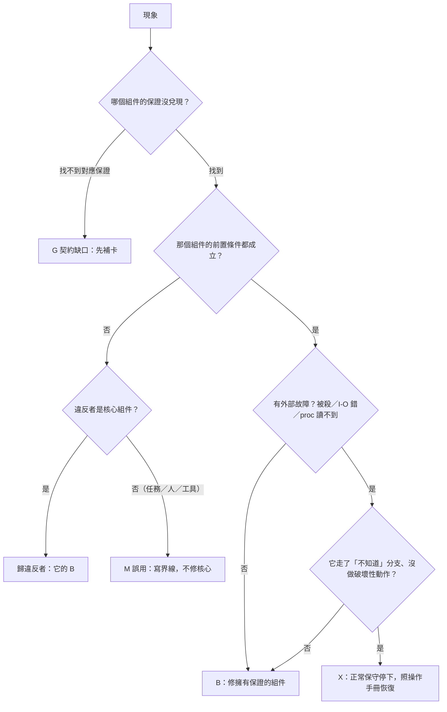

# proto7-2 組件功能定義藍圖：契約卡與錯誤歸屬

← [proto7-2](../README.md)｜[spec](../spec.md)｜[problems](problems.md)｜依據：[設計原則](../../proto7/notes/principles.md)第 7～10 條、[核心 spec](../../proto7/spec/core.md)（S-）、[四層交接點](layer-interfaces/01-daemon-ticktock.md)

**用途**：判斷「一個錯誤是不是某組件的問題」（原則 9、10）。每個組件一張契約卡，固定四欄：**職責**／**前置條件**（呼叫者／環境要保證的，違反＝誤用，不歸它管）／**保證**（前置成立時它承諾的）／**明確不管**。改進循環每輪：先對這份分類 → 再精簡／修補 → 再回歸。**卡不重抄機制**：每條保證引 [spec](../spec.md) 節號（文中「§」都指 proto7-2 spec），細節以 spec 為準；spec 改時 grep 節號就找得到卡，衝突處以本檔的「歸屬」為準去改 spec。

現況（2026-10-04，loop4 同步）：核心精簡已落地（[core-slimming](core-slimming.md) 頂層定案），本檔只留**核心卡**；包的卡在各包 README 的「契約卡」節（2.7 連結表）。

## 1. 組件清單與邊界

| 組件 | 程式 | 一句話 | 誰呼叫它 | 它呼叫誰 |
|---|---|---|---|---|
| **daemon** | `aos7_daemon.py` | aos 與 Linux 的介面：跑登記的 node、處理 daemon 控制檔、寫 status（S-03～06） | 人、父 node 的任務（路一） | 時間線迴圈（thread） |
| **時間線迴圈** | `aos7_daemon_timeline.py` | 一個 node 的節拍：照 §2.1 六步起 tick／tock 程序 | daemon | tick、tock |
| **tick** | `aos7_tick.py` | 開回合、執行任務控制與加掛審核、照 tasks.json 在槽裡起 run，不等（S-09、S-10） | 時間線（人手也行） | aos7-run |
| **tock** | `aos7_tock.py` | 關回合：判槽、寫上一次總結、通知活任務、刪不要的槽（S-08、S-11） | 時間線（人手也行） | 無 |
| **aos7-run（runner）** | `aos7_run.py` | Linux 子程序與檔案協定的交接者：pid.json／exit.json／out.log | tick | 任務 |
| **控制檔處理** | `aos7_daemon.py`（`.aosd/ctl/`）、`aos7_task.run_ctl`（槽 `ctl.json`） | daemon ctl＋槽 kill：把「寫檔」變成「動作」，每件一回條（S-17、S-18、S-21 路二）；restart／reload 在控制包 | daemon 主迴圈／tick、tock | — |
| **模組（擴充點）** | `modules/*/`、`packs/*/` | 核心以外的功能，一律以普通任務、包裝程式、工具接上（原則 1、7；§9） | tick（經 tasks.json）、人 | 核心檔（只讀＋給人寫的檔） |
| **任務** | 任何程式 | tick 起的程序；kernel／agent 都是任務（S-16），分四類（2.8） | aos7-run | 彼此（檔案協定） |
| **人／外部程式** | 編輯器、cron、包的工具（`aos7-ctl`…）… | 寫給人寫的檔、修復停點（[診斷包](../modules/diag/README.md)）；工具是這一側的便利，不是核心 | — | daemon／tick（寫檔） |

共用程式庫（`aos7_fs`、`aos7_proc`、`aos7_task` 的判定）不是組件，是**四個判定入口**（檔／回合／程序／槽，§0）；它們的 bug 歸「呼叫它的那個組件的保證沒兌現」，修在入口。

**檔案所有權（判誤用最常用的一張表）**：

| 檔 | 唯一寫者 | 給誰寫（合法輸入） |
|---|---|---|
| `.aosd/nodes.json`、`paused.json`、`gen.json`、`status.json`、`ctl-done/` | daemon | 沒有人 |
| `.aosd/ctl/*.json`、`log.on` | — | 人、任務、kernel |
| `.aosd/stop-guard.json`、`owner.json`、`subd-life.json` | 包（[子 daemon 包](../modules/subd/README.md)）或人（`subd-life.json` 只有 subd 寫） | 核心只讀守門檔 `stop-guard.json`（§2.7）；`owner.json` 給人看，核心不讀 |
| `.aos/round.json`、`last-round.json`、`action.owner.json` | tick／tock | 沒有人（修復例外：先 pause、保存證據） |
| `.aos/tasks.json` | 多人，**一律拿 `tasks.json.lock`**（§4.1、§4.3） | 人、kernel、包；tick 只寫 once 的 `launch` 欄與移項（§4.4） |
| `.aos/timeline.json`、`mount_allow` | — | 人、kernel |
| 槽 `birth.json`、`tock.json`、`mnt/`、`mount-done/`、`ctl-done.json` | tick／tock | 沒有人 |
| 槽 `pid.json`、`exit.json`、`out.log` | aos7-run（lost 時 tock／tick 寫 exit） | 沒有人 |
| 槽 `ctl.json`、`mount-req/` | — | 人、任務、kernel |
| 槽其他檔（`state.json`、`usage.json`、`writes.jsonl`…）、槽外交付物 | 任務（或它的包裝程式） | 任務自己；核心不讀格式 |

**規則一句話**：寫了不是給你寫的檔、或不照要求的方式寫（不拿鎖、換成 FIFO／資料夾／符號連結、手改內容）＝誤用，後果不歸任何核心組件。

## 2. 契約卡

格式固定四欄：職責／前置條件／保證／明確不管。外部故障（被殺、I/O 錯、/proc 讀不到）的處理寫在「保證」裡，一律走 §0 的「不知道」分支，其餘不加。

### 2.1 daemon（`aos7-daemon <root>`）

- **職責**：只跑 `nodes.json` 登記的 node，每個一條時間線；處理 `.aosd/ctl/`（2.6）；每圈寫 `status.json`；是空間根的守門人（S-07）。
- **前置條件**：root 存在、可 stat、是真資料夾；同一個 root 同時只有一個 daemon（`daemon.lock`，拿不到退出碼 1，§2.5）；node 在 root 下、不包住別的 daemon 根，**node 本身不是符號連結**（中間段換成連結＝誤用，§11）；`.aosd/` 內部檔沒人手改；守門檔由包或人寫（§2.7）。
- **保證**：只跑登記的 node，一個 node 任一時刻最多一條時間線（§1、§2.1）；**絕不沿符號連結寫出 root**：登記時檢查整條路徑、tick／tock 以 `O_NOFOLLOW` 開 node（§1、§2.5）；node 不見、換掉＝missing，看不到（EIO、EACCES…）或 /proc 讀不到＝不知道：保留現狀、不殺、不清記著的 live／pgid（§0、§2.6）；SIGTERM＝stop＋kill，不看守門檔；守門檔存在而 `allow` 不是 true＝控制檔 stop 拒收（§2.7）；status 每圈更新，`stopped: true` 是最後一份（§2.8）；被殺重開照 `nodes.json` 接著跑、gen＋1，起來時自己的檔讀不到＝不起來（§2.5）；暫存檔只清寫者確定不在的（§0）。
- **明確不管**：手改 `nodes.json`／`paused.json`／`gen.json`／`status.json`；兩個 daemon 根重疊；控制成環（S-22）；誰有權寫控制檔；守門檔的語意（包的事）；斷電後檔案系統的持久化順序；不在管理範圍的程序（§11）。

### 2.2 時間線迴圈（daemon 內，每 node 一條）

- **職責**：按 `timeline.json` 的節拍，照 §2.1 六步起 tick／tock 程序，處理 pause／wake／resume／rounds，把 tick／tock 的退出碼翻成 status。
- **前置條件**：tick／tock 是本 repo `bin/` 的程式並守退出碼契約；`round.json` 只由 tick／tock 寫；`timeline.json` 數值不合＝用預設並記一筆（B，§1），不是故障。
- **保證**：同一 node 不會同時跑兩個動作（動作鎖＋世代，§2.5）；舊回合確知已關才開下一回合，不知道＝停在 `error` 退避（§2.2）；tock 沒關上馬上補一次（§2.1）；**tick 退出碼非 0／3＝失敗：記 `last_error`、退避、不算回合、不扣 `rounds`**（§2.1）；動作逾時 SIGKILL 並記、舊世代持鎖者認得出才殺（§2.5）；pause 清單非空不開回合、`rounds` 倒數按 owner 各記（§2.4）；wake／resume 的提前結束照 §2.1 第 4、6 步；迴圈丟例外記 `last_error`、0.5 秒後續跑。
- **明確不管**：節拍準不準（S-08）；interval 0 的 CPU。

### 2.3 tick（`aos7-tick <root> <node-id>`）

- **職責**：開回合（round＋1）；執行任務控制（2.6）與加掛審核；拿表鎖讀 `tasks.json`、挑要起的、在槽裡起 run；印一行 JSON；**不等任務**（§4.2）。
- **前置條件**：在 `action.lock` 下、世代正確地被呼叫（人手跑要自己確保沒有 daemon 在跑同一 node，§2.5）；改 `tasks.json` 的人都拿鎖（§4.3）；生命週期檔只有核心寫（§5.1 的表）；node 本身不是符號連結。
- **保證**：
  - 上一回合確知已關才開（§3）；不知道＝退出 3、什麼都不寫。
  - 一個槽一個 tick 最多起一次；只在「空」或「已結束」的槽起（§5.3、§5.4）；起之前把「已結束未報」的 run 記進 `reaped`（§4.2 第 5 步）。
  - 單項欄位錯只跳那項；表讀不到（U）＝這回合不起、表鎖 1 秒拿不到＝回合照開、不起，都記 `tasks_error`（§4.1、§4.2）。
  - once 不重起、最多一次、不無痕消失（`launch` 標記，§4.4）；**(a) once 項從表上拿掉時，該槽 `birth.json` 已寫好**（§4.4）。被殺在任一點＝下一個 tick 靠 `launch`／birth／exit／pid 證據恢復，不多起。
  - 加掛：請求與 birth 一律經檔判定（§0、§4.5）——請求讀不到（U）＝那一件留著、不寫回條、不改 birth，記一筆在 round.json／總結的 `mounts`；請求不是 JSON 物件（B）＝回 `ok: false` 回條；birth 不是讀到（OK）的物件＝不審、請求留著。
  - 不知道的槽不起、不判 lost、記 `errors`（§5.4）；tick 不刪槽（刪槽是 tock 的，§5.1）。
- **明確不管**：任務跑什麼、跑多久、退出碼意義；不拿鎖編輯 `tasks.json` 被蓋（W8）；生命週期檔被手改或換成 FIFO／資料夾（§11，落到「不知道」照 §0 走）；交付物寫在槽內被刪（W7）；回合數被人手倒退（run 仍遞增，§5.2）。

### 2.4 tock（`aos7-tock <root> <node-id>`）

- **職責**：關回合：執行任務控制、掃槽判定、lost 補 `exit.json`、寫 `last-round.json`、再寫活任務的 `tock.json`、補 `seen_round`、刪該刪的槽、`open: false`（§7）。
- **前置條件**：同 tick；只收 `open: true` 的回合；槽內基礎設施檔由核心寫。
- **保證**：
  - **先提交 `last-round.json`（讀回確認）才寫 `tock.json`**：任務收到通知時總結一定已在；確認不了＝退出 3、回合不關（§7 第 4、5 步）。
  - 不知道的槽不判 lost、不刪、記 `errors`（§5.4）；列不出槽＝不關回合（§7）。
  - 只刪「名字不在表上、已結束、結束已報過」的槽，表讀不到不刪（§5.1）；**(b) 已結束的槽最早在報結束的下一個 tock 才刪**（§5.1）。
  - 同回合已有完整總結（寫完就被殺）→ 重播不重寫、只收尾，並補寫沒收到的 `tock.json`（§7 重播）。
  - 通知（`tock.json`）寫失敗記 round.json 的 `notify_errors`，**不跨回合補送**；要補由模組讀 round.json 自己做（§7）。
- **明確不管**：任務漏看 tock（只留最新，S-11）；槽被刪連帶任務自己的檔；任務不理 SIGTERM 拖慢動作；tock 不「收掉」任務。

### 2.5 aos7-run（runner，`aos7-run <taskdir> <fd>`）

- **職責**：經 fd 讀 `birth.json`，把任務起在自己的程序群組，寫 `pid.json`（run、pid、pgid、starttime、runner_pid、at），等它，寫 `exit.json`；`out.log` 收 stdout＋stderr（§5.1 表、§5.3）。
- **前置條件**：由 tick 以新 session、傳好 fd、cwd＝node 起；`birth.json` 已寫好；環境變數齊。人手直接跑、起任務途中搬 node 不在保證內（§11、K-06）。
- **保證**：起程序前任何失敗→`exit.json` code 127；fd 無效退出碼 2，不回退字串路徑；活到任務結束才寫 exit；`AOS7_*` 原樣傳給任務（§5.3）。runner 被殺由 tick／tock 靠身分掃描與 pid.json 判定（§5.4），不是 runner 自己處理。
- **明確不管**：任務換 session／pgid、清 `AOS7_*`、換使用者身分、關 dumpable（§11）；`out.log` 大小（W10）；任務退出碼語意；任務自己的 state／usage。

### 2.6 控制檔處理（daemon 的 `.aosd/ctl/`＋槽 `ctl.json` 的 kill）

- **職責**：把一份 JSON 請求變成一次動作，給一份回條。核心只有兩種：daemon ctl（§2.3）與槽 kill（§6）；restart／reload／`req_id` 去重在[控制包](../modules/control/README.md)的契約卡。
- **前置條件**：JSON 物件、`op` 合法；**檔名由寫者負責**（同名＝同一件事的最新一次，W3；工具的編碼見工具包）；槽 kill 帶 `run`（必填）。
- **保證**：
  - daemon ctl：每件要嘛回條（`ctl-done/`）、要嘛留著下一圈；回條 `ok` 只表示 daemon 接受、不表示已生效；一件丟例外不擋同圈其他件，效果可能已生效、不重做（刪請求、記 `last_ctl_error`，刪不掉就不再執行）（§2.3）。
  - **請求檔不是一般檔＝B 拒收**（搬成 `ctl-done/<名>.bad`、給失敗回條）：這是 §0 U 規則的例外，因為請求檔只可能是別人放的（§0、§2.3）。讀不到（I/O）＝留著。
  - 槽 kill：`run` 缺、不是整數、op 不是 kill＝回條 `ok: false`；`run` 不是槽現在的＝`ok: false`、不執行；帶 `run` 讓重播只對同一個 run（§6）。槽不知道、ctl.json 讀不到＝請求留著（§6）。
  - kill 只在確知任務程序已不在時回 `ok: true`，否則 `ok: false`（msg 以 `unknown` 開頭）；範圍是 Q1，打 pgid 前防重用（§6）。
- **明確不管**：誰有權寫；成環；不同寫者取同檔名互蓋；保留 mtime 複製還原請求檔（A3-05）。

### 2.7 模組（擴充點）

核心完全不知道模組存在（沒有鉤子，§9）：模組只從檔案協定接上（A 任務／B 包裝程式／C 工具），加上核心給的三個小出口。**核心對模組的保證就是對任務的保證（2.8）**，加上：收到自己 node 的 `tock.json` 時 `last-round.json` 已是該回合（§7）；`x` 照抄進 birth（§4.1）。模組漏取樣、模組自己的 bug、模組寫壞自己的檔、模組慢了拖住 early_tock，都不歸核心。

**包的卡在各包 README 的「契約卡」節**：

| 包 | 契約卡 |
|---|---|
| control 控制包 | [modules/control/README.md](../modules/control/README.md#契約卡) |
| subd 子 daemon 包 | [modules/subd/README.md](../modules/subd/README.md#契約卡) |
| once_retry once 保證包 | [modules/once_retry/README.md](../modules/once_retry/README.md#契約卡) |
| audit 稽核包 | [modules/audit/README.md](../modules/audit/README.md#契約卡) |
| diag 診斷包 | [modules/diag/README.md](../modules/diag/README.md#契約卡) |
| tools 工具包 | [modules/tools/README.md](../modules/tools/README.md#契約卡) |
| step 任務包 | [packs/step/README.md](../packs/step/README.md)（「四個組件」節） |
| budget 任務包（grant／帳／入口） | [packs/budget/README.md](../packs/budget/README.md) |
| adapt 任務包（最新值轉接） | [packs/adapt/README.md](../packs/adapt/README.md) |

### 2.8 任務（kernel、agent 都是）

- **職責**：tick 起的程序。**核心看到的只有一種任務**；四類是 kernel 層的標籤，寫在任務包的 README，`tasks.json` 不加 kind 欄：**核心任務**（kernel 骨架：主迴圈、狀態接續、快照、決定落地、決策紀錄）、**通用任務**（把 LLM 換成 cron 仍成立：帳本、准入、配額、排程、history、copier、量測、批次登記、step）、**agent 任務**（idle／think／act 狀態機、工具使用）、**LLM 任務**（沒有 LLM 就沒有這個問題：端點分配者、摘要者、摘要驗證器）（[core-slimming](core-slimming.md) §10）。
- **前置條件**（違反＝誤用，§11）：跟 daemon 同使用者、environ 可讀、保留 `AOS7_*`、不換 session 又脫離身分；交付物寫槽外（W7）；改 `tasks.json` 用 `edit_json`／拿鎖；只碰給的資料夾（S-10，合作式）；要控制別人寫 ctl 檔，不直接 kill。
- **保證**：環境變數齊、cwd＝node、`PATH` 有 `bin/`（§5.5）；同槽上一次的 state 讀得到（§5.1、§8）；每回合結束有 `tock.json`（可能漏、只留最新，§5.5）；kill 範圍是 Q1（§6）；keep 重起前舊的已收掉（管理範圍內，§5.4）。
- **明確不管**：任務邏輯錯；任務之間的協定（kernel↔agent 的格式、grant、帳）——那是 kernel 層契約，錯歸 kernel 層，不歸 daemon／tick；`usage.json` 只是取樣下界；故意脫離身分。

### 2.9 人／外部程式

- **職責**：寫給人寫的檔（本檔第 1 節的表）、`register`、`timeline.json`、照[診斷包](../modules/diag/recovery.md)的操作手冊修復停點；工具只是替你寫檔／輪詢，LLM 直接讀寫檔一樣做得到（S-01、§10）。
- **前置條件**：只寫合法輸入；修核心內部檔前先 pause、保存證據；不把 node、生命週期檔換成符號連結／FIFO／資料夾。
- **保證**（核心給的）：所有狀態 `cat` 看得懂（S-01）；每件控制有回條（2.6）；停下等人的情況都有證據與恢復步驟（§12）。
- **明確不管**：工具 bug 歸工具（A2-13、A3-06），不動 daemon。

## 3. 錯誤分類

四類，判準與統一處理分支：

| 類 | 判準 | 誰處理 | 怎麼呈現給人 | 回歸測試 |
|---|---|---|---|---|
| **M 誤用** | 某方違反了被害組件的前置條件（本檔第 1 節的表、各卡「前置條件」） | 違反的那一方：核心組件違反＝那個組件的 B；任務／人／工具違反＝不修核心，寫進「明確不管」 | 文件界線；核心碰巧偵測到就記 `last_error`／`errors`，**不保證、不加新檢查** | 可以留案例，標 `misuse`，失敗不算 bug |
| **X 外部故障** | 程序被殺、I/O 錯、/proc 讀不到、權限暫時變了；前置條件成立 | 被害組件走**同一條「不知道」分支**：保留現狀、記 `kind`、退避、下一圈再看（spec §0 三態） | status `last_error`、總結 `errors`、診斷包的 `uncertain` 與操作手冊 | 故障注入矩陣，每案斷言注入命中 ≥1 |
| **B 組件 bug** | 前置條件成立、保證沒兌現（含：X 發生時沒走「不知道」分支而做了破壞性動作） | 擁有該保證的組件；修在四個判定入口之一，不在呼叫處各補一次 | 修＋problems.md 一列 | 固定回歸案例 |
| **G 契約缺口** | 翻遍契約卡找不到對應的前置條件或保證 | 先補卡（Fable／astra），再重新分類成 M／X／B | 本檔或包 README 的卡更新一行 | 補卡後才寫測試 |

歸屬口訣：**誰的保證破了就先看誰；誰違反前置條件就歸誰。** 任務之間的事（kernel 對 agent）在 kernel 層另立契約，不往 daemon／tick 推。

## 4. 拍板題

三題已在 [core-slimming](core-slimming.md)「頂層定案」定案（第 2、3、4 條）；A2／A3 的試分類與當時的建議見 git 歷史與 [problems](problems.md)。
