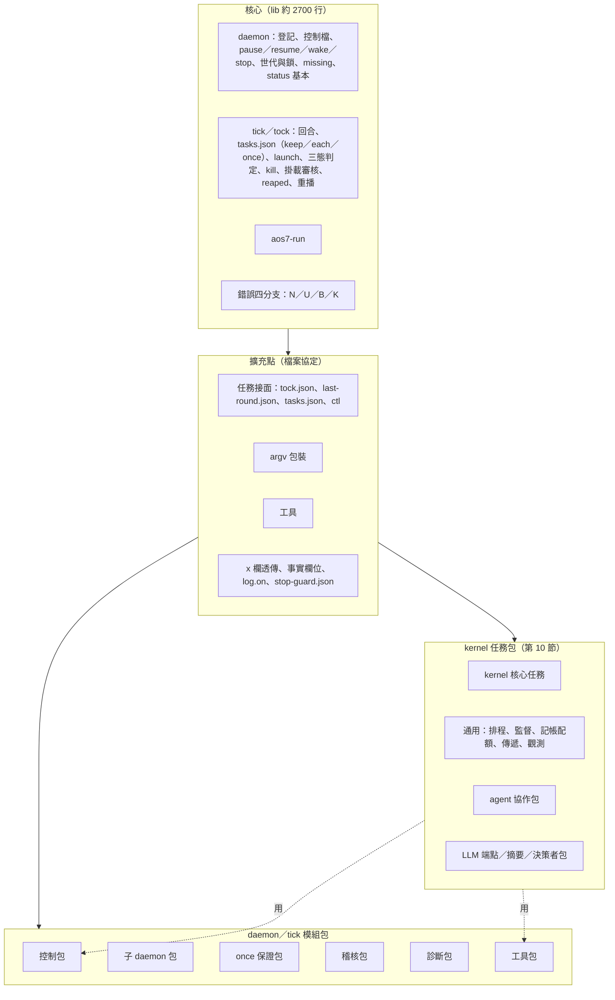

# daemon／tick-tock 核心精簡方案（只出方案，沒改程式）

**已照頂層定案執行（commit 範圍 1e94ba09～本次），F47 與 kernel 任務包、aos7-pack 未做。**

← [proto7-2](../README.md)｜[spec](../spec.md)｜[problems](problems.md)｜照的原則：[principles](../../proto7/notes/principles.md) 第 1、2、4、5、7～10 條｜核心要求：[core.md](../../proto7/spec/core.md)（S- 條）

**10-04 依使用者「核心保持精簡、類似用途集結成模組／模組包」（第 7 條）、「kernel 也分層、成任務包」（第 8 條）、「KISS、錯誤分類、誤用不歸組件管」（第 9 條）寫的方案。** 以 git HEAD（6ed9a7a7）為準。工作區另有另一個隊伍未 commit 的 A3 測試（`tests/test_matrix_a3.py`、`test_options_a3.py`），只拿來參考，用到的地方會標明。這份不改程式、spec、測試。

> **判斷依據可替換。** 每項保護防的是「組件自己的錯／外部環境故障／誤用」，這個分法是**我自己的判斷**，依據寫在第 2 節。Fable 正在寫的「組件契約藍圖」（第 10 條）定稿後，以那份契約的「前置條件／明確不管」為準重新對一次；本方案的表都留了「防的是」欄，方便整批改判。

## 0. 結論先講

- **核心最小集**：62 項功能裡，留在核心的 43 項（含 1 項核心選項 early_tock，其中幾項會再簡化），刪 4 項誤用保護，移出 9 項（到 6 個模組包、tests/ 和觀測任務包），兩難 5 項（第 3 節）。
- **擴充點**：不開 tick／tock 內的 hook，也不載入進程內外掛。模組只從四個檔案接面接進來：任務、argv 包裝、工具、宣告欄位透傳。核心另外補兩個小出口：事實欄位、通用守門檔（第 5 節）。
- **錯誤收成四類**：不存在、不知道、輸入不合、中斷。誤用不另立一類，落到哪類就照哪類處理（第 4 節）。
- **估計**：核心 lib 從 4501 行（實際程式 3085 行）降到約 **2700 行（實際程式約 2250 行，目標壓到 2000 以下）**；spec 從 425 行降到約 **230 行**，其餘分到各模組的 spec（第 7 節）。
- **時機**：A3 修補 commit 之後、astra 第三輪之前，分 8 步做，每一步跑全套測試，測試只搬不丟（第 8 節）。
- **防再胖**：訂核心行數預算（總行 2800／實際程式 2200，之後收到 2000），新功能預設進模組；核心 spec 只收引得到 S- 條的規則；新保護要先答「防的是哪一類」（第 9 節）。

## 1. 盤點

逐項功能表已抽到 [core-slimming-inventory.json](core-slimming-inventory.json)（62 列，`wf-table/1`）。

欄位：

- `id`：F01～F62。
- `功能`、`做什麼`：每列一項。
- `檔`：哪幾個檔的哪些函式。
- `約行數`：含 docstring 與註解，取自函式範圍，大略數字。
- `由來`：S- 條，或 P2-／A2-／A3-／W／Q／N／K 編號。
- `測試`：測試在哪。
- `防的是`：功能／組件自己的錯／外部故障／誤用。
- `判定`：核心、核心選項、移出、刪，或兩難。
- `去向`：移到哪個模組包，或「文件界線一句」。

**量測**（HEAD，ast 數函式範圍、去掉空行／註解／docstring 算實際程式）：

| 檔 | 總行 | 實際程式 |
|---|---|---|
| aos7_task.py | 885 | 603 |
| aos7_daemon.py | 759 | 588 |
| aos7_fs.py | 559 | 327 |
| aos7_tick.py | 512 | 373 |
| aos7_proc.py | 401 | 251 |
| aos7_daemon_timeline.py | 373 | 271 |
| aos7_tock.py | 316 | 234 |
| aos7_mount.py | 268 | 155 |
| aos7_run.py | 203 | 136 |
| aos7_ctl.py | 194 | 134 |
| aos7_audit.py（另有 audit_site 159） | 31 | 13 |
| **合計** | **4501** | **3085** |

proto7-1 同一組檔是 3346／2212 行。**多出來的大約一半是 A2／A3 的保護，另一半是 docstring 裡的由來說明**（docstring 引 A2-／A3-／P2- 編號共 185 處）。

**統計**：62 項裡，核心 42、核心選項 1（F08）、簡化 1（F47）、移出 9、刪（誤用）4（F28、F31、F33、F49）、兩難 5（F03、F11、F23、F26、F36）。「核心」裡有幾項標了「簡化」（F13、F16、F21）。

## 2. 「防的是」三類怎麼判（我的判斷，可替換）

- **組件自己的錯**：組件照自己的契約運作也會出事。例如自己的寫入順序錯、自己的回報不實、多個合法使用者並行。**核心要管。**
- **外部環境故障**：不是任何人的錯，環境本身出問題。例如 I/O 錯誤（EIO、ESTALE）、程序被 SIGKILL、斷電、卡住逾時、pid 被重用。**核心只做最基礎的保護**：不往前走、不做破壞性動作、下次再試。
- **誤用**：有人用組件沒約定的方式操作它。例如：
  - 手改或寫壞核心自己寫的生命週期檔；
  - 把生命週期檔換成 FIFO；
  - 運行中把 node 換成符號連結；
  - 起任務途中搬 node；
  - 任務關掉 dumpable、換 uid、改 pgid、刪環境變數；
  - 保留 mtime 去複製控制檔；
  - 手改權限讓核心刪不掉自己的檔。

  **照第 9 條，這類不處理，刪掉保護，在文件界線寫一句「誤用，不處理」。**
- **判準**：看「觸發它要不要有人做了契約外的事」。要的話算誤用。不要的話，再看是組件內部的邏輯錯，還是環境出問題。
- **兩難**：誤用和外部故障都會觸發、而且後果是破壞性的（寫出空間根、打到別人的程序），就標兩難，交給使用者或組件契約決定。

## 3. 核心最小集（照 KISS 重估）

### 3.1 留在核心（一行一項，括號是盤點 id）

1. 登記／取消登記，登記時驗證路徑（F01、F02）
2. node 消失／搬走 → missing＋收任務；看不到 → 保留（F04、F05、F06）
3. 時間線主迴圈：tick → 等 → tock → 等滿 interval（F07）；early_tock 是核心選項（F08）
4. daemon 控制檔通道，以及 pause（帶 owner）、resume、wake、stop、SIGTERM（F09、F10、F12、F13 簡化）
5. 世代、daemon.lock、動作鎖、舊動作接管、動作逾時、tick／tock 忽略 SIGTERM（F14～F18；F16 簡化）
6. 回合判定、接號、未關回合先補 tock（F19、F20）
7. tasks.json 讀取與驗證、keep／each／once、from／until_round、enabled、tasks_rev（F21、F22、F24）
8. once 最多一次的 launch 標記（F25）
9. 起任務交接與 aos7-run、inst（F27、F29、F61）
10. 槽三態判定、疑似 lost 先身分掃描、/proc 讀不到一路傳上來（F30、F32、F34）
11. kill 範圍 Q1、不打自己與祖先的群組、任務控制 kill（F35、F37、F38）
12. 宣告掛載、執行中加掛的審核（F40、F41；S-23 明寫由 tick 決定）
13. tock 收回合、tock 重播、P2-03 的 reaped、刪槽（F44、F45、F46、F48）
14. 原子寫、統一讀檔、flock、死寫者暫存檔清理（F43、F59、F60）
15. status 基本欄位與 last_error、事件出口 log.on（F52、F54）
16. stop 守門檔：通用版，核心不知道從屬語意（F51）

### 3.2 刪（誤用，改寫成文件界線一句）

| id | 刪什麼 | 界線那一句 |
|---|---|---|
| F31 | 壞 birth 的證據鏈（A2-03） | 生命週期檔被手改或寫壞＝誤用；核心當不知道，單槽保留 |
| F33 | environ EACCES 的 session／群組判斷（A3-02） | 任務必須同 uid、environ 可讀；範圍外的程序不保證不雙開 |
| F49 | 生命週期檔嚴格讀、檔案型別判斷（A3-03） | 把核心的檔換成非一般檔＝誤用；卡住由動作逾時收 |
| F28 | 起任務前比對 node 還是同一個（K-06） | 起任務途中搬 node＝誤用；鬼目錄已接受 |
| F03 | 每圈 realpath 重驗（A2-04，**兩難**） | 運行中把 node 換成符號連結＝誤用；留登記檢查與 inode 比對 |
| F36 | 群組身分核對（**兩難**，推薦簡化不全刪） | 任務改 pgid＝誤用；只為 pgid 被重用保留最小檢查 |

**A2／A3 照第 9 條重新歸類**：已抽到 [core-slimming-astra-triage.json](core-slimming-astra-triage.json)（22 列）。

- **屬誤用、照新原則不該修**：A2-03、A3-02、A3-03、A3-05。
- **誤用為主，只留統一分支、不另寫規則**：A2-02。
- **兩難**：A2-04（寫出空間根）、A3-01（權限被手改；restart 移出後不在核心）。
- **其餘是組件自己的錯或外部故障**，該修：A2-01、05～08、11～13，以及 A3-04、06～09。其中 A3-04、A3-05 隨控制包移出核心；A3-08 簡化成只記錄。

### 3.3 移出（見第 6 節的包）

| id | 項目 | 去哪 |
|---|---|---|
| F39 | restart、reload、ctl_id、ctl-seen | 控制包 |
| F50 | 子 daemon 所有權（F51 守門檔留核心） | 子 daemon 包 |
| F26 | retry_lost（兩難） | once 保證包 |
| F53 | status 診斷擴充 | 診斷包 |
| F55 | 寫入紀錄 | 稽核包 |
| F57、F58、F42 | aos7-ctl、wait-tock、任務端掛載函式 | 工具包 |
| F56 | 測試鉤子 | tests/ |
| F62 | 歷史 | 觀測任務包 |

**兩難、推薦暫留**：

- F11 rounds 倒數：移出會變成取樣、多跑回合，tickless「剛好一回合」要精確。
- F23 max_live：移出要改使用者看得到的格式。

**簡化**：

- F13 控制檔通道：壞檔一律回條 `ok: false`，不另分 ctl-failed。
- F16 舊動作接管：人工提示併進 last_error。
- F47 欠的 tock.json：只記不補。任務本來就只看最新一次 tock（S-11）。
- F21 任務表驗證：改成表驅動。

## 4. 錯誤分類：四條處理分支

| 類 | 什麼算 | 唯一的處理 |
|---|---|---|
| **N 不存在** | ENOENT／ENOTDIR；/proc 程序確定不在 | 當沒有：新空間、空槽、沒有請求 |
| **U 不知道** | 其他 OSError；/proc 讀不到或掃描不完整；**核心自己寫的**檔內容不合（含被手改） | 保留現狀：不前進、不做破壞性動作。記一筆 `last_error{kind, where, why}`，下一圈再看。停多大看事實歸誰：回合事實→整 node，槽事實→單槽，請求→那件請求 |
| **B 輸入不合** | **別人寫給核心的**請求、設定、表項格式不對 | 拒收那一件並回報（回條 `ok: false`、`tasks_error`、設定用預設），其他照做 |
| **K 中斷** | 自己被殺、逾時被收 | 不偵測。靠「先寫證據再動作」的順序，加上下一次重做是冪等的，加上清死寫者的暫存檔 |

- **誤用不另立一類**，落到 U 或 B 就照那一條走，不寫專用判斷。
- **「確定壞了」不另設分支。** 核心自己寫的檔壞了，只可能是被手改或磁碟壞，跟讀不到一樣走 U；別人寫的檔壞了走 B。

**現在散在各處的判斷怎麼收斂**：

- **讀檔收成一個函式**：`fact(path, check) → N | Ok(v) | U(kind, why)`。取代 `read_json`、`read_json3`（strict／非 strict 兩種）、`is_regular`、`read_round`、`summary_ok` 各自的判斷。`check` 是每種檔一個驗證函式，核心的檔約 8 個。
- **讀程序收成一個函式**：`proc(pid) → N | Ok(starttime) | U`。掃描結果帶 `complete`。取代 `_read_proc`、`pid_state`、`pid_alive`、`same_process`、`DENIED`。
- **例外收成一個**：`Unknown(kind, why)`。取代 `Unknown`、`ProcUnknown`、`ReadBack`、`_Skip`；`LockTimeout` 也轉成 U。
- **記錄收成一個**：`hold(scope, kind, why)`，取代各處的組字串、截斷、分欄。
- **時間線上** `prog` 的退出碼只看三種：0 成功、3＝U 退避、其他＝失敗退避。

**估計省的行數**：

| 來源 | 約省 |
|---|---|
| 讀檔、讀程序收斂 | 90 |
| 57 處 `except OSError`、15 處 `except Exception` 各自分流改走 `fact`／`hold` | 60 |
| 誤用保護刪掉（F03、F28、F31、F33、F49，F36 簡化） | 220 |
| 診斷字串、截斷 | 30 |
| **合計** | **約 400** |

## 5. 模組怎麼接到核心：擴充點

### 5.1 比較

| 接法 | 好處 | 壞處 | 結論 |
|---|---|---|---|
| A. 模組＝普通任務（tick 起，收 tock、讀「上一次」檔、寫 tasks.json、ctl） | 現成（history 就是）；合 S-10；模組掛掉只是任務掛掉 | 取樣：慢了、被 pause 會漏 | **主接法** |
| B. argv 包裝程式（`aos7-subd -- aos7-daemon …`） | 核心零改動；任何語言；失敗只影響那個任務 | 有人繞過包裝就沒有保護 | **主接法** |
| C. 工具（人、LLM、kernel 跑的 CLI） | 不在任何迴圈裡 | 只在被呼叫時有效 | **主接法** |
| D. tick／tock 前後同步呼叫外部 hook 程序 | 時刻精確、拿著動作鎖 | hook 的失敗、逾時、歷史都變成核心的邊緣狀況；spec §9 已否決 | 不採 |
| E. 進程內外掛（Python entry point） | 快、共用三態函式 | 綁 Python（違 S-04 精神）；內部 API 變成契約；外掛卡住就拖垮 tick | 不採 |
| F. 控制檔 op 外掛處理器（daemon 把不認得的 op 交給 `.aosd/ops/<op>`） | 擴 ctl 方便 | daemon 主迴圈要起程序、等程序，等於 D | 不採 |
| G. tasks.json 欄位外掛驗證 | — | 同 E | 不採；改用下面的透傳 |

### 5.2 推薦：只走檔案協定（A＋B＋C），核心補三個小出口

1. **宣告欄位透傳**：tasks.json 項目可以帶一個 `x` 物件，tick 不驗、照抄進 birth.json。模組（包裝程式、任務包安裝器）在裡面放自己的設定和標記（例如 `x.pack`）。核心多約 5 行。
2. **事實出口**：核心把它判定到的事實寫進現有的「上一次」檔，例如 lost 紀錄帶 `never_started: true`（birth 沒有 runner、沒有 pid.json、out.log 空）；再加 log.on 事件流。模組只讀、不回寫。
3. **通用守門檔**：`.aosd/stop-guard.json` 存在、而 `allow` 不是 `true` → 控制檔 `stop` 回 `ok: false`，SIGTERM 照停。核心不知道「從屬」，只知道「有個守門檔」。這個檔由子 daemon 包寫，取代 owner.json 在核心裡的角色。

**原則**：核心不呼叫模組，也不知道模組的語意；模組失敗頂多是一個任務失敗。哪天真的有功能非得在動作鎖裡做，走第 9 節的「進核心申請」，不開通用 hook。

## 6. 模組包（daemon／tick 這一層）

| 包 | 包含 | 接法 | 預設 | 依賴 |
|---|---|---|---|---|
| **控制包** | restart、reload（F39）。請求端照「先在 tasks.json 加 once（`slot` 釘同槽、`restart_of`、自帶 `id` 去重），再寫 ctl kill（帶 `run`）」 | C 工具（`aos7-ctl task restart` 改在用戶端做）＋給 kernel 用的同一個函式庫 | 開（隨工具包發） | 核心 kill、tasks.json 的 `slot` 欄 |
| **子 daemon 包** | subroot、owner 兩塊、allow_stop → 寫 stop-guard.json、stopped.json、起之前查「子根鎖有人拿、有 stopped」、subroot 位置檢查（F50） | B 包裝程式 `aos7-subd <subroot> [--allow-stop] -- <argv>`；設定放 `x.subd` | 關（用到才裝） | 核心 stop 守門檔 |
| **once 保證包** | retry_lost（F26）：讀 last-round 的 lost 加 `never_started`，把 once 加回表 | A 任務（keep） | 關 | 事實出口 |
| **稽核包** | AOS7_AUDIT 寫入紀錄（F55） | B 包裝程式 `aos7-audit -- <argv>` | 關 | 無 |
| **診斷包** | status 的 uncertain、steps_left、last_ctl_error、io_errors；spec §12 的恢復步驟表 | C 工具 `aos7-diag <root> [node]`，按需讀槽重算 | 開（工具） | 唯讀共用判定函式 |
| **工具包** | aos7-ctl、aos7-wait-tock、任務端函式（wait_tock、task_env、mount.request、resolver）（F42、F57、F58） | C 工具＋任務端函式庫 | 開 | 無 |

- **歷史不放這裡**：它是普通任務、在核心裡沒有對應的東西，歸第 10 節的任務包。測試鉤子搬去 `tests/` 的注入層，也不算模組。
- **放在哪**：`proto7-2/modules/<包>/`，每包有 `README.md`、`spec.md`、程式、`tests/`。包的格式跟任務包相同（10.4）。

### 6.1 移出或刪掉後，核心保證變弱的地方

| # | 變弱的地方 | 推薦 |
|---|---|---|
| 1 | **restart 不再由 tick／tock 原子執行**：請求端在「加了 once、還沒寫 kill」之間死掉，once 會等槽空才起（busy），跟現在 P2-07 一樣，但重試責任在請求端。ctl-seen 拿掉後，不帶 `run` 的 kill 重播可能打到新 run | 做。kill 的 `run` 改成必填（工具自動帶），重播天然冪等。這是第 1 個要使用者決定的點 |
| 2 | **子 daemon**：繞過包裝、直接在 argv 寫 `aos7-daemon` 的人，沒有 stopped.json 與重複認領的擋法。重複認領時第二個 daemon 拿不到鎖、退出碼 1，keep 每回合重試，總結裡會一直看到失敗，不是 `skipped` | 做。stop 權限靠核心的守門檔，沒有變弱 |
| 3 | **retry_lost 變成取樣**：模組慢了或被 pause，錯過那筆 lost，就退回「最多一次」 | 兩難，做成選項：預設移出；要精確的人保留核心選項。第 3 個決定點 |
| 4 | **欠的 tock.json 不補**：node 長時間 pause 前錯過的最後一次 tock，要等下一回合才收到 | 做。S-11 本來就只保證看到最新的 tock |
| 5 | **node 運行中被換成符號連結**：只剩 inode 比對（同 inode 的連結換法抓不到），可能沿連結在空間根外建 `.aos` | 兩難。推薦刪，理由是第 9 條。不放心可以保留 tick／tock 開 node 時的 `O_NOFOLLOW`（約 3 行）當最小保險。第 2 個決定點 |
| 6 | **改了 pgid 的任務**：群組身分核對簡化後，任務把自己移進別人的群組，kill 可能打到那個群組 | 兩難。推薦保留最小檢查「群組裡還有這個 run 的程序才打」，防 pgid 被重用（這是外部故障，不是誤用） |
| 7 | **不可讀的任務**（關 dumpable、換 uid）可能雙開 | 做。文件界線寫清楚管理範圍 |
| 8 | **壞 birth、FIFO 生命週期檔**：只剩「不知道＝保留」，不再嘗試從旁證推回 | 做 |
| 9 | **診斷移出**：只看 status 的人看不到 uncertain，要跑 `aos7-diag` 或讀總結的 `errors` | 做 |

## 7. 精簡後的樣子

**核心行數估計**（以 HEAD 的 4501 行為基準）：

| 動作 | 總行 | 實際程式 |
|---|---|---|
| 現在 | 4501 | 3085 |
| 移出工具與稽核（aos7_ctl、aos7_audit、任務端函式） | −290 | −200 |
| 移出控制包、子 daemon 包、retry_lost、診斷、測試鉤子 | −520 | −350 |
| 刪誤用保護，錯誤收成四分支 | −400 | −280 |
| docstring 的由來說明移回 problems.md（只留「做什麼、保證什麼」） | −600 | 0 |
| **精簡後** | **約 2700** | **約 2250** |

實際程式要壓到 2000 行以下，看實作時錯誤分支收斂得多徹底。

**spec 估計**：425 行降到約 230 行。

- **移出**：
  - §2.7 子 daemon → 子 daemon 包的 spec；核心留守門檔兩行
  - §6 的 restart／reload／重播 → 控制包
  - §9 → 觀測任務包
  - §10 → 工具包
  - §12 恢復表 → 診斷包的操作手冊
  - 各處「以前…」的由來 → problems.md
- **刪**：
  - §0 嚴格讀
  - §5.4 表裡壞 birth、EACCES 兩列
  - §5.4 末段 EACCES 說明
- **新增**：
  - §0「錯誤四分支」一段
  - §11 改成「誤用，不處理」清單（一項一句）

## 8. 執行計畫

**時機**：另一個隊伍的 A3 修補（含 `test_matrix_a3.py`、`test_options_a3.py`）commit 落地之後、astra 第三輪之前。這樣 astra 第三輪審的就是精簡後的核心加模組，不會白審即將刪掉的保護。

**順序**：先做純搬移（行為不變），再做行為變更（要使用者先點頭的）。

| 步 | 做什麼 | 測試怎麼不退 |
|---|---|---|
| 0 | 定基準：記下測試數與耗時。目前工作區 252 項（含未 commit 的 A3 測試），HEAD 狀態下有 1 項失敗，屬那個隊伍的進行中工作 | 基準全綠才開始 |
| 1 | 測試分層：每個測試案例標 `core`／`<包>`／`misuse`，先搬資料夾（`tests/core/`、`modules/<包>/tests/`），不改內容 | 搬前後項數相同、全綠 |
| 2 | 工具包、任務端函式、測試注入層外移（純搬移） | 同上 |
| 3 | 錯誤四分支重構：fact、proc、Unknown、hold，行為不變 | 全綠；矩陣的故障命中斷言照舊 |
| 4 | 補擴充點：`x` 透傳、`never_started`、stop-guard.json | 新增核心測試 |
| 5 | 子 daemon 包、稽核包（包裝程式），tick 拿掉 subroot | `test_subdaemon_modules` 搬去包裡，改用包裝程式起；項數不少 |
| 6 | **要使用者決定後**：控制包（restart 移出、kill 必帶 run、拿掉 ctl-seen）；once 保證包 | restart 測試搬到控制包；ctl-seen 測試照新語意改寫或刪，逐項列在 commit 訊息裡 |
| 7 | **要使用者決定後**：刪誤用保護 | 標 `misuse` 的測試刪掉，數目和名字寫進 problems.md 的新節 |
| 8 | spec 拆分、docstring 減肥、code map 同步 | 全綠；wf-lint 0 broken |

**每一步的規矩**：

- 步驟 1～5 測試數只能增加。
- 步驟 6、7 刪掉的每一項測試都要在 problems.md 有一行理由。
- 每步一個 commit，可以單獨回退。

## 9. 防再胖的機制

1. **行數預算**：核心（`lib/aos7_*.py` 扣掉工具與任務端函式）總行 ≤ 2800、實際程式 ≤ 2200；精簡做完後收緊到 2000。
   - 可以在 `tests/core/test_budget.py` 量測，超過就失敗。
   - 要加預算，得在 problems.md 寫一行理由並經使用者同意。
2. **新功能預設進模組**（第 7 條）。要進核心得同時答出三件事：
   - 引得到哪條 S- 條；
   - 為什麼不能用任務、包裝、工具三個接面做到；
   - 是不是通用的，不是只為 agent／LLM（第 5 條）。
3. **新保護先答「防的是哪一類」**：誤用的不做；外部故障的只能走四分支，不加新分支。審查報告（astra）也照這個分類，誤用的不列成 bug（第 9 條末句）。
4. **核心 spec 只收規則**：每條要能引到 S- 條或核心選項。由來、以前的錯法寫在 problems.md，模組的規則寫在模組自己的 spec。
5. **docstring 只寫「做什麼、保證什麼、丟什麼」**，不寫 A2-／A3- 的故事；編號留一個就好。

## 10. kernel 任務的分層與任務包

proto7-2 還沒有 kernel。下面以 proto7-1 的 kernel、agent、探針（`proto7-1/lib/aos7_kernel*.py`、`aos7_agent*.py`、`aos7_llm.py`、`proto7-1/probes/`）與思考筆記（[r1 綜合](../../proto7/notes/thinking/2026-10-04-r1-synthesis.md)、[LLM 端點是一種資源](../../proto7/notes/2026-10-04-llm-endpoint-resource.md)）為材料。這節同樣只出方案。

### 10.1 四類的定義與判準

| 類 | 定義 | 判準（照順序問） |
|---|---|---|
| **核心任務** | 任何 kernel 都需要的骨架，不帶任何資源或用途的語意 | 拿掉它還能不能叫 kernel？不能 → 核心 |
| **通用任務** | 管的對象是「任務、回合、數字、檔案」，可以用在記帳、配額、排程、事件轉發等非 agent 用途 | 把 agent 換成一個 cron 腳本，它還有用嗎？有 → 通用 |
| **agent 任務** | 只對「有狀態機、會互相通訊的 agent」有用 | 沒有 agent 就沒用，但沒有 LLM 照樣有用 → agent |
| **LLM 任務** | 只對 LLM 呼叫有用（端點、token、prompt、摘要） | 沒有 LLM 就沒用 → LLM |

**分類看「管的對象與需要的東西」，不看「誰做決定」。** 例如 llmkernel 是 LLM 當決策者、管的是通用對象，所以拆成兩部分：通用的排程動作歸通用包，「LLM 當決策者」的操作卡歸 LLM 包。

### 10.2 現有與規劃中的任務各歸哪類

**核心任務**（全部從 proto7-1 `aos7_kernel.py` 拆出，不含規則）：

- 主迴圈：等 tock、跑一輪
- 狀態接續：kernel-state.json 留在自己的槽，靠 §8 接前任
- 快照：讀成員的上一次檔
- 決定落地：apply_decision 寫 ctl.json、daemon ctl、tasks.json，去重、帶 run
- 加掛請求：ask_mounts
- 決策紀錄：decisions.jsonl，只留上一次，歷史交給觀測包
- 規則介面：proto7-1 是寫死的函式 `rule_x(cfg, st, snap, out)`；建議改成「一條規則＝一個純函式或一支程式，讀快照、回決定清單」，讓任務包可以加規則

**通用任務**：

| 子類 | 任務 |
|---|---|
| 監督 | rule_age（超齡就 kill）、rule_stuck（progress 不動就 restart；`llm_since` 那段除外）、supervisor（one_for_one、退避、升級）、watchdog |
| 排程 | sched（round-robin、優先序、類 cron）、tickless（閒置就 pause，有信就 resume 一回合）、gang（成組准入）、holds＋arbiter（多控制者）、deadline／EDF、優先級捐贈、利用率准入 |
| 記帳配額 | rule_budget／cap（usage 只是一個數字）、ledger（帳本，單一寫入者）、grant 函式庫（within／split／expired）、根／團隊分配者、各資源的 gateway、§8 以 run 為單位的用量累計 |
| 傳遞 | copier（原樣搬運並附 src）、跨空間信箱、event（事件轉發）、索引暫存器 |
| 觀測 | 歷史 module（proto7-2 `modules/history.py`）、clock-quality、「分配算法的分配」評估者 |
| 服務注入 | namespace（經 `mnt/` 換服務；用例是 LLM，機制是通用的） |
| 驗證／測試 | swarm、longrun、multid、fleet、polyglot、selfmod、chaos 這些探針是驗證用的，不是常駐任務，不放進包 |

**agent 任務**：

- agent 狀態機骨架（idle、think、act）
- roster（名冊）
- inbox／outbox 協定與「寄不出去先寫加掛請求、掛上再補寄」
- agent 工具（send、write、save、none）、memory 視窗
- selfprog（agent 改自己的任務表）
- 團隊複製與批次登記工具
- llmteam 的團隊組法

**LLM 任務**：

- llm client（`aos7_llm.py`）
- LLM 端點分配者
- 給 LLM 用的 gateway，以及 LiteLLM spend 稽核
- annotator（摘要者）、digest 慣例、verify、relay（copier＋annotator）
- rule_stuck 的 `llm_since` 判斷
- LLM 決策者操作卡（llmkernel、llmops、hsched 的 agent.py）
- blindread（S-01 盲讀驗證，屬驗證，不放進包）

### 10.3 建議的任務包

| 包 | 類 | 內容 | 依賴 |
|---|---|---|---|
| `kernel-core` | 核心 | 主迴圈、快照、決定落地、狀態接續、加掛請求、規則介面 | 控制包、工具包 |
| `supervise` | 通用 | age、stuck、supervisor、watchdog | kernel-core |
| `schedule` | 通用 | sched、tickless、gang、holds／arbiter、EDF | kernel-core；tickless 需要核心的 rounds 與 wake |
| `account` | 通用 | budget／cap、ledger、grant 函式庫、分配者、gateway 框架 | kernel-core |
| `relay` | 通用 | copier、跨空間信箱、事件轉發 | 掛載 |
| `observe` | 通用 | 歷史、clock-quality | 無；可以不靠 kernel-core，直接當 keep 任務 |
| `agent-team` | agent | 狀態機骨架、roster、信箱、工具、memory、團隊複製 | kernel-core、relay |
| `llm-endpoint` | LLM | llm client、端點分配者、LLM gateway、spend 稽核 | account |
| `llm-digest` | LLM | annotator、digest、verify、relay 的 LLM 版 | relay、llm-endpoint |
| `llm-operator` | LLM | LLM 決策者操作卡、`llm_since` 規則 | kernel-core、llm-endpoint |

### 10.4 任務包的形式與安裝

- **一個包＝一個資料夾**：`packs/<包>/`（daemon／tick 模組包放 `modules/<包>/`，**格式相同**）。內容：
  - `pack.json`，欄位：
    - `name`、`class`（core／general／agent／llm）、`layer`（infra 或 kernel）、`version`、`depends`
    - `tasks`：tasks.json 項目片段，argv 用 `${PACK}` 指包的位置
    - `config`：每個 node 一份的設定範本
    - `mounts`：需要的掛載
  - `bin/`、程式
  - `README.md`、`spec.md`、`tests/`
- **安裝**用工具包裡的 `aos7-pack install <node> <包> [--config k=v]`。它只做三件事：
  - 把包複製到 `<node>/packs/<包>/`（不放進 `.aos/`，那是基礎設施的地方）。複製進 node，搬 node 時才跟著走，也合 S-10「只碰給的資料夾」。
  - 把設定範本寫到 `<node>/packs/<包>/config.json`。
  - 用 `edit_json` 拿鎖把 `tasks` 片段加進 tasks.json：一次 rename，項目名 `<包>-<任務>`，帶 `x.pack: "<包>@<版>"`（用 5.2 的透傳欄）。
- **解除安裝**：刪掉表上 `x.pack` 是這個包的項目（槽照 5.1 報完再刪），再刪 `packs/<包>/`。
- **依賴**只檢查有沒有裝，不自動裝。kernel 自己也可以跑同一個工具來裝包（selfmod）。
- **核心完全不知道「包」**：安裝結果就是 tasks.json 裡的普通項目。

### 10.5 任務包與 daemon／tick 模組包的界線

- **看語意屬於誰**：
  - 語意屬於基礎設施的歸**模組包**（`layer: infra`），在核心有對應的擴充點。例如 restart 的做法、子 daemon 所有權、once 的重試、寫入紀錄、診斷。
  - 語意屬於「拿基礎設施來做事」的歸**任務包**（`layer: kernel`），只用核心公開的檔案。例如排程、記帳、agent、LLM。
- **方向**：任務包可以依賴模組包（例如 kernel-core 用控制包落地 restart）；模組包不依賴任務包。
- **歷史**：它是任務，但不帶任何 kernel 語意，歸通用的 `observe` 任務包；不需要 kernel-core 也能裝。
- **團隊**：照第 4 條是上層概念，只出現在 agent-team 任務包，不進任何模組包。

## 11. 要使用者決定的點

1. **restart／reload 移出核心**，改由請求端做「先加 once 再 kill」。同時核心的 kill 改成必填 `run`，拿掉 ctl-seen、ctl_id（第 6.1 節第 1 點）。推薦：做。
2. **誤用保護的刪除清單**（第 3.2 節）。另外兩項兩難的要你點頭：
   - F03：運行中把 node 換成符號連結，可能在空間根外建 `.aos`；推薦刪，或只留 `O_NOFOLLOW` 三行；
   - F36：群組身分核對；推薦簡化，不全刪。
3. **retry_lost 與 rounds 倒數**：留核心選項，還是移出成模組（取樣，可能不精確）。推薦：rounds 留核心，retry_lost 移出，核心只給 `never_started` 事實。

## 頂層定案（10-04，使用者授權「隨意，糾結就做選項」）

合併本方案的 3 題、[組件契約藍圖](component-contracts.md) 的 3 題：

1. **restart／reload 移出核心**（控制包，請求端「先加 once 再 kill」）；kill 的 `run` 改必填；ctl-seen 與 ctl_id 拿掉。
2. **誤用保護照推薦清單刪**。兩項兩難：node 符號連結——不每圈重驗整條路徑，只留 `O_NOFOLLOW` 開 node 的最小保險（守「絕不寫出 root」，幾行）；改 pgid 的任務——留最小檢查「群組裡還有這個 run 的程序才打」（防 pgid 被重用，屬外部故障而非誤用）。
3. **「存在但不是一般檔」併成一條規則：一律「不知道」**，收在單一讀檔入口（藍圖題 2；取代本方案「生命週期檔嚴格讀」的刪除，因為併成一條後成本只剩一處）。
4. **順手偵測到的誤用記一筆，不保證偵測到**（藍圖題 1）。
5. **rounds 倒數留核心；retry_lost 移成模組**。
6. 誤用／外部故障／組件 bug 的歸類以組件契約藍圖為準，本方案的盤點表照它重對。
