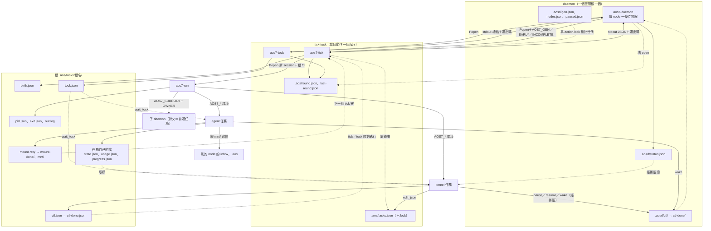
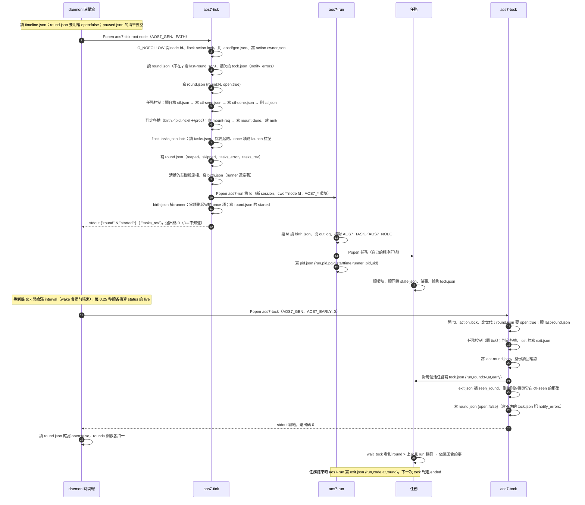

# 四層之間的交接點：daemon、tick-tock、kernel、agent

← [proto7-2](../README.md)｜[spec](../spec.md)｜[核心 spec](../../proto7/spec/core.md)｜[設計原則](../../proto7/notes/principles.md)

**這是一份調查紀錄，不是決定。** 對象是 proto7-2（commit 6ed9a7a7 的 spec 與程式）；kernel、agent 在 proto7-2 還沒做，那兩層拿 proto7-1 的實作當參考，看它們接到 proto7-2 的介面上會怎樣。只記不修。

> 2026-10-10 註：調查之後，kernel 任務包已在 10-09 做成 [packs/kernel/](../packs/kernel/README.md)；本文與分檔裡「proto7-2 還沒有 kernel」說的是 6ed9a7a7 當時。

## 摘要

1. 四層之間全部靠**檔案、環境變數、程序呼叫、退出碼**交接，沒有任何常駐連線；每一個交接點都是通用的，daemon／tick 裡**沒有只為 agent／LLM 的東西**，設計原則第 5 條目前守得住。
2. 只為 agent／LLM 的交接（`progress.json` 的 `llm_since`、`roster.json`、`agent.json`、token 預算）全在 kernel 層自己的約定裡，核心看不懂也不用懂。
3. daemon ↔ tick-tock 最硬：世代、action.lock、三態退出碼都是強制的；tick-tock ↔ 任務只有六個入口（tasks.json、ctl.json、mount-req、環境變數、tock.json、槽裡的檔），其中「只碰給的資料夾」「改表要拿鎖」都是合作式。
4. 請求的延遲：daemon 控制檔約 20 ms 收件，`wake` 約 20 ms 開新回合，pause 要等本回合收完，改 tasks.json／任務控制要等下一個 tick 或 tock（2 秒 interval 實測 1.5～1.7 秒）。
5. 最大的弱點在**控制請求的回饋**：daemon 控制檔沒有請求 id、同名蓋掉；任務 ctl.json 一槽一份會互蓋；pause 期間任務控制與 tock 都停。
6. 實驗確認三個介面缺口：tasks.json 壞掉時寫入工具會把它換成只剩新項；tick 的非 3 失敗被算成一回合、吃掉 `resume --rounds`；父 kill 子 daemon 時子任務會變孤兒。
7. proto7-1 的 kernel／agent 不能直接搬：import 不到、status 欄位改名、用量格式有三種說法、以 tid 記「已下過指令」在槽重用下會卡死。

## 分檔

| 檔 | 內容 |
|---|---|
| [01 daemon ↔ tick-tock](layer-interfaces/01-daemon-ticktock.md) | 程序呼叫、AOS7_GEN／EARLY／INCOMPLETE、stdout、退出碼、round.json、世代與 action.lock、故障怎麼往上傳、延遲 |
| [02 tick-tock ↔ 任務](layer-interfaces/02-ticktock-task.md) | tasks.json、槽、birth／pid／exit、環境變數、tock.json、ctl.json、掛載；任務卡住對回合的影響、下層故障時任務看到什麼、延遲 |
| [03 kernel ↔ agent](layer-interfaces/03-kernel-agent.md) | proto7-1 的 progress／usage／roster／信箱；接到 proto7-2 時哪些直接可用、哪些要改；往後的方向會接在哪裡 |
| [04 跨層](layer-interfaces/04-cross-layer.md) | kernel → daemon 控制檔、agent → daemon、子 daemon ↔ 父時間線、任務 ↔ 任務經掛載 |
| [05 缺口與風險](layer-interfaces/05-gaps.md) | G1～G19，附檔名與行號 |

## 全體交接圖

實線是寫，虛線是讀；方框外的字是交接的東西。

## 一個回合內的時序

固定 interval（`early_tock: false`）、node 上有一個常駐任務的正常回合。

## 通用 vs 只為 agent／LLM

照設計原則第 5 條，對每個交接點問「只方便 agent／LLM，還是同樣惠及其他需求」。

| 類別 | 交接點 |
|---|---|
| **通用（核心）** | 01、02、04 的所有交接點：程序呼叫、AOS7_* 環境、退出碼、round／last-round、tasks.json 全部欄位（含 `until_round`、`retry_lost`、`early_tock`）、槽與 run、tock.json、ctl.json、掛載、daemon 控制檔、status、子 daemon 所有權 |
| **通用（kernel 層約定）** | `progress.json` 的進度欄、`usage.json` 的格式（任何可數資源）、信箱與信件、`kernel.json` 的 `stuck_rounds`、`max_age`、`members` |
| **只為 agent／LLM（kernel 層約定）** | `progress.json` 的 `llm_since`、`kernel.json` 的 `llm_stuck_rounds` 與 token 預算、`roster.json`、`agent.json`、`llm.jsonl` |
| **動機來自 LLM、但機制通用** | S-01「用 JSON、LLM 讀得懂」、`wake` 提前結束回合（為了寄信延遲）、`until_round`（為了分配者掛掉時使用權到期）、`retry_lost`（為了付費工作） |

## 實驗

在 scratchpad 暫存目錄跑，跑完收程序、刪目錄，沒有動 repo。

| 實驗 | 結果 | 記在 |
|---|---|---|
| tasks.json 寫壞後跑 `aos7-ctl add` | 原本的項目不見，只剩新加的一項 | [G1](layer-interfaces/05-gaps.md) |
| `.aos/` 設唯讀，下 `resume --rounds 3` | 只真跑 1 回合，倒數被兩次失敗的 tick 吃掉，node 被 pause 回去 | [G2](layer-interfaces/05-gaps.md) |
| 子 node 有兩個不理 SIGTERM 的任務，父表拿掉子 daemon 那項再 kill | 子 daemon 死了，兩個子任務留下 | [G3](layer-interfaces/05-gaps.md) |
| 2 秒 interval 量延遲 | wake → 任務收到 tock.json 15～25 ms；加 once 項 → birth.json 1.5 秒；ctl kill → 回條 1.7 秒；pause → 回條 5 ms、status 變 paused 2.0 秒 | [01](layer-interfaces/01-daemon-ticktock.md)、[02](layer-interfaces/02-ticktock-task.md) |

## 最值得注意的五件事

1. **tasks.json 是 kernel 接上後最常寫的檔，而寫入路徑沒有照三態。** 表壞掉（半寫、讀不到、被換成 FIFO）時，`aos7-ctl add`、restart、`retry_lost` 都會把整份表換成只剩新項，人寫的項目無聲消失（G1，已實驗）。讀表那一側早就照三態了，寫的這一側漏了。
2. **控制請求沒有完整的回饋。** daemon 控制檔沒有請求 id、回條同名蓋掉、`ok` 只表示「接受」；任務 ctl.json 一個槽一份、後寫蓋前寫；restart 等不到表鎖會消耗掉請求。kernel 要知道「我下的指令生效了沒」，只能自己對 status、`ctl_id`、`tasks_rev`（G4、G7、G12）。
3. **pause 是時間線的開關，不是任務的開關。** pause 之後任務照跑、照花錢，但收不到 tock、任務控制不執行、加掛不審；kernel 不能「先 pause 止血再 kill」，也不能 pause 自己的 node。`resume --rounds N` 數的是 daemon 以為關上的回合，連失敗的 tick 也算進去（G2、G6）。
4. **子 daemon 的收尾靠合作。** 父給 1 秒寬限就 SIGKILL，子 daemon 來不及收自己的任務，子任務變孤兒；父不再要那個子空間時就永遠沒人收（G3，已實驗）。同時父 node 的 pause 停不了子空間的回合。
5. **proto7-1 的 kernel／agent 不能直接搬過來。** 要改的不只是 import：status 的 `paused` 變 `paused_by`、`issued` 要改用 run id、daemon 控制檔要用固定檔名加 owner，而用量 usage.json 有三種互相矛盾的說法要先定（G5、G16）。另外任務環境整份繼承 daemon，「只有分配者拿得到 LLM key」目前做不到（G8）。
