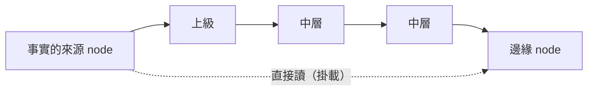

# 事實的傳遞（分散式）與時間確定性（RTOS）：使用者想法，2026-10-04

← [proto7](../README.md)｜[核心 spec](../spec/core.md)｜同日：[LLM 端點是一種資源](2026-10-04-llm-endpoint-resource.md)

**前半是使用者口述，照原意整理；後半是頂層的對照與待定點，不是決定。**

## 使用者原意

### 分散式
- **備援（某台機器掛掉時迅速接手）**：可選，**先不考慮**。
- **關注的是事實的傳遞**。攤子愈鋪愈大，邊緣的 node 跟中心的 node 之間，資料交換會有延遲。
  - 雖然都在同一台電腦、掛載同一個資料夾就能馬上共享，但問題在於：如果一個 node 吃資料時**一律只吃上級傳來的**，一層傳一層，**延遲和錯誤**會接踵而來。
  - 處理資料時如果還會用到 LLM，情況更糟。
- **時間**這塊很值得參考。

### RTOS
- 最重要的是**時間確定性**，沒什麼好說的：**kernel 多做一些選項乃至 module** 就好（不進核心）。

上面那條是「一層傳一層」：每一跳加延遲；跳上有 LLM 時，每一跳還可能改寫、漏掉、編造。下面虛線是同一台機器上本來就做得到的直接讀。

## 頂層對照

- **問題的本質是「傳話遊戲」**：失真來自中繼，不是來自距離。同一台電腦上，讀任何掛載進來的資料夾都一樣快；慢與錯是因為**經過中間人**，尤其中間人是 LLM、會摘要與改寫。所以重點不是加速傳輸，而是**讓事實帶著出處，讓需要的人可以回頭找來源**。
- **事實要帶出處與時間戳**：一份事實至少帶「誰產生（node、任務、run）」與「在它自己的時間線上是第幾回合」。上級轉手時，保留原出處，再加上自己的轉手紀錄；經 LLM 摘要的，標明是摘要。邊緣 node 就能判斷：這是原話還是轉述、多舊了，要不要繞過上級直接讀來源（掛載，S-23）。
- **「只吃上級的」是組織選擇，不是基礎設施限制**：掛載本來就允許直接讀，所以這是 kernel 或團隊層的規則（誰可以掛誰），不用改核心。核心要做的只是讓「事實帶出處」容易做、成本低。
- **時間的參考：邏輯時鐘**。不同 node（甚至不同子 daemon）節拍不同，牆鐘不可靠也不在核心約定裡。分散式系統用 Lamport 時鐘、向量時鐘表達「誰先誰後、誰看過誰」。aos 天然有每條時間線的回合數，事實戳記成 `(node, 回合)`，轉手時帶上「我看到的來源是第幾回合」，就能判斷新舊與因果，不必依賴牆鐘。
- **延遲還有一半在「多快看到」**：資料寫進去後，讀的 node 要等到下一回合才會看到。這是第三波探針的事件喚醒（N-83）與 P2-01「wake 提前結束回合」要解的問題。
- **RTOS 的時間確定性**：同意放 kernel 選項或 module。核心只需要不擋路：節拍要準（固定 interval 已是預設），tick／tock 的耗時要量得到（status 已有），kernel 才能在上面做截止時間排程、執行時間預算之類的保證。

## 待定點（之後再定；糾結的做成選項）

1. **出處要做成核心約定，還是 kernel 層慣例？** 例如「凡是給別人讀的事實檔，都帶 `src`（node、任務、run、回合）」——核心只寫約定、不檢查，比較貼近「核心極簡」。
2. **轉手鏈要記多深？** 全鏈都記，最清楚但會變大；只記原出處加最後一手，比較省。
3. **LLM 摘要過的事實怎麼標？** 只標「這是摘要」，還是附上原文的位置，讓讀的人能回頭對？
4. **跨子 daemon 的回合怎麼比？** 父子節拍不同時，`(node, 回合)` 只能在同一條時間線內比先後；跨線要靠「我看到你的第幾回合」這種向量式紀錄。

## 下一步

交給正在做思想擴充的 Fable 與 astra 一併想（跟 LLM 資源那份放在一起：使用權與帳也是一種要傳遞的事實）。之後的探針可以加一條：多層團隊裡，邊緣 node 只吃上級轉述 vs. 帶出處、可以直接讀來源，比較延遲與失真（假 LLM 後端模擬摘要失真）。
