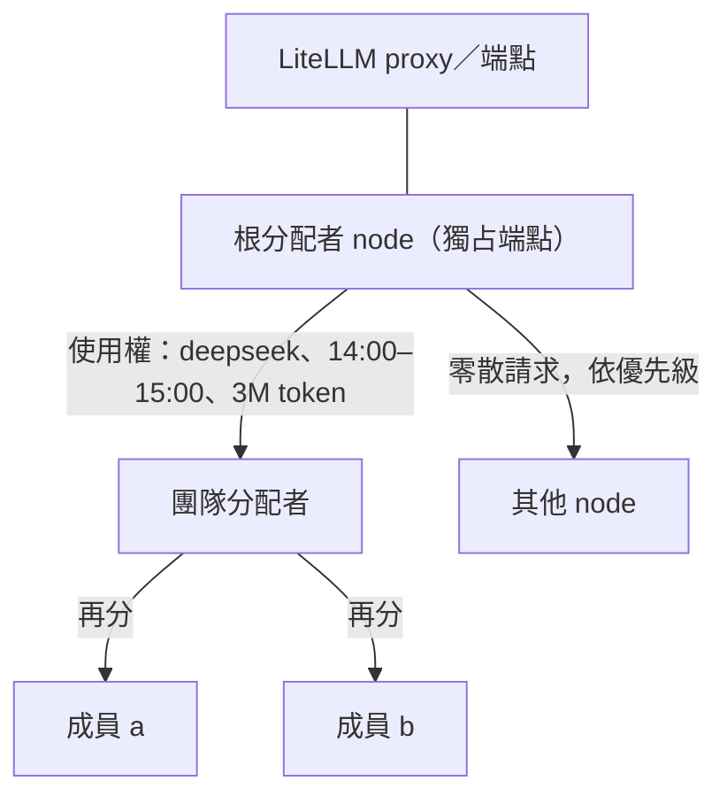

# LLM 端點是一種資源（使用者想法，2026-10-04）

← [proto7](../README.md)｜[核心 spec](../spec/core.md)｜上一份：[分層想法](2026-10-03-aos-layering.md)

**前半是使用者口述，照原意整理；後半是頂層的對照與待定點，不是決定。**

## 使用者原意

使用者說這就是核心思想裡「**資源可以無限定義**」的例子（S-17；分層想法第 35、68 行）。

- LLM 呼叫端點是一種資源。
- **最低等級**：大家各自打 API 到 LiteLLM proxy。
- **高一點**：開一個 node 專門**獨占**特定端點（甚至整個 LiteLLM proxy），從其他 node 收請求，照請求的優先級分配。
- **再往上包裝**：一個團隊向 LLM 分配者拿到一份使用權，例如「下午兩點到三點，deepseek 端點，額度三百萬 token」；團隊自己的分配者再收團隊內的請求，把這份使用權往下分。

## 頂層對照（跟現有東西的關係）

- **分層**：分配者就是 kernel 角色（做資源管理、排程，S-16），一個 node 上的普通 keep 任務。請求與回覆走掛載（S-23）的信箱；daemon／tick 不用認識「LLM」。
- **使用權＝可往下切的配額**：子使用權必須落在父使用權之內（時間窗是子集、額度不超過剩餘）。這就是 astra 調查裡的階層排程、seL4 MCS 的預算下放、resource container（[其他 OS 調查](../../proto7-1/notes/research/2026-10-03-other-os-borrow.md)），以及 proto7-1 的 hsched 探針「慢策略、快執行」。
- **帳**：每筆用量要記到「哪個使用權、哪個任務的哪一次 run」——跟 proto7-2 spec §8「用量以 run 為單位」同一套。

## 待定點（之後做探針時再定；糾結的做成選項）

1. **時間窗用牆鐘還是回合？** 使用者的例子是「兩點到三點」（牆鐘），但核心約定邏輯不依賴牆鐘（S-01 的 `at` 只給人看）。可能兩種都支援：使用權寫 `until` 牆鐘或 `rounds`。
2. **誰強制？** 照現在的合作式協定，成員也能繞過分配者直接打 proxy。真要強制，強制點只能在端點那一端：只有根分配者拿得到真的 key；或由根分配者替每份使用權開 LiteLLM 的 virtual key（LiteLLM 支援 key 帶預算、速率上限與期限，能不能精確用 token 數當額度要再查）。
3. **用不完、提早歸還、收回**：時間窗到了剩下的額度作廢，還是還給上層？上層能不能中途收回？
4. **優先級與搶占**：高優先請求來了，正在用的低優先能不能被打斷？
5. **等待的代價**：請求進信箱後分配者要多快看到——對應第三波的事件喚醒需求（N-83），以及 P2-01 定下的「wake 提前結束回合」。

## 下一步

proto7-2 第二輪回歸收完後，做一個離線探針（假 LLM 後端，不打真模型）：根分配者＋團隊分配者＋成員，驗使用權往下切、額度記帳、時間窗到期、優先級，看 daemon／tick 缺什麼。
