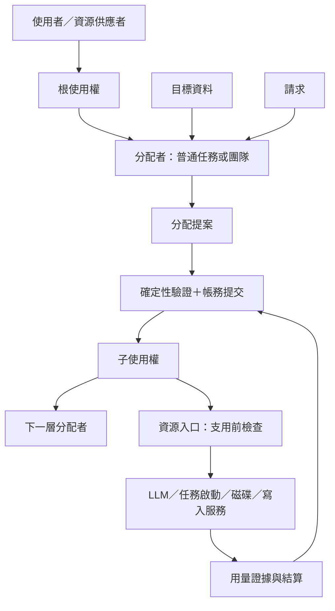

← [綜合](2026-10-04-r1-synthesis.md)

> 來源：astra（codex）對 [LLM 端點是一種資源](../2026-10-04-llm-endpoint-resource.md) 的獨立思考報告（第一輪，2026-10-04），原樣收錄，內文未改（只把四個本機絕對路徑連結改成相對路徑，讓 wf-lint 認得）。

# 思考報告：可遞迴的資源分配，與可以保持極簡的核心

這個構想可以收斂成一個很小的共同結構：

> **分配者拿著有限的使用權，依照目標處理請求；算法提出方案，帳本與資源入口確認方案能不能成立。分配者也可以把部分使用權交給下一層，讓下一層自行選擇目標與算法。**

「無限」應該放在**可定義的資源種類、目標與算法**；每一次實際運作仍有有限的授權、成本與責任。這樣才能持續擴充，又不要求 daemon 理解每種資源。

最值得補進原構想的三個區分是：

- **使用上限、競爭份額、供應保證是不同的東西。**「最多用 3M token」不代表一定能在一小時內取得 3M token。
- **共用的是協定與檢查流程，各種資源保留自己的切分規則。**磁碟容量、API 次數、檔案寫入權與人的注意力，不能全部照 token 記帳。
- **複製分配團隊可以複製能力，不能順便複製財產與授權。**

以下是設計提案，不是已定規格。本次只讀文件與查證資料，沒有修改檔案、執行探針或呼叫真模型。

## 1. 先確認既有基礎，避免建立在錯誤前提上

既有探針已提供很有用的起點，但有三項界線必須保留：

1. **慢策略、快執行的協定可行，尚未證明 LLM 慢策略划算。**`hsched` 的驗證器、退路與閘門守住了限制；但該工作軌跡中，手調的確定性策略仍優於 LLM 策略。這支持「保留算法插槽」，不支持預設每個分配者都應使用 LLM。[hsched 結論](../../../proto7-1/probes/hsched/README.md)

2. **帳務守恆不代表授權正確。**`ledger` 已驗到重送、保留額、結算與崩潰恢復；也實際驗到別的任務冒充執行者，花掉外洩的 grant。帳沒有算錯，花錢的人卻不對。[ledger 結果](../../../proto7-1/probes/ledger/README.md)

3. **目前 proto7-2 的用量是取樣下界。**§8 明確接受漏掉最後一段用量；§9 歷史 module 也可能漏資料。因此精確配額必須靠支用前的預留與支用後的結算，不能靠加快讀取 `usage.json` 解決。此外，資源筆記提到 wake 提前結束回合，但目前 spec §2.1／§2.3 仍寫回合中 wake 無效，兩份文件尚未對齊。[proto7-2 spec](../../../proto7-2/spec.md)

## 2. 最小概念模型：七個名詞，不必變成七套系統

| 概念 | 最小意思 | 不應混入的意思 |
|---|---|---|
| 資源 | 某些操作受到限制，限制由誰管理、如何計量 | 不一定是一個可相加的數量 |
| 使用權 `grant` | 某持有人，在指定條件下可以使用或轉授資源 | 不自動代表供應保證；有期限的 grant 可稱 lease |
| 請求 | 想取得使用權，或用既有使用權做一件事 | 請求者寫的需求、優先級與付款者不是授權 |
| 帳 `ledger` | 已分出、已預留、已使用、已歸還及結果未知的事實 | 不是任務自行回報的統計總和 |
| 優化目標 | 如何判斷可行方案哪個比較好 | 不能取代權限與資源限制 |
| 分配算法 | 根據請求、目標與現況產生方案 | 算法的輸出尚未是有效使用權 |
| 分配者 | 執行上述工作的普通任務或團隊 | 不需要是 daemon 的特殊物件 |

從實作形狀看，主要是**資料契約，加上一組普通任務**。分配者可以從十行規則成長為一棵團隊；對外仍收同樣的請求、交同樣的回覆。



這裡有一條重要界線：**LLM 可以決定想怎麼分，但不能用修改 JSON 的方式讓額度憑空增加。**

### 共用的骨架，放在 kernel 層

建議共用：

- 使用權的來源、持有人、期限、轉授與撤銷格式。
- 請求／回覆、識別碼、重送與版本規則。
- 帳務交易、支用預留、結算與未知狀態。
- 提案驗證、錯誤理由、確定性退路。
- 資源型別的接合介面。

每種資源的 module 至少說清楚五件事：

1. 怎樣縮小使用權。
2. 哪些使用權可以組合。
3. 什麼條件下准許支用。
4. 使用量由誰量、量的是什麼。
5. 怎樣結算、釋放或歸還。

這套骨架可以是共用函式庫與協定，**不必是一個所有部署都必開的大型 kernel 程序**。

各團隊自由替換的部分則是：目標、排序、估價、分工、學習方式，以及分配者究竟是規則、LLM、專職 agent 或團隊。

### 「無限可定義」的真正檢驗

| 資源 | 使用權可以長怎樣 | 特有規則 |
|---|---|---|
| 磁碟容量 | 某資料區最多使用 10 GiB | 是同時占用容量；到期不代表檔案消失，也不代表容量已釋放 |
| 外部 API | 本月 10,000 次、每分鐘 60 次、在途最多 4 次 | 總次數、速率、並行量是三個限制 |
| 某檔案的寫入權 | 在版本 18 上提交一次更新 | 不相容的寫者不能同時提交；不能任意切成「0.3 份寫入權」 |
| 人類審查時間 | 明天下午預約兩個各 20 分鐘的審查時段 | 能管理預約、接單與通知；不能保證人真的投入心力 |
| GPU | 一張指定 GPU 的占用時段，另有記憶體上限 | 裝置可能不可切；程序失聯不代表裝置已可重新分配 |

這些都能共用 grant、request、ledger 的外殼，卻有不同的資源代數。

因此，「無限可定義」不應理解為萬用欄位接受任何文字就算完成；而是**新增一種資源時，補上該種類的規則，不必修改 daemon**。不認識的型別或規則版本應拒絕處理，不能猜。

### LLM 分配與任務排程怎麼統一

兩者都可以表示成：

> 什麼工作，在什麼條件下，可以取得多少使用機會。

但任務排程要說清楚分配的是哪一種機會：

- 啟動一次任務。
- 占用一個並行槽。
- 允許時間線前進 N 回合。
- 在指定回合邊界要求 kill／restart。

它們不是同一種資源。尤其 `resume rounds:N` 不是保證執行 N 次模型呼叫，`pause` 也不停止已經跑著的任務。共用框架可以成立，資源名稱仍須精確。

## 3. 使用權的代數：可以縮小、組合、歸還，但不能洗掉限制

用 `g ≼ p` 表示：「子使用權 g 所允許的一切，都在父使用權 p 之內。」

這個關係至少包含：

- 資源與操作範圍沒有擴大。
- 使用期間沒有擴大。
- 數量、速率與同時占用限制都成立。
- 可转授的對象、深度與撤銷條件沒有被放寬。
- 子權利確實從父帳切出，而不是只有兩份看起來相容的檔案。

### 3.1 數量：切出去的不能留在原地再花

對有限消耗型額度，可以用以下全樹不變式：

```text
根供給總額
＝唯一計數的已使用額
＋在途預留額
＋所有節點目前各自持有的可用額
＋已退回根供給之外或已失效的額
```

上層畫面可以另外顯示「委派到子樹的未用額」，但那是子樹餘額的彙總，不能再當一份錢相加。

例如根有 3M token：

- 分給 A：1M。
- 分給 B：1.5M。
- 根保留：0.5M。

A 再分給兩個成員 0.4M、0.5M，A 自留 0.1M。整棵樹仍只有 3M；不能把 A 的 1M 與兩個成員的額度再次相加。

**委派移動支用權，沒有產生消耗；執行才產生消耗。**

### 3.2 時間：切窗不會複製總額

時間窗建議用半開區間 `[開始, 結束)`，避免相鄰窗口都認為自己包含邊界。

父使用權是「14:00–15:00，共 3M token」，可以切成：

- A：14:00–14:30，1M。
- B：14:30–15:00，2M。

不能因兩個窗口不重疊，就各發 3M。只有資源契約明確定義「每個窗口重新補額」時，才存在新的窗口額度；它仍可能受終身總額限制。

對可重用容量則不同：同一個 GPU 可以先借給 A，再借給 B，前提是前一段占用已確實結束。

### 3.3 速率：除了平均速率，還有瞬間突發量

「每秒 100 次」至少還需要知道窗口算法：固定窗口、滑動窗口，或允許短暫突發的 token bucket。

若父 bucket 的補充速率為 `r`、突發容量為 `b`，切成可獨立使用的子 bucket 時，保守做法是：

```text
Σ 子補充速率 ≤ 父補充速率
Σ 子突發容量 ≤ 父突發容量
```

只切速率、不切突發量，可能讓每個孩子同時打一大波，超出父限制。

不同時鐘或窗口起點也不能直接相加。**最簡原型可以讓所有支用仍通過共同祖先閘門**，由它檢查實際聚合流量；之後才考慮完整切出可自治的速率權。

### 3.4 優先級：只能在自己的分配範圍裡排序

優先級不是額度，不能相加。

父層給 A、B 各半份服務機會，A 可以把自己全部機會優先給一名成員；不能因那名成員填了 `priority: 999`，就壓過 B 的全部權利。

因此至少分清：

- **上層服務類別或份額**：由上層授予。
- **團隊內部順序**：由團隊自行決定。
- **跨團隊急件提升**：是額外請求，需要上層接受。

這能避免「每個團隊都把自己的事情標成最高優先」。

### 3.5 合併：先支援共同使用，不急著鑄成一張新票

兩張使用權可以形成一組 bundle，例如「API 額度＋寫入權」。它們共同滿足某個工作，但沒有因此變成同一種資源。

真正合併成單一額度，只適合來源與條件相容的情況：

- 同一資源與量綱。
- 沒有重複計算同一來源。
- 時鐘、期限、撤銷與付款條件相容。
- 舊權利在交易完成後不能再獨立支用。

兩張不同到期日的票，不能合併後一律使用較晚的日期。來自不同父使用權的額度，可以保留為多個來源分項；不必為了統一外觀，抹掉來源鏈。

### 3.6 歸還與撤回：先阻止再花，才把餘額還出去

歸還的安全順序是：

1. 停止該部分的新支用。
2. 確認哪些額度未使用、沒有在途。
3. 原子地移回父帳。
4. 發出回條。

到期或撤銷只能立即禁止未來使用。已送出的 API 呼叫、仍占用的 GPU、結果未知的請求，都不能直接退款。

父使用權若也已過期，剩餘額可以回到帳上供核對，卻不能自動恢復為可支用額。是否能重新發放，取決於根供給的契約。

## 4. 分配者也消耗資源：遞迴要有底，而且要算總帳

每一筆分配工作都應分清四個角色：

- **誰要求分配。**
- **誰執行分配。**
- **替哪件工作分配。**
- **從哪份使用權支付分配成本。**

同一個分配服務替 A、B 服務，不能只因服務程序住在 A 的子樹，就把全部成本算給 A。

### 誰付錢

建議預設：

- 團隊自己的分配成本，由該團隊額度負擔。
- 上層比較多個團隊的成本，由上層管理預算負擔。
- 共用服務另有基本維運預算；逐件服務成本則按請求歸帳。
- 若受益者共同分攤，分攤規則必須在支用前確定。

seL4 MCS 的 scheduling context donation 可借來理解「服務帶著呼叫者的執行預算工作」；但其原生模型是 CPU 排程預算，不能直接當成非同步 token 帳。[seL4 MCS 文件](https://docs.sel4.systems/Tutorials/mcs.html)

### 開銷確實可能吃光資源

假設每層分配者都抽走收到額度的 5%，經過深度 `d`，抵達最底層工作的比例是：

```text
0.95^d
```

20 層後只剩約 36%。若每個分支還要支付固定啟動費，情況可能更差。

所以「每層最多 5%」不夠；還需要**整個祖先帳戶下，所有管理成本合計的上限**。這也是一種普通的資源限制，不必由 daemon 理解。

建議探針先採：

- 全子樹管理支出上限為總額的 5%，作為實驗參數。
- 單次提案另有成本上限。
- 有限的轉授深度與活躍分配者數量。
- 剩餘額度不足以完成最小工作時，停止細分。
- 沒有新資訊、方案沒有實質變化時，不重問 LLM。

### 遞迴的底不是另一個更聰明的分配者

最底層應有不需要 LLM 的准入與退路；最上層則是使用者給定的總預算與目標。

這樣「誰分配分配者的資源」就有答案：由父層預先給一份控制預算。分配者不應為了取得自己的第一筆決策 token，排進自己尚未處理的佇列。

LLM 預算用完時可以繼續使用確定性策略；但確定性服務仍需要執行機會、磁碟與記憶體。控制面也要保留基本資源，不能只保留 token。

## 5. 優化目標：資料化之後，仍要有人定義什麼叫好

「token 最少」若沒有交付條件，最佳答案就是什麼都不做。

目標檔至少要包含：

| 部分 | 要回答的問題 |
|---|---|
| 工作範圍 | 哪些工作算進評估？拒絕與失敗是否也算？ |
| 交付條件 | 什麼叫完成、正確、可以接受？ |
| 硬限制 | 哪些界線不能為了績效突破？ |
| 指標 | 名稱、單位、方向、量測者、評估期間 |
| 比較法 | 指標衝突時怎麼選？ |
| 未知處理 | 尚未驗收、資料不足時怎麼辦？ |
| 管理成本 | 分配、評估與人工補救如何算入？ |

其中，「不得超額」可以由閘門在事前檢查；「答案正確」通常要事後驗收。兩者都可以是必要条件，但可提供的保證不同。

### 多目標先採有順序的比較

初版建議：

1. 先剔除越權、超額或不符合必要条件的方案。
2. 比較主要目標。
3. 主要目標相當時，再比較次要目標。
4. 最後用固定規則或公平輪替處理同分。

例如：

> 先讓必要工作通過驗收；在達成者中找總成本最低；成本相近時選等待較短者。

若使用者尚未決定成本與品質如何交換，就保留多個「各有優勢」的方案，不急著壓成一個分數。加權總分需要共同量尺與權重；不能直接把「正確率 0.9」和「5,000 token」相加。

### 團隊內最優，不一定使上層最優

A 追求正確率，可能把整份預算集中在一題；B 追求完成件數，可能只挑簡單題。兩者都忠於自己的目標，整體仍可能偏離使用者想完成的工作。

因此上層交給子團隊的，除了 grant，還需要**交付契約**：

- 必須服務哪些工作類別。
- 有哪些最低交付要求。
- 哪些成本必須回報。
- 在哪些範圍內可自由取捨。

子團隊的自由存在於這些條件之內，不需要所有團隊共用同一套內部效用函數。

### 「分配算法的分配」確實還是同一個結構

上層可以把各團隊視為不同的服務方案，分配試驗額度，再依成果调整下一期 grant。

但不能只比較「誰平均得分高」：

- 題目難度可能不同。
- 拿到較多額度者可能更容易累積成果。
- 少接困難工作者可能看起來特別有效率。
- 成果驗收可能落後好幾個評估窗口。

更有用的問題是：

> **再給這個團隊一小份額度，預期多取得什麼成果？**

實作上可先用共同工作集、固定評分器與少量探索額度；保留原始指標、樣本量與延遲，不讓分配者只呈交一個自己算的分數。

上層调整應比下層執行慢，單次调整幅度受限；否則父層減額、子層換策略、父層又追著新數字反向调整，可能一直震盪。

這條鏈不必無限上升。頂層評估方式由使用者固定，評估本身也受管理預算限制；沒有足夠新證據就維持現狀。

## 6. 複製與演化：複製一套能力，重新建立一份責任

「團隊＝node 子樹」很適合當部署與管理單位。但應把三種操作分開：

| 操作 | 身分與帳 | 使用權與在途工作 |
|---|---|---|
| 重啟 | 同一實例，接原帳 | 接續既有狀態，核對未結請求 |
| 複製 | 新實例，建立新帳 | 重新申請使用權，不繼承在途 |
| 遷移 | 同一業務實例，轉移管理位置 | 先封住舊入口，再交接權利與未結狀態 |

直接複製整個執行中的資料夾，再同時啟動兩份，容易把重啟誤做成雙重支用。

### 模板與實例的分界

**模板可以包含：**

- node 子樹與任務定義。
- 分配算法、目標格式、預設政策。
- 服務別名與需要的介面版本。
- 初始化程序、測試與已知適用情境。
- 明確允許分享的學習成果。

**實例必須另行建立：**

- 實例識別、跨空間識別範圍。
- 掛載與外部服務綁定。
- grant、憑證、帳與在途請求。
- 執行與時鐘狀態。

這裡不必改掉 S-14 的路徑式 node id。可以由 kernel module 加上空間／部署實例識別，用來限定帳與請求 ID 的有效範圍。

### 改進同步與分支合併

建議預設鎖定模板版本，各實例獨立升版：

1. 比較新版與本地修改。
2. 用既有工作軌跡重播。
3. 通過驗收後更換政策或程式。
4. 若狀態格式改變，另做狀態遷移。

分支合併合的是程式、政策與可分享知識；**兩份帳的餘額不能用檔案合併處理**。在途請求也不能因換服務而重送到新服務，這點已有 `namespace` 探針的直接證據。[namespace 結果](../../../proto7-1/probes/namespace/README.md)

### 四種結構要分開

> 團隊是 node 子樹；使用權形成委派關係；服務依賴可能是圖；付款歸屬跟著每筆請求。

例如同一個審查服務可以替三個團隊工作，不必同時成為三棵團隊子樹的成員。

類比可以幫忙理解，但各有界線：

- **Erlang 監督樹**：借恢復責任與有上限的重啟；監督關係不等於付款或使用權關係。[Erlang 官方文件](https://www.erlang.org/doc/system/sup_princ.html)
- **容器映像／實例**：借模板與運行狀態分離的觀念。
- **生物複製**：借變異、選擇與保留版本；成功的變體仍不能自行擴大授權。
- **市場中的企業**：借成本歸屬、委託與績效比較；營收或競價不能自動取代使用者的目標。

## 7. 強制與信任：真正的邊界在副作用入口

一份 JSON grant 本身不能阻止繞路。

要宣稱「只有授權的人能花這份資源」，至少需要：

1. 無法任意修改的權威帳。
2. 資源入口能驗證的使用資格。
3. 無法繞過的支用路徑。

| 資源 | 可實施控制的位置 | 合作式部署下的限制 |
|---|---|---|
| LLM／外部 API | 持有真 key 的 gateway | 任務另有 key，或能讀取 gateway 憑證，就可繞過 |
| 檔案寫入 | 唯一寫入服務或作業系統權限 | symlink 掛載與宣告寫入範圍不構成隔離 |
| 磁碟容量 | 受控檔案服務或作業系統 quota | 事後掃描與自行回報無法保證事前上限 |
| 人類注意力 | 接單、預約與通知入口 | 能限制送來多少請求，不能強制人的心力 |

因此可以宣告三種不同部署保證：

- **合作式**：各任務自願經閘門，防失誤並保留稽核資料。
- **受控入口**：特定資源只能經服務支用，但不聲稱整個任務環境已隔離。
- **隔離式**：憑證、帳、執行身分與可繞過的通道受到系統保護。

這些是部署的真實性質，不能靠把 `enforcement` 欄位改成 `"hard"` 升級。

### LiteLLM virtual key 能提供什麼

官方文件提供 virtual key 的期限、模型限制、預算及速率設定；預算以金額計，TPM 是每分鐘 token 速率。**不能只靠 `max_budget` 與 `tpm_limit`，就認定已實現「這份使用權終身最多 3M token」**。需要對指定版本、計量方式、並行預留與故障行为另行驗證。[Virtual Keys](https://docs.litellm.ai/docs/proxy/virtual_keys)、[Budgets and Rate Limits](https://docs.litellm.ai/docs/proxy/users)

初版最清楚的路線，是由根 gateway 持有端點 key，kernel grant 再限制 gateway 中的支用。之後可把能對應的限制下放給 virtual key，形成第二道限制。

### 演算法不應跟閘門共享修改權

在合作式原型中，這先是角色分工；有隔離需求時，再變成真正的權限分離：

- 算法寫提案。
- 驗證器讀提案與當前帳。
- 帳本提交交易。
- gateway 查已提交的權利，執行副作用。

同一筆額度的使用必須原子領取。簽章能證明來源，仍不能單獨防止一張票被重複使用；寫了 `executor` 也不等於驗證了執行者。

## 8. 時間：保留發行者的時間，不換算不同節拍

### 8.1 使用權需要指名時間域

建議邏輯期限包含：

```text
空間／時間線識別＋時鐘世代＋邊界定義＋[開始回合, 結束回合)
```

其中邊界要明確，例如以「已確知完成的 tock 回合數」為準。不能只看到 `last-round.json` 已寫出，就推論整個 tock 一定結束；proto7-2 寫總結之後還有收尾步驟。

三種世代也不應混用：

- **daemon 世代**：是哪次 daemon 運行。
- **時鐘世代**：回合序列是否仍是原本那一條。
- **帳務寫入／撤銷世代**：誰能提交新交易、哪些權利已撤回。

daemon 重啟後回合可以接續，已提交 grant 也不一定要失效。

### 8.2 不同節拍之間沒有可靠的回合匯率

父 daemon 每秒一回合、子 daemon 每秒十回合，不代表父十回合永遠等於子一百回合。pause、提前 tock、動作延遲與恢復都會破壞比例。

建議預設：

> 子使用權沿用父使用權的期限域；每次准入由能看到權威時鐘的閘門判斷。

孩子可以用自己的回合安排工作，但不能用自己的回合替父期限續命。

此外，子 daemon 的空間根有邊界，不能假設它能直接掛載父根。部署 module 需要安排跨空間信箱；例如由父任務明示掛載位於子空間內的共同服務信箱，再由根閘門回覆准入結果。這是依目前 spec 可行的推論，應納入探針確認。

只轉送一份時鐘快照不足以保證新鮮度。無法取得有效准入確認時，停止新增支用；既有在途仍可對帳。

### 8.3 「14:00–15:00」仍然可以存在

牆鐘期限由可選的外部時間 adapter 管理：

- 內部排程仍依 tick-tock。
- 外部使用權另受指定時區與實際期限限制。
- gateway 在准入時檢查外部期限。
- 所有適用條件都成立才放行，不把秒數換算成假回合。

到 15:00 禁止的是**新准入**，不代表 14:59 已開始的呼叫一定完成或停止。若還要求「15:00 前完成」，那是另一種供應或截止承諾。

牆鐘回撥不能讓已關閉的窗口重新打開；時間來源不確定時，adapter 要有明確拒絕或保守處理規則。

純邏輯 lease 的時間線停住時，期限也停住，這是定義的直接結果。若某資源不能接受，就同時加外部期限，不暗中修改回合語意。

## 9. 失敗模式與對策

| 失敗模式 | 對策 | 必須保留的界線 |
|---|---|---|
| 飢餓 | 群組份額、等待愈久逐步提升、大工作預留起點 | 沒有可用資源或需求不可行時，不能保證等待上限 |
| 多資源死鎖 | 固定取得順序；或先短期預留整組，全部足夠才開始 | 跨多個權威帳的整組交易需要協調，不能用幾次 rename 假裝原子 |
| 優先級反轉 | 將急迫性有限度傳給真正阻擋急件的依賴者 | 提升排序生不出空槽；必要時還要保留容量 |
| 囤積 | 未啟用保留額上限、短租期、閒置額可撤回或借出 | 已送出的在途額不能視為閒置 |
| 分配者掛掉 | 既有已提交 grant 按契約處理；停止新分配；確定性策略接手 | 帳或權威状态不明時，退路只能停止新支出 |
| 帳不一致 | 單一權威寫入者、交易序號、去重、提交點與重播 | 原子 rename 不等於跨檔交易，也不等於停電耐久 |
| LLM 亂分 | 檢查格式、來源、版本、父界線、當前需求與剩額 | 驗證器可保證不越界，不能保證策略好 |
| 撤銷與歸還競爭 | 先封住新支用，再搬移可歸還額；入口拒絕舊提交 | 撤銷不代表遠端已取消，也不代表不計費 |
| 重啟風暴 | 重啟次數上限、退避、持久化等待年齡與花費 | 重啟不能重置預算或把老工作變成新工作 |
| 資料與請求暴增 | 限佇列、提案大小、活躍 grant 數與保存量 | 無限可定義不代表控制資料可以無限堆積 |

分配者接管時，可以提高**寫入世代**，讓閘門拒絕舊程序的新交易；已提交 grant 是否繼續有效，則按原契約決定。兩件事分開，才能既阻止舊程序亂寫，又不因重啟抹掉合法權利。

另外必須承認外部副作用的界線：provider 若不支援去重與查詢，送出後斷線就可能無法確定是否執行。此時保留 `unknown`，不能承諾「重試一定不會做兩次」。

## 10. 對 daemon／tick 的具體要求

**合作式原型不需要先替 daemon 新增一整套資源子系統。**目前真正欠缺的是上層契約與 module；少數核心改動要等欲提供的保證明確後才成立。

| 能力 | proto7-2 現況 | 建議位置 |
|---|---|---|
| 回合、槽、run、重啟與三態判定 | 已有 | 核心維持可靠語意 |
| grant、父子檢查與資源型別 | 尚無共用協定 | kernel 共用協定／函式庫 |
| 精確額度與在途結算 | `usage.json` 只能提供取樣下界 | ledger＋gateway module |
| 整棵團隊登記 | 逐 node register，可重送 | 部署 module 或 CLI；批次 API 是便利功能 |
| 團隊相對路徑 | 掛載目標相對 daemon root，不等於團隊 root | 模板展開與服務綁定 module |
| 請求／回覆信箱 | 已有檔案與掛載，缺業務協定 | 資源服務共用格式 |
| 跨 daemon 時鐘與服務 | 有空間边界，不能假設共用根 | 跨空間信箱與權威准入 module |
| 事件喚醒 | 回合中 wake 無效，事件式喚醒仍未提供 | 先量延遲；若需要改回合行為，才動核心 |
| 強制身分與不可繞過入口 | 明確不在目前合作式範圍 | 有需求才增加 runner／OS 隔離適配 |

### 整棵登記不必先等核心提供交易

部署 module 可以：

1. 展開模板、建立所有設定。
2. 讓業務入口維持未啟用。
3. 逐一 register，收集回條。
4. 驗證服務與掛載就緒。
5. 發布團隊啟用標記。

這能做到「半套部署不產生業務副作用」。它不等於「所有程序同時出生」；後者若真的必要，才是更強的核心需求。

### 喚醒提示與業務事件分開

信箱中的請求是持久事實；wake 只是請接收者早點看的提示。即使提示遺失，下一次輪詢也應找回請求。

若新增事件喚醒，核心只需處理「某條時間線有待處理工作」及其回合邊界，不需要知道 token、grant 或優先級。不要讓每個資源事件都膨脹成 daemon 專用控制指令。

### 帳的生命週期不依附任務槽

帳、未結請求與業務成果應放在 node 的持久資料區，避開會被清除的槽目錄。帳本可保留事件與快照；保存、壓縮與輪替由 module 管理。

如果要求停電復原，module 還要定義資料落盤、完整交易邊界與損壞尾端的處理。這不要求核心保存每回合歷史。

## 11. 四種檔案的草擬格式

以下是協定草圖，不是現有 aos 指令。範例使用假 LLM 的 token 計量，根額度為 3M；團隊 A 取得其中 1M。

共通約定：

- `schema` 與資源語意版本必須可辨識。
- 請求識別碼限定在實例範圍內；相同 ID、相同內容重送，回原結果。
- 相同 ID 卻帶不同內容，回衝突。
- `caller` 是歸屬資料；合作式模式下不構成身分證明。
- grant 檔描述權利，當前餘額由帳決定。

### 11.1 使用權：`grant.json`

```json
{
  "schema": "aos.grant/1",
  "id": "g-a",
  "parent": "g-root",
  "issuer": {
    "space": "space-root-1",
    "node": "bank"
  },
  "holder": {
    "instance": "team-a-7",
    "node": "teams/a"
  },
  "resource": {
    "id": "mock-endpoint-1",
    "type": "llm-tokens/1",
    "meter": "mock.total-tokens/1"
  },
  "rights": {
    "operations": ["invoke"],
    "total_tokens": 1000000,
    "max_inflight": 2,
    "rate": {
      "kind": "token_bucket",
      "refill_per_round": 20000,
      "burst": 50000
    }
  },
  "validity": {
    "clock": {
      "space": "space-root-1",
      "node": "control",
      "epoch": "timeline-1",
      "boundary": "completed_tock"
    },
    "from": 100,
    "until": 160,
    "applies_to": "new_admission"
  },
  "delegation": {
    "remaining_depth": 3
  },
  "on_expiry": "stop_new_and_settle_inflight",
  "supply_promise": "permission_only",
  "assurance": "cooperative",
  "issued_by_transaction": "tx-42"
}
```

這份 grant 同時有總量、速率與並行限制。它沒有寫「剩餘 1M」，避免使用者把舊檔案中的餘額當成當前事實。

### 11.2 請求：`request.json`

```json
{
  "schema": "aos.resource-request/1",
  "id": "team-a-7:req-17",
  "op": "delegate",
  "caller": {
    "space": "space-root-1",
    "node": "teams/a",
    "slot": "allocator",
    "run": 99
  },
  "parent_grant": "g-root",
  "recipient": {
    "instance": "team-a-7",
    "node": "teams/a"
  },
  "want": {
    "resource": "mock-endpoint-1",
    "total_tokens": 1000000,
    "max_inflight": 2,
    "from": 100,
    "until": 160,
    "clock_ref": "root-control-clock"
  },
  "priority": {
    "domain": "root-admission",
    "requested_class": "batch"
  },
  "objective_ref": "objectives/review-v1.json",
  "expected_ledger_revision": 41,
  "reply_to": "receipts/team-a-7.req-17.json"
}
```

`requested_class` 只是要求，接收者仍要判斷是否有資格。`clock_ref` 由服務契約解析成完整時間域，不由請求者自行換算。

實際呼叫時使用同一種請求外殼，`op` 改為 `reserve`，帶上 `work_id`、`attempt_id`、`grant_id` 與保守用量上界。重送同一次請求沿用 ID；真的重新執行則是新的 attempt，重新判斷是否需要預留。

### 11.3 帳：`ledger.json`

下面用單一 JSON 展示一個檢查點與其後交易；實際可拆成事件檔與快照，對外仍提供可讀 JSON。

```json
{
  "schema": "aos.ledger/1",
  "resource": "mock-endpoint-1",
  "unit": "mock_total_tokens",
  "writer_epoch": 3,
  "checkpoint": {
    "seq": 41,
    "root_supply": 3000000,
    "balances": {
      "g-root.free": 3000000
    }
  },
  "transactions": [
    {
      "seq": 42,
      "id": "tx-42",
      "request_id": "team-a-7:req-17",
      "op": "delegate",
      "transfers": [
        {
          "from": "g-root.free",
          "to": "g-a.free",
          "amount": 1000000
        }
      ]
    },
    {
      "seq": 43,
      "id": "tx-43",
      "request_id": "team-a-7:req-18",
      "op": "reserve",
      "work_id": "review-8",
      "attempt_id": "review-8:a1",
      "transfers": [
        {
          "from": "g-a.free",
          "to": "reservation-18.held",
          "amount": 10000
        }
      ]
    },
    {
      "seq": 44,
      "id": "tx-44",
      "request_id": "team-a-7:req-18-settle",
      "op": "settle",
      "attempt_id": "review-8:a1",
      "evidence": "mock-provider/receipt-18",
      "transfers": [
        {
          "from": "reservation-18.held",
          "to": "g-a.spent",
          "amount": 8000
        },
        {
          "from": "reservation-18.held",
          "to": "g-a.free",
          "amount": 2000
        }
      ]
    }
  ],
  "current": {
    "seq": 44,
    "balances": {
      "g-root.free": 2000000,
      "g-a.free": 992000,
      "g-a.spent": 8000,
      "reservation-18.held": 0
    }
  }
}
```

例子保持：

```text
2,000,000 ＋ 992,000 ＋ 8,000 ＝ 3,000,000
```

若 provider 結果未知，就沒有最後一筆結算，10,000 繼續留在 `held`。`current` 是可重建視圖，不是另一份獨立的帳務真相。

這個數量帳範例不取代速率 bucket、並行占用與撤銷狀態；它們同樣由對應資源 module 維護。

### 11.4 目標：`objective.json`

```json
{
  "schema": "aos.objective/1",
  "id": "review-v1",
  "revision": 1,
  "scope": {
    "work_manifest": "work/required.json",
    "count_rejected_and_failed": true
  },
  "delivery_requirements": [
    {
      "metric": "required_work_completed",
      "equals": true
    },
    {
      "metric": "acceptance_checks_pass",
      "equals": true
    }
  ],
  "preferences": [
    {
      "metric": "total_tokens",
      "direction": "min",
      "includes": ["work", "allocation", "evaluation"]
    },
    {
      "metric": "completion_wait",
      "unit": "root_control_round",
      "direction": "min"
    }
  ],
  "comparison": "lexicographic_after_requirements",
  "evaluation": {
    "service": "mnt/evaluator",
    "suite": "review-suite/1",
    "unknown": "pending"
  },
  "control_budget": {
    "max_tokens": 50000,
    "scope": "entire_descendant_tree"
  },
  "fallback": "deterministic_fair_queue/1"
}
```

這裡的目標是「完成指定且合格的工作之後，總成本越低越好」。若額度不足，應回報不可行與缺口，不能悄悄刪掉困難工作來改善分數。

目標檔只引用管理預算上限；真正支用仍經 grant 與帳，不因這裡寫了 50,000 就多出一筆額度。

## 12. 三個本機離線探針

以下都是待做設計。數字是建議驗收門檻，不是已測結果；所有後端與政策回答均可用預錄資料，不連外、不打真模型。

### 探針一：同一套框架，能否處理不同資源與三層委派

**假設**

共用協定可以支援 token 額度、API 速率及檔案獨占寫權；父子切分、歸還與崩潰不破壞各自的不變式。

**設計**

- 根→團隊→成員三層，固定 seed 產生 1,000 個操作。
- 同時搶最後額度、重送請求、複製 grant、交錯歸還與支用。
- 在提交後回條前、provider 執行後回條前注入崩潰。
- 注入到期但結果未知、舊寫入世代、不同窗口起點及過大突發量。
- 檔案服務另測兩個寫者搶同一版本。
- fake provider 有獨立副作用帳，可供重算；另跑不提供去重的變體。

**成功標準**

- 每個事件前綴都守恆；負額與超限生效都是 0。
- 不相容寫者同時提交成功的次數為 0。
- 超父速率／突發的要求都被拒絕或延後。
- 重送不新增扣帳，未知在途不被釋放。
- 支援去重的 fake provider，同一操作最多執行一次。
- 不支援去重的變體必須暴露 `unknown`，不能假裝提供恰好一次。
- 改用不同資源型別不需修改 daemon／tick。

### 探針二：不同目標、元分配與分配成本是否真的可控

**假設**

同一份資源協定能容納不同目標；管理成本可封頂；策略壞掉或預算用完時，執行仍有退路。

**設計**

- 固定一批具不同成本、品質、期限的假工作。
- 比較固定規則、每件詢問假 LLM、每十回合更新政策三組。
- 假 LLM 的延遲與 token 費用都有帳。
- A 追求必要工作達標後成本最低；B 追求額度內按期合格件數最多。
- 上層每隔一段期間调整配額，加入延遲驗收與只挑簡單題的策略。
- 注入壞 JSON、過期提案、超父額及試圖停止控制者的提案。

**成功標準**

- 所有組共用相同供給與驗收條件，成本包含管理與評估。
- 越權生效為 0；拒絕提案後下一次正常決策機會即使用退路。
- 全子樹管理支出不超過設定的 5%；耗盡後不再呼叫假 LLM。
- 未驗收結果保持待定，不被當成成功或零分。
- 複製更多 worker 不增加根額度或公平份額。
- 上層依共同指標評估，不直接比較兩個團隊自訂的分數。

這個探針驗協定與成本邊界。它不能證明真 LLM 策略品質；量到確定性策略更好，也是一個有效結果。

### 探針三：複製、跨節拍與跨空間部署

**假設**

團隊模板能搬到不同位置與 daemon，且不複製有效授權；跨節拍不需要回合匯率。

**設計**

- 同模板部署 A、B、C，節拍設為 10、70、200 ms。
- 由部署 module 建立跨空間信箱，根閘門判斷准入期限。
- A 有在途工作時複製模板成 C。
- 在逐 node 登記中途停止部署，再重跑。
- 切斷橋接、提供舊時鐘快照、重啟分配者。
- 用可控制的假牆鐘測時間回撥，以及邏輯時間線暫停時外部期限到期。
- 升級其中一個實例的模板，保留舊服務直到在途結清。

**成功標準**

- 模板不含部署絕對路徑；同份模板可在三處完成綁定。
- C 沒有繼承 A 的有效 grant、帳餘額或在途請求。
- 權威期限後新增准入為 0；舊快照不能延長權利。
- 登記未完成前沒有業務副作用；重跑不重複執行已啟用工作。
- 跨團隊串帳為 0；舊在途只在原服務結算。
- 時間回撥不重新開啟已過期窗口。
- 另量請求到准入的延遲分布，據此判斷是否值得修改 wake。

## 13. 最值得你拍板的五個問題

### 1. 第一版的 grant，要承諾到哪裡？

- **A：使用上限與資格。**允許使用，但不保證期限內拿滿。
- **B：同時保證最低供應量或完成期限。**

**推薦 A。**B 需要供應能力、工作上界與保留容量的額外模型；等第一個確實需要保證的資源出現，再增加該種類的契約。

### 2. 跨 daemon 的期限由誰判？

- **A：沿用發行者的時間域，由權威閘門准入；牆鐘另用 adapter。**
- **B：建立全域回合或各 daemon 間的回合換算。**

**推薦 A。**不必同步所有時間線，也不會因調整節拍而改變既有授權。

### 3. 第一階段要提供哪種信任保證？

- **A：合作式任務＋明確的資源閘門與帳。**
- **B：連憑證、帳與執行者身分一起做不可繞過的隔離。**

**推薦原型先 A。**若下一步要宣稱能阻止不受信任任務花真實端點額度，B 就成為該部署的必要條件，不能只靠補欄位完成。

### 4. LLM 分配者是否預設啟用？

- **A：確定性策略為預設，LLM 是可關閉、有預算的慢策略。**
- **B：每個團隊預設由 LLM 做分配。**

**推薦 A。**沿用現有探針證據。未來以相同工作集驗證：在品質、期限與公平條件不惡化下，含管理成本的總成本至少改善 10%，再考慮將特定 LLM 策略設為該場景預設。

### 5. 複製後的團隊如何接收改進？

- **A：實例獨立、鎖定版本，明確升級。**
- **B：本尊一改，複本自動同步。**

**推薦 A。**先讓複製具有穩定含義；B 可以日後做成有回滾與驗收的更新政策，不能連帳與在途狀態一起同步。

## 我最不確定的三件事

1. **共同資源介面究竟能保持多小。**token、容量、互斥寫權很可能能共用目前提出的外殼；人類承諾、不可逆動作、多供應者整組資源，可能迫使契約再分種類。應用不同資源的探針找出邊界，避免提前做出龐大的萬用 schema。

2. **真實端點能提供多完整的用量與副作用證據。**如果無法取得可信用量上界、取消結果或去重能力，嚴格 token cap 與自動恢復都會受到限制。這部分必須按實際 provider 與部署驗證，假後端只能確認協定沒有自相矛盾。

3. **哪種工作值得讓分配團隊持續思考與演化。**目前證據支持確定性執行，尚未證明動態 LLM 策略的淨收益。真正有價值的場景可能是需求語意常變、一次錯配代價很高的工作；能否取得可靠又便宜的成果評估，可能比選哪個分配算法更關鍵。