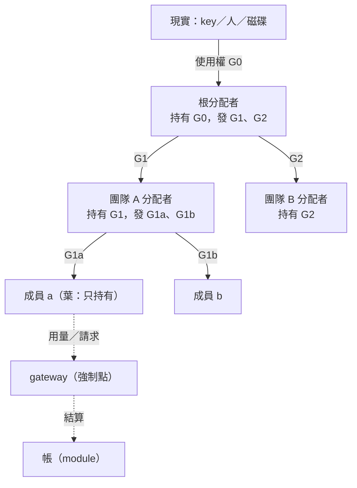

← [綜合](2026-10-04-r1-synthesis.md)

> 來源：Fable 子 agent 對 [LLM 端點是一種資源](../2026-10-04-llm-endpoint-resource.md) 的獨立思考報告（第一輪，2026-10-04），原樣收錄，內文未改。

# 無限的資源、無限的目標、無限的算法——思考報告（Fable）

依據：`proto7/notes/2026-10-04-llm-endpoint-resource.md`、`proto7/notes/2026-10-03-aos-layering.md`、`proto7/spec/core.md`、`proto7-2/spec.md`、兩份調查報告、`hsched`／`ledger`／`namespace` 探針 README。只讀 repo，沒有跑任何模型。

每個推論後面標把握程度：【高】＝從 repo 現有證據或數學上直接得出；【中】＝合理但沒驗證；【低】＝猜測，值得用探針試。

---

## 0. 先講三句最重要的話

1. **「資源」不是用名字定義的，是用「有沒有人站在中間」定義的。** 大家各自打 LiteLLM proxy 的時候，LLM 端點不是 aos 的資源，只是世界的一部分；某個 node 拿走 key、別人只能向它要，那一刻它才變成資源。所以「資源可以無限定義」的白話是：**誰能站到消費者和那樣東西之間，誰就能定義一種資源**。站的位置就是信任邊界（第 5 節）。【高】
2. **kernel 層共用的骨架小到只有「使用權的格式＋子不超出父的檢查＋帳的四個動詞＋信箱」。** 分配算法、優化目標、甚至資源是什麼，全是肉，全可換。而且 proto7-2 現在的 `tasks.json`（`from_round`、`max_live`、`enabled`）、`mounts`、`paused.json` 其實**已經是**三種使用權，只是沒有這樣叫（1.5 節）。【高】
3. **遞迴不會無限上升、也不會無限下降，兩頭都有天然的止點。** 往上止於「誰付真錢」（根的目標是人定的，不是算出來的）；往下止於「這份使用權小到養不起一個分配者」——用 hsched 的實測數字可以算出門檻：**LLM 分配者只該出現在使用權 ≥ 它每次決策成本 100 倍的地方**，再小就必須退回確定性規則（第 2.3 節）。【中，數字取自 hsched】

---

## 1. 最小概念模型

### 1.1 七個詞，只有四個是骨架

| 詞 | 白話 | 骨架／肉 |
|---|---|---|
| **資源（resource）** | 一張「資源卡」：宣告有哪幾個維度、各維度是哪種型別、用哪個時鐘、在哪裡強制、誰說了算（結算權威） | **卡的格式是骨架；卡的內容是肉**（每多一張卡就多一種資源） |
| **使用權（grant／lease）** | 一份檔案：「某資源的某個範圍，在某個窗口內，給某個持有人，來自某個父使用權」 | **骨架**（唯一真正共用的格式） |
| **請求（request）** | 「我想要一份使用權」或「我想用這份使用權做一次事」 | 骨架（格式），內容隨資源 |
| **帳（ledger）** | 使用權的四個動詞的流水：切（split／grant）、佔（reserve／claim）、結（settle）、還（return／revoke） | **骨架**（四個動詞與守恆式），實作是 module |
| **分配者（allocator）** | 一個任務：讀請求、讀自己持有的使用權、讀目標，寫出子使用權 | 肉（可以是規則、LLM、人） |
| **優化目標（goal）** | 一份資料：分配者挑方案時用什麼排序 | 肉 |
| **分配算法** | 分配者的內部邏輯 | 肉，而且**kernel 完全不用看得懂它** |

**關鍵的壓縮**：不要讓 kernel 懂「LLM」「磁碟」「人」，讓 kernel 只懂**五種維度型別**。每一種資源卡只是把這五種型別排列組合。「子不超出父」的檢查對每種型別各寫一次，就能對無限多種資源做檢查。【高】

### 1.2 五種維度型別（這是整個模型的核心）

| 型別 | 例子 | 子使用權的約束（往下切的規則） | 用完會不會回來 |
|---|---|---|---|
| **可消耗、不可回收（consumable）** | token、金額、API 呼叫次數、CPU 秒 | Σ 子的額度 ≤ 父的**剩餘未切出**額度（不是父的總額） | 花了就沒了；沒花完的到期才還 |
| **可消耗、可回收（reclaimable）** | 磁碟 bytes、檔案數、記憶體 | 同上，但允許「釋放」讓額度回到父 | 刪檔就回來 |
| **可重用容量（capacity）** | 並行槽、GPU VRAM、人同時能審幾件 | **任一時刻** Σ 活著的子 ≤ 父（是剖面檢查，不是總和） | 用完就還 |
| **速率（rate）** | tokens/min、req/hour | 同 capacity：任一時刻 Σ 子速率 ≤ 父速率；窗口不重疊的子可以各拿全額 | 每個時刻重新計算 |
| **集合／獨占（set／exclusive）** | 允許的模型清單、哪個端點、某檔案的寫入權（集合大小 1） | 子集合 ⊆ 父集合；獨占的只能整份轉交 | 轉回來就有 |

加上兩個**不是維度、但每份使用權都有**的欄：

- **窗口（window）**：子窗口 ⊆ 父窗口。時鐘要宣告（第 6 節）。
- **優先級（priority）**：**不是資源**，是給父分配者的排序提示；只在同一個父底下有意義，跨父不能比。子的優先級 ≤ 父的（只能降不能升）。【高】

> 「14:00–15:00、deepseek、3M token」＝ 窗口（牆鐘）＋ 集合 {deepseek} ＋ consumable 3M。「獨占整個 proxy 一小時」＝ 窗口 ＋ rate 全額 ＋ 集合全部。兩者是同一張格式。

### 1.3 用五種非 LLM、非 CPU 的資源檢驗

| 資源 | 維度 | 檢驗出來的事 |
|---|---|---|
| **人類審查時間** | capacity（同時待審 ≤ 3 件）＋ rate（每週 10 件）＋ 窗口（牆鐘，上班時間）＋ set（哪幾位審稿人） | (a) 沒有任何強制點，只能事後稽核——「結算」是人寫回條；(b) 窗口**必須**用牆鐘，人活在牆鐘裡；(c) 分配者可以是 LLM（「哪件最值得人看」）——而且這裡 LLM 分配者最有價值，因為被分配的資源比 token 貴幾個數量級 |
| **磁碟（某資料夾的空間）** | reclaimable bytes ＋ 檔案數 | 逼出「可回收」這個型別：帳要有「釋放」而不只是「到期歸還」；守恆式要多一欄 `released`。用量不是只增不減——**跟 proto7-2 §8「usage 只增不減」的假設衝突**，所以 usage 格式要能分「累計消耗」和「現在佔用」兩種 |
| **外部 API 配額（如 GitHub 5000 req/hr）** | rate（供應商的時鐘）＋ 集合（哪些 endpoint） | 窗口的時鐘是**供應商的**，不是我們的回合也不是我們的牆鐘——跨時鐘換算的問題不用等子 daemon 就出現了（第 6 節的答案：不換算，讀對方的鐘） |
| **某檔案的寫入權（例如一份 tasks.json）** | exclusive set，大小 1 | 往下切只能整份轉交；這是最像 capability 的資源；也是**死鎖**唯一真正會發生的地方（兩個團隊各握一個檔等對方）；強制只有 flock 這種合作式 |
| **GPU** | capacity（VRAM bytes）＋ rate（算力份額）＋ 窗口 | 多維同時准入：一個要 4 槽 2000 token、一個要 1 槽 5000 token，總槽只有 5 就放不下——DRF 那類問題出現，但只要「每個維度各自檢查」就能先擋住，不必先懂 DRF |
| **一條時間線的回合（任務排程）** | capacity（node 的槽數 `max_live`）＋ 窗口（`from_round`～`until_round`）＋ set（哪個 node） | **任務排程就是對「回合槽」這個資源發使用權**；tick 是它的強制點（tick 決定誰起），`tasks.json` 就是使用權倉庫。見 1.5 |

結論：五種型別夠用，沒有一個例子需要第六種。【中——只試了六個，但這六個刻意挑得很不像】

### 1.4 兩個角色、一套介面

每個分配者**同時**是兩個角色：對上是持有人（holder），對下是發行者（issuer）。根分配者的「父」是現實世界（那把 key）；成員是只持有、不發行的葉。所以不管在哪一層，一個分配者對外只有三個檔案介面：

```
<分配者根>/
  card.json          ← 服務卡：我分什麼資源、收什麼格式的請求、我的目標是哪份檔
  inbox/requests/    ← 別人丟請求
  grants/<id>.json   ← 我發出去的子使用權（事實來源）
  usage/             ← 持有人回報（或 gateway 代報）的用量
```



「無限遞迴」在實作上就是**同一個角色重複出現**，沒有第二種角色。【高】

### 1.5 proto7-2 其實已經有三種使用權（只是沒這樣叫）

| proto7-2 現有的東西 | 其實是哪種使用權 | 父的界 | 強制點 |
|---|---|---|---|
| `tasks.json` 的一項（`from_round`、`max_live`、`enabled`） | 「在這個 node 的 N 個槽上跑」的 capacity 使用權，窗口從 `from_round` 起 | 沒有（缺 `until_round`，見 8.1） | tick（真的強制：tick 不起就起不了） |
| `mounts`／`mount_allow` | 「看得到哪些路徑」的 set 使用權；`mount_allow` 就是父的界 | `mount_allow` | tick 建 `mnt/`（合作式，沒有 FUSE） |
| `paused.json` 的 owner 清單 | 一種**負使用權**（hold）：持有人可以阻止回合開 | 無 | daemon（真的強制） |

這說明模型不是外加的，是把已有的東西叫對名字。也說明「任務排程也是同一套」在基礎設施層已經成立：**kernel 排程＝寫 tasks.json 這個使用權倉庫，tick＝確定性的執行者**，和「分配者寫 grant、gateway 執行」是同一個形狀。【高】

---

## 2. 遞迴與組合

### 2.1 往下切的代數（每種型別一句話）

- **consumable**：`Σ children ≤ parent.remaining`，其中 `remaining = limit − spent − reserved − delegated_unspent`（ledger 探針的守恆式）。保留（reserve）＝發一份給自己的子使用權。
- **capacity／rate**：是「剖面」約束：對窗口裡每個時刻 t，`Σ_{活著的 child 在 t} ≤ parent`。所以**時間分割是這兩種型別的主要切法**（把一小時切成四個 15 分鐘，每段都能拿全速率）。consumable 不能這樣切。
- **set**：`child ⊆ parent`。獨占集合只能整份轉。
- **窗口**：`child.window ⊆ parent.window`。子不能活得比父久——這一條**讓所有子使用權在父到期時自動失效**，是後面很多失敗模式的解藥。
- **優先級**：`child.priority ≤ parent.priority`，且跨父不可比。

**合併（merge）**：只有同一持有人、同一父、窗口相鄰或重疊的使用權可以合併；合併後的額度＝兩者剩餘之和，窗口＝聯集。跨持有人合併＝先還再切，不要偷做。【高】

**歸還（return）** 分三種，帳上要分欄：
1. **明示歸還**：持有人說「剩下的不要了」→ 回父的 `remaining`。
2. **到期歸還**：窗口結束，`unspent` 自動回父（推薦預設，見第 10 節 Q5）。
3. **在途未知**：已 claim、供應商沒回條 → **不能歸還**，留在 `reserved` 直到有證據（ledger 探針第 5 步已驗）。這一條是「核心三態判定」的帳本版：不知道就不動。

### 2.2 分配者自己花誰的錢

三個選項：
- (a) **算在它正在分的那份使用權裡**（envelope 研究的 `policy_cost_included_in_total`）。好處：自我限制——分配者再怎麼浪費也花不過它手上那份；父不用另外管。壞處：團隊的「可用額度」比看起來少。
- (b) 父另開一筆 overhead 帳給它。好處：團隊額度乾淨。壞處：多一種帳、多一個可以被吃光的東西，而且父要猜 overhead 多少。
- (c) 分配者自己的 node 自己付（它另外持有一份使用權）。這其實是 (b) 的變形。

**推薦 (a)，加一條硬規則：overhead 比率上限寫在使用權裡**（例如 `allocator_cost_cap: 0.05`，超過 gateway 直接拒它的分配呼叫、分配者退回確定性規則）。【中】

### 2.3 分配開銷會不會吃光資源？會，而且算得出在哪一層開始吃

設一份使用權 G，每層 LLM 分配者每次決策花 c 個 token，一個窗口內決策 k 次，每層抽走比率 f = k·c / G_層。往下 d 層後剩 G·(1−f)^d。

用 hsched 的實測：D 組 100 回合 8 次政策呼叫花約 9300 token，工作本身 76450 token → **f ≈ 12%**，這就是 D 在「每萬 token 合格數」輸給免費規則的全部原因。反過來算：要讓 f ≤ 5%，**G 必須 ≥ 20 × k × c**；k＝5 時 G ≥ 100 c。以每次決策 1～2k token 計，LLM 分配者的最小合理使用權約 **10 萬～20 萬 token**；再往下（成員級的幾萬 token）必須是規則，不能是 LLM。【中——比例取自單一 trace】

這給遞迴一個**自然的終止條件**：`G_層 < min_llm_grant` 時，這一層的分配者**必須**是確定性規則（FIFO、等分、stride），不准再問 LLM。寫進資源卡或使用權（`min_bundle`）即可，不需要另外規定「最多幾層」。另外三個終止條件一起用：
- `max_depth`（charge-context 提案已有）——人可讀的保險。
- **延遲**：每層 LLM 加 2～5 回合落後（hsched 實測），三層就是 15 回合；窗口 1 小時沒差，窗口 20 回合就不行。所以**窗口越短、允許的 LLM 層數越少**。
- **不可再分**：`min_bundle` 以下的使用權不再往下切，直接給一個成員用。

另一個別人不容易想到的點：**分配者的開銷應該跟「決策次數」掛鉤，不是跟「成員數」掛鉤**。團隊從 3 人擴到 10 人（hsched 的 P 擴編）時，分配者如果每個請求問一次 LLM，開銷隨成員線性長；如果像 D 組那樣只在事件時提政策，開銷幾乎不變。所以「LLM 直接決定每一筆」（使用者說的團隊 A 做法）只能在很小、很便宜的團隊用，而且要用「最簡方案」這種便宜 prompt；團隊一大就該變成「LLM 提政策、規則執行」。【高，hsched 的 C 對 D 就是這兩種的對照】

---

## 3. 優化目標

### 3.1 目標怎麼寫成資料

不要寫成一個加權分數（兩份調查都反對把多維壓成一個數，理由是看不出取捨）。寫成**先硬後軟、由上到下的排序**，LLM 和人都讀得懂：

```json
{
  "schema": "aos.goal.v1",
  "owner": "team-b",
  "hard": [
    {"metric": "within_grant", "op": "==", "value": true},
    {"metric": "oldest_wait_rounds", "op": "<=", "value": 6}
  ],
  "soft": [
    {"metric": "accepted_ratio", "dir": "max", "weight": 1.0},
    {"metric": "tokens_per_accepted", "dir": "min", "weight": 0.3}
  ],
  "accept": {"by": "review.json", "rubric": "operator-can-explain-next-action-v2"},
  "horizon": {"clock": {"kind": "round", "node": "team-b"}, "window": 20},
  "why": "正確率優先，省 token 其次；超過 6 回合沒處理算失敗"
}
```

- `hard` 是過濾器：不滿足的方案直接不考慮（對應 linux 報告 §8.2 的決策順序前兩步）。
- `soft` 是排序，`weight` 只在同一份 goal 內有意義，**不跨團隊比較**。
- `accept` 指向「誰說做對了」——沒有這一欄，任何「正確率」目標都會被 Goodhart（下一節）。

### 3.2 多目標衝突、能不能比較

**同一個分配者內**：衝突靠 hard→soft 順序解決；兩個 soft 打架時 weight 決定，而且 LLM 可以在 `why` 解釋這次為什麼偏向哪邊。

**不同團隊之間**：**不能比，也不該比**。團隊 A 的「token 最少」和團隊 B 的「正確率」是兩種單位。能比的只有一件事：**父的目標**。父看兩個團隊時，用父自己的 metric（例如「每萬 token 父驗收通過的件數」）去看，完全不管子團隊自己宣稱什麼目標。這就是「目標只在發它的那一層有意義」——跟優先級一樣的規則。【高】

### 3.3 「分配算法的分配」：是同一層結構，但有兩個止點和一個陷阱

是同一個結構：資源＝「使用權本身」，子＝各團隊的分配者，父的算法＝「照成效調配額」。這是 feedback control（調查 §7.4）那一類，不是又一個 LLM 每回合評分。

**為什麼不會無限上升**：
1. 根的目標不是算出來的，是**付錢的人**寫的。往上到「誰持有 key／誰付帳單」就停了，那一層的目標是外生的。
2. 評估需要觀測，觀測有成本（讀帳、跑驗收）；每往上一層，要觀測的子樹大一倍、訊號弱一倍。到某一層評估成本超過調整帶來的收益，就沒人願意再開一層。

**陷阱（這是我最想提醒的）**：hsched 裡各組差距是幾個百分點（合格 69 vs 71 vs 73），而真模型三次重跑之間自己就差 2 件。**用成效評估分配者，在現實規模下訊號很可能被雜訊淹沒**，上層照這種訊號調配額會變成亂調。對策：
- 只在**同一份工作（replay 同 trace）**或**長窗口、多次樣本**下比較；
- 每個窗口最多調一格（`max_change_per_window`），而且要連續兩個窗口同方向才動（feedback 提案的 `minimum_settle_windows`）；
- 父評估子分配者的第一指標是**守規矩**（越權 0、按時回報、沒有在途未知堆積），第二才是成效。守規矩是確定性可驗的，成效不是。
- **Goodhart**：團隊知道被看「每萬 token 完成數」，就會挑簡單的做。所以 `accept` 必須由**父或父指定的評審**寫，不由團隊自評（linux 報告 §8.4 的 review.json 就是這個用途）。【高】

---

## 4. 複製與演化

### 4.1 複製的是什麼、不是什麼

一個團隊＝一棵 node 子樹。把它拆成三層：

| 層 | 內容 | 複製時 |
|---|---|---|
| **模板（code）** | 分配者程式、goal 的預設、tasks.json 的形狀、card.json | **複製或共用** |
| **身分（identity）** | node id、owner.json、它持有的使用權 | **一律重發**：新 id、新 owner、**零使用權**（父重新發） |
| **狀態（state）** | 帳、slot 裡的 state.json、in-flight 請求 | **一律清空** |

最重要的一條：**使用權不可複製**。複製使用權＝雙重花費（ledger 探針第 6 步「洩漏的 grant 被別人花掉」就是這個的前身）。所以複製工具必須強制剝掉 `grants/`、`usage/`、帳；複製出來的團隊是個「有能力但沒錢」的空殼，等父給它一份新的使用權才活。這也順便回答待定點 6（本尊改進要不要同步）——**只有模板層能同步，身分和狀態層絕不同步**。【高】

### 4.2 改進同步：三種做法，推薦第二種

- (a) 模板用符號連結指向共用的一份：改一處全部生效。危險——改到一半、正在跑的複本會讀到半套；而且 A2-04 已經把「路徑上有符號連結」當 node 不在。**不建議**。
- (b) **複製時記下模板版本（`template: {"from": "...", "rev": "<sha>"}`），升級靠 `restart reload`**：本尊改好、複本的主人決定要不要升、升就 reload 一次。proto7-2 已經有 reload 回條帶 diff。這就是「容器映像＋tag」的做法。**推薦**。
- (c) 模板是一個 git repo，複本是 clone，改進走 merge。做得到，但那是人的工作流，不是 aos 的事。

**分支與合併**：模板（程式、goal 預設）可以 merge；**狀態與帳永遠不 merge**（兩個複本各自跑了一段，帳合不起來也不該合）。這跟「資料檔不合併，只合併導航」是同一種精神。

### 4.3 類比各借一句

- **Erlang 監督樹**：child spec（模板）vs 跑著的 child pid（實例）；supervisor 重啟時照 spec 起新的，pid 不同——跟「同槽新 run」一樣。借它的是**重啟策略的位置在父不在子**。
- **容器映像**：image 不可變、container 可寫層；image 升級＝起新 container，不改舊的。借它的是 **(b)** 那套。
- **生物**：基因型（模板）vs 表現型（狀態）；複製只傳基因型。「分配團隊複製給別人」更像**水平基因轉移**——把一個器官搬到別的生物身上，接得上的前提是介面一樣（1.4 的三個檔案）。這也提示：有了複製＋評估＋調配額，**不用誰設計，分配算法會自己演化**；但天擇只看被評估的指標，所以 Goodhart 會被演化放大，3.3 的 `accept` 更重要。
- **市場中的企業**：spin-off（獨立，不同步）vs 加盟（模板同步、帳各自）。使用者問的「獨立還是同步」在企業界兩種都存在，差別在**誰承擔模板壞掉的風險**；aos 裡複本的主人該自己選，所以 (b) 把選擇權留給複本是對的。

### 4.4 複製怎麼跟「團隊＝node 子樹」接上

複製＝ `cp -r 模板子樹 新位置`（剝掉身分與狀態）＋ 讓它活起來。「活起來」有兩條路（對應使用者寫的兩種登記方式）：
- **路一（推薦先做）**：接收方在自己 tasks.json 加一項 `{"name": "team-c", "mode": "keep", "argv": ["aos7-daemon", "$AOS7_SUBROOT"], "subroot": "teams/c"}`。子 daemon 一起來就是整棵登記（它自己的 nodes.json 在模板裡），有自己的 owner.json、自己的回合。**不改核心**。
- **路二**：父 daemon 的 `register` 收一份清單（整棵）。要改核心一點點，但省掉一個 daemon 程序。

**無論哪條路，模板裡所有路徑都得是相對團隊根的**（mounts 現在是相對空間根，會指回本尊）——這是第 8 節的第一個核心需求。

---

## 5. 強制與信任

### 5.1 一句原則：使用權的硬度等於它的 gateway 的硬度

把每種資源照「強制點能放在哪」分四類：

| 類 | 強制點 | 例子 | 繞得過嗎 |
|---|---|---|---|
| **key-gated** | 在資源那一端（供應商） | LiteLLM virtual key、雲端 API key、外部 API 配額 | 沒有 key 就打不了，**繞不過**；key 洩漏＝使用權洩漏 |
| **OS-gated** | 本機 OS | 磁碟 quota、uid、cgroup | 要 daemon 用不同 uid 跑任務才有；現在沒有，**只能稽核** |
| **tick-gated** | tick／daemon | 回合槽（誰能起）、pause | 起不起**繞不過**；起了之後任務做什麼管不到 |
| **convention-gated** | 沒有 | 人的注意力、檔案寫入權（flock）、合作式信箱 | 全靠自覺，只能事後對帳 |

所以使用權檔要有一欄 `enforcement: "key" | "os" | "tick" | "audit"`，讓讀的人（LLM）一眼知道這個界是**牆還是承諾**。這是 linux 報告 §17 說「最值得借的區分」的檔案化版本，成本幾乎是零。【高】

### 5.2 LLM 端點：強制點就在 LiteLLM，不用等 FUSE

這是整份報告最實用的一點。LiteLLM 的 virtual key 本身就長得像使用權：有 `max_budget`（金額）、`budget_duration`（週期補額）、`tpm_limit`／`rpm_limit`（速率）、`max_parallel_requests`（容量）、`models`（集合）、`expires`（窗口），還有 team／user 的階層預算，key 可以被 block／delete（撤銷）。【中——這是我對 LiteLLM 的記憶，欄位名與是否能用 token 數當額度**要查**；見第 12 節】

所以「根分配者替每份使用權開一把 key」可以讓 LLM 這種資源**從合作式升級成真強制**，而且不碰 daemon、不碰 FUSE、不分 uid。三種部署深度：

- **每份使用權一把 key**：最硬；但 key 的生成權本身是一種資源（「能 mint 幾把子 key」是 consumable），而且每個成員都拿到 key 的話，團隊分配者看不到成員的請求，只能從 spend log 稽核。
- **每個團隊一把 key，團隊內合作式**：團隊界線是牆，團隊內是承諾＋稽核（用 LiteLLM 的 spend log 當結算權威，不信自報）。**推薦**。這跟現實組織一樣：部門有預算牆，部門內靠管理。
- **只有根有 key，所有請求經根分配者轉送**：最硬也最慢，根變成單點與瓶頸。只適合「獨占端點、依優先級分配」那種低層場景。

一個很好用的副產品：**key 可以直接寫進使用權檔**（或寫進只有持有人掛得到的檔）——使用權變成「拿了就能用、沒拿就不能用」的 capability，不只是帳面上的數字。撤銷＝刪 key；在途請求照樣完成（供應商不會中途砍），這剛好跟帳上的「在途未知不歸還」一致。

### 5.3 信任邊界放哪

- **團隊之間**：放在 key（LLM）或 tick（回合槽）。要硬就在這裡硬。
- **團隊之內**：合作式，請求檔約定填 `from = $AOS7_NODE_ID:$AOS7_TID`（頂層對 N-77 已取的最簡做法），服務要核對就讀寄件者的 birth.json。能偽造，但那是團隊內部的事。
- **分配者 vs 它控制的時間線**：分配者不能被自己執行的政策 pause（hsched：不給 agent 掛 `.aosd`，驗證器拒絕 pause 控制 node）。這條要寫進每個分配者模板的 `mount_allow`。

### 5.4 繞過分配者的三種人與對策

1. **自己打 proxy**：key-gated 之後打不了；沒 key-gated 時只能從 spend log 看到「有人沒經分配者」——至少要**看得到**，所以 spend log 的稽核 module 比強制更先該做。
2. **拿別人的使用權**（洩漏）：key-gated 下等於 key 洩漏，對策是 key 綁 metadata（持有人 id）＋ 短窗口＋ 可撤銷；合作式下只能帳上發現「這份 grant 的用量來自不該有的 node」。
3. **複製團隊順便複製了使用權**：4.1 的剝除規則，複製工具強制做。

---

## 6. 時間

### 6.1 三個鐘，不是兩個

牆鐘、發行者的回合、持有人的回合。再加上供應商自己的重置週期（API 配額），實際是四個。核心約定「邏輯不依賴牆鐘」管的是 **daemon／tick 的邏輯**，不是禁止 kernel 層的分配者寫牆鐘窗口——人和供應商活在牆鐘裡，硬把他們換成回合才是違反「資源可以無限定義」。【高】

**規則：窗口的時鐘跟著資源的原生時鐘走，而且使用權裡要寫明。**

| 資源 | 原生時鐘 | 窗口該用 |
|---|---|---|
| token 額度（沒有原生時鐘） | — | 發行者的回合（可暫停、可重播、符合核心精神） |
| 速率上限、供應商配額 | 供應商的牆鐘 | 牆鐘 |
| 人 | 牆鐘 | 牆鐘 |
| 回合槽（任務排程） | 那條時間線 | 回合 |

```json
"window": {"clock": {"kind": "round", "node": "team-b"}, "from": 120, "until": 160}
"window": {"clock": {"kind": "wall"}, "from": "2026-10-04T14:00:00+08:00", "until": "2026-10-04T15:00:00+08:00"}
```

### 6.2 跨子 daemon（不同節拍）怎麼換算：不換算

hsched 已經示範了正解：worker 和閘門**經掛載讀控制 node 的 `round.json`**，用發行者的鐘。持有人不用知道自己的鐘和發行者的鐘的比率，它只要能讀到發行者的 `round.json` 就能判斷自己的使用權還在不在窗口裡。換算（「我的 3 回合 ≈ 你的 1 回合」）永遠不準，而且暫停一邊就全錯。

讀不到發行者的鐘（掛載斷、子 daemon 停了）＝**不知道**，照三態原則：**不發新 claim、在途的照舊、記 `last_error`**。這跟 D-08 的 lease 到期行為一樣，不用另設機制。【高】

一個會被忽略的陷阱：**回合窗口在 pause 時會「拉長」**（回合不走、牆鐘照走）。對 token 額度這是優點（暫停不吃額度）；對牆鐘資源是 bug（供應商的小時過了，你的回合窗口還沒到）。這就是為什麼 6.1 要求時鐘跟資源走。

---

## 7. 失敗模式與對策

| 失敗 | 怎麼發生 | 對策（優先用已有的東西） |
|---|---|---|
| **飢餓** | 嚴格照優先級，低優先永遠拿不到 | 老化（等越久優先越高）；最低份額（stride 的保底）；`interactive_max_wait_rounds` 這類硬上限放進 goal 的 `hard` |
| **死鎖** | 兩個團隊各握一份 exclusive 使用權等對方 | (1) **窗口必填且有限**：使用權到期自動失效，死鎖最多持續一個窗口，不會永久——這是「子不超出父窗口」免費送的；(2) 成組全有全無的 reserve（E-04 的 prepare／commit）；(3) 多份 exclusive 照資源 id 排序取得 |
| **優先級反轉** | 低優先持有使用權擋住高優先 | 捐贈：高優先把自己的優先級／額度借給持有人讓它快點做完（hsched 的 dependency donation、seL4 SC donation）；不要只提升急件本人 |
| **囤積** | 團隊先要一大份佔著 | 用完即失（窗口到期 unspent 回父）；父可撤銷**未 claim** 的部分（`revoke_scope: unclaimed_and_future`）；要大額的要附 `min_bundle` 理由；長期囤積反映在父的評估（3.3「守規矩」指標） |
| **分配者掛掉** | keep 任務死、或整個團隊 daemon 停 | **已發的使用權是事實來源，寫在檔裡，不隨分配者死**（hsched：票當事實來源認領）；gateway 照舊強制；新請求積在 inbox；keep 重起後讀 grants/ 接著做。超過父給的 lease 還沒回來 → 父用確定性保底代發（D-08），不問 LLM |
| **帳不一致** | 多人寫、半寫、重播 | 單一寫入者＋只加不改＋重播去重＋獨立重算器（ledger 探針全套）；結算以 gateway／供應商回條為準，不信自報。注意**帳本是 module**：「核心只留上一次」不適用於它，它自己留歷史、自己輪替 |
| **LLM 分配者亂分** | 超父額、過期、pause 控制 node、挑錯 | 驗證器（子 ⊆ 父，8 項檢查 hsched 已有）＋保底＋爆炸半徑只有它自己那份使用權＋決策頻率上限（2.3 的 overhead cap）＋父的守規矩評估 |
| **使用權洩漏／雙花** | 檔被複製、團隊被複製 | 5.4、4.1：key 綁持有人、複製剝除、帳上比對來源 |
| **分配者 pause 自己** | 政策能碰 `.aosd` | 控制 node 不在策略範圍，模板的 `mount_allow` 不給 `.aosd`（hsched 做法） |
| **在途未知堆積** | 供應商一直不回，reserved 越積越多 | 不歸還但**要看得到**：帳的 summary 列 `inflight_unknown`，超過門檻進 goal 的 hard 失敗，父減配額而不是帳本自己猜著放 |

---

## 8. 對 daemon／tick 基礎設施的要求

使用者偏好核心極簡。我的判斷：**這整套幾乎不需要核心改動**，三個探針（hsched、ledger、namespace）已經證明分配者、帳、服務卡都能在任務層做。真正要進核心的只有三件小事，其餘全是 module。

### 8.1 必須進核心（小、而且不做就接不上）

| # | 要什麼 | 為什麼非核心不可 | 大小 |
|---|---|---|---|
| C1 | **mounts 支援相對團隊根的路徑**（例如 `"@/inbox"`＝相對本 node、`"@up/bank/inbox"`＝相對父 node；或至少在 mount 路徑展開 `$AOS7_NODE_ID`） | `mnt/` 是 tick 建的，任務層碰不到；沒有這條，複製出來的團隊會指回本尊 | 幾十行 |
| C2 | **tasks.json 項目加 `until_round`**（或 `rounds`） | 這讓「回合槽使用權」有窗口，**分配者死了 tick 也會到期不起**；現在 kernel 死了它排的任務會永遠跑。對稱於 `from_round`，tick 判定時多比一個整數 | 幾行 |
| C3 | **整棵登記**：`register` 收 `"nodes": [...]` 清單，或接受「子根裡有 nodes.json 就照它登記」 | 只有 daemon 能寫 nodes.json。**但如果團隊一律走路一（子 daemon），這條就不需要**——子 daemon 本來就整棵自己管 | 幾十行；或 0 |

C3 看使用者選路一還是路二（第 10 節 Q1）。【C1 高、C2 高、C3 看選擇】

### 8.2 不進核心、做成 module（kernel 層的普通任務＋約定格式）

| module | 內容 | 已有的基礎 |
|---|---|---|
| `grantlib`（純函式庫，給分配者與 gateway 共用） | `within(child, parent)`、`split`、`merge`、`expired(grant, clock)`、五種維度型別 | hsched 的 `sim.validate_proposal`、ledger 的 `recompute` 可以直接演化成它 |
| 帳本 module | 單一寫入者 keep 任務，四個動詞，events.jsonl，replay 去重 | ledger 探針幾乎就是 |
| gateway module（每種資源一個） | 收請求、驗使用權、做事、結算；LLM 的那個對 LiteLLM，`fake` 的那個給探針 | hsched 的 `gate.py`、namespace 的 mock 服務 |
| 稽核 module | 讀 LiteLLM spend log／`writes.jsonl`，比對帳本，找「沒經分配者的用量」 | 無，新寫但小 |
| 歷史 module | 已在 spec §9 | — |
| 信箱格式 | 請求檔、回條檔的最小欄位（下一節）；**只是文件約定**，不是程式 | namespace 探針的服務卡格式 |
| 事件喚醒 | 請求者寫 `wake` 到分配者 node（經掛載 `.aosd`，路二）；或分配者 node 設短 interval | N-83 已決定之後再說；現有 `wake`＋P2-01 夠用 |

### 8.3 兩個刻意不做的

- **不在 daemon 裡放任何「資源」概念**：daemon 連 token 兩個字都不該出現。所有資源語意在 card.json 與 gateway。
- **不做核心鉤子讓 tick 呼叫分配者**：spec §9 已拒絕鉤子的理由（外部程式的失敗變成核心的邊緣狀況）在這裡完全一樣。分配者是普通 keep 任務，用自己的回合做事。

---

## 9. 具體化：四種檔案、三個探針

### 9.1 使用權 `grants/<id>.json`

```json
{
  "schema": "aos.grant.v1",
  "grant_id": "g-team-b-0042",
  "parent": "g-root-0007",
  "issuer": "root/alloc",
  "holder": "teams/b",
  "resource": "llm/litellm-main",
  "enforcement": "key",
  "dims": {
    "tokens": {"type": "consumable", "limit": 3000000},
    "rate_tpm": {"type": "rate", "limit": 200000},
    "parallel": {"type": "capacity", "limit": 4},
    "models": {"type": "set", "allow": ["deepseek-chat"]}
  },
  "window": {"clock": {"kind": "wall"}, "from": "2026-10-04T14:00:00+08:00", "until": "2026-10-04T15:00:00+08:00"},
  "priority": 5,
  "may_split": true,
  "max_depth": 2,
  "min_bundle": {"tokens": 20000},
  "allocator_cost_cap": 0.05,
  "on_expire": "return_unspent",
  "revocable": "unclaimed_and_future",
  "secret_ref": "mnt/keys/g-team-b-0042.key",
  "rev": 3,
  "why": "團隊 B 下午的審稿批次"
}
```

- `dims` 的每個維度帶 `type`，`grantlib` 照型別做子 ⊆ 父檢查，不需要懂 `tokens` 是什麼。
- `secret_ref` 只在 `enforcement: "key"` 時有，指向只有持有人掛得到的檔。
- `rev` 讓父修改（縮減、撤銷）時持有人看得出變了；gateway 比 rev。

### 9.2 請求 `inbox/requests/<request_id>.json`

```json
{
  "schema": "aos.request.v1",
  "request_id": "req-b-amy-0191",
  "from": "teams/b/agents/amy:agent",
  "kind": "grant",
  "resource": "llm/litellm-main",
  "want": {"tokens": 80000, "models": ["deepseek-chat"]},
  "window_hint": {"clock": {"kind": "round", "node": "teams/b"}, "rounds": 10},
  "priority": 3,
  "work_id": "review-17",
  "charge": "g-team-b-0042",
  "why": "審第 17 份，預估三輪",
  "deadline": {"clock": {"kind": "round", "node": "teams/b"}, "round": 215}
}
```

`kind` 只有三種：`grant`（要一份子使用權）、`use`（用現有使用權做一次事，給 gateway）、`return`。回條 `inbox/receipts/<request_id>.json` 帶 `ok`、`grant_id` 或 `why_not`、`replayed`。寫回條成功才刪請求（ledger／namespace 探針的做法）。

### 9.3 帳 `ledger/events.jsonl`（一行一事件，只加不改）

```json
{"seq": 8810, "op": "split",   "grant": "g-team-b-0042", "parent": "g-root-0007", "dims": {"tokens": 3000000}, "by": "root/alloc", "req": "req-root-0042", "at": "..."}
{"seq": 8811, "op": "reserve", "grant": "g-team-b-0042", "res": "res-0191", "dims": {"tokens": 4000}, "attempt": "amy#57-1", "req": "req-b-amy-0191"}
{"seq": 8812, "op": "settle",  "res": "res-0191", "actual": {"tokens": 3612}, "source": "litellm-spend-log:7f3a", "req": "req-b-amy-0191"}
{"seq": 8813, "op": "return",  "grant": "g-team-b-0042", "dims": {"tokens": 1200000}, "reason": "expired", "clock_seen": {"kind": "wall", "at": "..."}}
{"seq": 8814, "op": "release", "grant": "g-disk-0003", "dims": {"bytes": 52428800}, "reason": "files deleted"}
```

四個動詞：`split`、`reserve`（含 claim）、`settle`、`return`（含 revoke）；可回收型別多一個 `release`。守恆式照 ledger 探針，每種 consumable 維度各一條：`limit = spent + reserved + delegated_unspent + free`；reclaimable 多一欄 `released` 回到 free。`settle.source` 必須指向 gateway／供應商的證據，不接受只有自報。

### 9.4 目標 `goal.json`

見 3.1。補一個團隊 A（token 最少、LLM 直接決定）的版本做對照：

```json
{
  "schema": "aos.goal.v1",
  "owner": "teams/a",
  "hard": [{"metric": "within_grant", "op": "==", "value": true}],
  "soft": [{"metric": "tokens_per_accepted", "dir": "min", "weight": 1.0}],
  "accept": {"by": "parent", "rubric": "root-accept-v1"},
  "decide": {"mode": "llm_per_request", "max_decision_tokens": 400, "fallback": "fifo"},
  "horizon": {"clock": {"kind": "round", "node": "teams/a"}, "window": 10}
}
```

`decide` 不是目標的一部分，但放一起方便讀：這一欄就是「算法可換」的開關，`fallback` 必填。

### 9.5 探針一：`split`——往下切、記帳、到期、分配者掛掉

**擺法**：`root/alloc`（確定性）、`teams/a/alloc`（假 LLM：預錄回答，含壞的）、`teams/b/alloc`（規則）、各 3 個成員、一個 `gateway/fake-llm`（照請求的 `want.tokens` 乘以 0.8～1.1 的隨機係數「計費」，有 1/20 機率不回條模擬在途未知）、`bank` 帳本。窗口用 root 的回合（成員經掛載讀 `root/.aos/round.json`）。

**假設**：(H1) 五種型別的子 ⊆ 父檢查足以擋住所有越權；(H2) 到期自動歸還後父的守恆式仍成立；(H3) 分配者被 SIGKILL 後已發使用權繼續可用、重起後接得上；(H4) 預錄的壞回答（超父額、過期、pause 控制 node、把 min_bundle 以下的再切）全被拒；(H5) overhead cap 生效。

**成功標準**：越權生效 0；獨立重算器每步守恆；兩次 kill 分配者後成員在途的 reserve 都結了、沒有重複 settle；在途未知那幾筆在窗口到期後仍在 `reserved`、沒被歸還；假 LLM 分配者的呼叫 token 超過 `allocator_cost_cap` 後，後續決策都是 `fallback` 且回條標 `fallback: cost_cap`。

### 9.6 探針二：`clone`——複製分配團隊給第三個團隊

**擺法**：把 `teams/b` 的分配者子樹複製成 `teams/c`（用一支小工具做 4.1 的剝除），走路一起子 daemon；root 發新使用權給 c。然後改 b 的模板（例如 goal 的 weight），c 用 `restart reload` 升級。

**假設**：(H1) 複製出來的 c 沒有 b 的任何狀態、帳、使用權；(H2) 所有路徑經 C1 的相對寫法後指向 c 自己；(H3) 模板升級只在 reload 後生效、b 的升級不會自動影響 c；(H4) 兩個團隊同時跑時帳本能分清誰是誰。

**成功標準**：c 的帳裡只有 c 的請求；`grep` 整棵 c 找不到 `teams/b` 字樣；c 的 `grants/` 在複製後是空的、root 發了才有；reload 前後 c 的行為差異剛好等於 diff；b 被 kill 不影響 c 的回合。另外量：複製一次要幾個檔、幾步手工，當成之後工具化的依據。

### 9.7 探針三：`select`——分配算法的分配

**擺法**：root 底下兩個團隊用**同一個模板、不同參數**（一個 `interactive_max_wait 2`、一個 `6`），同一份 trace（借 hsched 的 `build_trace`），假 gateway。root 每 20 回合看一次父指標（父驗收通過數／萬 token），用 feedback 規則調兩隊配額，每窗口最多動 10%，連續兩窗口同向才動。再加一個「作弊隊」：專挑最短的工作做，衝高完成數。

**假設**：(H1) 配額會往較好的那隊移動且不震盪；(H2) 作弊隊在沒有父驗收時會贏、有父驗收（`accept.by: parent`）時會輸；(H3) 窗口 20 回合的訊號是否大於雜訊（跑 5 個 seed 看方向一致率）。

**成功標準**：H1：100 回合後配額差 ≥ 20% 且方向對、沒有來回翻轉；H2：兩種設定下作弊隊配額變化方向相反；H3：**這一項允許失敗**——如果 5 個 seed 方向不一致，結論就是「這個規模下評估分配者是雜訊」，那本身就是重要發現（3.3 的陷阱）。

（可選探針四：假 LiteLLM——一個小 HTTP mock 支援 per-key 預算與 block；驗「沒 key 的成員打不進去」「刪 key 後在途完成、新請求 401」。把 5.2 從記憶變成證據。）

---

## 10. 最值得使用者拍板的五題

**Q1 團隊的邊界用什麼做？**
- (a) 路一：每個團隊一個子 daemon（整棵自管、自己的回合、自己的 owner.json）。不改核心。
- (b) 路二：同一個 daemon，`register` 收整棵清單（C3）。
- **推薦 (a) 先做**：零核心改動，複製＝搬資料夾＋一項 tasks.json，身分與鐘天然分開。代價：多一個程序、fleet 探針顯示 150 條線就吃 12 核，團隊多了要注意。做完探針二再決定要不要補 (b)。

**Q2 LLM 端點強制到哪一層？**
- (a) 全合作式（現狀）。
- (b) 每團隊一把 LiteLLM key，團隊內合作＋稽核。
- (c) 每份使用權一把 key。
- **推薦 (b)**：團隊界線是牆、團隊內是承諾，跟現實組織一致；(c) 的 key 管理本身會變成下一個要分配的資源。前提是先查清 LiteLLM 能不能用 token 數當額度（第 12 節第 1 項）。

**Q3 分配者的開銷誰付？**
- (a) 算在它分的那份裡，加 `allocator_cost_cap`（推薦 5%），且 `min_bundle` 以下禁用 LLM。
- (b) 父另開 overhead 帳。
- **推薦 (a)**：自我限制、少一種帳；而且它自動給出「哪一層以下不准用 LLM」的止點（2.3）。

**Q4 窗口用什麼鐘？**
- (a) 一律回合。
- (b) 一律牆鐘。
- (c) **每份使用權宣告自己的鐘，規則是跟資源的原生時鐘走；跨時間線不換算，持有人經掛載讀發行者的 round.json**。
- **推薦 (c)**。(a) 對人和供應商不成立；(b) 跟核心精神打架、暫停時會錯。

**Q5 窗口到期時沒用完的額度怎麼辦？父能不能中途收回？**
- (a) 作廢（最簡單，但等於鼓勵「快到期就亂花」）。
- (b) **到期 unspent 自動回父；父隨時可撤銷「尚未 claim」的部分；已 claim／在途的永不撤**。
- (c) 全部可撤，含在途。
- **推薦 (b)**：守恆式乾淨，囤積有解，在途不動跟三態原則一致。(c) 會製造「本機以為取消了、供應商還在計費」的帳。

（附帶小題不用拍板，我建議直接做：C1 相對路徑、C2 `until_round`。）

---

## 11. 跟現有待定點的對照

| 待定點 | 本報告的答案 |
|---|---|
| 1 牆鐘還是回合 | Q4：宣告式，跟資源走 |
| 2 誰強制 | 5.1、5.2：硬度＝gateway 硬度；LLM 用 key，團隊級 |
| 3 用不完、歸還、收回 | Q5 |
| 4 優先級與搶占 | 優先級不是資源、只在同父內有效；搶占＝撤銷未 claim 的部分，在途不搶（7 節優先級反轉用捐贈不用搶） |
| 5 等待的代價 | 8.2：請求者寫 `wake`、或分配者短 interval；不進核心 |
| 6 複本獨立還是同步 | 4.2：模板可同步（reload 升級），身分與狀態永不同步 |
| 7 要不要評估各團隊 | 3.3：要，但第一看守規矩、第二看父的 metric、慢調、防 Goodhart，而且先用探針三確認不是雜訊 |

---

## 12. 我最不確定的三件事

1. **LiteLLM virtual key 到底能做到什麼。** 我記得有金額預算、週期、tpm/rpm、並行數、模型清單、到期、block；但「用 token 數（不是美元）當硬額度」我不確定有沒有原生支援——可能要用「自訂價格 1 單位/token 讓美元＝token」這種繞法，或退一步用 tpm 當速率牆、金額當總量牆。另外「某把 key 能不能 mint 子 key、子 key 的預算是否自動受母 key 限制」也沒把握。這直接決定 Q2 的 (b)/(c) 可不可行，**做任何東西前先查文件或打一次本機 LiteLLM 的 `/key/generate`**。【低】
2. **「分配算法的分配」在真實規模下是訊號還是雜訊。** hsched 各組差幾個百分點、重跑之間自己就差 2 件。如果探針三的 H3 失敗，那麼待定點 7 的正確答案是「上層只看守規矩，不看成效」，整個「演化」的敘事就只剩複製、沒有天擇。我目前傾向它在短窗口是雜訊、在長窗口（幾百回合、多份工作）才有訊號，但沒證據。【低】
3. **五種維度型別是否真的封閉。** 我用六個刻意不同的資源試過都夠用，但有一類沒試：**彼此有依賴的資源**（例如「用 GPU 必須同時佔一個 CPU 槽與一段 VRAM」、「審稿人 X 只在模型 Y 的輸出上有效」）。這種「捆綁」可能要第六種型別（bundle／向量），或者就是 `min_bundle` 的推廣。另外 rate 的剖面檢查在窗口很多、互相交錯時計算量會長，LLM 讀不讀得懂一張剖面表也沒把握。【中偏低】
