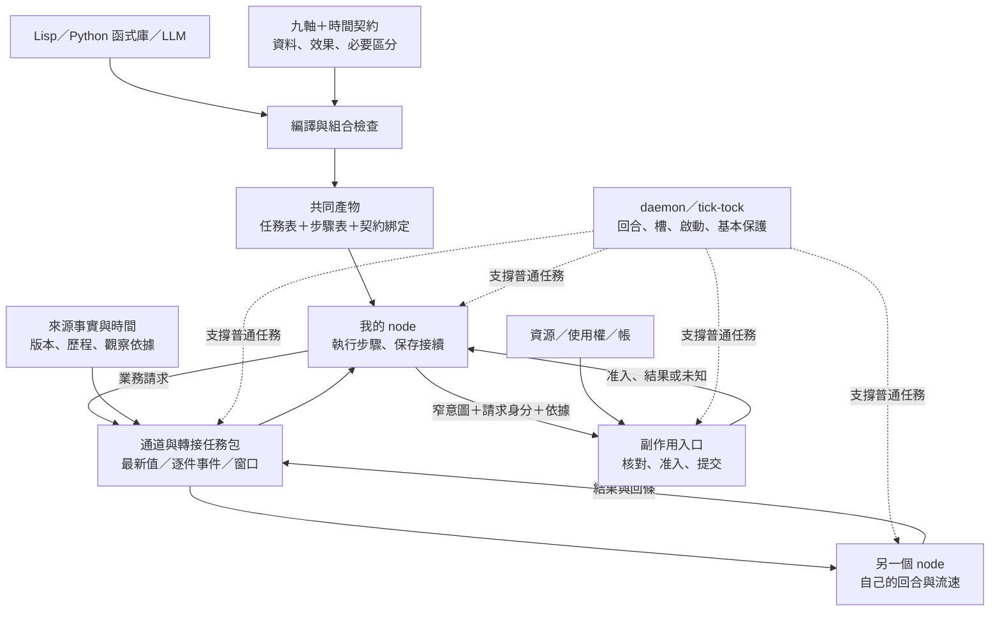

← [第四輪題目](2026-10-04-r4-topic.md)｜第四輪 astra 原報告｜[第四輪綜合](2026-10-04-r4-synthesis.md)

**這輪最值得保留的方向，是讓「跨 node 的交換」成為語言可以描述、九軸可以檢查的東西。** 交換的不只有資料，還有觀察時點、必須保留的事件、可以執行的效果，以及尚未結清的責任。各 node 不必先同步時間，才能一起完成工作。

Lisp、Python 函式庫與 LLM 可以提供不同寫法；共同產物則是**任務部署、可恢復的步驟，以及組合契約**。這些都能放在普通任務包裡，本輪對 daemon／tick-tock 的新增要求為零。

以下是方向提案，沒有修改檔案或執行探針。現況依[基礎設施設計](../../../proto7-2/spec.md)解讀；語言與九軸檢查器不視為已實作。思考沿用[全部十一條原則](../principles.md)，並納入 [Fable 語言報告](2026-10-04-lang-fable.md)與 [astra 九軸報告](2026-10-04-axes-astra.md)。

**從我的 node 看，別人的「現在」其實有幾種不同意思。**

下午兩點，我在第 5 回合，B 在第 100 回合。我不能因此認定 B 快二十倍：起算點可能不同，一回合做的工作不同，流速也可能剛剛改變。我知道的是「這次觀察，看見 B 宣告了某個狀態」。

| 我真正想問的事 | 需要什麼依據 |
|---|---|
| B 走到哪裡？ | 哪條時間線、哪一回合、哪個工作狀態 |
| B 的結果比我的依據新嗎？ | 採用哪些版本、處理過哪些請求 |
| B 還要多久才能回我？ | 服務估計或承諾，以及它們成立的條件 |
| 我現在還能使用這份權利嗎？ | 發行者的期限、撤銷條件，以及入口當下的核對 |

跨 node 的合作可以從這些局部問題開始，不必先求「B 的第 100 回合等於我的第幾回合」。

同機可以共享物理時間來源，但共享鐘不會自動建立共同的業務進度。反過來，即使回合座標不同，雙方仍能靠請求、版本與回條合作。

現況也提醒我們，**一個 node 並非只有一種進度**：pause 只停新回合，既有任務與外部服務仍可能繼續執行；tick 啟動任務後不等它完成。普通長任務不必然直接阻塞回合，但資源競爭、tick／tock 的動作成本與 `early_tock` 設定會影響節拍。回合流速為零，不代表工作、支出與外部期限都停止。[spec](../../../proto7-2/spec.md)、[四層交接點](../../../proto7-2/notes/layer-interfaces.md)

因此，「等 B 三回合」至少有三種意思：我等自己的三回合、等 B 前進三回合、等 B 替我提供三次服務。語言若把它們都寫成同一個 `wait(3)`，錯誤便已經藏在抽象裡。

**快慢協作首先遇到的是「通道保留什麼」，之後才是時鐘換算。**

| 我需要的資訊 | 適合的交付方式 | 速度差帶來的代價 |
|---|---|---|
| 現在的狀態 | 保留最新值 | 中間變化可能看不到 |
| 每一件發生的事 | 逐件保存至確認 | 積壓、保存、去重與確認成本 |
| 某段期間的性質 | 窗口或摘要 | 必須定義範圍、缺口與保留的差異 |

快 node 看到「正常→過熱→正常」，慢 node 若只讀最新值，只會看到正常。若它只需要知道「期間是否曾過熱」，保留一個告警可能就夠了；若需要知道每次過熱的順序和持續時間，同一個布林值便不夠。

這把[第三輪的必要區分](2026-10-04-r3-synthesis.md)推進到時間上：**轉接需要保留的，可能是兩段歷程的差異；單筆資料忠實，不代表整段交付忠實。**

慢消費者因而也在提出一種資源要求：「請替未來的我保管資料。」它需要的是儲存容量、保留時間與處理能力，接回[第一輪的資源模型](2026-10-04-r1-synthesis.md)。

有限緩衝、來源永遠不等待、消費者可以永久暫停、每件事件都不遺漏，四者不能同時成立。通道必須依用途容許等待、合併、限制保留，或明示缺口。這些差異應由任務包表達；核心只有最新檔案，就不能假裝它已提供事件佇列。

**「回來源看期限」仍然需要補上最後一段：看到之後，何時動手。**

第三輪主張期限不換算，回來源讀「到了沒」。這避免了回合匯率失準，卻還不足以保證使用時有效。

例如轉接器在 14:00 讀到使用權有效，受限 node 到 14:10 才動手，而窗口在 14:05 已關閉。轉接完全確定、完全忠於來源，也沒有換算回合，仍可能過期誤放。

所以至少要區分三種東西：

- **觀察**：在某個時點，看見使用權有效。
- **准入回條**：入口已按條件接受這一筆請求。
- **提交回條**：這筆效果已完成，或目前仍無法確定。

受限 node 可以繼續只吃窄格式。時間轉接器替它理解原始鐘；效應器把它的窄意圖送到權威入口。它不必自己讀原始資料，但整條鏈不能拿一個舊的「有效」代替支用時的核對。

這也修正第三輪 `adapt-time` 探針的預期：回來源判期限能避免錯誤換算；要主張「過期後零誤放」，還須由入口保證核對與准入之間的關係。若要求的是「效果必須在期限內完成」，又比「期限內接受請求」更強，必須有相應的執行承諾。

多跳轉接也不能替資訊重新計齡。剛產生的摘要可能依據很舊的資料；轉接器的新時間戳不能把來源變年輕。來源回合停住時，回合差可以不變，外部世界卻已過了很久。

因此，新鮮度至少有三個不同問題：**忠於哪個版本、距離哪次觀察多久、這份依據是否仍適用於眼前動作。** 它們不能壓成一個「新／舊」布林值。

**等待的期限，和工作的責任，也要分開。**

我的逾時首先表示「我不再照原計畫等」，不能推出 B 沒有執行、取消已成功，或預留額度可以退款。

這延續第一輪的在途處理：使用權到期可以停止新准入；已接受、結果未知的工作仍須對帳。開始工作的窗口、完成效果的期限、接受遲到回條的期間，是不同約束。

對單一 node 而言，好的跨 node 呼叫應讓我知道：我目前等的是哪件事、何種證據能讓我繼續、逾時後還留下什麼。它不要求我推算對方所有內部狀態。

**物理、分散式、硬體與遊戲類比，可以各借一部分。**

以下是對 aos 的類比取用方向，不把任何一種模型整套搬進來：

| 類比 | 想借來的觀念 | 在 aos 的適用界線 |
|---|---|---|
| 相對論的固有時 | 各自沿時間線經歷事件；看見別人的鐘是一次觀察 | node 回合不當成物理固有時，不建立相對論式的換算公式 |
| 時鐘同步 | 說明基準、誤差與適用範圍 | 即使鐘一致，工作進度與服務能力仍須另行描述 |
| 邏輯／向量時鐘 | 用因果與並行關係思考「誰依據誰」 | 先沿用版本與 `basis`；不把因果順序當成期限，也不先建立全網向量 |
| CDC、非同步 FIFO、握手 | 把跨速率交付拆成保存、接收確認與滿載處理 | 借協定結構；檔案原子覆寫仍不能代替不漏件與跨檔一致性的契約 |
| 遊戲 lockstep | 某段工作可以約定共同階段，等參與者到齊再前進 | 屏障放在需要它的局部工作；預測結果可供規劃，不能代替真實授權 |

PLC／HDL 類比也應保留邊界。[Fable 報告](2026-10-04-lang-fable.md)提出的「回合層程式」很有用，但現況只提供任務表快照，以及核心總結先提交、再通知的順序。任務仍能在回合中途讀寫業務檔案，不能把整個回合當成凍結的世界。

**流速適合成為契約中的性質；可分配的服務機會才比較像資源。**

「最近每秒十回合」是觀測；「希望一秒內回覆」是目標；「在指定負載下承諾一秒內回覆」是保證；「我可以占用兩個槽」是使用權。

這四者應分開。wake 可以增加回合頻率，pause 可以拉長回合窗口，兩者都不會憑空增加算力。給慢 node 更多額度，也不保證它來得及在有效窗口內使用。

因此，流速先放進可選的**時間契約**較清楚。真正能分配的，可以是 CPU 時間、執行槽、處理名額、資料保留容量；能否進一步承諾吞吐量或反應期限，取決於供應者維持條件的能力。

目前也不必把九軸硬擴成「第十軸＝流速」。時間已橫跨取樣、生命週期、資源、組合與環境；把這些關係說清楚，比多一個數字更有用。

**共同目標格式，可以長成「任務表＋步驟表＋契約」，由多種前端產生。**

「aos 指令集」是可用的方向類比，但共同 JSON 外形還不夠。真正要共同的是等待、效果、交付與恢復的意思。

| 部分 | 負責描述 |
|---|---|
| 任務表 | 在哪個 node 啟動什麼程序，使用哪些參數、掛載與啟動策略 |
| 步驟表 | 資料依賴、先後、分支、並行、等待、重試與結束 |
| 契約與綁定 | 輸入輸出、效果、時鐘、資源與通道要求，以及實際接到誰 |

任務表由 tick 讀；步驟表和契約由普通任務包讀。`inst` 繼續描述一次程序執行，沿用 Fable 的 `execve` 類比。順序、等待與恢復由上層組織，不必往 `inst` 或 tick 裡增加語言。

Lisp 可以用巨集展開常見模式；Python 函式庫可以建立相同的步驟與依賴；LLM 可以直接寫共同表示。共同格式應公開可讀，也讓工具指出「這一步在等什麼、哪個契約接不上」。

Python 前端尤其需要區分**產生程式時的分支**與**未來執行時的分支**。編譯時的 Python `if` 已經做完選擇；等待未來回條才決定的 `if`，必須留在產物裡。Lisp 的巨集也不能替未來未知的事實作答。

這不需要承諾任意 Python 或 Lisp 都能自動編成分散式程式。先讓它們明確表達同一套回合層組合，就已經有共同前端的意義。

**步驟表最重要的狀態，是「下一步尚未履行的責任」。**

跨 node 的 `await B` 可以理解為：A 保存自己的後續步驟，B 按自己的時間工作，回條抵達後 A 再接續。A 走了九十回合、B 只走一回合，不會改變這個依賴關係。

但接續不能只有 `pc=7`。它還需要知道：同一件業務請求是誰、依據哪個版本、已預留什麼、等待哪種回條，以及哪些效果仍然未知。新的 run 是新的執行嘗試，不必然是新的業務請求。

這也補上 Fable 對慢直譯器漏看 `exit.json` 的疑慮：需要可靠接續的工作，應由任務包在槽外保存帶請求身分的業務結果，直到約定的確認。核心仍只留上一次，不必替工作流保留完整歷史。

包裝程式可以協助交接，但無法自動消除「外部已提交、回條尚未寫下」的窗口。沒有共同提交或查詢契約時，結果仍須保留未知。程序失敗、業務拒絕與副作用未發生，不能混成同一個結果。

三態因此是語言的一部分：条件確定成立、確定不成立、目前不知道。**不知道不能默默落入一般失敗重試，也不能當成否定條件成立。**

**九軸可以形成型別與效果檢查，讓工具知道哪些組合有依據。**

一般型別告訴我們「這是什麼資料」；效果契約再告訴我們「使用它會改變什麼、能否重送、停止後如何接續」。時間條件則限制這些保證在哪個情境成立。

| 軸 | 在語言層可以檢查什麼 |
|---|---|
| 1. I/O 型態 | 格式、單位，以及最新值／事件／窗口是否相容 |
| 2. 生命週期 | 等的是有限工作完成，還是常駐服務就緒 |
| 3. 跨呼叫狀態 | 恢復需要什麼；並行是否競爭同一份狀態 |
| 4. 資源特性 | 重試、等待與緩衝的需求；需求是否得到供應與授權 |
| 5. 可中斷性 | 能否停止、接續；何時才確知資源已釋放 |
| 6. 執行保證 | 哪些效果可重送、須去重，哪些必須先對帳 |
| 7. 組合模式 | 交付與依賴關係；整段重跑是否成立 |
| 8. 環境模式 | 來源、掛載、版本、權限與部署條件 |
| 9. 確定性 | 固定哪些依據後可重現；另記能保證哪些結果性質 |

非冪等步驟不能無條件放進自動重試；但若確知尚未提交，或入口能按相同業務鍵去重，仍可能安全重送。反過來，冪等也不代表重跑免費、授權永遠有效，或整條鏈都能重跑。這沿用 [astra 對多軸組合的提醒](2026-10-04-axes-astra.md)。

非確定步驟之後的驗證，則應由**下游缺少哪項保證**來決定。已有對應驗證器，編譯器才有東西可插入。格式通過不等於內容真實；兩個不同答案都合格，也不會讓產生者變成確定函式。

作者宣告、測試證據與本次執行事實仍是三件事。未宣告的軸保留未知，普通任務照樣可以執行；只是工具沒有依據替它自動增加重試、平行化或替換。

**九軸還能約束編譯器的最佳化，這是比任務分類更進一步的用途。**

跨排程步驟有回合尺度的延遲，但不是每個運算都要一回合。固定輸入上的選取、換算與檢查，可以合在一個程序裡連續完成。

然而，合併兩步可能省掉原本的重新取樣、授權核對、取消機會或恢復位置。拆成跨 node 工作則可能增加過期與撤銷的窗口。能否合併或拆開，不能只看輸出格式相同。

因此，共同表示值得保留：**在哪裡固定依據、在哪裡等待、在哪裡重新核對、哪些中間結果可見。** 編譯器知道這些邊界，才有理由判斷某次加速是否保持原意。

受限轉接也適用同一條規則：轉接可以縮小 node 看見的世界，卻不能放大證據所允許的行動。B 曾看見有效，不能因改寫成 A 看得懂的 `true`，就變成 A 現在獲准支用。

**三個題目可以接成下面這張圖。**

例如 A 請慢 node B 產生候選：A 固定依據並保存接續，B 經轉接器取得窄輸入，結果沿用同一個業務請求身分。A 逾時可以改變等待策略，但仍保留在途責任；候選回來後驗證，真正支用時再由入口核對當下條件。

圖中幾件事是同一個問題的不同面：

- **跨速率與受限輸入**：通道是否保留了下游必須分辨的差異。
- **新鮮度與使用權**：動手時哪些前提仍成立；事實本身不自動授權。
- **資源分配與持久等待**：谁替未完成工作保留容量、資料與責任。
- **型別檢查與恢復**：目前已知到什麼程度，足以支持哪個下一步。

理想方向是：速度改變時，等待與積壓可以改變，權利與事件完整性不應悄悄改變。但這不是全系統速度無關的保證；最新值取樣原本就可能因讀取時機而得到不同結果，必須寫在契約裡。

**對 daemon／tick-tock 核心，本輪要求仍是零新增。**

編譯、組合檢查、步驟執行、通道、轉接、回條保存、驗證與對帳，都可以由普通任務、包裝程式或工具承擔。這沿用[核心精簡方案](../../../proto7-2/notes/core-slimming.md)與[組件契約的責任劃分](../../../proto7-2/notes/component-contracts.md)。

它們首先是通用任務包；agent 狀態與工具協議歸 agent 包，模型、prompt 與摘要品質的專用部分歸 LLM 包。不是每個 node 都要安裝完整工作流系統。

[第二輪](2026-10-04-r2-synthesis.md)提出的時間量測可以改善估計，本輪不把它變成語言成立的前提。沒有可信上界就不承諾準時；需要保存證據的包自行保存。核心零新增的代價，是上層明確承擔自己的保證。

這一輪最重要的三個新觀點：

1. **速度差會轉成通道與資源契約。** 慢 node 要求不漏件，就在要求上游保存資料；最新值、事件與窗口應成為不同的組合語意。
2. **時間轉接必须分開觀察與准入。** 忠於來源的「有效」仍可能在消費前過期；期限、授權與在途責任要接到實際效果入口。
3. **共同語言保存的是可恢復的合作責任。** 任務表管部署，步驟表管接續，九軸與時間契約限制組合及最佳化；多種前端共享的是這套意思。

我最不確定的三件事：

1. **最小契約能涵蓋多少真實差異。** 它可能擅長指出「這裡還不知道」，卻只能證明少數組合；這樣的價值是否已足夠，仍待實際工作驗證。
2. **服務估計有多少能提升成可靠承諾。** 資料格式容易界定，品質、供應能力與延遲會隨環境改變；不能把量測結果直接當成保證。
3. **共同步驟格式能否比直接寫程式更省事。** 它的優勢應來自跨 node、重開與未知狀態下仍能理解並接續工作；如果只是把 Python 改寫成更多表格，就還沒有找到值得存在的那一層。